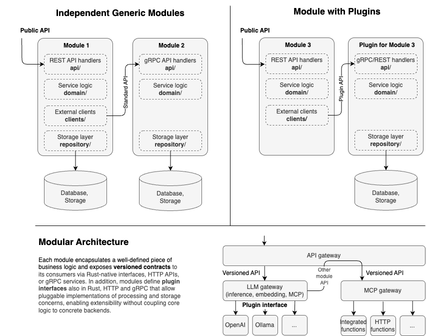
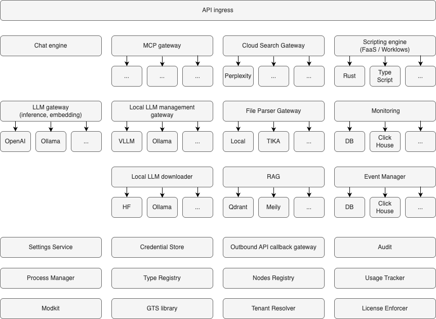

# HyperSpot Architecture Manifest

> **NOTE:** This manifest describes our targets and forward-looking architecture. It is not a changelog of the current implementation. Canonical, up-to-date product and API documentation is maintained separately (e.g., module-specific docs, OpenAPI, and design records). Use this document for intent and direction; confirm current behavior in the dedicated docs.

**Welcome to HyperSpot!** This document serves as your architectural and technical reference, explaining the core ideas, design principles, and rules that guide HyperSpot's development. Whether you're a newcomer or contributor, understanding these concepts will help you navigate and extend the platform effectively.

HyperSpot is a modular Rust-based foundation for building SaaS products where Generative AI capabilities are first-class, alongside enterprise-grade SaaS requirements such as multi-tenancy, access control, governance, auditability, and usage tracking. It is designed to sit between cloud infrastructure (IaaS/PaaS) and vendor-developed SaaS applications, providing reusable building blocks that product teams can assemble into complete end-to-end services.

## Overview

HyperSpot is a **modular, high-performance AI services platform** built in Rust. It provides a comprehensive framework for building scalable and highly-customizable AI applications with automatic REST API generation, comprehensive OpenAPI documentation, and a flexible modular architecture.

**Key Philosophy:**
- **Modular by Design**: Everything is a Module - composable, independent units with gateway patterns for pluggable workers
- **Extensible at Every Level**: [GTS](https://github.com/globaltypesystem/gts-spec)-powered extension points for custom data types, business logic, and third-party integrations
- **SaaS Ready**: Multi-tenancy, granular access control, usage tracking, and tenant customization built-in
- **Cloud Operations Excellence**: Production-grade observability, database agnostic design, API best practices, and resilience patterns via ModKit
- **Quality First**: 90%+ test coverage target with unit, integration, E2E, performance, and security testing
- **Universal Deployment**: Single codebase runs on cloud, on-prem Windows/Linux workstation, or mobile
- **Developer Friendly**: AI-assisted code generation, automatic OpenAPI docs, DDD-light structure, and type-safe APIs

## Non-goals

1. HyperSpot doesn't optimize for **minimalism** or the lowest barrier to entry

HyperSpot does not aim to be the simplest or smallest framework for building SaaS or AI applications. It intentionally prioritizes explicit structure, governance, composability, and long-term evolvability over quick-start simplicity or minimal configuration.

2. HyperSpot doesn't Provide a **rich catalog of end-user services** out of the box

HyperSpot does not aim to ship a comprehensive set of ready-made, end-user SaaS services (e.g. CRM, ticketing, billing products) as part of its core. Its primary focus is the foundational layer—runtime, control plane, GenAI capabilities, workflows, and extensibility—on top of which vendors and product teams build their own complete SaaS offerings.

3. HyperSpot doesn't attempt to replace **cloud infrastructure or PaaS layers**

HyperSpot is not a replacement for cloud providers or infrastructure platforms such as AWS, Azure, GCP, or on-prem orchestration stacks. It does not offer physical infrastructure, networking, container orchestration, or low-level resource scheduling. Instead, HyperSpot intentionally positions itself above IaaS/PaaS and below vendor-developed SaaS, focusing on application-level services, governance, and GenAI enablement.

## Why Rust and why Monorepo?

Rust and a monorepo are intentional choices to optimize **recurring engineering work**,especially the feedback loop required for safe and high-throughput **LLM-assisted development**. The goal is to maximize how quickly generated code can be validated (build, lint, test, run, debug) *before* it is committed.

### Why Rust (recurring benefits)

- **Compile-time safety for memory and concurrency**.
  Rust's ownership model prevents data races and memory safety issues by construction. It removes entire categories of runtime failures (null pointer dereference, use-after-free, iterator invalidation) by design—critical for a multi-tenant platform handling concurrent requests.

- **Faster debugging of complex, cross-cutting scenarios (human + LLM)**.
  Strong typing, structured errors, and deterministic build artifacts make failures easier to localize. This improves troubleshooting for complex, multi-module behaviors and makes it easier for LLMs to propose minimal, correct fixes based on compiler diagnostics, test failures, and traces.

- **Deep static analysis as a platform feature**.
  Rust's compiler and tooling ecosystem enable strong static inspection (AST/HIR/MIR-level analysis). Over time, recurring code review feedback and internal guidelines can be converted into custom project-specific lints (see [dylint_lints](../dylint_lints)), preventing bad patterns *before* they reach code review or production.

- **Low footprint + performance enable “whole subsystem locally” workflows**.
  A fast, resource-efficient stack makes it realistic for developers (and LLM-based code generators) to:
  - build and run large subsystems locally (e.g. via Docker Compose),
  - run end-to-end tests locally,
  - reproduce issues with full logs + source access without relying on remote environments.

- **Fearless refactoring**.
  Strong type system and exhaustive pattern matching mean large-scale refactors (e.g., changing a contract used by 20 modules) are caught at compile time, not in production.

### Why a monorepo (recurring benefits)

- **Atomic changes across modules and contracts**.
  HyperSpot is modular, but the contracts between modules evolve. A monorepo allows changing a contract and all its consumers in one PR.

- **Short, controllable feedback loops for LLM-generated changes**.
  When generation touches multiple crates, the monorepo makes it practical to run build + lints + targeted tests + E2E in a single workspace context. This reduces "partial correctness" changes and enables rapid iteration on generated patches until the full system is green.

- **Single source of truth for tooling and quality gates**.
  Consistent formatting, linting, security checks, and test entry points are easier to enforce when everything shares the same CI and build system.

- **Realistic local builds and end-to-end testing**.
  When the code is together, it is much easier to run “the full actual system” locally, which is a prerequisite for fast debugging and reliable local E2E.

- **Avoid version skew between internal crates/services**.
  Multi-repos often introduce dependency pinning, release choreography, and integration lag. A monorepo keeps internal APIs aligned by default.

Monorepo is not dogma: it has to be kept while it improves velocity and correctness. If a part of the system grows to the point where independent versioning, release cadence, or access control is required, it can be extracted behind stable contracts.

---

## 1. Modular Architecture

### 1.1. What is a Module?

A **Module** is a logical component that provides a specific set of functionality. In HyperSpot:
- Every logical component must be a module
- Each module is a Rust crate library
- Modules are self-contained with their own configuration, API, and business logic
- Modules are discovered automatically via the `inventory` crate
- Modules can depend on each other
- Modules can have plugins - plugins are not exposed their own Public REST API, depend on the main module and just implement certain contract defined by their host module. Plugins typically are runtime components that can be loaded dynamically

**Example modules:**
- `file_parser` - Document parsing and extraction
- `chat` - Chat module
- `web_search` - Web search module

**Module categories**

- **Regular Module** - Regular modules are typically independent, expose their own versioned public API and responsible for their own domain end to end, including module business logic, data storage, migrations and module API documentation
- **Plugin Module** - Plugins are special modules that are not exposing their own Public REST API, but implement certain host-module defined contract and acting as workers. Plugins typically are runtime components that can be loaded dynamically

**Module structure:**

| Module type | Generic module| Host module | Plugin module |
| --- | --- | --- | --- |
| API layer @ api/ | Yes | Yes | No |
| Business logic layer @ domain/ | Yes | Yes (contract, router) | Yes, main logic |
| Infrastructure layer @ infrastructure/ | Likely | Rare | Likely |
| Gateway layer @ gateways/ | Yes, if depends on other modules | Yes, workers connectors | Yes, clients to some service |
| Examples | Any CRUD module (TODO) | file_parser, (TODO) | file_parser_tika, (TODO) |

See below typical modules categories, internal layout and typical modules relationship:



See more in [MODKIT_UNIFIED_SYSTEM.md](MODKIT_UNIFIED_SYSTEM.md)

### 1.2. Deployment Units

A **Deployment Unit** is a physical component that bundles one or more modules for deployment:
- **Desktop app**: Most modules compiled into a single process
- **Cloud server**: Modules compiled into separate processes and running in separate Docker containers
- **On-prem server**: Modules compiled into several Windows/Linux binaries
- **Mobile app**: Selected modules in-app, others in the cloud

### 1.3. Module Communication

Modules interact using **native Rust APIs** that abstract the transport layer:
- **Local**: Direct function calls within the same process
- **gRPC**: High-performance remote procedure calls
- **HTTP/REST**: Standard web APIs

The `ClientHub` provides type-safe client resolution, allowing modules to communicate without knowing the underlying transport.

---

## 2. SaaS Readiness

HyperSpot is designed from the ground up for **Software-as-a-Service (SaaS)** deployments with enterprise-grade multi-tenancy, product licensing and security features.

### 2.1. Multi-Tenancy

**Tenant Isolation:**
- [x] **Data Isolation**: Complete separation of tenant data at the database level
- [x] **Resource Isolation**: Per-tenant resource quotas and rate limiting
- [ ] **Configuration Isolation**: Tenant-specific settings and feature flags

### 2.2. Granular Access Control

**Authentication:**
- [ ] **Multiple Providers**: OAuth2, SAML, LDAP, API keys, JWT tokens
- [ ] **Session Management**: Secure session handling with configurable TTL
- [ ] **Token Validation**: JWT verification with public key rotation support
- [ ] **MFA Support**: Multi-factor authentication integration points

**Authorization:**
- [ ] **Role-Based Access Control (RBAC)**: Hierarchical role definitions
- [ ] **Attribute-Based Access Control (ABAC)**: Fine-grained policy-based permissions
- [ ] **Resource-Level Permissions**: Per-resource access control (read, write, delete, admin)
- [ ] **API-Level Security**: Endpoint-level authorization checks
- [ ] **Scope-Based Access**: OAuth2 scopes for API access control

**Security Features:**
- [ ] **Audit Logging**: Complete audit trail of all security-relevant operations
- [ ] **Credential Management**: Secure storage and rotation of secrets and API keys
- [ ] **Rate Limiting**: Per-tenant and per-user rate limits
- [ ] **IP Whitelisting**: Network-level access restrictions
- [ ] **Data Encryption**: At-rest and in-transit encryption

### 2.3. Usage Tracking & Billing

**Metering:**
- [ ] **Usage Tracker**: Real-time tracking of resource consumption
- [ ] **Metrics Collection**: API calls, compute time, storage, bandwidth
- [ ] **Quota Enforcement**: Hard and soft limits with grace periods
- [ ] **Usage Analytics**: Detailed usage reports and dashboards

**License Management:**
- [ ] **License Enforcer**: Feature gating based on subscription tiers
- [ ] **Entitlement Checks**: Runtime validation of feature access
- [ ] **Trial Management**: Time-limited and feature-limited trials
- [ ] **Upgrade Flows**: Seamless tier upgrades and downgrades

### 2.4. Tenant Customization

**Branding:**
- [ ] **White-Labeling**: Custom logos, colors, and themes per tenant
- [ ] **Custom Domains**: Tenant-specific domain mapping
- [ ] **Email Templates**: Customizable notification templates

**Configuration:**
- [ ] **Feature Flags**: Per-tenant feature enablement
- [ ] **Custom Settings**: Tenant-specific configuration overrides
- [ ] **Integration Points**: Tenant-specific webhooks and callbacks

---

## 3. Modules



See detailed descriptions in [COMPONENTS.md](COMPONENTS.md).

---

## 4. Deployment Targets

HyperSpot supports multiple deployment scenarios to meet different operational needs:

- [ ] 4.1. Desktop Application - local AI researchers, offline processing
- [ ] 4.2. Cloud Server - multi-tenant SaaS, scalable AI services
- [ ] 4.3. On-premises Server - enterprise deployments, air-gapped environments
- [ ] 4.4. Mobile Application - AI on mobile devices

---

## 5. Code Organization

### 5.1. Monorepo Structure

HyperSpot uses a **monorepo** approach with multiple crates:

```
hyperspot/
├── apps/              # Executable applications (hyperspot-server)
├── config/            # Configuration files
├── docs/              # Architecture and development guides
├── dylint_lints/      # Project-specific lints (see `make dylint`)
├── examples/          # Example modules and usage patterns
├── guidelines/        # Coding standards and best practices for LLMs
├── libs/              # Shared libraries (modkit, modkit-db, modkit-auth, etc.)
├── modules/           # Business logic modules (chat, file_parser, etc.)
├── scripts/           # Custom scripts for build, testing, etc.
└── testing/           # E2E and integration tests (pytest)
```

### 5.2. External Integration

 The 'main' crates can be located in separate repositories and use HyperSpot modules as dependencies via Cargo. This allows:
 - Custom applications built on HyperSpot by choosing only needed modules
 - Private modules not in the main repo
 - Vendor-specific extensions (modules, plugins, adapters)

### 5.3. Module Layout (DDD-Light)

 Every module follows a **Domain-Driven Design (DDD-light)** structure:

```
modules/<module-name>/
├── Cargo.toml
├── src/
│   ├── lib.rs                        # Public exports
│   ├── module.rs                     # Module struct + #[modkit::module(...)] (some modules keep this in lib.rs)
│   ├── config.rs                     # Typed module config
│   ├── local_client.rs               # Local adapter implementing an SDK API trait (optional)
│   ├── api/
│   │   └── rest/
│   │       ├── dto.rs                # REST-only DTOs (serde + ToSchema)
│   │       ├── handlers.rs           # Thin HTTP handlers
│   │       ├── routes.rs             # Route + OpenAPI registration (OperationBuilder)
│   │       ├── error.rs              # DomainError -> Problem mapping
│   │       └── mappers.rs            # DTO <-> domain mapping
│   ├── domain/                       # Business logic
│   └── infra/                        # Infrastructure adapters (optional)
├── tests/                            # Optional
└── (optional extras: gts/, openspec/, build.rs, etc.)

# SDK pattern (used by e.g. `modules/types-registry/` and `examples/modkit/users_info/`)
modules/<module-dir>/
├── <module-name>-sdk/
│   ├── Cargo.toml
│   └── src/
│       ├── lib.rs                    # Re-exports
│       ├── api.rs                    # ClientHub API trait (methods take &SecurityCtx)
│       ├── models.rs                 # Transport-agnostic models (no serde)
│       ├── error.rs|errors.rs         # Transport-agnostic errors
│       ├── (optional) proto/         # Generated gRPC/proto types for OoP modules
│       └── (optional) wiring.rs      # gRPC client wiring/helpers for OoP transport
└── <module-name>/
    ├── Cargo.toml
    └── src/
        ├── lib.rs                    # Re-exports SDK + module struct
        ├── module.rs                 # Module struct + #[modkit::module(...)]
        ├── config.rs
        ├── local_client.rs
        ├── api/
        ├── domain/
        └── infra/
```

Additional common patterns (see `examples/`):

- **Gateway + plugins pattern** (pluggable workers via `ClientHub` scopes):
  - Gateway crate: `<module>-gw/`
  - SDK crate: `<module>-sdk/`
  - Plugin crates: `plugins/<vendor>_<plugin>/`

- **Out-of-process (OoP) module pattern** (gRPC boundary):
  - SDK crate with gRPC client + wiring helpers
  - Module crate with gRPC server + (optional) `main.rs` binary for OoP execution

 **Layer responsibilities:**
 - **SDK (optional but recommended)**: The stable public surface for other modules/apps.
   - Transport-agnostic traits, models, and errors.
   - No `serde`, no `axum`, no `utoipa`, no HTTP types.
 - **Module bootstrap** (`module.rs` + `#[modkit::module]`): Lifecycle, configuration loading, wiring adapters, and `ClientHub` registrations.
 - **API (transport adapters)**: REST/gRPC adapters.
   - REST DTOs are defined only in `api/rest` and must not leak into domain/SDK.
 - **Domain**: Core business logic and invariants.
   - Depends on ports/repo traits, not on concrete DB/HTTP.
 - **Infra**: Concrete implementations of storage and integrations.
   - DB repositories, HTTP clients, SDK clients, filesystems, etc.

### 5.4. ModKit - The Foundation

Every HyperSpot module uses the **ModKit** framework, which provides:
- **Module lifecycle**: Initialization, configuration, shutdown
- **REST API builder**: Type-safe route registration with OpenAPI
- **Database access**: SeaORM and SQLx integration
- **Client hub**: Type-safe inter-module communication
- **Error handling**: RFC-9457 Problem Details for HTTP APIs
- **Observability**: Structured logging and distributed tracing
- **SSE support**: Server-Sent Events for real-time updates

 **Key ModKit libraries:**
 - `modkit` - Core module framework: lifecycle, REST host/contracts, OpenAPI registry, ClientHub, tracing helpers
 - `modkit-macros` - Procedural macros for module registration (`#[modkit::module(...)]`)
 - `modkit-auth` - Authn/z plumbing for ingress and route policies
 - `modkit-security` - `SecurityCtx` and security-scoping primitives used across modules (request-scoped context)
 - `modkit-errors` - Shared error types and RFC-9457 Problem modeling utilities
 - `modkit-errors-macro` - Macros/codegen for error catalogs
 - `modkit-db` - Database runtime integration (DbHandle/DbManager) + Secure ORM patterns
 - `modkit-db-macros` - DB macros (e.g., secure ORM helpers, OData derives)
 - `modkit-odata` - OData query + pagination primitives
 - `modkit-transport-grpc` - gRPC client/server transport utilities (timeouts/retries/tracing)
 - `modkit-node-info` - Node/runtime metadata used for deployments and diagnostics

---

## 6. Dependencies and Standards

### 6.1. DNA - Development Guidelines

[DNA](https://github.com/hypernetix/DNA) is HyperSpot's collection of development standards and best practices:
- **REST API design**: Status codes, pagination, error handling

**Key guidelines:**
- `guidelines/DNA/REST/API.md` - REST API design principles

### 6.2. Extension Points (Type System)

HyperSpot uses the [Global Type System](https://github.com/GlobalTypeSystem/gts-rust) ([specification](https://github.com/GlobalTypeSystem/gts-spec)) to implement a powerful **extension point architecture** where virtually everything in the system can be extended without modifying core code.

**Core Concept: Extension Points**

An **extension point** is a well-defined interface where new functionality and data types can be plugged in dynamically. GTS enables this through:
- **Versioned type definitions**: Shared schemas across modules with backward compatibility
- **Type registration**: Runtime discovery of new types and implementations
- **Protocol buffer schemas**: Language-agnostic type definitions
- **Type evolution**: Safe schema changes without breaking existing code

**What Can Be Extended:**

1. **Module Plugins metadata** - Add new implementations behind entrypoint host modules:
   - **LLM Service Connectors**: OpenAI, Anthropic, Gemini, VLLM, LM Studio, custom providers
   - **LLM Benchmarks**: HumanEval, MBPP, custom evaluation frameworks
   - **Search Engines**: Qdrant, Weaviate, Milvus, Elasticsearch, custom engines
   - **File Parsers**: Embedded parser, Apache Tika, custom parsers
   - **Authentication Providers**: OAuth2, SAML, LDAP, custom auth systems

2. **Data Types in APIs** - Extend existing endpoints with new data structures:
   - **Event Types**: New domain events for the event manager
   - **Benchmark Result Formats**: Custom metrics and evaluation outputs
   - **Document Types**: New file formats and metadata schemas
   - **Message Formats**: Chat message types, attachments, rich content

3. **Executable Extensions**:
   - **FaaS Functions**: User-defined serverless functions
   - **Server-Side Workflows**: Custom workflows and automation
   - **Agents**: Pluggable AI agent implementations

**Benefits:**

- **High customization**: HyperSpot modules can be used as building blocks for custom AI applications or platforms
- **No Core Modifications**: Add new functionality without changing HyperSpot core
- **Type Safety**: Compile-time checks for extension implementations
- **Version Compatibility**: Graceful handling of schema evolution
- **Dynamic Discovery**: Extensions are discovered at runtime via type registry
- **Third-Party Extensions**: External developers can create plugins and connectors

**Example Use Cases:**

- A vendor adds a proprietary chat extension for it's competitive solution
- A researcher implements a new MCP or benchmark suite as a module worker
- A user creates custom FaaS functions or workflows for domain-specific workflows
- An enterprise integrates a custom search engine for compliance requirements

This extension point architecture makes HyperSpot truly modular and adaptable to diverse use cases while maintaining type safety and system integrity.

# 6.3. Rust dependencies

All dependencies are specified in the root `Cargo.toml` file and are shared across all modules. This ensures consistency and ease of dependency management. Each member of the workspace will inherit the dependencies from the root `Cargo.toml` file and specify the features it needs.

That follows what's specified in [Rust documentation](https://doc.rust-lang.org/cargo/reference/manifest.html#the-dependencies-section).

`[dev-dependencies]` section is used for dependencies that are only required for development and testing.

`[build-dependencies]` section is used for dependencies that are required for building the member.

---

## 7. Cloud Operations Excellence

HyperSpot modules are built on **ModKit**, which provides enterprise-grade operational capabilities out of the box. Every module automatically inherits these cloud-native patterns without additional implementation effort.

### 7.1. Observability

**Structured Logging:**
- [ ] **Unified Logging**: All modules use `tracing` for structured, contextual logging
- [ ] **Log Levels**: Configurable per-module log levels (trace, debug, info, warn, error)
- [ ] **Log Rotation**: Automatic log file rotation with size and age limits
- [ ] **JSON Output**: Machine-readable JSON logs for centralized log aggregation
- [ ] **Contextual Fields**: Automatic inclusion of tenant_id, user_id, request_id, trace_id
- [ ] **Performance**: Async logging with minimal overhead

**Distributed Tracing:**
- [ ] **OpenTelemetry Integration**: Full support for distributed tracing
- [ ] **Trace Propagation**: Automatic trace context propagation across service boundaries
- [ ] **Span Instrumentation**: Automatic span creation for HTTP requests, database queries, and inter-module calls
- [ ] **Trace Sampling**: Configurable sampling rates for production environments
- [ ] **Trace Export**: Support for OTLP, Jaeger, Zipkin exporters
- [ ] **Custom Spans**: Easy creation of custom spans for business logic tracing

**Metrics & Monitoring:**
- [ ] **Health Checks**: Built-in `/health` endpoint for liveness and readiness probes
- [ ] **Prometheus Metrics**: Automatic metrics export in Prometheus format
- [ ] **Custom Metrics**: Easy registration of business metrics (counters, gauges, histograms)
- [ ] **Performance Metrics**: Request latency, throughput, error rates
- [ ] **Resource Metrics**: Memory usage, connection pool stats, queue depths

### 7.2. Database Excellence

**Database Agnostic:**
- [ ] **Multiple Backends**: PostgreSQL, MySQL, SQLite support via SQLx
- [ ] **ORM Abstraction**: SeaORM for type-safe database operations
- [ ] **Migration Management**: Versioned schema migrations with rollback support
- [ ] **Connection Pooling**: Efficient connection pool management with configurable limits
- [ ] **Query Builder**: Type-safe query construction preventing SQL injection

**Secure Database Access:**
- [ ] **Credential Management**: Secure storage of database credentials (environment variables, secrets manager)
- [ ] **Connection Encryption**: TLS/SSL for database connections
- [ ] **Least Privilege**: Database users with minimal required permissions
- [ ] **Query Sanitization**: Automatic parameterization of all queries
- [ ] **Audit Trail**: Database operation logging for compliance

**Database Operations:**
- [ ] **Transaction Management**: ACID transactions with proper error handling
- [ ] **Retry Logic**: Automatic retry for transient failures
- [ ] **Timeout Configuration**: Configurable query and connection timeouts
- [ ] **Busy Handling**: SQLite busy timeout configuration
- [ ] **Mock Support**: In-memory database for testing

### 7.3. API Excellence

**HTTP Best Practices:**
- [ ] **RESTful Design**: Consistent REST API patterns across all modules
- [ ] **OpenAPI Documentation**: Automatic API documentation generation
- [ ] **Request Validation**: Type-safe request validation with detailed error messages
- [ ] **Response Standards**: RFC-9457 Problem Details for standardized error responses
- [ ] **Content Negotiation**: Support for JSON, protobuf, and other formats
- [ ] **Compression**: Automatic response compression (gzip, brotli)

**Request Tracing:**
- [ ] **Request IDs**: Automatic generation and propagation of unique request identifiers
- [ ] **Correlation IDs**: Cross-service request correlation
- [ ] **Request Logging**: Automatic logging of all HTTP requests with timing
- [ ] **Error Context**: Rich error context with stack traces and request details

**API Security:**
- [ ] **CORS Configuration**: Flexible CORS policy management
- [ ] **Rate Limiting**: Per-endpoint and per-tenant rate limits
- [ ] **Request Size Limits**: Protection against large payload attacks
- [ ] **Timeout Protection**: Request timeout enforcement
- [ ] **Authentication Middleware**: Automatic token validation

### 7.4. Resilience & Reliability

**Error Handling:**
- [ ] **Typed Errors**: Strongly-typed error handling with `anyhow` and `thiserror`
- [ ] **Error Propagation**: Proper error context propagation through the stack
- [ ] **Graceful Degradation**: Fallback mechanisms for non-critical failures
- [ ] **Circuit Breakers**: Protection against cascading failures

**Lifecycle Management:**
- [ ] **Graceful Shutdown**: Clean shutdown with connection draining
- [ ] **Cancellation Tokens**: Cooperative cancellation for long-running tasks
- [ ] **Background Tasks**: Managed background task lifecycle
- [ ] **Resource Cleanup**: Automatic cleanup of resources on shutdown

**High Availability:**
- [ ] **Stateless Design**: Modules designed for horizontal scaling
- [ ] **Health Endpoints**: Kubernetes-compatible health checks
- [ ] **Zero-Downtime Deploys**: Support for rolling updates
- [ ] **Retry Mechanisms**: Automatic retry for transient failures

### 7.5. Configuration Management

**Flexible Configuration:**
- [ ] **YAML Configuration**: Human-readable configuration files
- [ ] **Environment Overrides**: Environment variable support with `HYPERSPOT_` prefix
- [ ] **Type-Safe Config**: Strongly-typed configuration structs with validation
- [ ] **Defaults**: Sensible defaults for all configuration options
- [ ] **Hot Reload**: Configuration reload without restart

**Secrets Management:**
- [ ] **Environment Variables**: Secure credential injection
- [ ] **Secrets Integration**: Support for HashiCorp Vault, AWS Secrets Manager
- [ ] **Credential Rotation**: Support for zero-downtime credential rotation

### 7.6. Development Experience

**Developer Productivity:**
- [ ] **Hot Reload**: Fast development iteration with cargo watch
- [ ] **Mock Support**: In-memory mocks for databases and external services
- [ ] **Test Utilities**: Comprehensive testing helpers and fixtures
- [ ] **Documentation**: Auto-generated API docs and rustdoc comments
- [ ] **Type Safety**: Compile-time guarantees preventing runtime errors

**Debugging:**
- [ ] **Rich Logging**: Detailed logs with full context
- [ ] **Error Messages**: Clear, actionable error messages
- [ ] **Stack Traces**: Full stack traces with source locations
- [ ] **Request Replay**: Ability to replay requests for debugging

### 7.7. Performance Optimization

**Efficient Resource Usage:**
- [ ] **Async Runtime**: Tokio-based async runtime for high concurrency
- [ ] **Connection Pooling**: Efficient reuse of database and HTTP connections
- [ ] **Lock-Free Structures**: `DashMap`, `arc-swap` for concurrent access
- [ ] **Zero-Copy**: Minimal data copying in hot paths
- [ ] **Lazy Initialization**: Deferred initialization of expensive resources

**Scalability:**
- [ ] **Horizontal Scaling**: Stateless design for easy scaling
- [ ] **Resource Limits**: Configurable limits to prevent resource exhaustion
- [ ] **Backpressure**: Flow control for overload protection
- [ ] **Caching**: Built-in caching support for frequently accessed data
