> NOTE: this document describes target architecture and the current state of the codebase. Some components and scenarios are not yet implemented.

# CONVENTIONS

## Versioning conventions

This document describes the HyperSpot Server components and their roles in typical scenarios. Every feature or scenario step has an inline indicator of the priority/phase tag (p1-p5) and implementation status of given functionality:

- [ ] - not implemented
- [x] - implemented

The objective of such notation is to provide a clear overview of the current state of the codebase and the next priorities of selected scenarios.

## Type System

HyperSpot uses the [Global Type System](https://github.com/GlobalTypeSystem/gts-rust) ([specification](https://github.com/GlobalTypeSystem/gts-spec)) to implement a powerful **extension point architecture** where virtually everything in the system can be extended without modifying core code.

The GTS naming conventions provide simple, human-readable, globally unique identifier and referencing system for data type definitions (e.g., JSON Schemas) and global data instances (e.g., JSON objects).

# ARCHITECTURE

## Detailed Overview


The diagram above illustrates the principal HyperSpot module architecture. The deployed component set depends on the target environment and build configuration; for example it can be a single executable for the desktop build or multiple containers for a cloud server.

Each module encapsulates a well-defined piece of business logic and exposes **versioned contracts** to its consumers via Rust-native interfaces, HTTP APIs, or gRPC. In addition, modules can define their own **plugin interfaces** that allow pluggable implementations of processing and storage concerns, enabling extensibility without coupling core logic to concrete backends. Additionally, modules can define **adapter interfaces** for compile-time selection of an implementation.

All interaction between modules and between modules and their plugins happens strictly through these versioned public interfaces. No module or plugin is allowed to depend on another module’s internal structures or implementation details. This enforces loose coupling, enables independent evolution and versioning, and allows modules or plugin implementations to be replaced without impacting the rest of the system.

## Modules Categories

All modules can be divided into several categories:
- **Business Logic Modules** - modules implementing main SaaS service logic that can be build on top of HyperSpot
- **Shared Modules** - these are the building blocks for supporting functionality for SaaS services development, including Generative AI and Shared Control Plane modules
- **Core Platform Integration Modules** - interfaces for other modules and adapters for real Core Platform services (see below)
- **Core Platform Services** - external services that implement Core Platform functionality, such as tenancy management, access policies, licensing, etc.

The **Core Platform Integration Modules** layer abstracts integration with core platform services, such as IdP, policy management, licensing, and credentials management that is out of scope of HyperSpot. This keeps HyperSpot reusable: it can run as a standalone platform, or it can integrate into an existing enterprise platform by wiring adapters to the platform’s services.

## Dependency rules
- Authentication/authorization: all **external HTTP** traffic is enforced by `api_gateway` middleware, and secure ORM access is scoped by `SecurityCtx`. In-process calls must propagate `SecurityCtx` and use SDK/clients; bypassing middlewares is not permitted for gateway paths.
- Generative AI Modules MAY depend on Shared Control Plane Modules
- Generative AI Modules MUST NOT depend on Core Platform Services directly
- Control Plane Modules MUST NOT depend on GenAI Modules
- Only integration/adapters talk to external components
- No “cross-category sideways” deps except through contracts.
- No circular dependencies allowed

## API Gateway Modules

API Gateway is the single public entry point into HyperSpot for all external clients. It terminates protocols, exposes versioned REST APIs with OpenAPI documentation, and applies a consistent middleware stack for authentication, authorization hooks, rate limiting, validation, and observability. API Gateway is responsible for request shaping and policy enforcement, but contains no business logic.

Once a request is validated, it is routed to the appropriate module via stable contracts. All domain decisions and state changes occur downstream, allowing gateway to remain simple, auditable, and scalable while internal modules evolve independently.

Every external request MUST pass through:
API Gateway → Auth Resolver → Policy Engine → License Resolver → Execution Module → Tenancy Check → Audit/Usage → Response

### API gateway
#### Responsibility
Provide the single public API entrypoint for HyperSpot, including request routing, auth hooks, versioned REST surface, and OpenAPI publication.
#### High Level Scenarios
- [ ] p1 - route versioned HTTP APIs to modules and expose OpenAPI
- [ ] p1 - enforce request limits, timeouts, and basic middleware
- [ ] p2 - unified authn/z + license checks at gateway
- [ ] p3 - streaming endpoints (SSE) for long-running operations
- [ ] p4 - multi-region routing and traffic shaping policies
#### More details
- TODO: Design link
- TODO: Scenarios link
- TODO: API link
- TODO: SDK link

## Generative AI Modules

**Generative AI Modules** provide the core AI capabilities of HyperSpot and represent the primary value layer for building AI-powered SaaS applications. These modules encapsulate domain-specific GenAI functionality such as conversational orchestration, model inference, retrieval-augmented generation (RAG), agent execution, prompt management, and tool invocation. They are responsible for transforming user intent and contextual data into AI-generated outputs while enforcing platform-level constraints such as tenancy, security, policy, and usage limits.

These modules are designed to be highly composable and extensible: they rely on shared platform services (e.g., settings, usage tracking, audit) and integrate with external AI providers or local runtimes through well-defined gateways. Generative AI Modules do not directly manage enterprise governance concerns (licensing, identity, credentials); instead, they delegate those responsibilities to control plane modules and core platform adapters to remain focused on AI behavior and orchestration logic.

### Execution flow overview
1. Chat Engine / API-triggered entry
2. Configuration & assets (Settings, Prompts, Models)
3. Retrieval (RAG, Search, Data Connectors)
4. Execution (LLM Gateway, MCP, Tools)
5. Orchestration (Agents, Agent Runtime)
6. Persistence & feedback (Memory, Usage, Audit)

### Chat engine
#### Responsibility
Provide conversational capabilities (chat messages, conversation history) as a core GenAI building block for SaaS applications.
#### High Level Scenarios
- [ ] p1 - create chat sessions and append messages
- [ ] p2 - chat messages interceptors and custom hooks support
- [ ] p2 - streaming assistant responses with tool-call metadata
- [ ] p3 - multi-tenant retention, export, and compliance controls
- [ ] p4 - conversation evaluation and quality metrics integration
- [ ] p5 - enterprise-grade auditability and policy enforcement across conversations
#### More details
- TODO: Design link
- TODO: Scenarios link
- TODO: API link
- TODO: SDK link

### Models Registry
#### Responsibility
Maintain a catalog of available models (local/remote), including metadata, capabilities, and compatibility for runtime selection.
#### High Level Scenarios
- [ ] p1 - register and list models with basic metadata
- [ ] p2 - HuggingFace model catalog sync
- [ ] p2 - capability tagging (embeddings, vision, tools, function calling)
- [ ] p3 - multi-tenant model availability and allowlists
- [ ] p4 - model lifecycle tracking (deprecated, archived, pinned)
- [ ] p5 - automated recommendations and governance policies
#### More details
- TODO: Design link
- TODO: Scenarios link
- TODO: API link
- TODO: SDK link

### Prompts registry
#### Responsibility
Manage versioned prompt assets (system prompts, templates, chains) with governance and rollout controls.
#### High Level Scenarios
- [ ] p1 - create, version, and retrieve prompts
- [ ] p2 - tenant-scoped and environment-scoped prompt variants
- [ ] p3 - prompt evaluation, approval workflows, and rollback
- [ ] p4 - A/B rollout and progressive delivery of prompt versions
- [ ] p5 - safety, policy, and compliance validation on prompt publish
#### More details
- TODO: Design link
- TODO: Scenarios link
- TODO: API link
- TODO: SDK link

### LLM gateway (inference, embeddings)
#### Responsibility
Provide a unified interface for LLM inference and embedding generation across providers, enforcing consistent contracts and observability.
#### High Level Scenarios
- [ ] p1 - completion/chat requests routed to configured provider
- [ ] p1 - embeddings generation for downstream RAG/search
- [ ] p2 - provider routing, fallbacks, retries, and timeouts
- [ ] p2 - request/response interceptors for policy, redaction, safety
- [ ] p2 - per-tenant budgets
- [ ] p3 - cost/latency-aware routing and batching
- [ ] p3 - usage tracking
- [ ] p4 - audit integration
#### More details
- TODO: Design link
- TODO: Scenarios link
- TODO: API link
- TODO: SDK link

### Local LLM management gateway
#### Responsibility
Manage local model lifecycle (download, storage, loading, and runtime wiring) to support on-device/on-prem deployments.
#### High Level Scenarios
- [ ] p1 - download and store models via pluggable backends
- [ ] p2 - manage model cache, versions, and disk quotas
- [ ] p2 - traffic tunneling for distributed inference
- [ ] p3 - start/stop local runtimes and expose endpoints to LLM gateway
- [ ] p4 - hardware-aware configuration (GPU/CPU, quantization profiles)
- [ ] p5 - fleet management for distributed on-prem deployments
#### More details
- TODO: Design link
- TODO: Scenarios link
- TODO: API link
- TODO: SDK link

### MCP gateway
#### Responsibility
Integrate MCP-compatible tools and services as first-class capabilities for agents and automation.
#### High Level Scenarios
- [ ] p1 - connect to MCP servers and list available tools
- [ ] p2 - enforce auth and tenant scoping on MCP tool calls
- [ ] p3 - intercept/transform MCP traffic for policy and observability
- [ ] p4 - tool discovery, caching, and capability matching
- [ ] p5 - governed tool marketplaces and tenant allowlists
#### More details
- TODO: Design link
- TODO: Scenarios link
- TODO: API link
- TODO: SDK link

### Web Search Gateway
#### Responsibility
Provide a unified abstraction over web search providers, with consistent response shapes for downstream RAG/agents.
#### High Level Scenarios
- [ ] p1 - execute web search queries and return normalized results
- [ ] p2 - search traffic interception and hooks for custom policies
- [ ] p2 - provider plugins with per-tenant configuration
- [ ] p3 - pluggable search providers
- [ ] p3 - safe browsing policies and content filtering
- [ ] p4 - query rewriting and enrichment via LLM gateway
- [ ] p5 - compliance and audit trails for outbound searches
#### More details
- TODO: Design link
- TODO: Scenarios link
- TODO: API link
- TODO: SDK link

### Local Search Index
#### Responsibility
Provide fast local indexing and retrieval over ingested content for search and RAG, independent of external providers.
#### High Level Scenarios
- [ ] p1 - index documents and run keyword/vector queries
- [ ] p1 - Qdrant provider support
- [ ] p1 - multi-tenant isolation
- [ ] p2 - hybrid search and relevance tuning
- [ ] p2 - other pluggable index backends (e.g., Meilisearch)
- [ ] p3 - incremental updates and delete propagation
- [ ] p4 - enterprise-scale sharding
#### More details
- TODO: Design link
- TODO: Scenarios link
- TODO: API link
- TODO: SDK link

### RAG
#### Responsibility
Orchestrate retrieval-augmented generation: chunking strategies, retrieval, context assembly, and grounded generation.
#### High Level Scenarios
- [ ] p1 - retrieve relevant chunks and assemble prompts
- [ ] p1 - configurable chunking, ranking, and citation support
- [ ] p2 - multi-store retrieval (local index + external connectors)
- [ ] p3 - evaluation workflows for grounding, faithfulness, and latency
- [ ] p4 - governed enterprise RAG with policies, audit, and per-tenant controls
#### More details
- TODO: Design link
- TODO: Scenarios link
- TODO: API link
- TODO: SDK link

### File Parser Gateway
#### Responsibility
Parse and extract structured content from user files for downstream indexing, RAG, and business workflows.
#### High Level Scenarios
- [ ] p1 - parse common document types (DOCX, PPTX, PDF, Markdown, HTML, text) and extract text/metadata
- [ ] p2 - plugin parsers (embedded, Apache Tika, custom)
- [ ] p3 - streaming parsing for large files
- [ ] p4 - entity extraction and enrichment hooks
- [ ] p5 - compliance controls and redaction pipelines
#### More details
- TODO: Design link
- TODO: Scenarios link
- TODO: API link
- TODO: SDK link

### File Storage
#### Responsibility
Store and retrieve files and artifacts (uploads, parsed outputs, model assets) with policy-driven retention.
#### High Level Scenarios
- [ ] p1 - store/retrieve files with content addressing and metadata
- [ ] p2 - tenant quotas and usage reporting integration
- [ ] p2 - pluggable backends (filesystem, object storage)
- [ ] p3 - encryption, retention, and lifecycle policies
- [ ] p4 - compliance exports and legal hold support
#### More details
- TODO: Design link
- TODO: Scenarios link
- TODO: API link
- TODO: SDK link

### Data Access connectors
#### Responsibility
Connect to external data sources (DBs, SaaS APIs, file stores) to ingest and synchronize data for the platform.
#### High Level Scenarios
- [ ] p1 - define connector configs and run a basic pull/sync
- [ ] p1 - secure credential usage via Credential Resolver adapter
- [ ] p2 - incremental sync, change tracking, and scheduling hooks
- [ ] p3 - connector health monitoring and retries/backoff
- [ ] p4 - governed connector marketplace with tenant-scoped permissions
#### More details
- TODO: Design link
- TODO: Scenarios link
- TODO: API link
- TODO: SDK link

### AI Agents
#### Responsibility
Provide the agents layer as a user-facing abstraction: agent definitions, tools, skills, and orchestration policies.
#### High Level Scenarios
- [ ] p1 - create agents with basic tool invocation
- [ ] p2 - multi-step planning and tool chaining
- [ ] p3 - policy-aware tool access and tenant scoping
- [ ] p4 - agent evaluation, monitoring, and safety guardrails
- [ ] p5 - enterprise-grade agent governance and lifecycle management
#### More details
- TODO: Design link
- TODO: Scenarios link
- TODO: API link
- TODO: SDK link

### AI Agents Runtime
#### Responsibility
Execute agent workloads in controlled runtimes (sandboxes), providing scheduling, isolation, and runtime observability.
#### High Level Scenarios
- [ ] p1 - execute a single agent run with tool calls
- [ ] p2 - concurrency control, cancellation, and timeouts
- [ ] p3 - runtime isolation profiles (resource limits, sandboxing)
- [ ] p4 - distributed execution and scale-out
- [ ] p5 - regulated execution with attestations and audit integration
#### More details
- TODO: Design link
- TODO: Scenarios link
- TODO: API link
- TODO: SDK link

### Agent Memory
#### Responsibility
Persist and retrieve agent memory (short-term and long-term) to enable personalization, continuity, and automation.
#### High Level Scenarios
- [ ] p1 - store and retrieve episodic memory entries
- [ ] p1 - tenant isolation and proper access checks
- [ ] p2 - vector/kv backends and retrieval strategies
- [ ] p3 - privacy controls, and TTLs
- [ ] p4 - memory governance and redaction workflows
- [ ] p5 - enterprise portability and compliance exports
#### More details
- TODO: Design link
- TODO: Scenarios link
- TODO: API link
- TODO: SDK link

### Workflows & functions
#### Responsibility
Provide workflow orchestration and serverless-style functions for automation, integrations, and agentic pipelines.
#### High Level Scenarios
- [ ] p1 - define and execute workflows and basic functions
- [ ] p2 - scheduled triggers and event-driven execution
- [ ] p3 - integration with Jobs Manager for durable execution
- [ ] p4 - visual workflows
- [ ] p5 - reusable workflow marketplaces
#### More details
- TODO: Design link
- TODO: Scenarios link
- TODO: API link
- TODO: SDK link

### Settings Service
#### Responsibility
Provide typed configuration and preferences at tenant/user scope, supporting feature flags and customization.
#### High Level Scenarios
- [ ] p1 - CRUD settings per tenant and per user
- [ ] p1 - schema validation and versioning
- [ ] p2 - settings inheritance rules
- [ ] p3 - feature flags and rollout controls
- [ ] p3 - events generation per setting creation/update/deletion
#### More details
- TODO: Design link
- TODO: Scenarios link
- TODO: API link
- TODO: SDK link

## Shared Control Plane Modules

**Shared Control Plane Modules** provide the cross-cutting governance and operational capabilities required to run HyperSpot as a secure, observable, and policy-driven system. They implement system-wide concerns such as auditing, usage tracking, policy enforcement, background job execution, eventing, settings management, and type registration. These modules define and enforce global invariants that apply uniformly across all workloads, regardless of which Generative AI modules or adapters are involved.

Shared Control Plane Modules do not contain domain-specific or generative AI logic and are not directly exposed as end-user features. Instead, they act as the authoritative control layer that all execution paths must pass through, ensuring consistency, compliance, and operational correctness. By centralizing governance and orchestration in the control plane, HyperSpot enables higher-level modules to remain focused on business and AI behavior while inheriting uniform guarantees around security, observability, and usage enforcement.

### Audit
#### Responsibility
Capture immutable audit events for security-relevant and business-relevant actions across the platform.
#### High Level Scenarios
- [ ] p1 - record audit events with actor/tenant/resource context
- [ ] p1 - query audit events with pagination and filters
- [ ] p2 - export audit events to external systems
- [ ] p3 - compliance retention policies and legal hold
- [ ] p4 - cross-tenant governance and anomaly detection signals
#### More details
- TODO: Design link
- TODO: Scenarios link
- TODO: API link
- TODO: SDK link

### Events Broker
#### Responsibility
Provide an event bus for domain events and integration events across modules with durable delivery patterns.
#### High Level Scenarios
- [ ] p1 - publish and subscribe to basic events, replay
- [ ] p2 - event filtering (CEL)
- [ ] p3 - custom storage backend adapters (e.g. ELK, Kafka)
- [ ] p4 - streaming analytics integrations
#### More details
- TODO: Design link
- TODO: Scenarios link
- TODO: API link
- TODO: SDK link

### Usage Tracker
#### Responsibility
Measure platform usage (API calls, compute, storage) for quotas, billing, and internal capacity planning.
#### High Level Scenarios
- [ ] p1 - record usage events with tenant or resource attribution (push model)
- [ ] p1 - comprehensive usage metrics API
- [ ] p2 - pull model
- [ ] p3 - aggregate reports and dashboards, data export
- [ ] p4 - custom storages support (e.g. Clickhouse)
#### More details
- TODO: Design link
- TODO: Scenarios link
- TODO: API link
- TODO: SDK link

### Jobs Manager
#### Responsibility
Run and coordinate background jobs (download/upload, benchmarks, parsing, indexing, workflows) with retries and scheduling.
#### High Level Scenarios
- [ ] p1 - enqueue and execute jobs with status tracking
- [ ] p1 - jobs suspend/resume
- [ ] p2 - retry policies, backoff, and dead-letter handling
- [ ] p3 - scheduling and periodic jobs
- [ ] p4 - distributed workers and horizontal scale
- [ ] p5 - SLA management and priority queues per tenant
#### More details
- TODO: Design link
- TODO: Scenarios link
- TODO: API link
- TODO: SDK link

### Type Registry
#### Responsibility
Provide centralized type and contract registration (GTS-backed), enabling extensible schemas and versioned interoperability.
#### High Level Scenarios
- [ ] p1 - validate, register and resolve types and instances by versioned identifiers
- [ ] p2 - distribute GTS instances and schemas updates across modules safely via events generation
- [ ] p2 - runtime validation and registration
- [ ] p3 - schemas and instances import/export in different formats (YAML, RAML)
#### More details
- TODO: Design link
- TODO: Scenarios link
- TODO: API link
- TODO: SDK link

### Process Manager
#### Responsibility
Manage platform processes and runtimes (in-process and out-of-process modules), including lifecycle, health, and orchestration.
#### High Level Scenarios
- [ ] p1 - start/stop module runtimes and report lifecycle state
- [ ] p2 - resource limits control (CPU, memory)
#### More details
- TODO: Design link
- TODO: Scenarios link
- TODO: API link
- TODO: SDK link

### Nodes Registry
#### Responsibility
Maintain registry of HyperSpot nodes/deployments and their capabilities for discovery and operational management.
#### High Level Scenarios
- [x] p1 - register nodes and list node inventory
- [ ] p2 - node health and heartbeat tracking
- [ ] p3 - capability-aware routing and scheduling hints
- [ ] p4 - multi-region topology awareness
#### More details
- TODO: Design link
- TODO: Scenarios link
- TODO: API link
- TODO: SDK link

### Monitoring
#### Responsibility
Provide monitoring primitives and integrations: health checks, alerts, and operational dashboards.
#### High Level Scenarios
- [ ] p1 - collect metrics
- [ ] p1 - metrics aggregates
- [ ] p2 - custom dashboards
- [ ] p2 - alert hooks and incident signals
- [ ] p3 - trace/log correlation across modules
- [ ] p4 - SLOs and error budget tracking
- [ ] p4 - Custom runtime-level metrics registration
- [ ] p5 - automated remediation workflows
#### More details
- TODO: Design link
- TODO: Scenarios link
- TODO: API link
- TODO: SDK link

## Core Platform Integration Modules

**Core Platform Integration Modules** provide a thin abstraction layer between HyperSpot and external or enterprise-grade platform services such as identity providers, license managers, credential stores, and outbound traffic governance systems. These modules expose minimal, stable interfaces that HyperSpot modules can depend on without being coupled to a specific vendor, protocol, or deployment environment.

The primary role of these adapter modules is decoupling: they allow HyperSpot to operate either as a standalone platform (using local implementations) or as a component embedded into a larger enterprise ecosystem. Adapter modules do not own authoritative state or business rules; instead, they translate HyperSpot’s internal contracts into calls to external core platform services, handling protocol adaptation, caching, and integration-specific concerns.

### Tenant Resolver
#### Responsibility
Introduces an abstraction layer over tenant relationship services. The goal is to expose a single entry point for retrieving related tenants (parents, children, siblings) without coupling modules to a specific directory implementation.
#### High Level Scenarios
- [ ] p1 - resolve related tenant IDs (parent, children) based on given ID
- [ ] p1 - integrated adapter for single-tenant and single-user use-case (desktop app)
- [ ] p2 - tenant resolution cache with invalidation rules
#### More details
- TODO: Design link
- TODO: Scenarios link
- TODO: API link
- TODO: SDK link

### Auth Resolver
#### Responsibility
Introduces an abstraction layer behind real token validation and claims extraction. Contains minimalistic logic as main goal is to provide a single entrypoint for policy rules retrieval
#### High Level Scenarios
- [ ] p1 - validate JWTs and extract claims (roles and permissions)
- [ ] p1 - integrated adapter for single-tenant and single-user use-case (desktop app)
- [ ] p2 - tokens cache with invalidation rules
#### More details
- TODO: Design link
- TODO: Scenarios link
- TODO: API link
- TODO: SDK link

### License Resolver
#### Responsibility
Introduces an abstraction layer over the upstream License Manager service. The goal is to provide a single entry point for license retrieval without coupling feature code to a specific subscription & billing system.
#### High Level Scenarios
- [ ] p1 - features and quota provisioning on tenants/users/resources
- [ ] p1 - adapter for single-user and single-tenant use-cases (desktop app)
- [ ] p2 - cache and refresh license state
- [ ] p2 - metrics collection for license acquisitions
- [ ] p3 - audit with retention for license acquisitions
#### More details
- TODO: Design link
- TODO: Scenarios link
- TODO: API link
- TODO: SDK link

### Credential Resolver
#### Responsibility
Introduces an abstraction layer over the underlying Credential Store service. The goal is to provide a single entry point for credential retrieval.
#### High Level Scenarios
- [ ] p1 - store/retrieve secrets with tenant scoping
- [ ] p1 - adapter for single-user and single-tenant use-cases (desktop app)
- [ ] p2 - metrics collection
- [ ] p3 - audit with retention
#### More details
- TODO: Design link
- TODO: Scenarios link
- TODO: API link
- TODO: SDK link

### Outbound API gateway interface
#### Responsibility
Introduces an abstraction layer behind real Outbound API gateway. Contains minimalistic logic as main goal is to provide a single entrypoint for outbound calls.
#### High Level Scenarios
- [ ] p1 - define outbound endpoints and execute calls with tracing
- [ ] p2 - adapter for single-user and single-tenant use-cases (desktop app)
- [ ] p2 - outbound calls metrics collection
- [ ] p3 - minimalistic rate limiting
- [ ] p4 - audit with retention for outbound calls
#### More details
- TODO: Design link
- TODO: Scenarios link
- TODO: API link
- TODO: SDK link

## Core Platform Services (external)

Core Platform Services are authoritative, enterprise-level services that may exist outside of HyperSpot and act as systems of record for critical governance domains such as accounts, identity, access policies, licensing, credentials, and outbound egress control. These components typically belong to an organization’s broader platform or SaaS ecosystem and may already be deployed, certified, and governed independently of HyperSpot.

HyperSpot does not aim to be the system of record for these capabilities at enterprise level, but allows to integrate with external components operating in an integrated environment. It relies on adapter modules to interact with these external components through well-defined contracts. This approach allows HyperSpot to inherit enterprise-grade security, compliance, and governance guarantees while remaining portable, reusable, and safe to embed into existing platforms without duplicating or conflicting with core business infrastructure.

### Account Manager
#### Responsibility
Core platform service managing accounts and tenant relationships (system of record when HyperSpot runs standalone).
#### High Level Scenarios
- [ ] p1 - create and manage accounts/tenants and users
- [ ] p2 - hierarchical multi-tenancy
- [ ] p2 - link tenants to identities and organizations
- [ ] p3 - account lifecycle (suspend, soft-delete, hard-delete, archive, move)
- [ ] p4 - map external tenant IDs to internal IDs
- [ ] p4 - enterprise org structures and delegated administration
- [ ] p5 - federation across multiple account systems
#### More details
- TODO: Design link
- TODO: Scenarios link
- TODO: API link
- TODO: SDK link

### Policy Manager
#### Responsibility
Core platform service managing authorization policies for resources and actions.
#### High Level Scenarios
- [ ] p1 - user/client roles definition
- [ ] p1 - evaluate policies for API requests
- [ ] p2 - role/attribute-based policy models
- [ ] p3 - policy authoring and versioning
- [ ] p3 - enterprise SSO patterns (SAML/LDAP) via adapters
- [ ] p4 - audit integration and policy analytics
- [ ] p5 - advanced enterprise policy federation
#### More details
- TODO: Design link
- TODO: Scenarios link
- TODO: API link
- TODO: SDK link

### License Manager
#### Responsibility
Core platform service responsible for local license state, quota enforcement, feature gating hooks, and integration with License Resolver.
#### High Level Scenarios
- [ ] p1 - features and quota provisioning on tenants/users/resources
- [ ] p3 - per-resource feature check and assignment
- [ ] p2 - integrate with Usage Tracker for quota enforcement
- [ ] p3 - manage plan tiers and feature bundles
- [ ] p4 - support offline/air-gapped license operation
#### More details
- TODO: Design link
- TODO: Scenarios link
- TODO: API link
- TODO: SDK link

### Credential Store
#### Responsibility
Core platform service managing credentials lifecycle and access control, coordinating with the Credential Store adapter.
#### High Level Scenarios
- [ ] p1 - manage credential metadata and access policies
- [ ] p2 - integrate with external vault backends (AWS Secrets Manager, HashiCorp Vault, etc.)
- [ ] p3 - rotation workflows and secret health checks
- [ ] p4 - delegated admin and approval workflows
- [ ] p5 - enterprise compliance audit, reporting and attestations
#### More details
- TODO: Design link
- TODO: Scenarios link
- TODO: API link
- TODO: SDK link

### Outbound API gateway
#### Responsibility
Core platform egress policy enforcement and governance layer (outbound controls, allowlists, audit, and risk posture).
#### High Level Scenarios
- [ ] p1 - define outbound endpoints and execute calls with tracing
- [ ] p1 - credential injection via Credential Store adapter
- [ ] p2 - rate limiting, retries, and circuit breakers
- [ ] p3 - audit with retention
- [ ] p4 - auditability and compliance controls for egress traffic
#### More details
- TODO: Design link
- TODO: Scenarios link
- TODO: API link
- TODO: SDK link

# SCENARIOS EXAMPLES

## Sub-scenario - incoming API call processing

This diagram reflects the **actual middleware stack** from `api_gateway` (see `apply_middleware_stack` in `modules/system/api_gateway/src/lib.rs`).

**Middleware execution order (outermost → innermost):**
1. Request ID (SetRequestId + PropagateRequestId)
2. Trace span (tower-http TraceLayer)
3. Timeout (30s default)
4. Body limit
5. CORS (if enabled)
6. MIME validation
7. **Rate limiting** (per-route RPS + in-flight semaphore)
8. Error mapping (converts errors to RFC-9457 Problem)
9. **Auth** (JWT validation → RBAC check → build SecurityCtx with tenant from claims)
10. Policy engine injection
11. **License validation** (checks `license_requirement` from OperationSpec)
12. Router → Handler

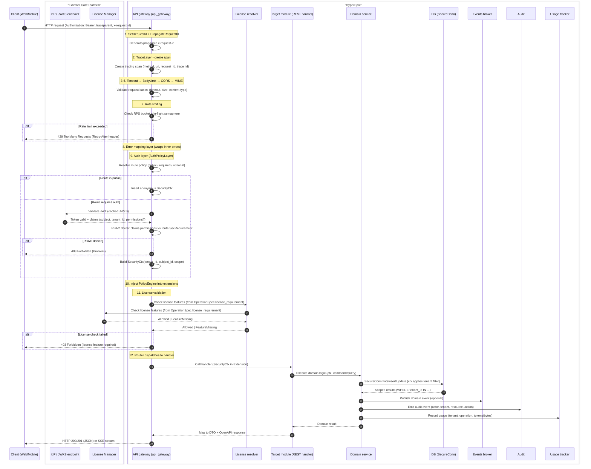

## Sub-scenario - chat hook invocation

Chat hooks allow integrations to intercept internal message/file/search traffic within the chat system. Hooks enable:
- **Blocking**: Return error and stop processing
- **Override**: Modify content before proceeding

### Hook types

| Hook ID | Trigger point | Capabilities | Use case |
|---------|---------------|--------------|----------|
| `gts.x.genai.flow.hook.v1~x.genai.chat.user_message_pre_store.v1~` | After user message submitted, before DB store | BLOCK, OVERRIDE | DLP: scan outgoing content |
| `gts.x.genai.flow.hook.v1~x.genai.file.post_parse.v1~` | After file content parsed | INFORMATIVE | Audit, classification |
| `gts.x.genai.flow.hook.v1~x.genai.llm.pre_call.v1~` | Before final message goes to LLM | BLOCK, OVERRIDE | Content filtering, PII redaction |
| `gts.x.genai.flow.hook.v1~x.genai.llm.post_response.v1~` | After LLM response, before DB store | BLOCK, OVERRIDE | Response filtering |
| `gts.x.genai.flow.hook.v1~x.genai.search.pre_request.v1~` | Before search request (RAG or WebSearch) | BLOCK, OVERRIDE | Query sanitization |
| `gts.x.genai.flow.hook.v1~x.genai.search.post_response.v1~` | After search response received | BLOCK, OVERRIDE | Result filtering |

All the hook types are registered in GTS and can be enabled/disabled per tenant/user by customers or integrations. All the registered hooks will be executed in the priority order.

### Hook invocation flow

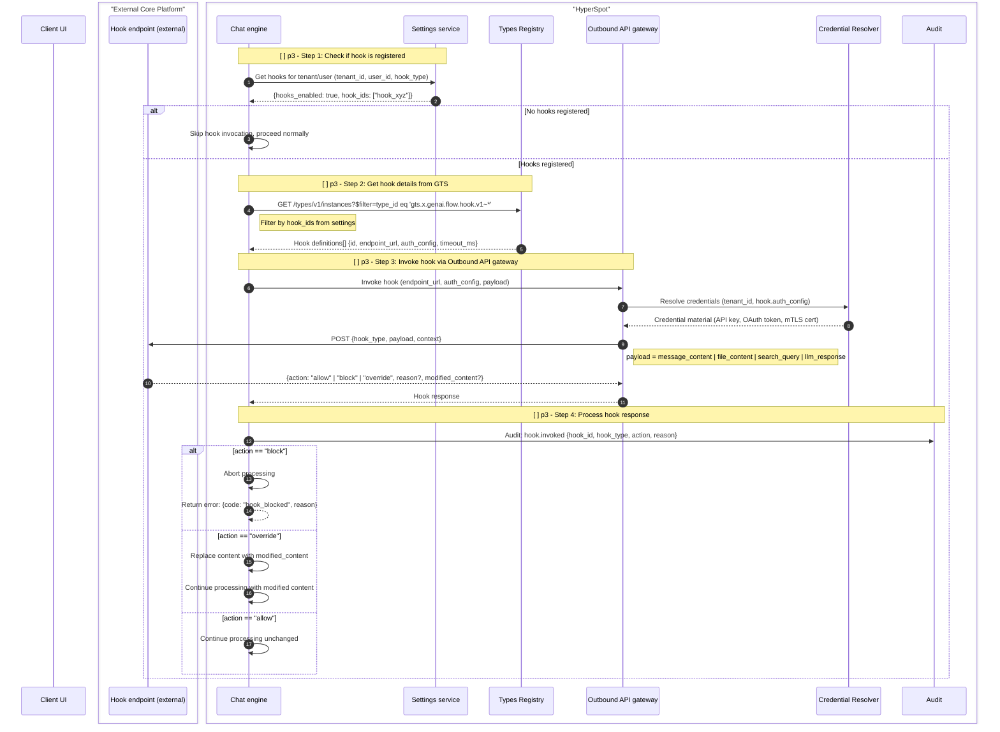

### Hook payload examples

**user_message.pre_store:**
```json
{
  "hook_type": "gts.x.genai.flow.hook.v1~x.genai.chat.user_message_pre_store.v1~",
  "payload": {
    "message_id": "msg_123",
    "content": "Please analyze this financial report",
    "attachments": [{"file_id": "file_456"}]
  },
  "context": {"tenant_id": "...", "user_id": "...", "conversation_id": "..."}
}
```

**llm.pre_call:**
```json
{
  "hook_type": "gts.x.genai.flow.hook.v1~x.genai.chat.llm_pre_call.v1~",
  "payload": {
    "messages": [...],
    "tools": [...],
    "model": "gpt-4",
    "estimated_tokens": 4500
  },
  "context": {"tenant_id": "...", "conversation_id": "..."}
}
```

## Typical chat scenario with ASYNCHRONOUS file attachment processing

> NOTE: This is target architecture and not the current state of the codebase. Some components and scenarios steps are not yet implemented.

This scenario follows patterns from **LangChain/LangGraph** (agent loop, state machine) and **Rig** (Rust AI framework):
- **ReAct pattern**: Reason → Act → Observe loop for tool calls
- **Streaming-first**: SSE for real-time token delivery
- **Async file processing**: Background jobs for parsing/indexing

**Steps:**
1. User uploads file + sends message (file stored, job enqueued) — **Hook: user_message.pre_store**
2. File processed asynchronously (parse → chunk → embed → index) — **Hook: file.post_parse**
3. RAG retrieval from indexed documents — **Hooks: search.pre_request, search.post_response**
4. WebSearch for real-time information (if enabled) — **Hooks: search.pre_request, search.post_response**
5. Agent state preparation (tools + prompt + model + token budget) — **Hooks: llm.pre_call**
6. Agent loop + SSE streaming — **Hooks: llm.pre_call, llm.post_response**

### Step 1/6 - Upload file + send message (async processing)

File upload stores the blob, then **Chat Engine orchestrates** job creation. The UI tracks job progress via SSE or polling before proceeding.

**Key architectural points:**
- API gateway remains simple (middleware + routing only)
- **Chat Engine** owns orchestration — it triggers the Jobs Manager
- UI must wait for job completion before file content is usable

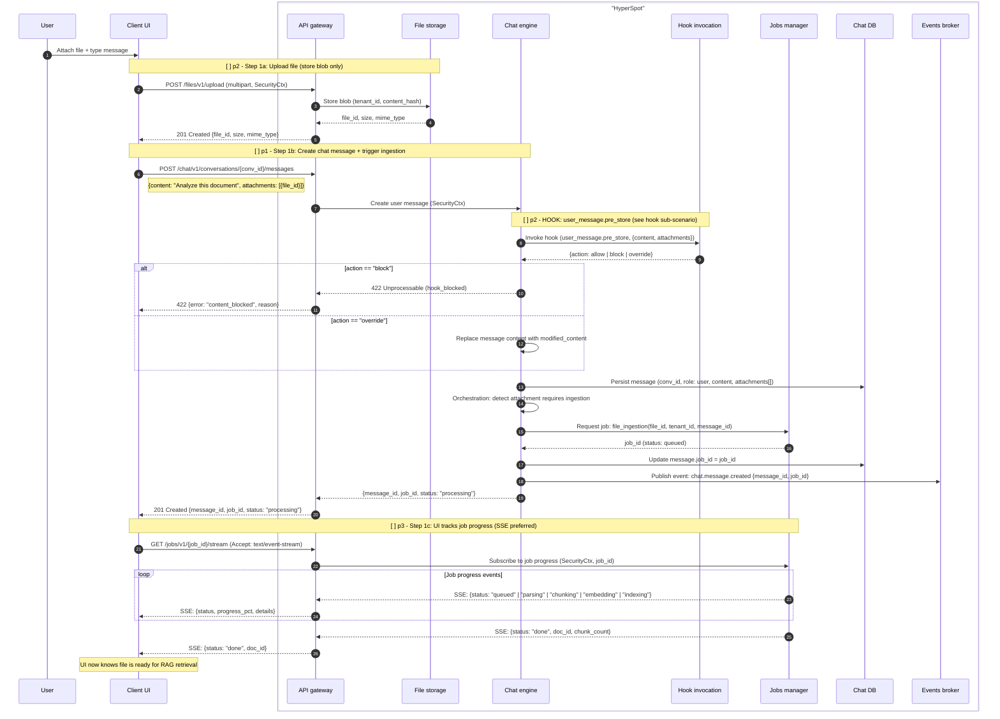

### Step 2/6 - File ingestion pipeline (background job)

The **Jobs Manager** executes the file ingestion pipeline asynchronously, emitting progress events for UI tracking. When complete, **Chat Engine** proceeds with RAG retrieval.

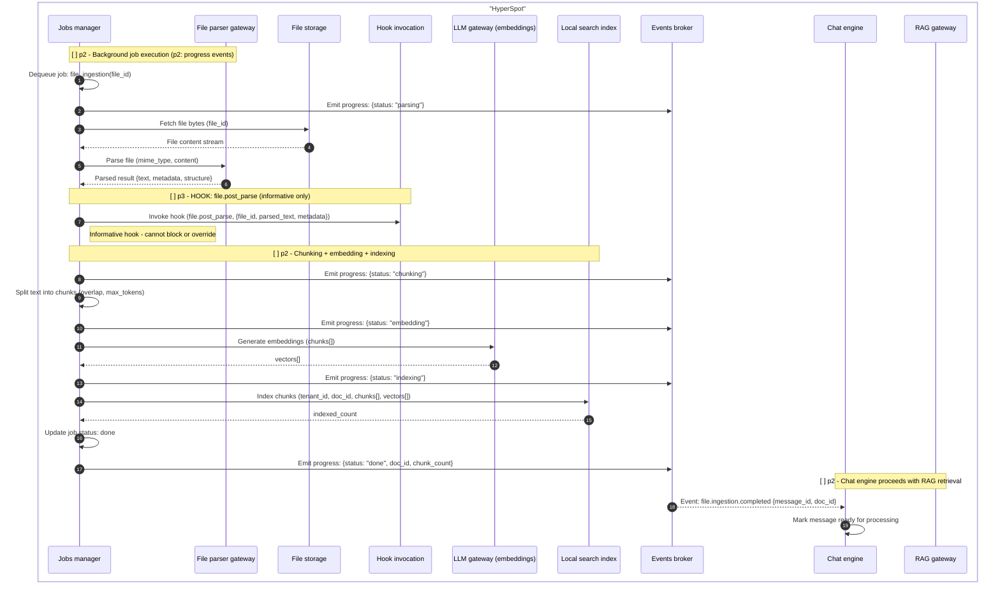

### Step 3/6 - RAG retrieval from indexed documents

Retrieve relevant context from indexed documents using hybrid search (vector + keyword).

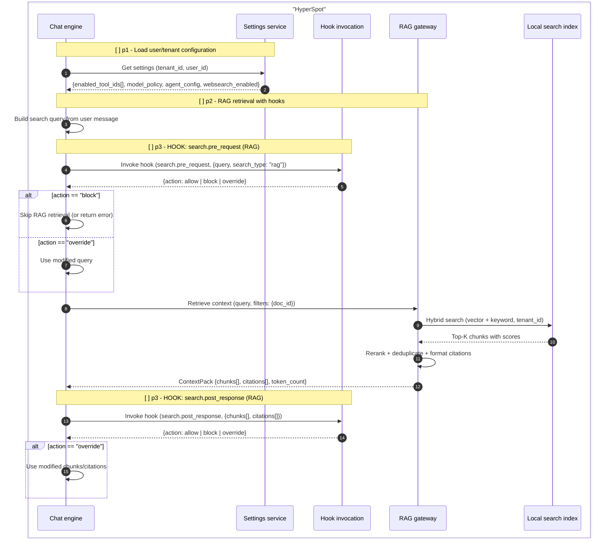

### Step 4/6 - WebSearch for real-time information (if enabled)

When WebSearch is enabled, query external search engines for real-time information. Results are merged with RAG context.

**WebSearch best practices:**
- Query rewriting (LLM-assisted or rule-based)
- Result deduplication with RAG context
- Source URL attribution for citations

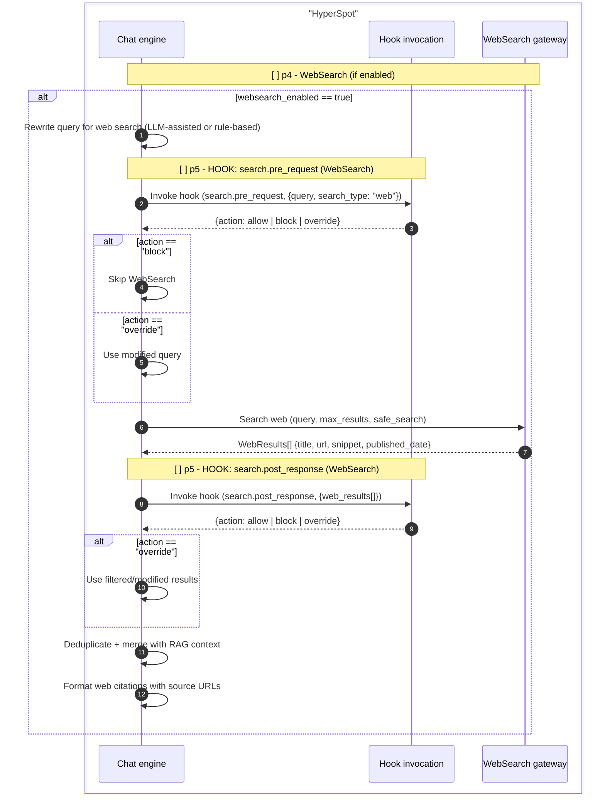

### Step 5/6 - Agent state preparation (tools + prompt + model + token budget)

Prepare the full agent state before LLM invocation.

**Key rules:**
- **No runtime tool validation** via MCP (too slow) — rely on GTS-registered definitions
- **Token budget check** before LLM call — reject or mitigate if context too large

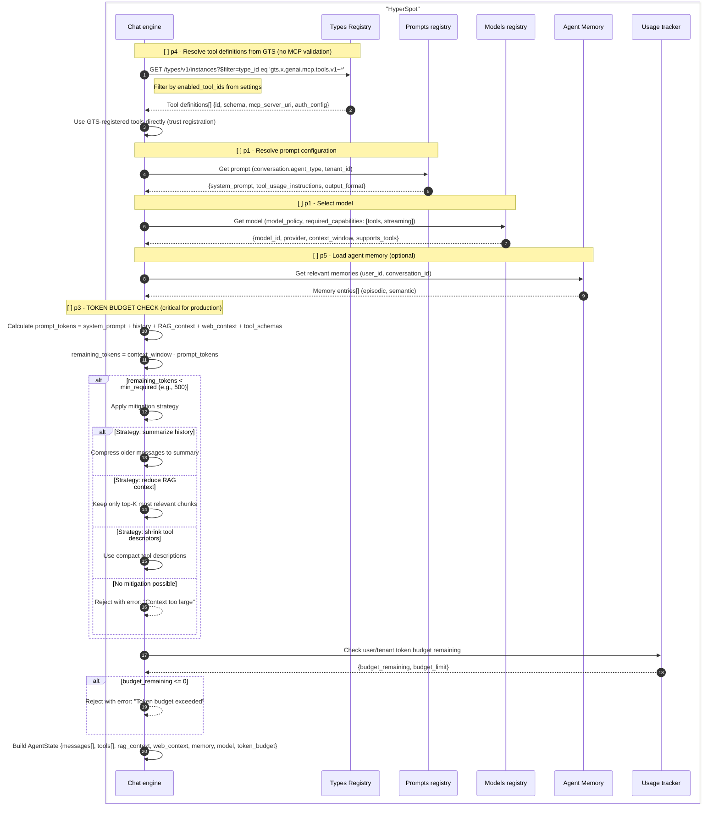

### Step 6/6 - ReAct agent loop + SSE streaming

This implements the **ReAct pattern** (Reason + Act): the agent iteratively calls the LLM, executes any requested tools, and feeds results back until the LLM produces a final answer.

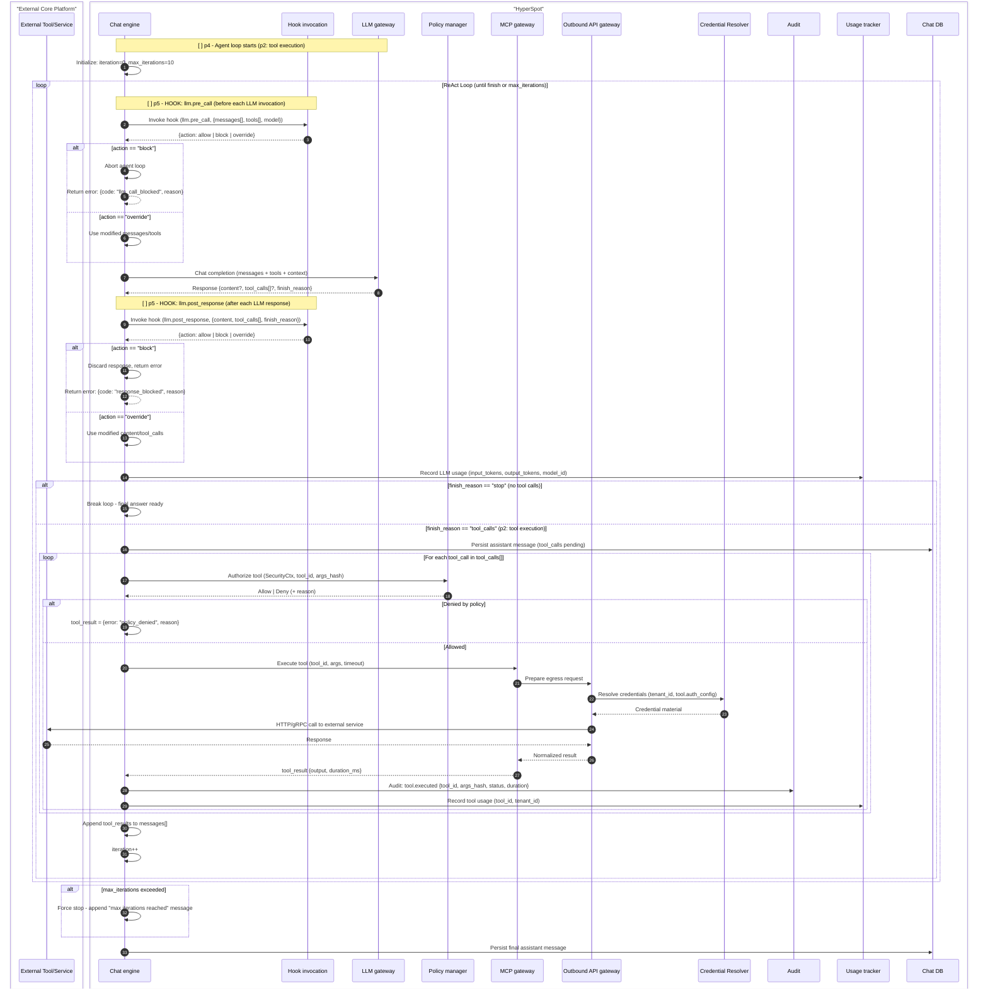

#### SSE streaming with throttling (continuation of Step 6/6)

The final answer is streamed to the client using **Server-Sent Events (SSE)**. The Chat engine uses ModKit's `SseBroadcaster` for efficient fan-out.

**Key rules:**
- **SSE throttling**: If user/tenant consumes too many tokens, slow down or terminate stream
- Track token budget in real-time during streaming

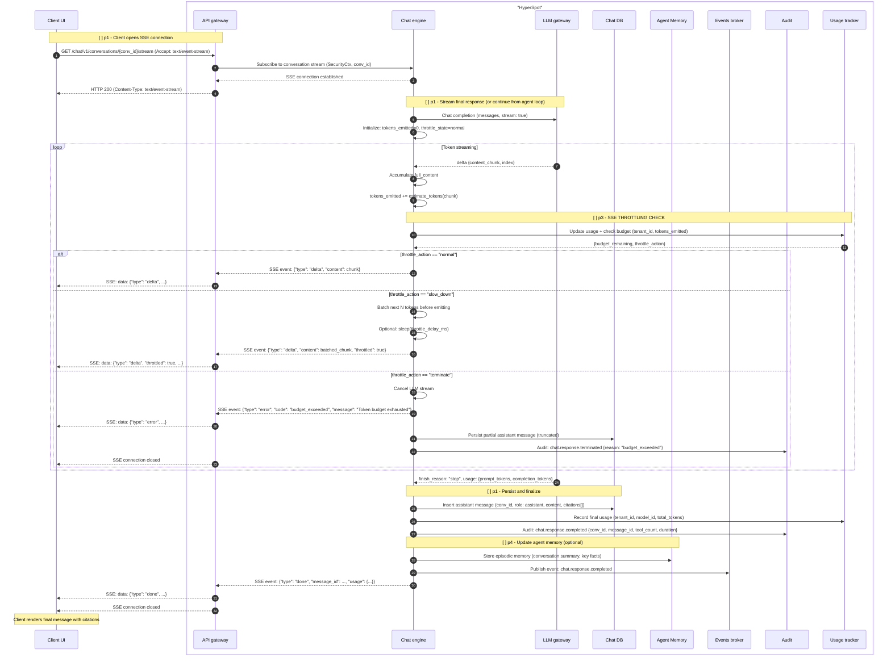


## Typical chat scenario with SYNCHRONOUS file attachment w/o RAG and WebSearch processing

This is a **simpler** alternative version of the async scenario:
- **No Jobs Manager** — file is parsed immediately during the request
- **No RAG** — file content is injected directly into chat context
- **No WebSearch** — no external search engines are used
- Aligned with current Go implementation (`/chat/threads/{thread_id}/attachment` and `/chat/attachments`)

**Steps:**
1. User uploads file → synchronous parse → create "file attachment message" — **Hook: file.post_parse**
2. User sends message — **Hook: user_message.pre_store**
3. Prepare agent state + agent loop + SSE streaming — **Hooks: llm.pre_call, llm.post_response** (same as async Steps 5-6)

### Step 1/3 - Upload file + synchronous parse + create attachment message

File is uploaded, parsed immediately (using File Parser), and a **file attachment message** is created with the parsed/truncated content. No background job, no RAG indexing, no WebSearch.

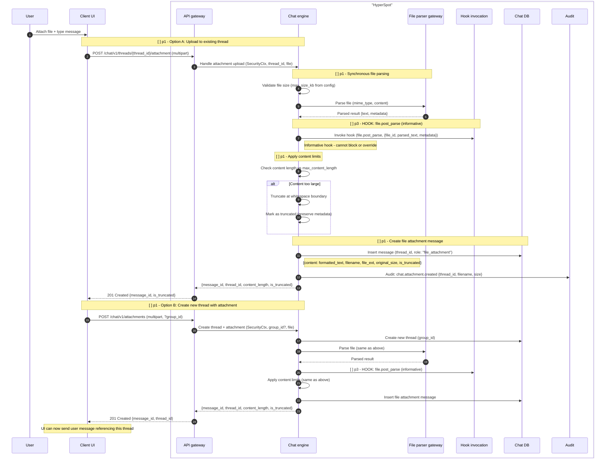

### Step 2/3 - Send user message + prepare agent state

After the file attachment message exists, user sends their actual question. Chat Engine prepares agent state with file content included in context.

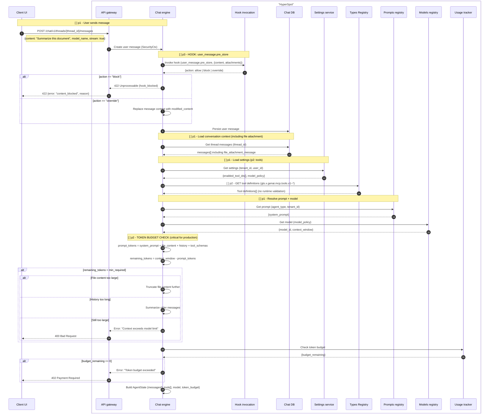

### Step 3/3 - Agent loop + SSE streaming (same as async Step 6/6)

For the agent loop and SSE streaming, refer to the **async scenario Step 6/6** above. The flow is identical:
1. ReAct agent loop (LLM call → tool execution → repeat)
2. SSE streaming with throttling

The only difference is that the context includes the **full file attachment content** (possibly truncated) directly in messages, rather than RAG-retrieved chunks with citations.
