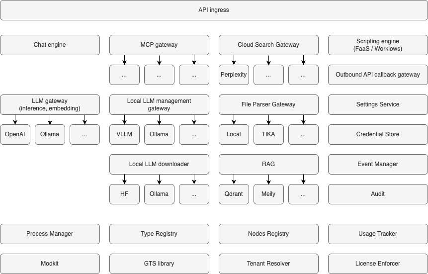

# HyperSpot Architecture Manifest

> **Welcome to HyperSpot!** This document serves as your architectural compass, explaining the core ideas, design principles, and rules that guide HyperSpot's development. Whether you're a newcomer or contributor, understanding these concepts will help you navigate and extend the platform effectively.

## Overview

HyperSpot is a **modular, high-performance AI services platform** built in Rust. It provides a comprehensive framework for building scalable and highly-customizable AI applications with automatic REST API generation, comprehensive OpenAPI documentation, and a flexible modular architecture.

**Key Philosophy:**
- **Modular by Design**: Everything is a Module - composable, independent units with gateway patterns for pluggable workers
- **Extensible at Every Level**: [GTS](https://github.com/globaltypesystem/gts-spec)-powered extension points for custom data types, business logic, and third-party integrations
- **SaaS Ready**: Multi-tenancy, granular access control, usage tracking, and tenant customization built-in
- **Cloud Operations Excellence**: Production-grade observability, database agnostic design, API best practices, and resilience patterns via ModKit
- **Quality First**: 90%+ test coverage target with unit, integration, E2E, performance, and security testing
- **Universal Deployment**: Single codebase runs on cloud, on-prem Windows/Linux workstation, or mobile
- **Developer Friendly**: AI-assisted code generation, automatic OpenAPI docs, DDD-light structure, and type-safe APIs

---

## 1. Modular Architecture

### 1.1. What is a Module?

A **Module** is a logical component that provides a specific set of functionality. In HyperSpot:
- Everything MUST be a module (no exceptions)
- Each module is a Rust crate library
- Modules are self-contained with their own configuration, API, and business logic
- Modules are discovered automatically via the `inventory` crate
- Modules can depend on each other
- A module can implement a common API gateway, while workers can be implemented as separate modules (for example Search gateway that provides agnostic API for search using different engines like Qdrant, Weaviate, etc.)

**Example modules:**
- `api_ingress` - HTTP server and routing
- `directory_service` - User and tenant management
- `file_parser` - Document parsing and extraction
- `grpc_hub` - gRPC communication gateway

### 1.2. Deployment Units

A **Deployment Unit** is a physical component that bundles one or more modules for deployment:
- **Desktop app**: Most modules compiled into a single process
- **Cloud server**: Modules running in separate Docker containers
- **On-prem server**: Modules as Windows/Linux binaries
- **Mobile app**: Selected modules in-app, others in the cloud

### 1.3. Module Communication

Modules interact using **native Rust APIs** that abstract the transport layer:
- **Local**: Direct function calls within the same process
- **gRPC**: High-performance remote procedure calls
- **HTTP/REST**: Standard web APIs

The `ClientHub` provides type-safe client resolution, allowing modules to communicate without knowing the underlying transport.

---

## 2. SaaS Readiness

HyperSpot is designed from the ground up for **Software-as-a-Service (SaaS)** deployments with enterprise-grade multi-tenancy and security features.

### 2.1. Multi-Tenancy

**Tenant Isolation:**
- [x] **Data Isolation**: Complete separation of tenant data at the database level
- [x] **Resource Isolation**: Per-tenant resource quotas and rate limiting
- [ ] **Configuration Isolation**: Tenant-specific settings and feature flags

### 2.2. Granular Access Control

**Authentication:**
- [ ] **Multiple Providers**: OAuth2, SAML, LDAP, API keys, JWT tokens
- [ ] **Session Management**: Secure session handling with configurable TTL
- [ ] **Token Validation**: JWT verification with public key rotation support
- [ ] **MFA Support**: Multi-factor authentication integration points

**Authorization:**
- [ ] **Role-Based Access Control (RBAC)**: Hierarchical role definitions
- [ ] **Attribute-Based Access Control (ABAC)**: Fine-grained policy-based permissions
- [ ] **Resource-Level Permissions**: Per-resource access control (read, write, delete, admin)
- [ ] **API-Level Security**: Endpoint-level authorization checks
- [ ] **Scope-Based Access**: OAuth2 scopes for API access control

**Security Features:**
- [ ] **Audit Logging**: Complete audit trail of all security-relevant operations
- [ ] **Credential Management**: Secure storage and rotation of secrets and API keys
- [ ] **Rate Limiting**: Per-tenant and per-user rate limits
- [ ] **IP Whitelisting**: Network-level access restrictions
- [ ] **Data Encryption**: At-rest and in-transit encryption

### 2.3. Usage Tracking & Billing

**Metering:**
- [ ] **Usage Tracker**: Real-time tracking of resource consumption
- [ ] **Metrics Collection**: API calls, compute time, storage, bandwidth
- [ ] **Quota Enforcement**: Hard and soft limits with grace periods
- [ ] **Usage Analytics**: Detailed usage reports and dashboards

**License Management:**
- [ ] **License Enforcer**: Feature gating based on subscription tiers
- [ ] **Entitlement Checks**: Runtime validation of feature access
- [ ] **Trial Management**: Time-limited and feature-limited trials
- [ ] **Upgrade Flows**: Seamless tier upgrades and downgrades

### 2.4. Tenant Customization

**Branding:**
- [ ] **White-Labeling**: Custom logos, colors, and themes per tenant
- [ ] **Custom Domains**: Tenant-specific domain mapping
- [ ] **Email Templates**: Customizable notification templates

**Configuration:**
- [ ] **Feature Flags**: Per-tenant feature enablement
- [ ] **Custom Settings**: Tenant-specific configuration overrides
- [ ] **Integration Points**: Tenant-specific webhooks and callbacks

---

## 3. System Components



The diagram above shows HyperSpot's component architecture. Components are organized in phases based on development priority and dependencies.

### 2.1. Phase 1 - Core Foundation

- [ ] Ingress API
- [ ] Process manager
- [ ] Types registry
- [ ] Chat engine
- [ ] File parser gateway
- [ ] File parser - embedded parser
- [ ] Search gateway
- [ ] Search gateway - Qdrant connector
- [ ] Usage tracker
- [ ] License enforcer gateway
- [ ] Tenant resolver gateway
- [ ] LLM gateway
- [ ] LLM gateway - VLLM connector
- [ ] LLM gateway - LM Studio connector
- [ ] LLM gateway - OpenAI connector
- [ ] LLM gateway - Gemini connector
- [ ] LLM gateway - Anthropic connector
- [ ] LLM manager
- [ ] LLM manager - VLLM
- [ ] LLM manager - LM Studio

### 2.2. Phase 2 - Extended Capabilities

- [ ] MCP gateway
- [ ] File parser - Apache Tika parser
- [ ] LLM benchmarks gateway
- [ ] LLM benchmarks gateway - HumanEval
- [ ] LLM benchmarks gateway - MBPP
- [ ] Event Manager
- [ ] Audit

### 2.3. Phase 3 - Advanced Features

- [ ] Agents gateway
- [ ] Server side scripting (FaaS, Workflows)
- [ ] Outbound API callback gateway
- [ ] Settings service
- [ ] Credentials Store
- [ ] License Enforcement
- [ ] Email gateway
- [ ] Flowcharts

---

## 3. Deployment Targets

HyperSpot supports multiple deployment scenarios to meet different operational needs:

- [ ] 3.1. Desktop Application - local AI resaerchers, offline processing
- [ ] 3.2. Cloud Server - multi-tenant SaaS, scalable AI services
- [ ] 3.3. On-premises Server - enterprise deployments, air-gapped environments
- [ ] 3.4. Mobile Application - AI on mobile devices

---

## 4. Code Organization

### 4.1. Monorepo Structure

HyperSpot uses a **monorepo** approach with multiple crates:

```
hyperspot/
├── apps/              # Executable applications (hyperspot-server)
├── libs/              # Shared libraries (modkit, modkit-db, modkit-auth, etc.)
├── modules/           # Business logic modules (api_ingress, directory_service, etc.)
├── examples/          # Example modules and usage patterns
├── testing/           # E2E and integration tests
├── docs/              # Architecture and development guides
├── guidelines/        # Coding standards and best practices
└── config/            # Configuration files
```

### 4.2. External Integration

The 'main' crates can be located in separate repositories and use HyperSpot modules as dependencies via Cargo. This allows:
- Custom applications built on HyperSpot
- Private modules not in the main repo
- Vendor-specific extensions

### 4.3. Module Layout (DDD-Light)

Every module follows a **Domain-Driven Design (DDD-light)** structure:

```
modules/<module-name>/
├── src/
│   ├── lib.rs           # Public exports
│   ├── module.rs        # Module declaration and traits
│   ├── config.rs        # Typed configuration
│   ├── api/             # Transport adapters (REST, gRPC)
│   │   └── rest/        # HTTP handlers, DTOs, routes
│   ├── contract/        # Public API for other modules
│   │   ├── client.rs    # ClientHub traits
│   │   ├── model.rs     # Transport-agnostic models
│   │   └── error.rs     # Domain errors
│   ├── domain/          # Business logic
│   │   ├── service.rs   # Orchestration and rules
│   │   └── events.rs    # Domain events
│   └── infra/           # Infrastructure (database, external APIs)
│       └── storage/     # Database entities and repositories
└── Cargo.toml
```

**Layer responsibilities:**
- **API**: Translates HTTP/gRPC requests to domain commands
- **Contract**: Public interface for inter-module communication
- **Domain**: Core business logic, independent of infrastructure
- **Infra**: Database, external services, system interactions

### 4.4. ModKit - The Foundation

Every HyperSpot module uses the **ModKit** framework, which provides:
- **Module lifecycle**: Initialization, configuration, shutdown
- **REST API builder**: Type-safe route registration with OpenAPI
- **Database access**: SeaORM and SQLx integration
- **Client hub**: Type-safe inter-module communication
- **Error handling**: RFC-9457 Problem Details for HTTP APIs
- **Observability**: Structured logging and distributed tracing
- **SSE support**: Server-Sent Events for real-time updates

**Key ModKit libraries:**
- `modkit` - Core framework
- `modkit-db` - Database abstractions
- `modkit-auth` - Authentication and authorization
- `modkit-errors` - Standardized error handling
- `modkit-macros` - Procedural macros for module declaration

---

## 5. Quality Gateways

HyperSpot maintains high code quality through automated checks and comprehensive testing.

### 5.1. Testing Strategy

**Target: 90%+ code coverage**

- **Unit tests**: Test individual functions and methods
  ```bash
  cargo test --workspace
  ```

- **Integration tests**: Test module interactions with databases
  ```bash
  make test-pg  # PostgreSQL
  make test-sqlite  # SQLite
  ```

- **End-to-end tests**: Test complete request flows (Python/pytest)
  ```bash
  make e2e-docker  # Run in Docker environment
  ```

- **Performance tests**: Test module interactions with databases
  TODO

- **Security tests**: API fuzzing testing
  TODO

### 5.2. Static Analysis

All code must pass these checks before merging:

- **Formatting**: `cargo fmt --all -- --check`
  - Max line length: 100 characters
  - 4-space indentation
  - Trailing commas required

- **Linting**: `cargo clippy --workspace --all-targets -- -D warnings`
  - Deny all warnings
  - Deny unsafe code (workspace-wide)

- **Security audit**: `cargo audit`
  - Check for known vulnerabilities

- **License compliance**: `cargo deny check`
  - Verify dependency licenses

**Run all checks:**
```bash
make check  # Unix/Linux/macOS
python scripts/ci.py check  # Cross-platform
```

---

## 6. Dependencies and Standards

### 6.1. DNA - Development Guidelines

[DNA](https://github.com/hypernetix/DNA) is HyperSpot's collection of development standards and best practices:
- **REST API design**: Status codes, pagination, error handling
- **Language conventions**: Rust coding standards
- **Security practices**: Authentication, authorization, data protection
- **DCO**: Developer Certificate of Origin for contributions

**Key guidelines:**
- `guidelines/DNA/REST/API.md` - REST API design principles
- `guidelines/DNA/languages/RUST.md` - Rust coding standards
- `guidelines/SECURITY.md` - Security requirements

### 6.2. Extension Points (Type System)

HyperSpot uses the [Global Type System](https://github.com/GlobalTypeSystem/gts-rust) ([specification](https://github.com/GlobalTypeSystem/gts-spec)) to implement a powerful **extension point architecture** where virtually everything in the system can be extended without modifying core code.

**Core Concept: Extension Points**

An **extension point** is a well-defined interface where new functionality can be plugged in dynamically. GTS enables this through:
- **Versioned type definitions**: Shared schemas across modules with backward compatibility
- **Type registration**: Runtime discovery of new types and implementations
- **Protocol buffer schemas**: Language-agnostic type definitions
- **Type evolution**: Safe schema changes without breaking existing code

**What Can Be Extended:**

1. **Module Workers** - Add new implementations behind gateway modules:
   - **LLM Service Connectors**: OpenAI, Anthropic, Gemini, VLLM, LM Studio, custom providers
   - **LLM Benchmarks**: HumanEval, MBPP, custom evaluation frameworks
   - **Search Engines**: Qdrant, Weaviate, Milvus, Elasticsearch, custom engines
   - **File Parsers**: Embedded parser, Apache Tika, custom parsers
   - **Authentication Providers**: OAuth2, SAML, LDAP, custom auth systems

2. **Data Types in APIs** - Extend existing endpoints with new data structures:
   - **Event Types**: New domain events for the event manager
   - **Benchmark Result Formats**: Custom metrics and evaluation outputs
   - **Document Types**: New file formats and metadata schemas
   - **Message Formats**: Chat message types, attachments, rich content

3. **Executable Extensions**:
   - **FaaS Functions**: User-defined serverless functions
   - **Server-Side Scripts**: Custom workflows and automation
   - **Agents**: Pluggable AI agent implementations

**Benefits:**

- **High customization**: Hyperspot modules can be used as a building blocks for custom AI applications or platforms
- **No Core Modifications**: Add new functionality without changing HyperSpot core
- **Type Safety**: Compile-time checks for extension implementations
- **Version Compatibility**: Graceful handling of schema evolution
- **Dynamic Discovery**: Extensions are discovered at runtime via type registry
- **Third-Party Extensions**: External developers can create plugins and connectors

**Example Use Cases:**

- A company adds a proprietary chat extension for it's competitive solution
- A researcher implements a new benchmark suite as a module worker
- A user creates custom FaaS functions or workflows for domain-specific workflows
- An enterprise integrates a custom search engine for compliance requirements

This extension point architecture makes HyperSpot truly modular and adaptable to diverse use cases while maintaining type safety and system integrity.

---

## 7. Cloud Operations Excellence

HyperSpot modules are built on **ModKit**, which provides enterprise-grade operational capabilities out of the box. Every module automatically inherits these cloud-native patterns without additional implementation effort.

### 7.1. Observability

**Structured Logging:**
- [ ] **Unified Logging**: All modules use `tracing` for structured, contextual logging
- [ ] **Log Levels**: Configurable per-module log levels (trace, debug, info, warn, error)
- [ ] **Log Rotation**: Automatic log file rotation with size and age limits
- [ ] **JSON Output**: Machine-readable JSON logs for centralized log aggregation
- [ ] **Contextual Fields**: Automatic inclusion of tenant_id, user_id, request_id, trace_id
- [ ] **Performance**: Async logging with minimal overhead

**Distributed Tracing:**
- [ ] **OpenTelemetry Integration**: Full support for distributed tracing
- [ ] **Trace Propagation**: Automatic trace context propagation across service boundaries
- [ ] **Span Instrumentation**: Automatic span creation for HTTP requests, database queries, and inter-module calls
- [ ] **Trace Sampling**: Configurable sampling rates for production environments
- [ ] **Trace Export**: Support for OTLP, Jaeger, Zipkin exporters
- [ ] **Custom Spans**: Easy creation of custom spans for business logic tracing

**Metrics & Monitoring:**
- [ ] **Health Checks**: Built-in `/health` endpoint for liveness and readiness probes
- [ ] **Prometheus Metrics**: Automatic metrics export in Prometheus format
- [ ] **Custom Metrics**: Easy registration of business metrics (counters, gauges, histograms)
- [ ] **Performance Metrics**: Request latency, throughput, error rates
- [ ] **Resource Metrics**: Memory usage, connection pool stats, queue depths

### 7.2. Database Excellence

**Database Agnostic:**
- [ ] **Multiple Backends**: PostgreSQL, MySQL, SQLite support via SQLx
- [ ] **ORM Abstraction**: SeaORM for type-safe database operations
- [ ] **Migration Management**: Versioned schema migrations with rollback support
- [ ] **Connection Pooling**: Efficient connection pool management with configurable limits
- [ ] **Query Builder**: Type-safe query construction preventing SQL injection

**Secure Database Access:**
- [ ] **Credential Management**: Secure storage of database credentials (environment variables, secrets manager)
- [ ] **Connection Encryption**: TLS/SSL for database connections
- [ ] **Least Privilege**: Database users with minimal required permissions
- [ ] **Query Sanitization**: Automatic parameterization of all queries
- [ ] **Audit Trail**: Database operation logging for compliance

**Database Operations:**
- [ ] **Transaction Management**: ACID transactions with proper error handling
- [ ] **Retry Logic**: Automatic retry for transient failures
- [ ] **Timeout Configuration**: Configurable query and connection timeouts
- [ ] **Busy Handling**: SQLite busy timeout configuration
- [ ] **Mock Support**: In-memory database for testing

### 7.3. API Excellence

**HTTP Best Practices:**
- [ ] **RESTful Design**: Consistent REST API patterns across all modules
- [ ] **OpenAPI Documentation**: Automatic API documentation generation
- [ ] **Request Validation**: Type-safe request validation with detailed error messages
- [ ] **Response Standards**: RFC-9457 Problem Details for standardized error responses
- [ ] **Content Negotiation**: Support for JSON, protobuf, and other formats
- [ ] **Compression**: Automatic response compression (gzip, brotli)

**Request Tracing:**
- [ ] **Request IDs**: Automatic generation and propagation of unique request identifiers
- [ ] **Correlation IDs**: Cross-service request correlation
- [ ] **Request Logging**: Automatic logging of all HTTP requests with timing
- [ ] **Error Context**: Rich error context with stack traces and request details

**API Security:**
- [ ] **CORS Configuration**: Flexible CORS policy management
- [ ] **Rate Limiting**: Per-endpoint and per-tenant rate limits
- [ ] **Request Size Limits**: Protection against large payload attacks
- [ ] **Timeout Protection**: Request timeout enforcement
- [ ] **Authentication Middleware**: Automatic token validation

### 7.4. Resilience & Reliability

**Error Handling:**
- [ ] **Typed Errors**: Strongly-typed error handling with `anyhow` and `thiserror`
- [ ] **Error Propagation**: Proper error context propagation through the stack
- [ ] **Graceful Degradation**: Fallback mechanisms for non-critical failures
- [ ] **Circuit Breakers**: Protection against cascading failures

**Lifecycle Management:**
- [ ] **Graceful Shutdown**: Clean shutdown with connection draining
- [ ] **Cancellation Tokens**: Cooperative cancellation for long-running tasks
- [ ] **Background Tasks**: Managed background task lifecycle
- [ ] **Resource Cleanup**: Automatic cleanup of resources on shutdown

**High Availability:**
- [ ] **Stateless Design**: Modules designed for horizontal scaling
- [ ] **Health Endpoints**: Kubernetes-compatible health checks
- [ ] **Zero-Downtime Deploys**: Support for rolling updates
- [ ] **Retry Mechanisms**: Automatic retry for transient failures

### 7.5. Configuration Management

**Flexible Configuration:**
- [ ] **YAML Configuration**: Human-readable configuration files
- [ ] **Environment Overrides**: Environment variable support with `HYPERSPOT_` prefix
- [ ] **Type-Safe Config**: Strongly-typed configuration structs with validation
- [ ] **Defaults**: Sensible defaults for all configuration options
- [ ] **Hot Reload**: Configuration reload without restart

**Secrets Management:**
- [ ] **Environment Variables**: Secure credential injection
- [ ] **Secrets Integration**: Support for HashiCorp Vault, AWS Secrets Manager
- [ ] **Credential Rotation**: Support for zero-downtime credential rotation

### 7.6. Development Experience

**Developer Productivity:**
- [ ] **Hot Reload**: Fast development iteration with cargo watch
- [ ] **Mock Support**: In-memory mocks for databases and external services
- [ ] **Test Utilities**: Comprehensive testing helpers and fixtures
- [ ] **Documentation**: Auto-generated API docs and rustdoc comments
- [ ] **Type Safety**: Compile-time guarantees preventing runtime errors

**Debugging:**
- [ ] **Rich Logging**: Detailed logs with full context
- [ ] **Error Messages**: Clear, actionable error messages
- [ ] **Stack Traces**: Full stack traces with source locations
- [ ] **Request Replay**: Ability to replay requests for debugging

### 7.7. Performance Optimization

**Efficient Resource Usage:**
- [ ] **Async Runtime**: Tokio-based async runtime for high concurrency
- [ ] **Connection Pooling**: Efficient reuse of database and HTTP connections
- [ ] **Lock-Free Structures**: `DashMap`, `arc-swap` for concurrent access
- [ ] **Zero-Copy**: Minimal data copying in hot paths
- [ ] **Lazy Initialization**: Deferred initialization of expensive resources

**Scalability:**
- [ ] **Horizontal Scaling**: Stateless design for easy scaling
- [ ] **Resource Limits**: Configurable limits to prevent resource exhaustion
- [ ] **Backpressure**: Flow control for overload protection
- [ ] **Caching**: Built-in caching support for frequently accessed data
