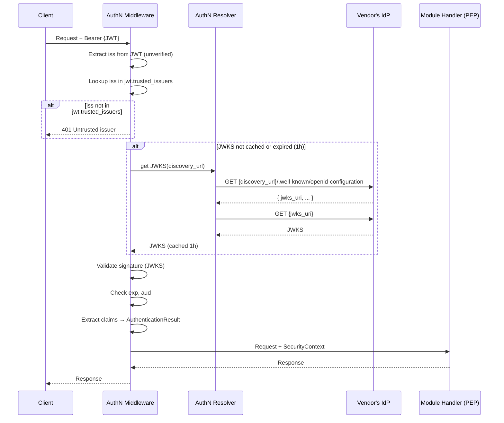
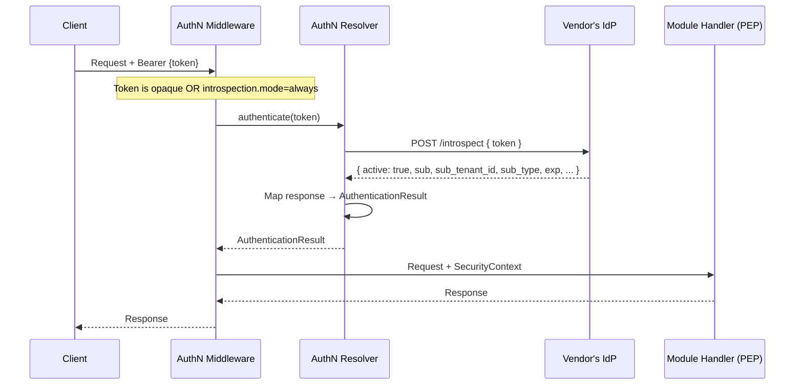

# AuthN Resolver: JWT + OIDC Plugin Reference Implementation

## Overview

This document describes the **reference implementation** of an AuthN Resolver plugin that supports:

- **JWT (JSON Web Token)** — Self-contained tokens validated locally via signature verification (RFC 7519)
- **Opaque tokens** — Validated via Token Introspection endpoint (RFC 7662)
- **OpenID Connect** — Auto-configuration via Discovery (OpenID Connect Core 1.0, Discovery 1.0)

**Scope:** This is ONE possible implementation of the `AuthNResolverPluginClient` trait. Vendors may implement different authentication strategies (mTLS, API keys, custom protocols) without following this design.

**Use case:** This plugin is suitable for vendors with standard OIDC-compliant Identity Providers that issue JWTs and support token introspection. It ships as part of HyperSpot's standard distribution and can be configured for most OAuth 2.0 / OIDC providers.

**Standards:**
- [RFC 7519: JSON Web Token (JWT)](https://datatracker.ietf.org/doc/html/rfc7519)
- [RFC 7662: OAuth 2.0 Token Introspection](https://datatracker.ietf.org/doc/html/rfc7662)
- [OpenID Connect Core 1.0](https://openid.net/specs/openid-connect-core-1_0.html)
- [OpenID Connect Discovery 1.0](https://openid.net/specs/openid-connect-discovery-1_0.html)

---

## Supported Token Formats

**JWT (JSON Web Token):**
- **Structure:** Three base64url-encoded segments separated by dots (`header.payload.signature`)
- **Contains:** Claims (subject, issuer, expiration, custom fields)
- **Validation:** Signature verification via JWKS (JSON Web Key Set)
- **Use case:** Self-contained tokens for distributed systems, offline validation

**Opaque Tokens:**
- **Structure:** Arbitrary string (no internal structure)
- **Contains:** No claims (reference to IdP state)
- **Validation:** Token Introspection endpoint call
- **Use case:** Revocation-sensitive flows, tokens with sensitive claims

**Token Type Detection:**
- **JWT:** Identified by structure (three base64url segments separated by dots)
- **Opaque:** All other formats

---

## Token Validation Modes

The plugin supports three validation modes controlled by `introspection.mode` configuration:

| Mode | When | How |
|------|------|-----|
| JWT local | JWT + introspection not required | Validate signature via JWKS, extract claims |
| Introspection | Opaque token OR JWT requiring enrichment/revocation check | Plugin calls `introspection_endpoint` |

**Detailed Mode Behavior:**

| Mode | JWT Behavior | Opaque Behavior | Use Case |
|------|--------------|-----------------|----------|
| `never` | Local validation only | **401 Unauthorized** | Offline validation, low latency |
| `opaque_only` (default) | Local validation only | Introspection | Balance of performance and revocation |
| `always` | Introspection (+ signature check) | Introspection | Strict revocation checking |

**Rationale:**
- `never` — Fastest, but no revocation checking for JWTs (opaque tokens fail)
- `opaque_only` — Default, reasonable balance (JWTs validated locally, opaque via introspection)
- `always` — Strictest, every token checked against IdP (highest latency, best revocation guarantees)

---

## JWT Local Validation Flow

**When used:**
- `introspection.mode: never` or `opaque_only` (default)
- Token is JWT format

**Sequence:**



**Steps:**

1. **Parse JWT** — Decode header and payload (unverified)
2. **Issuer Validation** — Check `iss` claim against `trusted_issuers` list
3. **JWKS Retrieval** — Fetch signing keys via OpenID Discovery (if not cached)
4. **Signature Validation** — Verify JWT signature using key identified by `kid` header
5. **Claim Validation** — Verify `exp` (expiration), `aud` (audience), `iss` (issuer)
6. **Claim Extraction** — Map JWT claims to `SecurityContext` fields
7. **Result Construction** — Wrap `SecurityContext` in `AuthenticationResult`

---

## Token Introspection Flow

**When used:**
- `introspection.mode: opaque_only` and token is opaque
- `introspection.mode: always` (all tokens)

**Sequence:**



**Use Cases:**

1. **Opaque tokens** — Token is not self-contained, must be validated by IdP
2. **JWT enrichment** — JWT lacks required claims (`subject_tenant_id`, `subject_type`), plugin fetches via introspection
3. **Revocation checking** — Even for valid JWTs, introspection provides central revocation point

---

## Configuration

**Complete YAML example:**

```yaml
auth:
  jwt:
    # Trusted issuers map — required for JWT validation
    trusted_issuers:
      "https://accounts.google.com":
        discovery_url: "https://accounts.google.com"
      "my-corp-idp":
        discovery_url: "https://idp.corp.example.com"

    # Audience validation (optional)
    require_audience: true  # default: false
    expected_audience:
      - "https://*.my-company.com"  # glob patterns
      - "https://api.my-company.com"

    # Claim mapping — maps JWT claims to SecurityContext fields
    claim_mapping:
      subject_id: "sub"  # default: "sub"
      subject_type: "sub_type"  # vendor-specific, no default
      subject_tenant_id: "tenant_id"  # vendor-specific, e.g., "tenant_id", "org_id", "account_id"
      token_scopes: "scope"  # default: "scope", can be "permissions", "scp"

  jwks:
    cache:
      ttl: 1h  # JWKS cache TTL (default: 1h)

  introspection:
    # When to introspect tokens
    mode: opaque_only  # never | opaque_only (default) | always

    # Global introspection endpoint (applies to all issuers)
    # If not set, endpoint is discovered per-issuer via OIDC config
    endpoint: "https://idp.corp.example.com/oauth2/introspect"

    # Claim mapping for introspection response (if different from JWT)
    # If not specified, uses jwt.claim_mapping
    claim_mapping:
      subject_id: "sub"
      subject_type: "sub_type"
      subject_tenant_id: "tenant_id"
      token_scopes: "scope"

    # Introspection result caching
    cache:
      enabled: true  # default: true
      max_entries: 10000  # default: 10000
      ttl: 60s  # default: 60s (upper bound, actual TTL = min(exp, ttl))

    # Discovery endpoint caching (per-issuer introspection endpoint URLs)
    endpoint_discovery_cache:
      enabled: true  # default: true
      max_entries: 10000  # default: 10000
      ttl: 1h  # default: 1h
```

### Configuration Sections

#### jwt.trusted_issuers

Map of issuer identifier to discovery configuration. **Required** for JWT validation.

**Format:**
```yaml
trusted_issuers:
  "<iss-claim-value>":
    discovery_url: "<base-url-for-oidc-discovery>"
```

**Why required:**
- **Trust anchor** — Plugin must know which issuers to trust before validating tokens
- **Bootstrap problem** — To validate JWT signature, need JWKS; to get JWKS, need discovery URL
- **Flexible mapping** — `iss` claim may differ from discovery URL

**Lazy initialization:**
1. Admin configures `trusted_issuers` map
2. On first request, extract `iss` from JWT (unverified)
3. Look up `iss` in map → get discovery URL
4. If not found → reject (untrusted issuer)
5. Fetch OIDC config from `{discovery_url}/.well-known/openid-configuration`
6. Cache JWKS and validate signature

#### jwt.require_audience

Boolean flag controlling audience validation:
- `true` — JWT MUST have `aud` claim, and it must match `expected_audience` patterns
- `false` (default) — `aud` claim is optional; if present, validated against `expected_audience`

#### jwt.expected_audience

List of glob patterns for valid audiences. Supports `*` wildcard.

**Examples:**
- `https://*.my-company.com` — matches `https://api.my-company.com`, `https://web.my-company.com`
- `https://api.my-company.com` — exact match only

**Validation:**
- If JWT has `aud` claim and `expected_audience` is configured → at least one audience must match a pattern
- If JWT has `aud` claim but `expected_audience` is empty → validation passes (no restrictions)
- If JWT lacks `aud` claim → validation passes if `require_audience: false`, fails if `require_audience: true`

#### jwt.claim_mapping

Maps JWT claim names to `SecurityContext` fields. Required to handle vendor-specific claim names.

**Fields:**
- `subject_id` (string) — Claim name for subject identifier (default: `"sub"`)
- `subject_type` (string) — Claim name for subject type (vendor-specific, no default)
- `subject_tenant_id` (string) — Claim name for subject's tenant ID (vendor-specific, e.g., `"tenant_id"`, `"org_id"`, `"account_id"`)
- `token_scopes` (string) — Claim name for token scopes (default: `"scope"`, can be `"permissions"`, `"scp"`)

**Example:**
```yaml
claim_mapping:
  subject_id: "sub"
  subject_type: "user_type"
  subject_tenant_id: "org_id"
  token_scopes: "permissions"
```

**Behavior:**
- Plugin extracts claim value using specified name
- If claim is missing and field is required (`subject_id`, `subject_tenant_id`) → authentication fails
- If claim is missing and field is optional (`subject_type`) → field is omitted from SecurityContext

#### jwks.cache.ttl

JWKS (JSON Web Key Set) cache TTL. Default: `1h`.

**Behavior:**
- JWKS is fetched on first token validation for an issuer
- Cached for `ttl` duration
- Automatically refreshed on cache expiry or when signature validation fails with unknown `kid`

#### introspection.mode

Controls when introspection is triggered:

| Value | Description |
|-------|-------------|
| `never` | JWT local validation only (opaque tokens fail) |
| `opaque_only` (default) | JWT local validation, opaque tokens via introspection |
| `always` | All tokens (JWT and opaque) go through introspection |

#### introspection.endpoint

Global introspection endpoint URL. If configured, used for all issuers.

**If not configured:**
- For JWT tokens with `introspection.mode: always` → endpoint discovered from issuer's OIDC config (`introspection_endpoint` field)
- For opaque tokens → **401 Unauthorized** (no `iss` claim to discover endpoint)

**Configuration Matrix:**

| Token Type | `introspection.mode` | `introspection.endpoint` | Behavior |
|------------|----------------------|--------------------------|----------|
| JWT | `never` | (any) | Local validation only, no introspection |
| JWT | `opaque_only` | (any) | Local validation only |
| JWT | `always` | configured | Use configured endpoint |
| JWT | `always` | not configured | Discover endpoint from issuer's OIDC config |
| Opaque | `never` | (any) | **401 Unauthorized** (cannot validate opaque without introspection) |
| Opaque | `opaque_only` / `always` | configured | Use configured endpoint |
| Opaque | `opaque_only` / `always` | not configured | **401 Unauthorized** (no `iss` claim to discover endpoint) |

**Note:** Discovery requires the `iss` claim to look up the issuer configuration. Opaque tokens don't contain claims, so discovery is only possible for JWTs. For opaque tokens, `introspection.endpoint` must be explicitly configured.

#### introspection.claim_mapping

Maps introspection response field names to `SecurityContext` fields. Optional — if not specified, uses `jwt.claim_mapping`.

**Fields:**
- `subject_id` (string) — Response field for subject identifier (default: `"sub"`)
- `subject_type` (string) — Response field for subject type (vendor-specific)
- `subject_tenant_id` (string) — Response field for subject's tenant ID (vendor-specific)
- `token_scopes` (string) — Response field for token scopes (default: `"scope"`)

**Example:**
```yaml
introspection:
  claim_mapping:
    subject_id: "sub"
    subject_type: "user_type"
    subject_tenant_id: "organization_id"
    token_scopes: "scope"
```

**Behavior:**
- If not configured, falls back to `jwt.claim_mapping`
- Useful when introspection response uses different field names than JWT claims
- If field is missing in response and required → authentication fails

#### introspection.cache

Introspection result caching configuration.

**Fields:**
- `enabled` (bool) — Enable caching (default: `true`)
- `max_entries` (int) — Max cached introspection results (default: `10000`)
- `ttl` (duration) — Cache TTL upper bound (default: `60s`). See [Security Considerations](#security-considerations) for guidance on tuning this value.

**Cache TTL calculation:**
```
actual_ttl = min(token_exp - now, configured_ttl)
```

**Trade-off:**
- **Caching enabled** — Reduced IdP load and latency, but revoked tokens remain valid until cache expires
- **Caching disabled** — Every request calls IdP (higher latency, higher load), but immediate revocation

#### introspection.endpoint_discovery_cache

Discovered introspection endpoint URLs caching (per-issuer).

**Fields:**
- `enabled` (bool) — Enable caching (default: `true`)
- `max_entries` (int) — Max cached endpoints (default: `10000`)
- `ttl` (duration) — Cache TTL (default: `1h`)

---

## OpenID Connect Integration

HyperSpot leverages OpenID Connect standards for authentication:

- **JWT validation** per OpenID Connect Core 1.0 — signature verification, claim validation
- **Discovery** via `.well-known/openid-configuration` (OpenID Connect Discovery 1.0) — automatic endpoint configuration
- **JWKS (JSON Web Key Set)** — public keys for JWT signature validation, fetched from `jwks_uri`
- **Token Introspection** (RFC 7662) — for opaque token validation, JWT enrichment, and revocation checking

### Issuer Configuration

The `trusted_issuers` map is required for JWT validation. This separation exists because:

1. **Trust anchor** — HyperSpot must know which issuers to trust before receiving tokens
2. **Flexible mapping** — `iss` claim may differ from discovery URL (e.g., custom identifiers)
3. **Bootstrap problem** — to validate JWT, we need JWKS; to get JWKS, we need discovery URL

**Example:**

```yaml
jwt:
  trusted_issuers:
    "https://accounts.google.com":
      discovery_url: "https://accounts.google.com"
    "my-corp-idp":
      discovery_url: "https://idp.corp.example.com"
```

**Why separate `iss` from `discovery_url`:**
- Some vendors use custom `iss` values that differ from their API base URL
- Allows flexible mapping between token issuer and OIDC discovery endpoint

**Lazy initialization flow:**
1. Admin configures `jwt.trusted_issuers` map
2. On first request, extract `iss` from JWT (unverified)
3. Look up `iss` in `jwt.trusted_issuers` → get discovery URL
4. If not found → reject (untrusted issuer)
5. Fetch `{discovery_url}/.well-known/openid-configuration`
6. Validate and cache JWKS, then verify JWT signature

### Discovery

Discovery is performed lazily on the first authenticated request (not at startup). HyperSpot fetches the OpenID configuration from `{issuer}/.well-known/openid-configuration` and extracts:

- `jwks_uri` — for fetching signing keys
- `introspection_endpoint` — for opaque token validation (optional)

**OIDC Configuration Fields Used:**

| Field | Purpose | Required |
|-------|---------|----------|
| `jwks_uri` | Signing keys for JWT validation | Yes |
| `introspection_endpoint` | Token introspection endpoint | No (if `introspection.endpoint` configured globally) |

**Caching:**
- **JWKS** — Cached for `jwks.cache.ttl` (default: **1 hour**)
- **Introspection endpoint** — Cached for `endpoint_discovery_cache.ttl` (default: **1 hour**)
- Refreshed automatically on cache expiry or when signature validation fails with unknown `kid`

---

## Validation Rules

### Token Expiration

The `exp` (expiration) claim is always validated:

**JWT local validation:**
- `exp` claim MUST be present
- `exp` MUST be in the future: `exp > now`

**Introspection:**
- Response `active` field MUST be `true`
- If response contains `exp` field, MUST be in the future: `exp > now`

**Clock skew tolerance:**
- Implementations SHOULD allow small clock skew (e.g., 60 seconds) to account for clock drift

### Audience Validation

The `aud` (audience) claim validation is controlled by `jwt.require_audience` and `jwt.expected_audience`:

**Validation matrix:**

| `require_audience` | JWT has `aud` | `expected_audience` configured | Result |
|-------------------|---------------|-------------------------------|--------|
| `true` | No | (any) | **401 Unauthorized** |
| `false` (default) | No | (any) | **Pass** |
| (any) | Yes | No (empty) | **Pass** |
| (any) | Yes | Yes | **Pass** if at least one audience matches a pattern, else **401 Unauthorized** |

**Glob pattern matching:**
- `*` wildcard supported
- `https://*.example.com` matches `https://api.example.com`, `https://web.example.com`
- `https://api.example.com` is exact match

**Multiple audiences:**
- JWT `aud` claim can be string or array of strings
- At least ONE audience must match ONE expected pattern

**Rules:**
- If `require_audience: true` and JWT lacks `aud` claim → **401 Unauthorized**
- If `require_audience: false` (default) and JWT lacks `aud` claim → validation passes
- If JWT has `aud` claim and `expected_audience` is configured → at least one audience must match a pattern (glob pattern matching with `*` wildcard)
- If JWT has `aud` claim but `expected_audience` is empty/not configured → validation passes

### Issuer Validation

The `iss` (issuer) claim validation:

**JWT local validation:**
1. Extract `iss` claim from JWT (unverified)
2. Look up `iss` in `trusted_issuers` map
3. If not found → **401 Untrusted issuer**
4. If found → proceed with signature validation using discovered JWKS

**Introspection:**
- IdP validates issuer as part of introspection
- Plugin trusts IdP response

---

## Caching Strategy

### JWKS Caching

**What:** JSON Web Key Set (public keys for JWT signature verification)

**Cache Key:** `issuer` (from `iss` claim)

**TTL:** `jwks.cache.ttl` (default: 1h)

**Refresh triggers:**
- Cache expiry (TTL elapsed)
- Signature validation fails with unknown `kid` (key rotation)

**Behavior:**
```
on token validation:
  if JWKS cached and not expired:
    use cached JWKS
  else:
    fetch JWKS from {jwks_uri}
    cache for ttl

  if signature validation fails (unknown kid):
    refresh JWKS (fetch from IdP)
    retry validation
```

### Introspection Caching

**What:** Introspection response (token validity + claims)

**Cache Key:** `sha256(token)` (hash to avoid storing credentials in cache key)

**TTL:** `min(token_exp - now, introspection.cache.ttl)`

**Trade-off:**
- **Caching enabled** — Reduced latency and IdP load, but revoked tokens remain valid until cache expires
- **Caching disabled** — Immediate revocation, but higher latency and IdP load

**Security:**
- Cache key MUST NOT contain the token itself (use hash)
- Cache entries MUST NOT outlive token expiration
- Cache MUST be cleared on configuration change (issuer update, endpoint change)

**Behavior:**
```
on introspection:
  cache_key = sha256(token)

  if cached and not expired:
    return cached AuthenticationResult

  response = POST {introspection_endpoint} { token }

  if response.active == false:
    return 401 Unauthorized

  security_context = map_response(response)
  result = AuthenticationResult { security_context }

  cache_ttl = min(response.exp - now, configured_ttl)
  cache(cache_key, result, cache_ttl)

  return result
```

**Note:** Introspection results MAY be cached to reduce IdP load and latency (`introspection.cache.*`). Trade-off: revoked tokens remain valid until cache expires. Cache TTL should be shorter than token lifetime; use token `exp` as upper bound for cache entry lifetime.

### Endpoint Discovery Caching

**What:** Discovered introspection endpoint URLs (per issuer)

**Cache Key:** `issuer` (from OIDC config)

**TTL:** `endpoint_discovery_cache.ttl` (default: 1h)

**Behavior:**
```
on introspection with mode=always and no global endpoint:
  if endpoint cached for issuer:
    use cached endpoint
  else:
    fetch OIDC config from {discovery_url}/.well-known/openid-configuration
    extract introspection_endpoint
    cache for ttl
```

---

## AuthenticationResult Construction

The plugin maps token claims (JWT or introspection response) to `SecurityContext` fields, then wraps the result in `AuthenticationResult`.

**Result Structure:**
```rust
pub struct AuthenticationResult {
    pub security_context: SecurityContext,
}
```

The claim mapping is configured via [jwt.claim_mapping](#jwtclaim_mapping) and [introspection.claim_mapping](#introspectionclaim_mapping).

### Field Mapping

| SecurityContext Field | Default Claim/Field | Configurable Via | Notes |
|-----------------------|---------------------|------------------|-------|
| `subject_id` | `sub` | `claim_mapping.subject_id` | Required, unique subject identifier |
| `subject_type` | (vendor-defined) | `claim_mapping.subject_type` | Optional, GTS type ID (e.g., `gts.x.core.security.subject_user.v1~`) |
| `subject_tenant_id` | (vendor-defined) | `claim_mapping.subject_tenant_id` | Required, Subject Owner Tenant |
| `token_scopes` | `scope` (space-separated) | `claim_mapping.token_scopes` | Array of scopes, split on spaces |
| `bearer_token` | Original from `Authorization` header | N/A | Optional, for PDP forwarding |

**Example configuration:**
```yaml
auth:
  jwt:
    claim_mapping:
      subject_id: "sub"
      subject_type: "user_type"
      subject_tenant_id: "org_id"
      token_scopes: "scope"
```

**Mapping Process:**
1. Plugin reads token claims (JWT) or introspection response fields
2. Applies claim mapping configuration to extract values
3. Validates required fields are present (`subject_id`, `subject_tenant_id`)
4. Splits `token_scopes` on spaces if it's a string
5. Constructs `SecurityContext` from extracted claims
6. Wraps `SecurityContext` in `AuthenticationResult`
7. Returns `AuthenticationResult` or authentication error if required claims missing

**Notes:**
- Token expiration (`exp`) is validated during authentication but not included in SecurityContext. Expiration is token metadata, not identity. The caching layer uses `exp` as upper bound for cache entry TTL.
- **Security:** `bearer_token` is a credential. It MUST NOT be logged, serialized to persistent storage, or included in error messages. Implementations should use opaque wrapper types (e.g., `Secret<String>`) and exclude from `Debug` output. The token is included for two purposes:
  1. **Forwarding** — AuthZ Resolver plugin may need to call external vendor services that require the original bearer token for authentication
  2. **PDP validation** — In out-of-process deployments, AuthZ Resolver (PDP) may independently validate the token as defence-in-depth, not trusting the PEP's claim extraction

---

## Token Scope Detection

The plugin extracts `token_scopes` from the `scope` claim in JWT tokens or introspection responses.

### Scope Extraction

**JWT:**
- Extract `scope` claim (space-separated string): `"openid profile email read:events write:tasks"`
- Split on spaces to get array: `["openid", "profile", "email", "read:events", "write:tasks"]`
- Set `token_scopes` to this array

**Introspection:**
- Extract `scope` field from response (space-separated string)
- Split on spaces to get array
- Set `token_scopes` to this array

**Vendor-specific claim names:**
- Some vendors use different field names: `permissions`, `scp`, `scopes`
- Plugin maps vendor-specific field to `token_scopes`

**Empty scopes:**
- If `scope` claim/field is missing or empty, set `token_scopes = []`
- Authorization decision is then made by PDP based on user permissions alone

---

## Error Handling

The plugin returns `AuthNError` variants for different failure scenarios:

| Error | HTTP Status | When |
|-------|-------------|------|
| `Unauthorized` | 401 | Invalid token, expired, signature verification failed |
| `UntrustedIssuer` | 401 | `iss` claim not in `trusted_issuers` |
| `ServiceUnavailable` | 503 | IdP unreachable, JWKS fetch failed, introspection failed |
| `ConfigurationError` | 500 | Invalid plugin configuration (missing required fields) |

**Error messages:**
- MUST NOT include token values (credentials)
- SHOULD include actionable information (e.g., "Token expired", "Untrusted issuer: example.com")
- SHOULD include correlation IDs for debugging

---

## Security Considerations

### Introspection Cache and Token Revocation

Caching introspection results creates a trade-off between performance and revocation latency:

| `introspection.cache.ttl` | Revocation Latency | IdP Load | Use Case |
|---------------------------|-------------------|----------|----------|
| `0` (disabled) | Immediate | High (every request) | Highly regulated systems (finance, healthcare), strict compliance requirements |
| `30s` - `60s` | Up to 60 seconds | Moderate | General production systems (default: `60s`) |
| `5m` - `15m` | Up to 15 minutes | Low | Internal tools, low-sensitivity data, high-traffic systems |

**Recommendation for regulated systems:**

For systems with strict security requirements (PCI-DSS, HIPAA, SOC2), set `ttl: 0` to disable caching. This ensures that revoked tokens are rejected immediately, at the cost of increased IdP load and latency.

---

## References

- [AUTH.md](./AUTH.md) — Main authentication and authorization design
- [RFC 7519: JSON Web Token (JWT)](https://datatracker.ietf.org/doc/html/rfc7519)
- [RFC 7662: OAuth 2.0 Token Introspection](https://datatracker.ietf.org/doc/html/rfc7662)
- [OpenID Connect Core 1.0](https://openid.net/specs/openid-connect-core-1_0.html)
- [OpenID Connect Discovery 1.0](https://openid.net/specs/openid-connect-discovery-1_0.html)
- [ADR 0002: Split AuthN and AuthZ Resolvers](../adrs/authorization/0002-split-authn-authz-resolvers.md)
