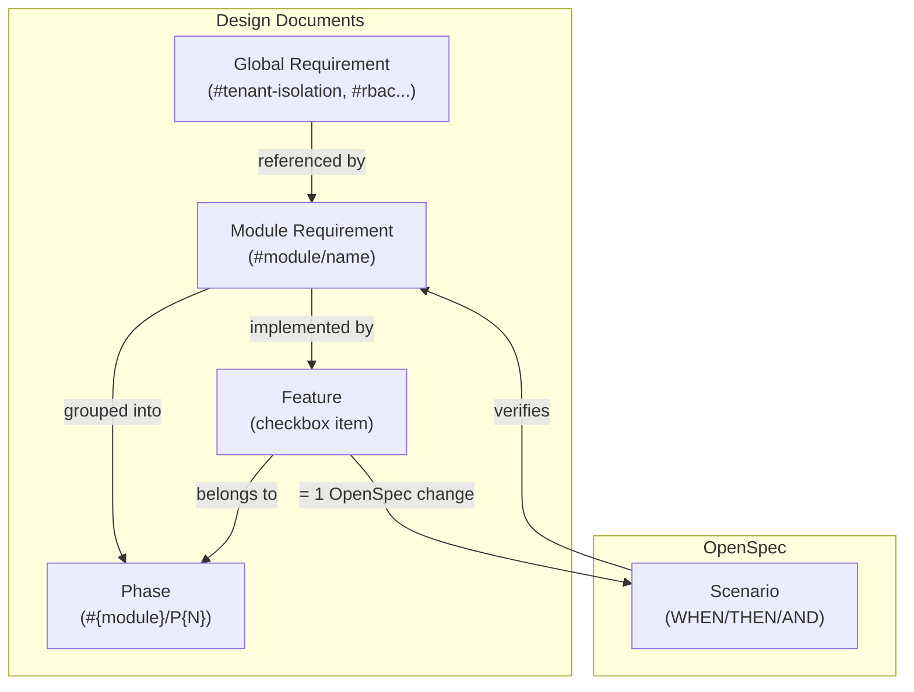

# Module Development Reference

This document provides reference material for module development, including terminology, document templates, and directory structure.

For the workflow steps, see [Module Development Workflow](./README.md).

## Index

- [Terminology](#terminology)
  - [Implementation Phases](#implementation-phases)
  - [Requirements](#requirements)
  - [Scenarios](#scenarios)
- [Directory Structure](#directory-structure)
- [Document Formats](#document-formats)
  - [DESIGN.md](#designmd)
  - [REQUIREMENTS.md](#requirementsmd)
  - [IMPLEMENTATION\_PLAN.md](#implementation_planmd)
  - [CHANGELOG.md](#changelogmd)
- [OpenSpec Specifications](#openspec-specifications)

---

## Terminology

| Term | Format | Description | Example |
|------|--------|-------------|---------|
| **Implementation Phase** | `#{module}/P{N}` | Incremental delivery milestone. Phases group related features for staged rollout. | `#oagw/P1`, `#typereg/P2` |
| **Global Requirement** | `#{name}` | Project-wide requirement from `docs/REQUIREMENTS.md`. Referenced by module requirements, not directly by scenarios. | `#tenant-isolation`, `#rbac` |
| **Module Requirement** | `#{module}/{name}` | Module-specific requirement defining what the system SHALL do. May reference global requirements. | `#oagw/request-forward`, `#typereg/entity-reg` |
| **Feature** | *(checkbox item)* | Deliverable unit of work that implements one or more module requirements. Maps 1:1 to an OpenSpec change. | "Request Forwarding" |
| **Scenario** | *(heading text)* | Concrete use case with WHEN/THEN/AND structure that verifies a module requirement. Lives in OpenSpec specs. | "Forward request to upstream" |



### Implementation Phases

Phases are delivery milestones for incremental development.

**Example phases for Outbound API Gateway module:**
- `#oagw/P1`: Core Functionality
- `#oagw/P2`: Request Forwarding with Advanced Features
- `#oagw/P3`: Monitoring and Analytics

**Notes:**
- Simple modules may not need phases on the first iteration
- Phases are defined in `modules/{module}/docs/DESIGN.md`
- Phases may be referenced in IMPLEMENTATION_PLAN.md and requirements

### Requirements

Requirements define **what the system SHALL do**. They use [RFC 2119](https://datatracker.ietf.org/doc/html/rfc2119) language:

| Keyword | Meaning |
|---------|---------|
| **MUST/SHALL** | Mandatory |
| **SHOULD** | Recommended |
| **MAY** | Optional |

**Two levels:**
1. **Global Requirements** — project-wide, in `docs/REQUIREMENTS.md` (e.g., `#tenant-isolation`, `#rbac`)
2. **Module Requirements** — module-specific, in `modules/{module}/docs/REQUIREMENTS.md` (e.g., `#oagw/request-forward`)

**Common global requirements:**
- `#tenant-isolation`
- `#rbac`
- `#logging`
- `#error-handling`
- `#traceability`

### Features

Features are **deliverable units of work** tracked in `IMPLEMENTATION_PLAN.md`:

- Each feature implements one or more module requirements
- Maps 1:1 to an OpenSpec change during implementation
- Typically 1-5 days of work (depends on complexity, without AI assistance)
- Has a scope hint describing affected layers/components

**Example:**
```markdown
- [ ] Request Forwarding (#oagw/request-forward, #oagw/timeout-handling)
      Scope: contract traits, domain service, REST endpoint
```

### Scenarios

Scenarios are **concrete use cases** that verify module requirements using WHEN/THEN/AND format:

```markdown
#### Forward request to upstream
Verifies: #oagw/request-forward
- **WHEN** client sends POST /gateway/forward with valid auth
- **THEN** system validates access by role and tenant
- **AND** request is forwarded to configured upstream
- **AND** response is returned within timeout
- **AND** trace ID is included in headers
```

> **Note:** Scenarios reference **module requirements only**. Module requirements reference global requirements in their definition (e.g., `#oagw/request-forward` might reference `#tenant-isolation`, `#rbac`, `#traceability` in REQUIREMENTS.md).

- Scenarios don't have IDs — the heading is the name
- Each scenario should reference the module requirement(s) it verifies
- Create separate scenarios for success, error, and edge cases

---

## Directory Structure

```
hyperspot/
├── docs/
│   ├── REQUIREMENTS.md                    # Global requirements (#tenant-isolation, #rbac...)
│   └── module_dev_workflow/               # Module development workflow
│       ├── README.md                      # Workflow steps (main doc)
│       ├── REFERENCE.md                   # This document
│       ├── ROADMAP.md                     # Future improvements
│       └── prompts/                       # AI prompt templates
│           ├── create_design_and_requirements.md
│           ├── create_implementation_plan.md
│           └── validate_design_docs.md
│
├── modules/{module}/
│   ├── src/                               # Code
│   ├── docs/
│   │   ├── DESIGN.md                      # Architecture + phases (#{module}/P1, #{module}/P2...)
│   │   ├── IMPLEMENTATION_PLAN.md         # Feature checklist (already implemented and planned) divided by phases
│   │   ├── REQUIREMENTS.md                # Module requirements (#module/name format)
│   │   └── CHANGELOG.md                   # Change history with requirement references
│   └── openspec/                          # Module-specific OpenSpec
│       ├── AGENTS.md                      # AI instructions (from openspec init)
│       ├── project.md                     # Module context
│       ├── specs/                         # Current module specs
│       │   └── {capability}/
│       │       └── spec.md                # Implemented scenarios for module requirements referenced in docs/REQUIREMENTS.md
│       └── changes/
│           ├── {change-name}/             # Active changes (change is a feature to implement from the IMPLEMENTATION_PLAN.md)
│           │   ├── proposal.md
│           │   ├── tasks.md
│           │   ├── design.md              # (optional)
│           │   └── specs/
│           │       └── {capability}/
│           │           └── spec.md        # Deltas
│           └── archive/                   # Completed changes (change is an implemented feature from the IMPLEMENTATION_PLAN.md)
```

---

## Document Formats

### DESIGN.md

**Location:** `modules/{module}/docs/DESIGN.md`

**Purpose:** Documents the module's architecture, components, and implementation approach.

**Structure:**
```markdown
# {Module Name} - Design

## Overview
[Brief module description and purpose]

## Architecture
[High-level architecture diagram and description]

## Components
[Key components and their responsibilities — include requirement IDs]

## Data Flow
[How data flows through the module — include requirement IDs where applicable]

## Integration Points
[How this module integrates with other modules]

## Implementation Phases

### Phase #{module}/P1: [Phase Name]
[Description of what's included in this phase — reference requirements]

### Phase #{module}/P2: [Phase Name]
[Description of what's included in this phase — reference requirements]

## Technical Decisions
[Key architectural and technical decisions]
```

**Cross-References:** After requirements are defined, add requirement IDs (`#{module}/{name}`, `#{name}`) to:
- Implementation Phases (which requirements each phase delivers)
- Components (which requirements each component supports)
- Data Flow steps (where applicable)

**When to Update:**
- During initial module design (iteratively with REQUIREMENTS.md)
- When adding features that change architecture or add new components
- When modifying data flow or integration points

---

### REQUIREMENTS.md

**Location:** `modules/{module}/docs/REQUIREMENTS.md`

**Purpose:** Defines what the module SHALL, SHOULD, and MAY do using RFC 2119 language.

**Structure:**
```markdown
# {Module Name} - Requirements

## #{module}/{name}: [Requirement Name]

The system SHALL [requirement description].

**Details:**
- [Specific detail 1]
- [Specific detail 2]

**References:** #global-req-1, #global-req-2

**Phase:** #{module}/P{N}

**Rationale:** [Why this requirement exists]
```

**Iteration Signals:** During the iterative design process, watch for:
- Requirement has no clear component owner → Add/clarify component in DESIGN.md
- Component has no requirements → Remove component or identify missing requirements
- Phase boundary feels wrong → Adjust phases based on requirement dependencies

**When to Update:**
- During initial module design (iteratively with DESIGN.md)
- When adding new system capabilities
- When modifying existing capabilities

---

### IMPLEMENTATION_PLAN.md

**Location:** `modules/{module}/docs/IMPLEMENTATION_PLAN.md`

**Purpose:** Trackable checklist of **features** to implement, organized by phase. Features are high-level deliverables, not granular tasks.

**Structure (phased):**
```markdown
# {Module Name} - Implementation Plan

## Phase #{module}/P1: [Phase Name]

**Goal:** [What this phase achieves]

- [ ] [Feature 1 name] (#{module}/req-name)
      Scope: [brief description of what this feature involves]
- [ ] [Feature 2 name] (#{module}/another-req)
      Scope: [brief description]
- [x] [Completed feature] (#{module}/completed-req)

## Phase #{module}/P2: [Phase Name]

**Goal:** [What this phase achieves]

- [ ] [Feature name] (#{module}/feature-req)
      Scope: [brief description]
```

**Structure (simple module, no phases):**
```markdown
# {Module Name} - Implementation Plan

- [ ] [Feature Name] (#{module}/req-name)
      Scope: contract traits, domain service, REST endpoint
- [ ] [Feature Name] (#{module}/another-req)
      Scope: authorization checks, tenant isolation
```

**When to Update:**
- During initial module design (create full plan)
- When adding new features (add unchecked items)
- As features are completed (check off items)

**IMPLEMENTATION_PLAN vs OpenSpec Tasks:**

| Aspect | IMPLEMENTATION_PLAN.md | OpenSpec tasks.md |
|--------|------------------------|-------------------|
| **Granularity** | Features (high-level) | Tasks (granular, actionable) |
| **Purpose** | Track what to build | Track how to build each feature |
| **Lifecycle** | Lives throughout module development | Created per feature, archived after |
| **Example** | "Request Forwarding" | "Define ForwardRequest DTO", "Implement handler" |

---

### CHANGELOG.md

**Location:** `modules/{module}/docs/CHANGELOG.md`

**Purpose:** Track module evolution following [Keep A Changelog](https://keepachangelog.com/en/1.0.0/) format.

**Structure:**
```markdown
# {Module Name} - Change Log

All notable changes to this module will be documented in this file.

The format is based on [Keep a Changelog](https://keepachangelog.com/en/1.0.0/).

## [Unreleased]

### Added
- [New features] — Implements #{module}/req-name

### Changed
- [Changes to existing functionality] — Updates #{module}/another-req

### Deprecated
- [Soon-to-be removed features]

### Removed
- [Removed features]

### Fixed
- [Bug fixes] — Fixes #{module}/bug-fix-req

### Security
- [Security fixes/improvements]
```

**Categories:**
- **Added**: New features
- **Changed**: Changes to existing functionality
- **Deprecated**: Soon-to-be removed features
- **Removed**: Removed features
- **Fixed**: Bug fixes
- **Security**: Security fixes or improvements

**When to Update:**
- After completing each feature implementation
- Add to `[Unreleased]` section
- Reference requirement IDs

---

## OpenSpec Specifications

**Location:** `modules/{module}/openspec/specs/{capability}/spec.md`

**Purpose:** Document the current state of implemented features with verified scenarios. Represents the **source of truth** for what's built and working.

**Structure:**
```markdown
# {Module Name} / {Capability}

## Requirement: #{module}/{name} - [Requirement Name]
[Brief requirement description using SHALL/SHOULD/MAY]
References: #global-req-1, #global-req-2

### Scenario: [Scenario name]
Verifies: #{module}/{name}
- **WHEN** [action/trigger]
- **THEN** [expected result]
- **AND** [additional verification]

### Scenario: [Another scenario]
Verifies: #{module}/{another-name}
- **WHEN** [action]
- **THEN** [result]
```

**When to Update:**
- Automatically updated when archiving OpenSpec changes
- Specs reflect only **implemented and verified** functionality
