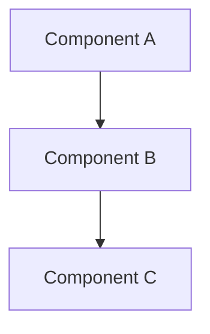
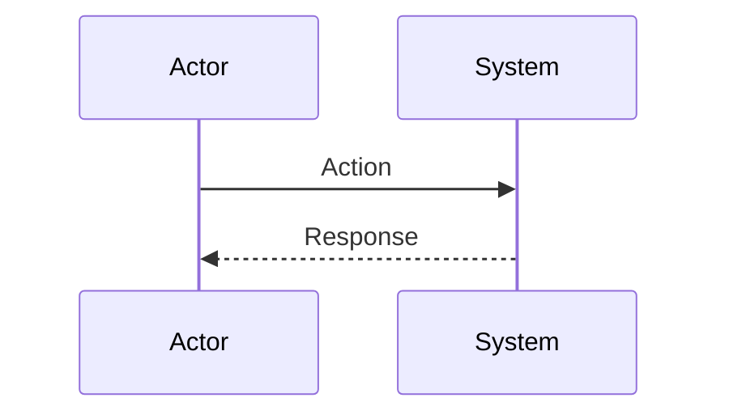
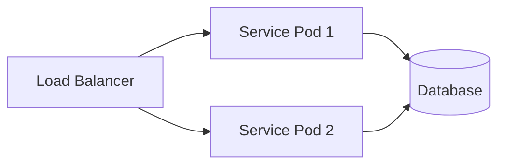

# Technical Design — {Module Name}

<!--
=============================================================================
TECHNICAL DESIGN DOCUMENT
=============================================================================
PURPOSE: Define HOW the system is built — architecture, components, APIs,
data models, and technical decisions that realize the requirements.

DESIGN IS PRIMARY: DESIGN defines the "what" (architecture and behavior).
ADRs record the "why" (rationale and trade-offs) for selected design
decisions; ADRs are not a parallel spec, it's a traceability artifact.

SCOPE:
  ✓ Architecture overview and vision
  ✓ Design principles and constraints
  ✓ Component model and interactions
  ✓ API contracts and interfaces
  ✓ Data models and database schemas
  ✓ Technology stack choices

NOT IN THIS DOCUMENT (see other templates):
  ✗ Requirements → PRD.md
  ✗ Detailed rationale for decisions → ADR/
  ✗ Step-by-step implementation flows → features/

STANDARDS ALIGNMENT:
  - IEEE 1016-2009 (Software Design Description)
  - IEEE 42010 (Architecture Description — viewpoints, views, concerns)
  - ISO/IEC 15288 / 12207 (Architecture & Design Definition processes)

ARCHITECTURE VIEWS (per IEEE 42010):
  - Context view: system boundaries and external actors
  - Functional view: components and their responsibilities
  - Information view: data models and flows
  - Deployment view: infrastructure topology

DESIGN LANGUAGE:
  - Be specific and clear; no fluff, bloat, or emoji
  - Reference PRD requirements using `spd-{system}-req-{slug}` IDs
  - Reference ADR documents using `spd-{system}-adr-{slug}` IDs
=============================================================================
-->

## 1. Architecture Overview

### 1.1 Architectural Vision

{2-3 paragraphs: Technical approach, key decisions, design philosophy. How does this architecture satisfy the requirements?}

### 1.2 Architecture Drivers

Requirements that significantly influence architecture decisions.

#### Functional Drivers

| Requirement | Design Response |
|-------------|-----------------|
| `spd-{system}-fr-{slug}` | {How architecture addresses this requirement} |

#### NFR Allocation

This table maps non-functional requirements from PRD to specific design/architecture responses, demonstrating how quality attributes are realized.

| NFR ID | NFR Summary | Allocated To | Design Response | Verification Approach |
|--------|-------------|--------------|-----------------|----------------------|
| `spd-{system}-nfr-{slug}` | {Brief NFR description} | {Component/layer/mechanism} | {How this design element realizes the NFR} | {How compliance is verified} |

### 1.3 Architecture Layers

{Add architecture diagram here: Mermaid or ASCII}

| Layer | Responsibility | Technology |
|-------|---------------|------------|
| Presentation | {description} | {tech} |
| Application | {description} | {tech} |
| Domain | {description} | {tech} |
| Infrastructure | {description} | {tech} |

## 2. Principles & Constraints

### 2.1 Design Principles

#### {Principle Name}

- [ ] `p2` - **ID**: `spd-{system}-principle-{slug}`

{Description of the principle and why it matters for this system.}

**ADRs**: `spd-{system}-adr-{slug}`

### 2.2 Constraints

#### {Constraint Name}

- [ ] `p2` - **ID**: `spd-{system}-constraint-{slug}`

{Description of the constraint (technical, regulatory, organizational) and its impact on design.}

**ADRs**: `spd-{system}-adr-{slug}`

## 3. Technical Architecture

### 3.1 Domain Model

**Technology**: {GTS, Rust structs},

**Location**: [{domain-model-file}]({path/to/domain-model})

**Core Entities**:

| Entity | Description | Schema |
|--------|-------------|--------|
| {EntityName} | {Purpose} | [{file}]({path}) |

**Relationships**:
- {Entity1} → {Entity2}: {Relationship description}

### 3.2 Component Model

{Add component diagram here: Mermaid or ASCII}

**Components**:

| Component | Responsibility | Interface |
|-----------|---------------|-----------|
| {Component 1} | {Purpose} | {API/Events/etc.} |

**Interactions**:
- {Component 1} → {Component 2}: {Protocol, data exchanged}

### 3.3 API Contracts

**Technology**: {REST/OpenAPI | GraphQL | gRPC | etc.}

**Location**: [{api-spec-file}]({path/to/api-spec})

**Endpoints Overview**:

| Method | Path | Description | Stability |
|--------|------|-------------|-----------|
| `{METHOD}` | `{/path}` | {Description} | {stable/unstable} |

### 3.4 External Interfaces & Protocols

Define how this library/module interacts with external systems, including protocols, data formats, and integration points.

#### {Interface/Protocol Name}

- [ ] `p2` - **ID**: `spd-{system}-interface-{slug}`

**Type**: {Protocol | Data Format | External System | Hardware Interface}

**Direction**: {inbound | outbound | bidirectional}

**Specification**: {Protocol spec reference, RFC, standard}

**Data Format**: {JSON Schema, Protocol Buffers, binary format, etc.}

**Compatibility**: {Versioning/backward compatibility guarantees}

**References**: Links to PRD § Public Library Interfaces

### 3.5 Interactions & Sequences

Document key interaction sequences and message flows between components.

#### {Sequence Name}

**ID**: `spd-{system}-seq-{slug}`

**Use cases**: `spd-{system}-usecase-{slug}` (ID from PRD)

**Actors**: `spd-{system}-actor-{slug}` (ID from PRD)

**Description**: {Brief description of what this sequence accomplishes}

### 3.6 Database schemas & tables

Document database tables, schemas, and data models.

#### Table: {table_name}

**ID**: `spd-{system}-dbtable-{slug}`

**Schema**:

| Column | Type | Description |
|--------|------|-------------|
| {col} | {type} | {description} |

**PK**: {primary key column(s)}

**Constraints**: {NOT NULL, UNIQUE, etc.}

**Additional info**: {Indexes, relationships, triggers, etc.}

**Example**:

| {col1} | {col2} | {col3} |
|--------|--------|--------|
| {val1} | {val2} | {val3} |

### 3.7 Deployment Topology

**ID**: `spd-{system}-topology-{slug}`

{Infrastructure view: pods, containers, services, regions, etc.}

### 3.8 Technology Stack

Optional. Document only deviations from project-wide tech stack (see root DESIGN.md).

| Layer | Technology | Rationale |
|-------|------------|-----------|
| Runtime | {e.g., Rust} | {Why chosen} |
| Framework | {e.g., Axum} | {Why chosen} |
| Database | {e.g., PostgreSQL} | {Why chosen} |
| Messaging | {e.g., Kafka} | {Why chosen} |

## 4. Additional context

{whatever useful additional context}

## 5. Traceability

- **PRD**: [PRD.md](./PRD.md)
- **ADRs**: [ADR/](./ADR/)
- **Features**: [features/](./features/)
