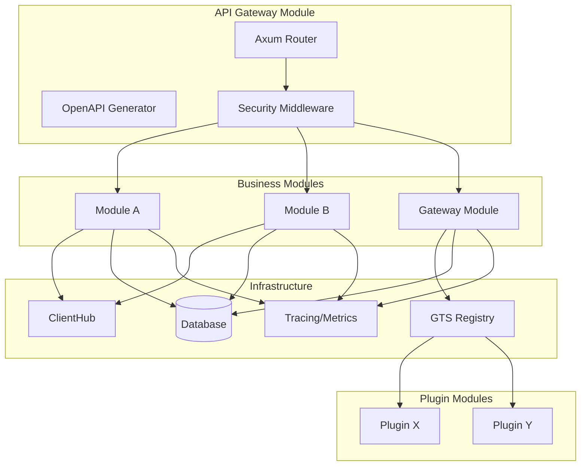
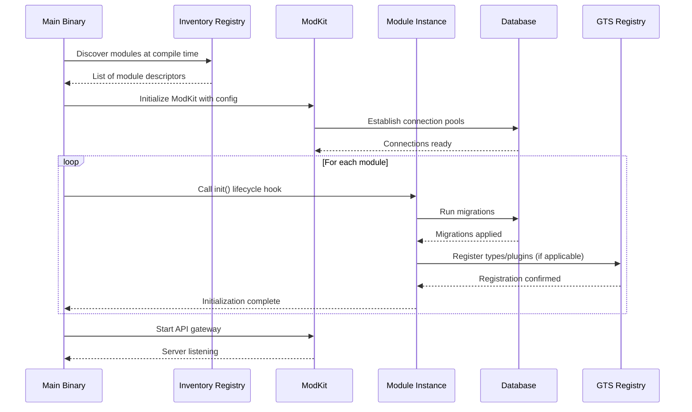
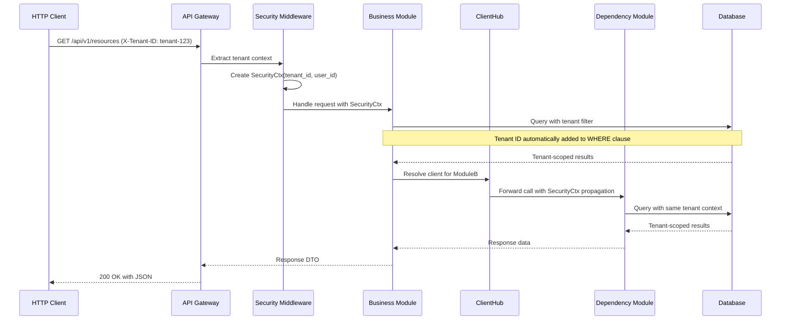
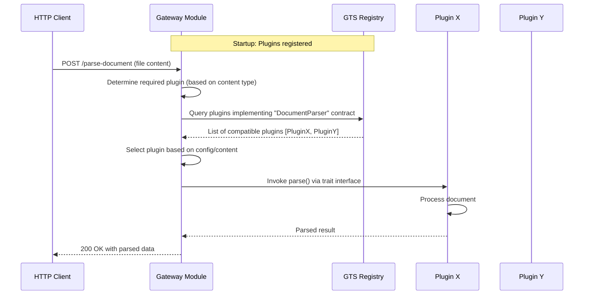

# Technical Design: HyperSpot Server

## 1. Architecture Overview

### 1.1 Architectural Vision

HyperSpot Server follows a modular monolith architecture with strong module boundaries and pluggable deployment models. The system is designed as a collection of independent modules that can run in-process for performance or out-of-process for isolation, all from the same codebase.

The architecture prioritizes compile-time safety through Rust's type system, explicit over implicit design, and production-grade operational excellence. Each module is self-contained with its own domain logic, persistence, and API surface, connected through type-safe abstractions (ClientHub) that hide transport details.

The platform employs a Gateway-Plugin pattern for extensibility, uses GTS (Global Type System) for runtime type discovery, and provides automatic OpenAPI generation from module definitions. Multi-tenancy and security are enforced at the infrastructure layer through request-scoped SecurityCtx propagation.

### 1.2 Architecture Drivers

#### Product requirements

Reference PRD: [docs/spec-templates/examples/hyperspot/PRD.md](PRD.md)

#### Functional requirements

| ID | Solution short description |
|--------|----------------------------|
| `spd-hyperspot-fr-module-lifecycle` | Rust inventory crate for compile-time discovery, trait-based lifecycle hooks |
| `spd-hyperspot-fr-tenant-isolation` | Request-scoped SecurityCtx with tenant_id propagation, tenant-aware ORM queries |
| `spd-hyperspot-fr-api-generation` | utoipa OpenAPI codegen from Rust types, Axum routing with automatic documentation |
| `spd-hyperspot-fr-configuration` | config-rs with YAML base + env overrides, validated at startup via serde |
| `spd-hyperspot-fr-database-agnostic` | sqlx with compile-time query checking, migrations per module, connection pooling |
| `spd-hyperspot-fr-gateway-plugin` | GTS registry for plugin contracts, trait-based dispatch, runtime plugin resolution |
| `spd-hyperspot-fr-module-communication` | ClientHub with local/gRPC/HTTP transports, trait-based client interfaces |
| `spd-hyperspot-fr-testing` | cargo test for units, testcontainers for integration, Python pytest for E2E |
| `spd-hyperspot-fr-observability` | tracing crate with structured logging, OpenTelemetry spans, log rotation |
| `spd-hyperspot-fr-access-control` | SecurityCtx propagation, per-tenant RBAC policies, API gateway enforcement |
| `spd-hyperspot-fr-static-analysis` | dylint custom lints, cargo clippy strict mode, RUSTFLAGS deny warnings |
| `spd-hyperspot-fr-universal-deployment` | Conditional compilation for transports, target-specific binary builds |

#### Non-functional requirements

| ID | Solution short description |
|--------|----------------------------|
| `spd-hyperspot-nfr-response-time` | Async Rust with Tokio runtime, connection pooling, query optimization |
| `spd-hyperspot-nfr-test-coverage` | cargo-tarpaulin for coverage, CI enforcement of 90% threshold |
| `spd-hyperspot-nfr-tenant-security` | Compile-time tenant isolation via SecurityCtx, no raw queries without tenant_id |
| `spd-hyperspot-nfr-build-performance` | Incremental compilation, sccache for build caching, parallel test execution |
| `spd-hyperspot-nfr-database-compatibility` | sqlx database abstraction, per-dialect SQL generation, feature flags per DB |
| `spd-hyperspot-nfr-observability-retention` | Log rotation via tracing-appender, configurable retention policies |
| `spd-hyperspot-nfr-memory` | Rust ownership model prevents leaks, no reference cycles, bounded channels |
| `spd-hyperspot-nfr-compilation-safety` | RUSTFLAGS=-D warnings in CI, deny unsafe code, exhaustive pattern matching |
| `spd-hyperspot-nfr-deployment-flexibility` | cargo build with target triples, Docker multi-stage builds, feature flags |

### 1.3 Architecture Layers

| Layer | Responsibility | Technology |
|-------|---------------|------------|
| API Layer | REST endpoints, OpenAPI docs, request validation | Axum, utoipa, tower middleware |
| Application Layer | Use case orchestration, DTO conversion, security context | Rust services, async/await |
| Domain Layer | Business logic, entities, module-specific rules | Pure Rust, GTS types |
| Infrastructure Layer | Database access, GTS registry, observability | sqlx, tracing, serde |
| ModKit Layer | Module lifecycle, ClientHub, security propagation | Inventory, trait abstractions |

## 2. Principles & Constraints

### 2.1: Design Principles

#### Everything is a Module

**ID**: `spd-hyperspot-principle-modularity`

**ADRs**: `spd-hyperspot-adr-module-boundaries`

All functionality must be packaged as modules discovered via Rust's inventory crate. Modules are self-contained with explicit dependencies, preventing implicit coupling and enabling independent development and testing.

#### Compile-Time Safety Over Runtime Flexibility

**ID**: `spd-hyperspot-principle-compile-safety`

**ADRs**: `spd-hyperspot-adr-type-safety`

Design decisions favor catching errors at compile time through Rust's type system rather than runtime checks. This includes exhaustive enum matching, no unsafe code without justification, and strict compiler warnings denied in CI.

#### Explicit Over Implicit

**ID**: `spd-hyperspot-principle-explicitness`

**ADRs**: `spd-hyperspot-adr-explicit-design`

Configuration, dependencies, and behavior must be explicit rather than convention-based. No magic globals, no implicit context propagation except through type-safe SecurityCtx, no reflection-based discovery.

#### Security by Construction

**ID**: `spd-hyperspot-principle-security-construction`

**ADRs**: `spd-hyperspot-adr-security-ctx`

Multi-tenant isolation is enforced at compile time through SecurityCtx propagation. Raw database queries without tenant context are a compilation error. Authorization checks are required before data access.

#### Gateway-Plugin for Extensibility

**ID**: `spd-hyperspot-principle-gateway-plugin`

**ADRs**: `spd-hyperspot-adr-plugin-architecture`

Extension points use Gateway modules that define contracts via GTS, with Plugin modules registered at runtime. This allows third-party extensions without modifying core code while maintaining type safety.

### 2.2: Constraints

#### Rust Stable Only

**ID**: `spd-hyperspot-constraint-rust-stable`

**ADRs**: `spd-hyperspot-adr-rust-version`

All code must compile on stable Rust. No nightly features allowed in production code. This ensures reproducible builds and avoids breaking changes from experimental features.

#### No Unsafe Code Without Audit

**ID**: `spd-hyperspot-constraint-no-unsafe`

**ADRs**: `spd-hyperspot-adr-unsafe-policy`

Unsafe Rust is forbidden except in audited FFI boundaries or performance-critical sections with documented safety invariants. Each unsafe block requires code review approval and justification comment.

#### Database Agnostic Core

**ID**: `spd-hyperspot-constraint-db-agnostic`

**ADRs**: `spd-hyperspot-adr-database-abstraction`

Core module logic must work with any sqlx-supported database. Database-specific SQL is isolated to migration files. No direct SQL strings in domain code; use query builder or compile-checked macros.

#### Monorepo Until Scale Forces Split

**ID**: `spd-hyperspot-constraint-monorepo`

**ADRs**: `spd-hyperspot-adr-monorepo-strategy`

All modules remain in single repository for atomic refactors and consistent tooling. Split only when repository size impacts developer experience or deployment requires independent versioning.

## 3. Technical Architecture

### 3.1: Domain Model

**Technology**: GTS (Global Type System) + Rust native types

**Location**: [libs/gts_types](../../libs/gts_types)

**Core Entities**:
- [Module](../../libs/modkit/src/module.rs) - Base module trait with lifecycle hooks
- [SecurityCtx](../../libs/modkit/src/security_ctx.rs) - Request-scoped tenant and user context
- [ClientHub](../../libs/modkit/src/client_hub.rs) - Type-safe client resolution across transports
- [GTSRegistry](../../libs/gts_registry/src/lib.rs) - Runtime type discovery for plugins
- [PluginContract](../../libs/modkit/src/plugin.rs) - Interface definition for gateway-plugin pattern

**Relationships**:
- Module → ClientHub: Many-to-one (modules resolve clients for inter-module calls)
- Module → GTSRegistry: Many-to-one (plugins register types for discovery)
- Gateway Module → Plugin Modules: One-to-many (gateway dispatches to registered plugins)
- SecurityCtx → Database Queries: One-to-many (context propagates to all data access)

### 3.2: Component Model



**Components**:
- **API Gateway Module**: HTTP routing, OpenAPI docs generation, CORS handling, request validation
- **Business Modules**: Domain-specific logic, REST endpoints, database access, business rules
- **Gateway Modules**: Plugin contract definition, runtime plugin discovery, request routing to plugins
- **Plugin Modules**: Pluggable workers implementing gateway contracts, registered via GTS
- **ClientHub**: Transport-agnostic inter-module communication (local, gRPC, HTTP)
- **GTS Registry**: Runtime type registry for plugin discovery and dynamic dispatch
- **ModKit**: Module lifecycle management, security context propagation, configuration loading

**Interactions**:
- API Gateway → Business Modules: HTTP requests transformed to service calls with SecurityCtx
- Business Modules → ClientHub: Type-safe client interfaces resolved to appropriate transport
- Gateway Modules → GTS Registry: Plugin discovery at startup, contract validation
- All Modules → Database: Tenant-scoped queries via SecurityCtx propagation
- All Modules → Observability: Structured logging with correlation IDs, distributed tracing spans

### 3.3: API Contracts

**Technology**: REST/OpenAPI 3.0 via utoipa

**Location**: Auto-generated from Rust types, served at `/docs`

**Endpoints Overview**:
- `GET /health` - Health check with module status details
- `GET /healthz` - Kubernetes-style liveness probe
- `GET /docs` - OpenAPI UI (Swagger/Redoc)
- `GET /api/v1/{module}/*` - Module-specific endpoints auto-generated from module API definitions

**Contract Enforcement**:
- Request/response types derived from Rust structs with utoipa annotations
- Validation via serde and custom validators
- Type-safe error responses with consistent error codes
- Tenant ID required in headers (X-Tenant-ID) for all authenticated requests

### 3.4: Interactions & Sequences

#### Module Initialization Sequence

**ID**: `spd-hyperspot-seq-module-init`

**Use cases**: `spd-hyperspot-usecase-create-module`, `spd-hyperspot-usecase-deploy-multitenant`

**Actors**: `spd-hyperspot-actor-module-registry`, `spd-hyperspot-actor-database-manager`, `spd-hyperspot-actor-gts-registry`



**Description**: Bootstraps the HyperSpot server by discovering all modules at compile-time, initializing them in dependency order, running migrations, and starting the API gateway.

#### Request Processing with Tenant Isolation

**ID**: `spd-hyperspot-seq-request-processing`

**Use cases**: All authenticated API requests

**Actors**: `spd-hyperspot-actor-api-gateway`, `spd-hyperspot-actor-clienthub`, `spd-hyperspot-actor-database-manager`, `spd-hyperspot-actor-end-user`



**Description**: Demonstrates how SecurityCtx is created from HTTP headers, propagated through all module calls, and automatically enforces tenant isolation at the database query level.

#### Gateway-Plugin Dispatch

**ID**: `spd-hyperspot-seq-gateway-plugin`

**Use cases**: `spd-hyperspot-usecase-gateway-plugin`

**Actors**: `spd-hyperspot-actor-gts-registry`, `spd-hyperspot-actor-api-gateway`



**Description**: Shows how gateway modules use GTS Registry to discover and dispatch requests to plugin implementations at runtime while maintaining type safety through trait interfaces.

### 3.5: Data Model

#### Core Tables (Managed by ModKit)

**tenants**

**ID**: `spd-hyperspot-dbtable-tenants`

**Schema**:
- `id` (UUID, PK) - Tenant identifier
- `name` (VARCHAR) - Tenant display name
- `status` (ENUM) - active, suspended, deleted
- `created_at` (TIMESTAMP)
- `updated_at` (TIMESTAMP)

**users**

**ID**: `spd-hyperspot-dbtable-users`

**Schema**:
- `id` (UUID, PK) - User identifier
- `tenant_id` (UUID, FK → tenants.id) - Tenant association
- `email` (VARCHAR, UNIQUE) - User email
- `role` (ENUM) - admin, user, readonly
- `created_at` (TIMESTAMP)

**module_config**

**ID**: `spd-hyperspot-dbtable-module-config`

**Schema**:
- `module_name` (VARCHAR, PK) - Module identifier
- `tenant_id` (UUID, FK → tenants.id, PK) - Tenant-specific config
- `config_json` (JSONB) - Module configuration
- `updated_at` (TIMESTAMP)

#### Module-Specific Tables

Each module manages its own tables with mandatory `tenant_id` column for isolation. Example for a hypothetical "tasks" module:

**tasks**

**ID**: `spd-hyperspot-dbtable-tasks-example`

**Schema**:
- `id` (UUID, PK)
- `tenant_id` (UUID, FK → tenants.id, indexed)
- `title` (VARCHAR)
- `status` (ENUM)
- `created_by` (UUID, FK → users.id)
- `created_at` (TIMESTAMP)

**Index Strategy**: All tables MUST have index on `(tenant_id, id)` for efficient tenant-scoped queries.

### 3.6: Security Architecture

#### Authentication Flow

1. API Gateway receives request with Bearer token (JWT)
2. Security Middleware validates token signature
3. Extract tenant_id and user_id from token claims
4. Create SecurityCtx(tenant_id, user_id)
5. Propagate SecurityCtx through all downstream calls

#### Authorization Model

- **Tenant-level isolation**: Enforced at database query level via SecurityCtx
- **Role-based access control (RBAC)**: Per-tenant role assignments
- **Resource permissions**: Module-specific authorization checks
- **Audit logging**: All security events logged with tenant/user context

#### Security Context Propagation

```rust
// Example: SecurityCtx enforced at compile time
async fn get_tasks(ctx: SecurityCtx) -> Result<Vec<Task>> {
    // tenant_id automatically injected into query
    let tasks = database::query_with_ctx(ctx, "SELECT * FROM tasks").await?;
    Ok(tasks)
}
```

### 3.7: Observability Architecture

#### Logging Strategy

- **Structured logging** via `tracing` crate with JSON formatting
- **Log levels**: ERROR (always), WARN (ops issues), INFO (key events), DEBUG (dev only)
- **Correlation IDs**: trace_id propagated across module boundaries
- **Tenant context**: tenant_id included in all log entries

#### Metrics Collection

- **Request metrics**: Count, latency (p50/p95/p99), error rate per endpoint
- **Module metrics**: Health status, initialization time, dependency status
- **Database metrics**: Connection pool utilization, query latency
- **System metrics**: CPU, memory, thread count

#### Tracing

- **Distributed tracing** via OpenTelemetry integration
- **Span hierarchy**: Request → Module → Service → Database query
- **Trace sampling**: 100% for errors, 1% for successful requests

## 4. Operational Architecture

### 4.1: Deployment Model

**Development**: Single binary with SQLite, all modules in-process

**Production Cloud**: Docker containers per module, PostgreSQL, gRPC for inter-module communication

**On-Premises**: Windows/Linux service binaries, choice of database, in-process or out-of-process modules

**Mobile-Integrated**: Selected modules compiled to mobile SDK, core modules in cloud

### 4.2: Configuration Management

**Hierarchy** (precedence order):
1. Environment variables (`HYPERSPOT_*`)
2. YAML configuration file (specified via `--config`)
3. Default values in code

**Example** (`config/production.yaml`):
```yaml
server:
  home_dir: "/var/lib/hyperspot"

database:
  url: "${DATABASE_URL}"
  max_conns: 50

logging:
  default:
    console_level: info
    file: "/var/log/hyperspot/app.log"
    file_level: warn

modules:
  api_gateway:
    bind_addr: "0.0.0.0:8087"
    enable_docs: false
```

### 4.3: Failure Modes & Recovery

**Module Initialization Failure**: Server startup aborts, error logged with module name

**Database Connection Loss**: Automatic reconnection with exponential backoff, requests fail fast with 503

**Plugin Discovery Failure**: Gateway falls back to default implementation or returns 501 Not Implemented

**Memory Exhaustion**: Process restarts via container orchestrator, in-flight requests lost

### 4.4: Scalability Strategy

**Vertical Scaling**: Increase CPU/memory for single instance (preferred for small/medium loads)

**Horizontal Scaling**: Multiple instances behind load balancer with sticky sessions for WebSocket connections

**Database Scaling**: Read replicas for queries, connection pooling per instance

**Module Scaling**: Out-of-process modules can scale independently via gRPC

## 5. Development Workflow

### 5.1: Module Development Lifecycle

1. **Scaffold**: Use module template from `guidelines/NEW_MODULE.md`
2. **Implement**: Domain logic in `domain/`, API in `api/`, infrastructure in `infrastructure/`
3. **Test**: Unit tests (domain), integration tests (with testcontainers), E2E tests (pytest)
4. **Document**: OpenAPI annotations via utoipa, module README
5. **Validate**: `make check` - format, clippy, dylint, tests, coverage
6. **Register**: Module auto-discovered via inventory, no manual registration needed

### 5.2: Testing Strategy

**Unit Tests** (`cargo test`): Pure functions, domain logic, no I/O

**Integration Tests** (`cargo test --test integration`): Database queries, module interactions, with testcontainers for real DB

**E2E Tests** (`pytest testing/`): Full HTTP API tests, multi-module workflows, realistic data

**Performance Tests**: Load testing with realistic tenant counts and concurrency

**Security Tests**: Tenant isolation verification, injection attack vectors, auth bypass attempts

### 5.3: CI/CD Pipeline

1. **Format check**: `cargo fmt --all -- --check`
2. **Lint**: `cargo clippy --workspace --all-features -- -D warnings`
3. **Custom lints**: `cargo dylint --all --workspace`
4. **Unit tests**: `cargo test`
5. **Integration tests**: `cargo test --test integration`
6. **Coverage**: Enforce 90% threshold via `cargo-tarpaulin`
7. **Security audit**: `cargo audit`
8. **License check**: `cargo deny check`
9. **E2E tests**: Docker Compose + pytest
10. **Build release**: `cargo build --release`
11. **Container build**: Multi-stage Docker build

## 6. Technology Decisions

### 6.1: Core Technologies

- **Language**: Rust stable (memory safety, concurrency, performance)
- **Async Runtime**: Tokio (industry standard, mature ecosystem)
- **Web Framework**: Axum (type-safe, tower middleware, performance)
- **Database**: sqlx (compile-time query checking, async, multi-DB)
- **OpenAPI**: utoipa (derive macros, type-safe, auto-generation)
- **Logging**: tracing (structured, async, OpenTelemetry integration)
- **Configuration**: config-rs (YAML + env overrides, type-safe deserialization)
- **Testing**: cargo test + testcontainers + pytest (full stack coverage)

### 6.2: Rationale for Rust

**Compile-Time Safety**: Eliminates entire categories of runtime errors (null pointers, data races, memory leaks)

**Performance**: Zero-cost abstractions, predictable performance, no GC pauses

**Ecosystem**: Mature crates for web, async, database, observability

**LLM-Friendly**: Strong types and compiler errors provide clear feedback for AI-assisted development

**Operational Efficiency**: Low memory footprint enables local full-stack development and cost-effective cloud deployment

### 6.3: Dependency Management

**Policy**: Minimize external dependencies, prefer well-maintained crates with active communities

**Security**: Regular audits via `cargo audit`, automated vulnerability scanning in CI

**Licensing**: Apache 2.0 or MIT preferred, no GPL in dependencies (enforced via `cargo deny`)

## 7. Future Considerations

### 7.1: Planned Enhancements

- **GraphQL Gateway**: Alternative to REST for complex client requirements
- **Event Sourcing**: Optional CQRS pattern for modules requiring audit trails
- **Multi-Region Deployment**: Geographic data residency with cross-region replication
- **WASM Plugins**: Sandboxed plugins compiled to WebAssembly for untrusted extensions

### 7.2: Performance Optimization Opportunities

- **Query Optimization**: Automated EXPLAIN analysis, query plan caching
- **Connection Pooling**: Per-tenant connection pools for resource isolation
- **Caching Layer**: Redis integration for frequently accessed data
- **Binary Protocol**: gRPC streaming for high-throughput module communication

### 7.3: Scalability Evolution

**Phase 1** (current): Modular monolith, in-process modules, single database

**Phase 2**: Out-of-process modules via gRPC, read replicas, horizontal scaling

**Phase 3**: Microservices extraction for independent scaling, event-driven architecture, CQRS

**Phase 4**: Multi-region deployment, global data replication, edge computing integration
