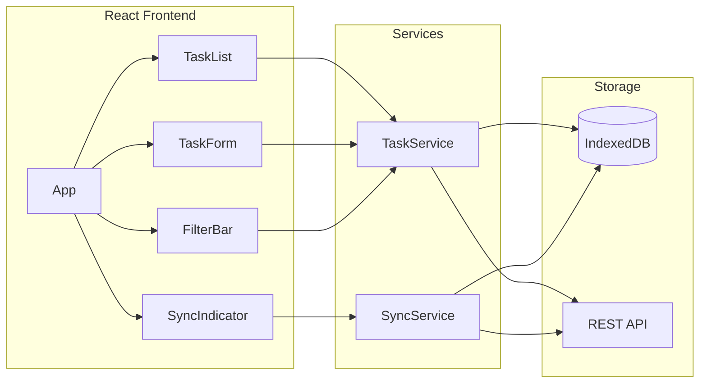
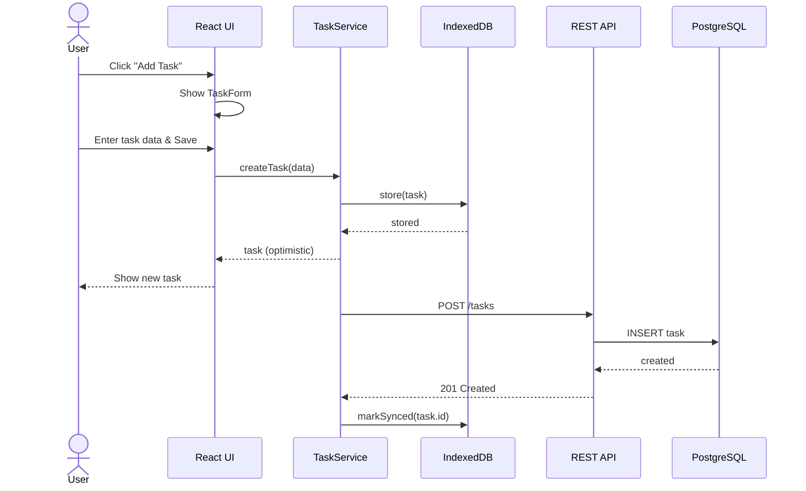

# Technical Design: TODO-APP

## 1. Architecture Overview

### 1.1 Architectural Vision

The Todo App follows a clean architecture approach with clear separation between presentation, business logic, and data layers. The frontend is built as a single-page application (SPA) communicating with a RESTful backend API.

The system prioritizes offline-first capabilities using local storage with background synchronization. This ensures users can work without interruption regardless of network conditions.

Event-driven architecture is employed for real-time updates and cross-device synchronization via WebSockets.

### 1.2 Architecture Drivers

#### Product requirements

| FDD ID | Solution short description |
|--------|----------------------------|
| `fdd-todo-app-fr-create-task` | REST API endpoint POST /tasks with validation |
| `fdd-todo-app-fr-complete-task` | PATCH /tasks/:id with status toggle |
| `fdd-todo-app-fr-filter-tasks` | Query parameters on GET /tasks |
| `fdd-todo-app-nfr-offline-support` | IndexedDB local storage with sync queue |

### 1.3 Architecture Layers

| Layer | Responsibility | Technology |
|-------|---------------|------------|
| Presentation | User interface, user input handling | React, TailwindCSS |
| Application | Use case orchestration, DTOs | TypeScript services |
| Domain | Business logic, entities, validation | TypeScript classes |
| Infrastructure | Data persistence, external APIs | PostgreSQL, Redis |

## 2. Principles & Constraints

### 2.1: Design Principles

#### Offline-First

**ID**: `fdd-todo-app-principle-offline-first`

<!-- fdd-id-content -->
**ADRs**: `fdd-todo-app-adr-local-storage`

All operations must work without network connectivity. Data is persisted locally first, then synchronized to the server when connection is available.
<!-- fdd-id-content -->

#### Optimistic Updates

**ID**: `fdd-todo-app-principle-optimistic-updates`

<!-- fdd-id-content -->
**ADRs**: `fdd-todo-app-adr-optimistic-ui`

UI updates immediately on user action without waiting for server confirmation. Rollback occurs only on server rejection.
<!-- fdd-id-content -->

### 2.2: Constraints

#### Browser Compatibility

**ID**: `fdd-todo-app-constraint-browser-compat`

<!-- fdd-id-content -->
**ADRs**: `fdd-todo-app-adr-browser-support`

Application must support latest 2 versions of Chrome, Firefox, Safari, and Edge.
<!-- fdd-id-content -->

## 3. Technical Architecture

### 3.1: Domain Model

**Technology**: TypeScript

**Location**: [src/domain/entities](../src/domain/entities)

**Core Entities**:
- [Task](../src/domain/entities/task.ts) - Core task entity with title, status, priority
- [Category](../src/domain/entities/category.ts) - Task grouping entity
- [User](../src/domain/entities/user.ts) - User account entity

**Relationships**:
- Task → Category: Many-to-one (task belongs to optional category)
- Task → User: Many-to-one (task belongs to user)
- Category → User: Many-to-one (category belongs to user)

### 3.2: Component Model

**Components**:
- **TaskList**: Displays filtered list of tasks with pagination
- **TaskForm**: Form for creating and editing tasks
- **FilterBar**: Controls for filtering and sorting tasks
- **SyncIndicator**: Shows synchronization status

**Interactions**:
- TaskForm → TaskService: Submits task data for creation/update
- FilterBar → TaskList: Passes filter criteria for rendering

### 3.3: API Contracts

**Technology**: REST/OpenAPI

**Location**: [api/openapi.yaml](../api/openapi.yaml)

**Endpoints Overview**:
- `GET /tasks` - List tasks with optional filters
- `POST /tasks` - Create a new task
- `GET /tasks/:id` - Get task by ID
- `PATCH /tasks/:id` - Update task fields
- `DELETE /tasks/:id` - Delete a task

### 3.4: Interactions & Sequences

**Use cases**: `fdd-todo-app-usecase-create-task`, `fdd-todo-app-usecase-complete-task`

**Actors**: `fdd-todo-app-actor-user`, `fdd-todo-app-actor-sync-service`

### 3.5: Database schemas & tables

#### Table tasks

**ID**: `fdd-todo-app-db-table-tasks`

**Schema**

| Column | Type | Description |
|--------|------|-------------|
| id | UUID | Primary key |
| user_id | UUID | Foreign key to users |
| title | VARCHAR(255) | Task title |
| description | TEXT | Optional description |
| status | ENUM | 'active', 'completed' |
| priority | ENUM | 'low', 'medium', 'high' |
| category_id | UUID | Optional foreign key |
| due_date | TIMESTAMP | Optional due date |
| created_at | TIMESTAMP | Creation timestamp |
| updated_at | TIMESTAMP | Last update timestamp |

**PK**: id

**Constraints**: title NOT NULL, status NOT NULL DEFAULT 'active'

**Additional info**: Indexed on user_id, status, due_date

**Example**

| id | user_id | title | status | priority |
|----|---------|-------|--------|----------|
| abc-123 | user-1 | Buy groceries | active | medium |

### 3.6: Topology (optional)

**ID**: `fdd-todo-app-topology-cloud`

- Frontend: Static files on CDN
- Backend: Containerized Node.js on Kubernetes
- Database: Managed PostgreSQL
- Cache: Redis cluster

### 3.7: Tech stack (optional)

**ID**: `fdd-todo-app-tech-stack`

- Frontend: React 18, TypeScript, TailwindCSS, Zustand
- Backend: Node.js, Express, TypeScript
- Database: PostgreSQL 15, Redis 7
- Infrastructure: Docker, Kubernetes, GitHub Actions

## 4. Additional Context

**ID**: `fdd-todo-app-design-context-decisions`

The choice of React over other frameworks was driven by team expertise and ecosystem maturity. PostgreSQL was selected for its reliability and JSON support for flexible task metadata.
