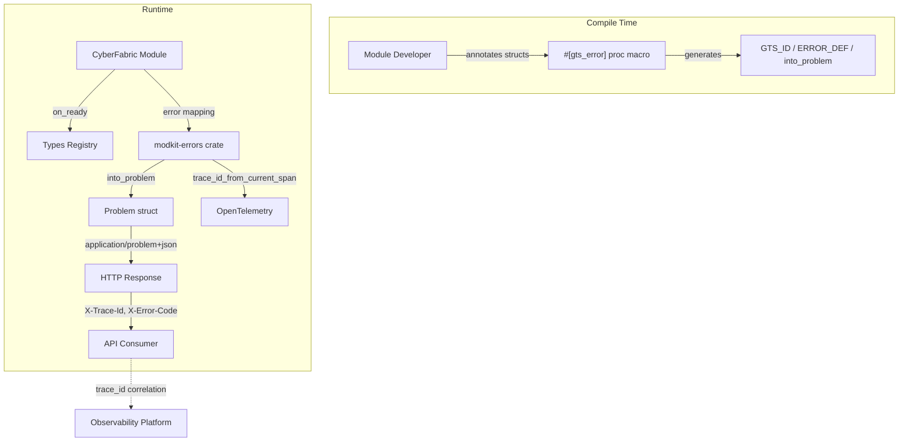
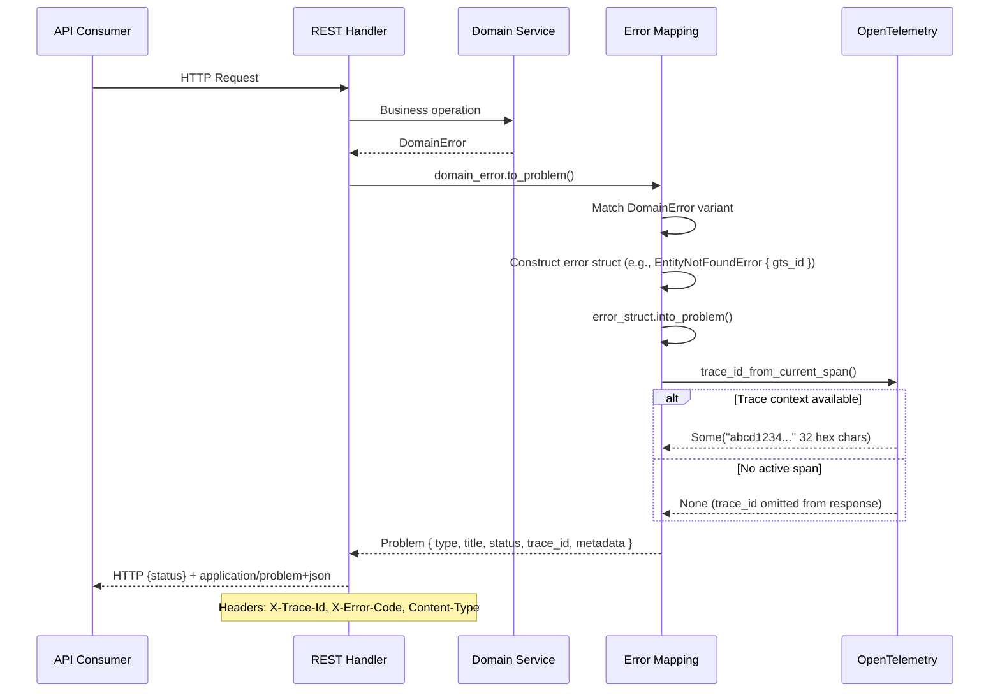
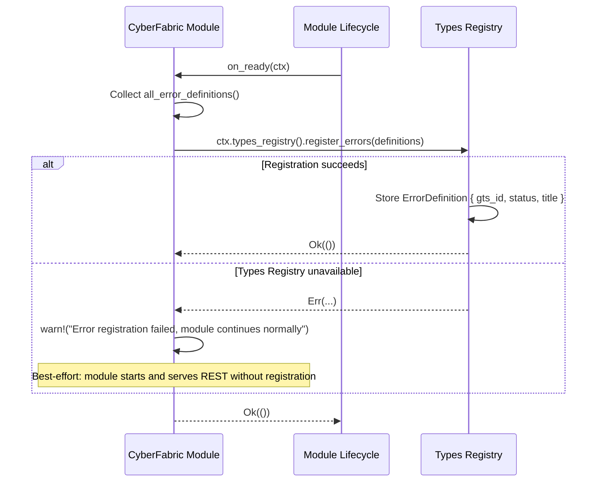

# Technical Design — Unified Error System

## 1. Architecture Overview

### 1.1 Architectural Vision

The Unified Error System provides a compile-time error definition framework built on two standards: GTS (Global Type System) for error classification and RFC 9457 (Problem Details) for wire format. Every error is defined as a Rust struct annotated with `#[gts_error]`, which generates constants, conversion logic, and trait implementations at compile time.

The architecture enforces a security-first approach: error responses contain only sanitized, structured data (`type`, `title`, `status`, `trace_id`, `metadata`), while full error details (chains, stack traces, internal state) are logged server-side and correlated via trace ID. The `detail` field from RFC 9457 is intentionally omitted to prevent sensitive data leakage.

All errors follow a 2-segment GTS chain model: a base schema segment (`gts.cf.core.errors.err.v1~`) anchors the chain, and a specific error segment identifies the concrete error. This keeps the type taxonomy flat and predictable while allowing each segment to introduce metadata fields.

### 1.1.1 System Context



### 1.2 Architecture Drivers

#### Functional Drivers

| Requirement | Design Response |
|-------------|-----------------|
| `cpt-cf-ues-fr-gts-type-id` | 2-segment GTS chain model with `gts://` URI prefix; `GTS_ID` constant generated by macro |
| `cpt-cf-ues-fr-trace-id` | `trace_id_from_current_span()` extracts W3C trace-id from OTel context; `Option<String>` field on Problem |
| `cpt-cf-ues-fr-error-registration` | `ErrorDefinition` constant generated per error struct; modules register via `on_ready` lifecycle hook |
| `cpt-cf-ues-fr-rfc9457-schema` | `Problem` struct with RFC 9457 fields; serializes to `application/problem+json` |
| `cpt-cf-ues-fr-compile-time-def` | `#[gts_error]` proc macro generates constants, `into_problem()`, `Display`, `Error` impls |
| `cpt-cf-ues-fr-metadata-fields` | Struct fields map to `metadata` HashMap entries; no builder API |
| `cpt-cf-ues-fr-system-errors` | Pre-defined error structs in `modkit-errors` for transport, runtime, HTTP, gRPC, logical categories |
| `cpt-cf-ues-fr-machine-readable` | GTS `type` field provides deterministic, parseable error codes for programmatic handling |
| `cpt-cf-ues-fr-ergonomic-api` | `#[gts_error]` macro generates short constants (e.g., `GTS_ID`, `ERROR_DEF`) on each struct; modules expose ergonomic accessors |

#### NFR Allocation

| NFR ID | NFR Summary | Allocated To | Design Response | Verification Approach |
|--------|-------------|--------------|-----------------|----------------------|
| `cpt-cf-ues-nfr-no-sensitive-data` | No sensitive data in responses | `#[gts_error]` macro + `#[gts_error(skip_metadata)]` attribute | Metadata populated only from declared struct fields; `skip_metadata` excludes internal fields from response; no `detail` field | Security scan of all error responses; dylint lint for raw Problem construction |
| `cpt-cf-ues-nfr-sanitized-metadata` | Sanitize user input in metadata | Module-level error mapping | Modules sanitize values before constructing error structs; struct fields are the single source for metadata | Code review checklist; integration tests with malicious input |
| `cpt-cf-ues-nfr-server-side-logging` | Full details logged server-side | Error mapping pattern + tracing | `tracing::error!` with full context before `into_problem()`; trace_id enables correlation | Log audit; trace correlation tests |

### 1.3 Architecture Layers

| Layer | Responsibility | Technology |
|-------|---------------|------------|
| Macro | Compile-time error definition, code generation | Rust proc macro (`#[gts_error]`) |
| Types | Problem struct, ErrorDefinition, BaseError, field attributes | Rust structs in `modkit-errors` |
| Runtime | Trace ID extraction, serialization, HTTP response integration | OpenTelemetry, serde, http crate |
| Registration | Error type catalog at startup | Types Registry module, `on_ready` hook |

## 2. Principles & Constraints

### 2.1 Design Principles

#### GTS IDs Visible in Code

- [ ] `p2` - **ID**: `cpt-cf-ues-principle-ids-in-code`

All GTS error identifiers are defined as constants on error structs, making them discoverable via code search and enforced at compile time. No JSON catalogs, no runtime string construction.

**ADRs**: `cpt-cf-ues-adr-gts-error-macro`

#### Security-First Responses

- [ ] `p2` - **ID**: `cpt-cf-ues-principle-security-first`

Error responses expose only `type`, `title`, `status`, `trace_id`, and sanitized `metadata`. The RFC 9457 `detail` field is removed to prevent sensitive data leakage. Full error details are logged server-side with trace_id for correlation.

**ADRs**: `cpt-cf-ues-adr-security-first`

#### Two-Segment Chain

- [ ] `p2` - **ID**: `cpt-cf-ues-principle-two-segment`

All errors use a 2-segment GTS chain: `base_schema ~ specific_error`. This keeps the taxonomy flat, predictable, and easy to parse. Each error defines its own `status` explicitly — `base` is for GTS chain anchoring only, not status inheritance.

**ADRs**: `cpt-cf-ues-adr-gts-identifiers`

#### Metadata From Fields Only

- [ ] `p2` - **ID**: `cpt-cf-ues-principle-metadata-from-fields`

All metadata in error responses comes from declared struct fields. There is no `.with_metadata()` builder. This ensures metadata content is auditable, type-safe, and visible in the error definition.

**ADRs**: `cpt-cf-ues-adr-gts-error-macro`

### 2.2 Constraints

#### RFC 9457 Wire Format

- [ ] `p2` - **ID**: `cpt-cf-ues-constraint-rfc9457`

All error responses use the `application/problem+json` content type and conform to RFC 9457 Problem Details structure. Extension members are carried in the `metadata` field.

**ADRs**: `cpt-cf-ues-adr-rfc9457`

#### GTS Segment Format

- [ ] `p2` - **ID**: `cpt-cf-ues-constraint-gts-format`

Each GTS segment follows the canonical format: `<vendor>.<package>.<namespace>.<type>.v<MAJOR>[.<MINOR>]`. Segments are separated by `~`. The full type URI uses the `gts://` prefix.

**ADRs**: `cpt-cf-ues-adr-gts-identifiers`

#### No Detail Field

- [ ] `p2` - **ID**: `cpt-cf-ues-constraint-no-detail`

The RFC 9457 `detail` field is intentionally omitted from the Problem struct. Use `title` for static description, `metadata` for structured context, and server-side logging for technical details.

**ADRs**: `cpt-cf-ues-adr-security-first`

#### Trace ID Scope

- [ ] `p2` - **ID**: `cpt-cf-ues-constraint-trace-id-scope`

Only the W3C trace-id portion (32 hex chars) is exposed in error responses. The full traceparent (span-id, trace-flags) is never exposed — span-id reveals internal call hierarchy, trace-flags reveal sampling strategy.

**ADRs**: `cpt-cf-ues-adr-security-first`

#### Stable GTS Type URIs

- [ ] `p2` - **ID**: `cpt-cf-ues-constraint-stable-type-uri`

GTS type URIs **MUST** be stable and deterministic — no environment-dependent base URLs (e.g., no `cyberfabric.com` or deployment-specific prefixes). The `gts://` URI scheme is canonical and self-contained. Type URIs are derived purely from the GTS segment format with no external resolution required.

**ADRs**: `cpt-cf-ues-adr-gts-identifiers`

#### Explicit Error Collection

- [ ] `p2` - **ID**: `cpt-cf-ues-constraint-explicit-collection`

Error definitions for types-registry registration **MUST** be collected via explicit, manual lists (e.g., a `fn all_error_definitions() -> Vec<ErrorDefinition>` returning known constants). Auto-collection via `inventory` or `linkme` crates is **NOT** used — these are vulnerable to dead-stripping and are toolchain/linker sensitive. Auto-collection may be considered in future phases.

**ADRs**: `cpt-cf-ues-adr-gts-error-macro`

#### Best-Effort Registration

- [ ] `p2` - **ID**: `cpt-cf-ues-constraint-best-effort-registration`

Error registration in the types registry **MUST** be best-effort and non-blocking. If the types registry is unavailable at module startup, the module **MUST** still start and serve REST normally. Registration failures are logged as `warn!` and optionally retried in the background. Runtime error generation **MUST NOT** depend on types-registry availability.

**ADRs**: `cpt-cf-ues-adr-gts-identifiers`

#### HTTP Status Coupling

- [ ] `p2` - **ID**: `cpt-cf-ues-constraint-http-status-coupling`

The `status` field in `#[gts_error]` attributes defines the HTTP status code for REST API responses. This intentionally couples error definitions to HTTP semantics because CyberFabric is an HTTP-first platform. For future gRPC support, a separate mapping layer (gRPC status ↔ HTTP status) would be introduced at the transport boundary without changing error definitions. Error definitions capture business meaning; the `status` field is the HTTP projection of that meaning.

**ADRs**: `cpt-cf-ues-adr-gts-error-macro`

### 2.3 Non-Applicable Constraint Categories

The following constraint sub-categories are not applicable to this library and are addressed at the CyberFabric platform level:

- **Regulatory constraints**: No module-specific regulatory requirements. CyberFabric platform-level compliance applies.
- **Vendor/licensing constraints**: `modkit-errors` is an internal library with no third-party licensing concerns beyond standard Rust crate dependencies.
- **Legacy system integration constraints**: No legacy system integration — this is a new library consumed by CyberFabric modules via standard Cargo dependency.
- **Data residency constraints**: Not applicable — stateless library with no data storage or processing.
- **Resource constraints (budget, team, time)**: Not applicable at the library level; managed at project level.

### 2.4 Threat Model

The Unified Error System is directly responsible for preventing information disclosure through error responses. Key threats and mitigations:

| Threat | CWE | Attack Vector | Mitigation | Design Element |
|--------|-----|---------------|------------|----------------|
| Sensitive data leakage via error `detail` field | CWE-209 | Developers put SQL errors, stack traces, internal hostnames in free-text fields | RFC 9457 `detail` field removed from Problem struct — compile-time enforcement | `cpt-cf-ues-constraint-no-detail`, `cpt-cf-ues-principle-security-first` |
| Dynamic metadata injection of sensitive data | CWE-209 | Runtime `.with_metadata()` could inject credentials, PII, or internal state | No builder API — metadata populated exclusively from declared struct fields | `cpt-cf-ues-principle-metadata-from-fields`, `#[gts_error(skip_metadata)]` attribute |
| Trace context over-exposure | CWE-200 | Full W3C traceparent reveals span-id (internal call hierarchy) and trace-flags (sampling strategy) | Only trace-id (32 hex chars) exposed; span-id and trace-flags never included in responses | `cpt-cf-ues-constraint-trace-id-scope` |
| Bypass via raw Problem construction | CWE-209 | Developers construct Problem struct directly, bypassing macro safeguards | Enforced via dylint lint rules and code review checklist; all errors must go through `into_problem()` | NFR `cpt-cf-ues-nfr-no-sensitive-data` verification approach |

### 2.5 Capacity & Cost Budgets

Not applicable — `modkit-errors` is a compile-time code generation library with minimal runtime overhead. Error conversion via `into_problem()` (see [modkit-errors](../../libs/modkit-errors)) is a synchronous in-memory operation with negligible latency. Heap allocations are limited to the created `Problem` struct and its fields: depending on error content, this includes `String` allocations for `type`, `title`, `status`, and `trace_id`, plus a `HashMap<String, Value>` for metadata entries. No I/O, async operations, or external resource allocations occur during conversion.

## 3. Technical Architecture

### 3.1 Domain Model

**Technology**: Rust structs

**Location**: [libs/modkit-errors/src](../../libs/modkit-errors/src)

**Core Entities**:

| Entity | Description | Schema |
|--------|-------------|--------|
| Problem | RFC 9457 error response with GTS type, title, status, trace_id, metadata | [problem.rs](../../libs/modkit-errors/src/problem.rs) |
| BaseError | Root GTS schema anchor (`gts.cf.core.errors.err.v1~`); never instantiated directly | [lib.rs](../../libs/modkit-errors/src/lib.rs) |
| ErrorDefinition | Static error metadata (gts_id, status, title) for types registry registration | [lib.rs](../../libs/modkit-errors/src/lib.rs) |

**Relationships**:
- Error struct → BaseError: All errors reference `base = BaseError` to form the 2-segment GTS chain
- Error struct → Problem: `into_problem()` converts error struct to Problem response
- Error struct → ErrorDefinition: `ERROR_DEF` constant used for types registry registration
- Problem → Trace context: `trace_id` populated from current OpenTelemetry span

### 3.2 Component Model

```
modkit-errors (crate)
├── #[gts_error] proc macro
│   ├── Parses: type, base, status, title attributes
│   ├── Generates: GTS_ID, STATUS, TITLE, ERROR_DEF constants
│   ├── Generates: into_problem() with metadata from struct fields
│   └── Generates: Display + Error trait impls
├── Problem struct
│   ├── type: String (GTS URI)
│   ├── title: String (static)
│   ├── status: StatusCode (http crate)
│   ├── trace_id: Option<String>
│   └── metadata: Option<HashMap<String, serde_json::Value>>
├── BaseError (root schema anchor)
├── ErrorDefinition (registration metadata)
├── trace_id_from_current_span() (OTel extraction)
├── Field attributes
│   ├── (default): field → metadata entry
│   ├── #[gts_error(skip_metadata)]: exclude from response
│   └── #[gts_error(as_errors)]: serialize as metadata.errors array
└── System error catalog
    ├── Transport errors (cf.system.transport.*)
    ├── Runtime errors (cf.system.runtime.*)
    ├── HTTP errors (cf.system.http.*)
    ├── gRPC errors (cf.system.grpc.*)
    └── Logical errors (cf.system.logical.*)
```

**Component**: `modkit-errors`

**ID**: `cpt-cf-ues-component-modkit-errors`

**Responsibility**: Provides the `#[gts_error]` macro (`cpt-cf-ues-interface-gts-error-macro`), `Problem` struct (`cpt-cf-ues-interface-problem`), `trace_id_from_current_span()` (`cpt-cf-ues-interface-trace-id-fn`), field attributes, and the system error catalog. Single crate that all modules depend on for error handling.

### 3.3 API Contracts

**Technology**: REST / JSON
**Location**: Inline (no separate OpenAPI spec — error schema is embedded in all API responses)

**Endpoints Overview**:

Error responses are not served by dedicated endpoints — they are the error format for all existing REST API endpoints per `cpt-cf-ues-contract-problem-json`.

**Response Schema** (all error responses):

| Field | Type | Required | Description |
|-------|------|----------|-------------|
| `type` | string | Yes | GTS chained type URI (`gts://...~`) |
| `title` | string | Yes | Static human-readable error name |
| `status` | integer | Yes | HTTP status code |
| `trace_id` | string | No | 32 hex chars, auto-populated in HTTP context; `None` (omitted) when unavailable — empty string `""` MUST NOT be emitted |
| `metadata` | object | No | Segment-specific extension data as key-value pairs |

**Response Headers** (on errors):

| Header | When | Value |
|--------|------|-------|
| `X-Trace-Id` | Always | Trace ID (32 hex chars) |
| `X-Error-Code` | Always | GTS error type |
| `Content-Type` | Always | `application/problem+json` |
| `Retry-After` | 429, 503 | Seconds to wait |

### 3.4 Internal Dependencies

| Dependency Module | Interface Used | Purpose |
|-------------------|----------------|---------|
| types-registry | SDK client (`register_errors()`) per `cpt-cf-ues-contract-error-registration` | Register error definitions at module startup |

**Dependency Rules**:
- No circular dependencies
- Always use SDK modules for inter-module communication
- `SecurityContext` must be propagated across all in-process calls

### 3.5 External Dependencies

#### OpenTelemetry / tracing

| Dependency | Interface Used | Purpose |
|------------|----------------|---------|
| `tracing` | `Span::current()` | Access current span context |
| `tracing-opentelemetry` | `OpenTelemetrySpanExt` | Extract OTel context from tracing span |
| `opentelemetry` | `TraceId` | Validate and format trace-id |

#### HTTP / Serialization

| Dependency | Interface Used | Purpose |
|------------|----------------|---------|
| `http` | `StatusCode` | Type-safe HTTP status codes |
| `serde` / `serde_json` | `Serialize`, `Deserialize`, `Value` | JSON serialization of Problem and metadata |

### 3.6 Interactions & Sequences

#### Error Creation and Response

**ID**: `cpt-cf-ues-seq-error-response`

**Use cases**: `cpt-cf-ues-usecase-define-error`, `cpt-cf-ues-usecase-handle-error`

**Actors**: `cpt-cf-ues-actor-module-dev`, `cpt-cf-ues-actor-api-consumer`



**Description**: When a domain operation fails, the REST handler maps the domain error to a specific `#[gts_error]` struct, calls `into_problem()` which builds metadata from struct fields and extracts the trace ID from the current OTel span, then returns the Problem as an `application/problem+json` response with appropriate headers.

#### Error Registration at Startup

**ID**: `cpt-cf-ues-seq-error-registration`

**Use cases**: `cpt-cf-ues-usecase-define-error`

**Actors**: `cpt-cf-ues-actor-module-dev`, `cpt-cf-ues-actor-types-registry`



**Description**: During the `on_ready` lifecycle phase, each module collects its `ErrorDefinition` constants (generated by `#[gts_error]`) and registers them with the types registry. This enables runtime error schema discovery and validation.

### 3.7 Database schemas & tables

Not applicable — the Unified Error System is a stateless library with no persistence layer. Error type definitions are compile-time constants; error registration is in-memory via the types registry module.

## 4. Additional context

### GTS Error Inheritance Hierarchy

All errors are 2-segment chains: `gts.cf.core.errors.err.v1~<error_type>~`.

**Platform errors** (`cf.system.*`):
- `cf.system.transport.*` — connection_refused, connection_reset, connection_timeout, dns_failed, tls_*, network_unreachable
- `cf.system.runtime.*` — panic, oom, timeout, rate_limited, circuit_open, resource_exhausted, internal, unhandled, unavailable
- `cf.system.http.*` — bad_request, unauthorized, forbidden, not_found, method_not_allowed, not_acceptable, conflict, gone, payload_too_large, unsupported_media_type, unprocessable_entity, upstream_error, upstream_timeout
- `cf.system.grpc.*` — cancelled, invalid_argument, deadline_exceeded, not_found, already_exists, permission_denied, resource_exhausted, failed_precondition, aborted, unimplemented, internal, unavailable, data_loss, unauthenticated
- `cf.system.logical.*` — not_found, already_exists, validation_failed, precondition_failed, state_conflict, operation_failed

**Module errors** follow the pattern `cf.<module_name>.<namespace>.<type>.v1` and are defined within each module's crate.

### Field Attribute Reference

| Attribute | Effect |
|-----------|--------|
| _(none)_ | Field included in `metadata` |
| `#[gts_error(skip_metadata)]` | Field excluded from `metadata` (logged server-side only) |
| `#[gts_error(as_errors)]` | Field serialized as `metadata.errors` (for validation violation arrays) |

## 5. Non-Applicable Domains

The following design checklist domains are not applicable to this library and are addressed at the CyberFabric platform level:

- **Performance** (PERF): Error conversion is a synchronous in-memory operation with negligible latency. No caching, pooling, or scaling concerns apply to a compile-time library (see PRD §6.2).
- **Authentication / Authorization** (SEC auth/authz): This library does not handle authentication or authorization. It formats error responses for modules that independently implement auth via `modkit-auth`.
- **Data Protection** (SEC data): No data storage or processing. Security of error response content is addressed in Section 2.1 (principles) and Section 2.4 (threat model).
- **Reliability** (REL): Stateless library with no persistence, failover, or recovery concerns. Best-effort registration is documented in constraint `cpt-cf-ues-constraint-best-effort-registration`.
- **Operations** (OPS): No deployment topology — distributed as a Rust crate dependency via Cargo. No observability infrastructure of its own (uses the platform's OpenTelemetry setup).
- **Maintainability** (MAINT): Code organization follows standard Rust crate conventions. Module structure is documented in the component model (Section 3.2).
- **Testing** (TEST): Testing follows standard Rust unit/integration test patterns. No special testability architecture needed beyond `cargo test`. Verification approaches are listed in the NFR Allocation table (Section 1.2).
- **Compliance** (COMPL): No module-specific compliance requirements beyond CyberFabric platform defaults.
- **Usability** (UX): No user-facing UI. Developer experience is addressed via the ergonomic API requirement (`cpt-cf-ues-fr-ergonomic-api`).
- **Business** (BIZ): Business alignment is fully captured in the PRD-to-DESIGN FR/NFR mapping (Section 1.2). No separate cost or time-to-market analysis applies to an internal library.

## 6. Traceability

- **PRD**: [PRD.md](./PRD.md)
- **ADRs**: [ADR/](./ADR/)
