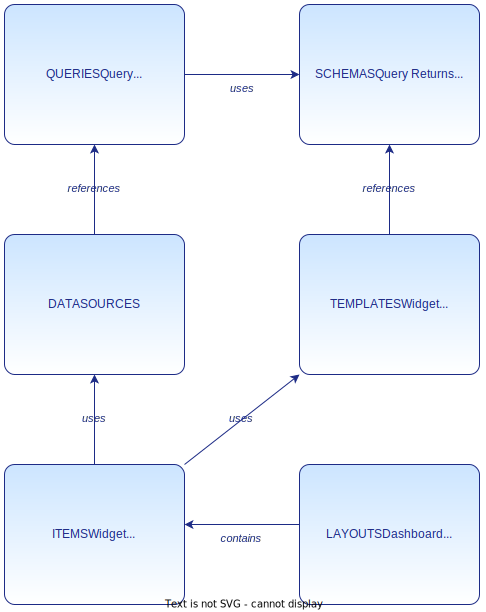

# Analytics - Overall Design

<!-- REVERSE-ENGINEERED FROM CODE -->
<!-- Date: 2026-01-06 -->
<!-- Source: modules/analytics.bak -->
<!-- Adapter: guidelines/FDD-Adapter/AGENTS.md -->

**Version**: 1.0  
**Date**: 2025-12-31  
**Module**: Analytics

---

## Section A: Business Context

### 1. VISION

**Purpose**: Comprehensive framework for creating, managing, and displaying data visualizations and reports within the Hyperspot Platform

**Target Users**:
- Platform Administrators - Infrastructure and security management
- Data Engineers - External data infrastructure (indirect interaction)
- Plugin Developers - Custom datasource and query plugins
- Dashboard Designers - Creating dashboards and visualizations
- Business Analysts - Consuming reports and insights
- End Users - Viewing dashboards and exploring data

**Key Problems Solved**:
- **Data Fragmentation**: Unified access to multiple external data sources through plugin architecture
- **Data Agnostic Design**: No vendor lock-in - works with any data source (OLAP, OLTP, APIs) via query registration
- **Visualization Complexity**: Rich set of chart types and interactive features without coding
- **Type Safety**: Strong typing through GTS (Global Type System) prevents runtime errors
- **Multi-Tenancy**: Complete tenant isolation with automatic JWT propagation
- **Extensibility**: Plugin-based architecture for custom datasources and query adapters
- **Reporting & Scheduling**: Automated report generation and delivery via platform services
- **Performance**: Query result caching and horizontal scalability (data performance depends on external sources)
- **Security**: SecurityCtx enforced at every layer with automatic tenant context injection

**Success Criteria**:
- Sub-second query response for typical dashboards (p95 < 1s)
- Support 100+ concurrent users per tenant
- 99.9% uptime SLA
- Plugin registration without service restart
- Complete tenant data isolation

### 2. Actors

**Human Actors**:

#### Platform Administrator
**Role**: Manages platform infrastructure and configuration
**Capabilities**:
- Configure tenant isolation and security policies
- Monitor system health and performance
- Manage user access across tenants
- Configure DWH connections

#### Data Engineer
**Role**: Manages external data infrastructure (indirect interaction)
**Interaction**: Does NOT directly interact with Analytics module - manages external DWH/ETL systems that Analytics queries via plugins
**Capabilities** (external to Analytics):
- Build ETL pipelines in external systems
- Configure external OLAP/OLTP data warehouses
- Maintain data quality in source systems
**Analytics Impact**: External data sources become available via query plugin registration performance

#### Plugin Developer
**Role**: Develops custom datasource plugins and adapters
**Capabilities**:
- Create datasource plugins
- Implement contract adapters (OData, REST)
- Register GTS type extensions
- Build integration connectors

#### Dashboard Designer
**Role**: Creates dashboards and visualizations
**Capabilities**:
- Design dashboards and reports
- Configure widgets and filters
- Set up scheduled exports
- Organize layouts for end users

#### Business Analyst
**Role**: Analyzes data and creates insights
**Capabilities**:
- Create ad-hoc queries
- Build interactive reports
- Export data for analysis
- Set up alerts and notifications

#### End User
**Role**: Consumes dashboards and reports
**Capabilities**:
- View dashboards
- Apply filters and drilldowns
- Export visualizations
- Subscribe to reports

#### Template Developer
**Role**: Develops custom widget templates and visualizations
**Capabilities**:
- Create widget templates
- Define template configuration schemas
- Implement rendering logic
- Build reusable components
- Register templates via GTS

#### System Integrator
**Role**: Embeds analytics into third-party products
**Capabilities**:
- Embed dashboards via iframe/SDK
- Configure white-label solutions
- Integrate with SSO/OAuth
- Set up multi-tenant configurations
- Implement branding customization

#### Tenant Administrator
**Role**: Manages tenant-specific configurations
**Capabilities**:
- Control user access within tenant
- Configure tenant datasources
- Manage tenant data retention
- Monitor tenant usage and quotas

#### API Consumer
**Role**: Integrates analytics programmatically
**Capabilities**:
- Execute queries via REST API
- Fetch data for custom visualizations
- Build automation workflows
- Integrate with mobile/desktop apps

**System Actors**:

#### UI Application (HAI3)
**Role**: Frontend application for Analytics module
**Integration**: REST API consumption with JWT authentication
**Capabilities**:
- Render dashboards and widgets
- Execute queries via API
- Manage user interactions
- Handle authentication flow

#### Hyperspot Platform
**Role**: Provides core infrastructure services
**Integration**: Platform APIs and event bus
**Services Provided**:
- Event management and propagation
- Tenancy management and isolation
- User authentication and authorization
- Access control and permissions
- UI configuration and settings
- **Scheduling service** - Cron-based job scheduling for reports and tasks
- **Email delivery** - Email sending for report delivery and notifications

#### Query Plugin
**Role**: Executes queries against datasources
**Integration**: Plugin API with JWT propagation
**Data Flow**: Analytics Service → Plugin → External API → Response

#### External API Provider
**Role**: Provides data through REST/OData APIs
**Integration**: JWT-based authentication
**Requirements**: Must validate JWT and filter by tenant_id

### 3. System Capabilities

**Data Visualization**:
- Rich chart types (line, bar, pie, scatter, heatmap, etc.)
- Interactive tables with sorting and filtering
- Geographic maps with custom layers
- Custom widget templates
- **Values selectors** (dropdowns, autocomplete, pickers) for filters and parameters

**Data Access**:
- Plugin-based datasource architecture
- OData v4 query support
- Native REST API queries
- Real-time data refresh
- **Data agnostic** - no built-in DWH or data sources, all connected via query registration

**Datasource Management**:
- Datasource configuration (query + parameters + UI controls)
- Parameter binding and validation
- Values selector integration for parameter inputs
- Datasource reusability across widgets
- Runtime parameter injection

**Dashboard Management**:
- Grid-based responsive layouts
- Drag-and-drop widget positioning
- Dashboard templates
- Version history

**Query Execution**:
- Multi-datasource queries
- Query result caching
- Automatic JWT generation with tenant context
- Plugin-based query adapters

**Reporting**:
- Report generation (on-demand, scheduled via platform)
- Report templates (based on dashboards)
- Multi-format export (PDF, CSV, Excel)
- Report history and versioning
- Report delivery (email via platform)

**Export & Sharing**:
- Dashboard export to multiple formats
- Dashboard sharing with permissions
- Embed widgets in external apps
- Public/private dashboard URLs

**Security & Multi-Tenancy**:
- Complete tenant isolation
- SecurityCtx enforced everywhere
- JWT-based API authentication
- Row-level security in queries

**Extensible Architecture**:
- Dynamic datasource registration
- Custom query implementations
- Contract format adapters (native, odata, rest)
- GTS-based type extensions
- Plugin-based extensibility

**Organization & Libraries**:
- **Categories** for all GTS types and instances (hierarchical classification)
- **Widget Libraries** - reusable widget collections
- **Template Libraries** - visualization template marketplace
- **Datasource Libraries** - preconfigured data source connectors
- **Query Libraries** - shareable query definitions

**Performance**:
- Query result caching
- Horizontal scalability
- External data sources accessed via query plugins
- No built-in ETL or DWH (data agnostic)

---

## Section B: Requirements & Principles

### 1. System Requirements & Constraints

**Performance Requirements**:
- Query execution: p95 < 1s, p99 < 3s (depends on external data sources)
- Dashboard load: < 2s for typical dashboard
- API response: p95 < 200ms
- Concurrent users: 100+ per tenant
- Plugin registration: < 5s

**Scalability**:
- 1000+ dashboards per tenant
- 100+ widgets per dashboard
- 10M+ rows per query result (limited by external sources)
- 50+ concurrent queries per tenant
- Unlimited datasource plugins

**Security Requirements**:
- Multi-tenant isolation (mandatory, **provided by Hyperspot Platform**)
- JWT signature validation
- Automatic tenant_id injection
- SecurityCtx checks at all layers
- Audit logging for all queries (**platform-level**)
- Row-level security in data access (enforced by external sources)

**Compliance**:
- GDPR compliant (data retention, deletion) - **managed by platform**
- SOC 2 Type II requirements
- Audit trail for all data access (**platform-level**)
- Data encryption at rest and in transit

**Technology Constraints**:
- Rust for core services
- **PostgreSQL for OLTP** (GTS metadata, types, instances, configuration)
- **No built-in DWH** - data agnostic, all sources via query registration
- GTS for all type definitions
- JWT for authentication (**provided by Hyperspot Platform**)

**Platform Dependencies**:
- **Hyperspot Platform** provides:
  - Event management system
  - Tenancy management and isolation
  - User authentication and authorization
  - Access control framework
  - UI configuration and settings management
  - **Scheduling service** - For report scheduling and periodic tasks
  - **Email delivery** - For report delivery and notifications

---

### 1a. Security Requirements

**Secure ORM (REQUIRED)**:
- All database queries MUST use `SecureConn` with `SecurityCtx`
- Entities MUST derive `#[derive(Scopable)]` with explicit scope dimensions
- Compile-time enforcement: unscoped queries cannot execute
- Tenant isolation automatic when tenant_ids provided

**SecurityCtx Propagation**:
- All service methods accept `&SecurityCtx` as first parameter
- All repository methods accept `&SecurityCtx` for scope enforcement
- SecurityCtx created from request auth (per-operation, not stored)

**Input Validation**:
- Use `validator` crate for DTO validation
- Field-level constraints (length, email, custom validators)
- Return 422 with structured validation errors

**Secrets Management**:
- Never commit secrets to version control
- Use environment variables for configuration
- Rotate secrets regularly
- Use secure random generation for tokens

**References**: `@/guidelines/SECURITY.md`, `@/docs/SECURE-ORM.md`

---

### 1b. Observability Requirements

**Distributed Tracing (OpenTelemetry)**:
- Accept/propagate `traceparent` header (W3C Trace Context)
- Emit `traceId` header on all responses
- Auto-instrument: HTTP requests, DB queries, inter-module calls
- Export to Jaeger/Uptrace via OTLP

**Structured Logging**:
- JSON logs per request: `traceId`, `requestId`, `userId`, `path`, `status`, `durationMs`
- Use `tracing` crate with contextual fields
- Log levels configurable per-module

**Metrics (Prometheus)**:
- Health check endpoint: `/health`
- RED metrics: Rate, Errors, Duration (per route)
- USE metrics: Utilization, Saturation, Errors
- Performance: p50/p90/p99 latencies
- Resource: memory, connection pools, queue depths

**Health Checks**:
- Liveness probe: service is running
- Readiness probe: service can handle traffic
- Kubernetes-compatible health endpoints

**References**: `@/docs/TRACING_SETUP.md`, `@/docs/ARCHITECTURE_MANIFEST.md`

---

### 2. Principles

#### 1. Security First
SecurityCtx enforced at every level. No query execution without tenant context.

**Implementation**: SecurityCtx as first parameter in all service methods

#### 2. Plugin-Based Extensibility
Datasources as dynamically registered plugins. No service restart required.

**Implementation**: Plugin registry with runtime registration

#### 3. GTS Native
All plugin communication via GTS. Type safety at runtime.

**Implementation**: GTS Schema Registry for all data structures

#### 4. Strongly Typed
All configuration validated with schemas. No runtime errors from invalid config.

**Implementation**: JSON Schema validation + GTS type checking

#### 5. Metadata Storage
OLTP database for storing GTS types, instances, and configuration.

**Implementation**: PostgreSQL for metadata, GTS Registry for CRUD operations

#### 6. Data Agnostic Architecture
No built-in data sources or DWH. All data access via registered queries to external systems.

**Implementation**: Query plugins with JWT propagation to external APIs/DWH

#### 7. Modular Design
Reusable layouts, items, widgets, templates.

**Implementation**: GTS-based composable components

#### 8. API-First
REST API with OpenAPI specification. All features accessible via API.

**Implementation**: OpenAPI 3.x spec with code generation

#### 9. Horizontal Scalability
Stateless services, distributed architecture.

**Implementation**: Kubernetes deployment, Redis for caching

#### 10. Tenant Isolation
Complete data separation per tenant. Cryptographic JWT integrity.

**Implementation**: Automatic tenant_id injection + JWT validation

#### 11. Mock Mode Support
All services and UI components support mock mode for development and testing.

**Implementation**:
- **Service Mock Mode**: Analytics service can run without database or query plugins
  - Mock datasources provide realistic test data
  - Mock queries return sample responses matching real schemas
  - Enabled via `--mock-mode` flag or `MOCK_MODE=true` environment variable
  - Mock responses follow same GTS contracts as real implementations
  
- **UI Mock Mode**: Analytics UI can run without backend
  - Mock API client provides realistic dashboard data
  - All endpoints have mock implementations
  - Enabled via build-time configuration (`VITE_MOCK_MODE=true`)
  - Mock data includes complete GTS instances

**Benefits**: Faster local development, reliable E2E testing, demo environments, offline capability

---

### SDK Pattern

**Purpose**: Analytics module follows SDK pattern for clean separation

**Structure**:
```
modules/analytics/
├── analytics-sdk/    # Public API (transport-agnostic)
└── analytics/        # Implementation
```

**Rules**:
- SDK types MUST NOT have `serde` or transport-specific derives
- All API methods MUST accept `&SecurityCtx` as first parameter
- Consumers depend only on SDK crate
- Local client in module crate implements SDK trait

**Note**: Analytics currently has a flat structure and needs refactoring to follow SDK pattern.

**References**: `@/examples/modkit/users_info/`, `@/guidelines/NEW_MODULE.md`

---

### Plugin Architecture

**Implementation**: Analytics uses Gateway + Plugin pattern for datasources

**Gateway + Plugin Pattern**:
- **Analytics Gateway** - exposes query API, routes to selected datasource plugins
- **Datasource Plugins** - implement query execution for specific data sources (PostgreSQL, MySQL, REST APIs, etc.)
- **GTS-based Registration** - plugins register via types-registry with GTS instance IDs

**Plugin Discovery**:
- Plugins register GTS instances in types-registry
- Gateway queries types-registry for available datasource plugins
- Selection by: query configuration, tenant preferences

**Plugin Types**:
- Database plugins (PostgreSQL, MySQL, SQLite)
- API plugins (REST, GraphQL)
- File plugins (CSV, JSON, Parquet)
- Custom plugins (tenant-specific data sources)

**Key Concepts**:
- Query API trait: Public interface for consumers
- Datasource Plugin API trait: Interface for plugin implementations
- GTS Instance IDs: Each datasource identified by GTS ID
- Dynamic registration: Add plugins without service restart

**References**: `@/docs/MODKIT_PLUGINS.md`

---

## Section C: Technical Architecture

#### C.1: System Architecture


The architecture consists of four distinct layers:

**PRESENTATION** (HAI3 - UI Application):
- Dashboards, Reports, Widgets
- Datasources & Templates
- Admin Panel
- Interactive features (drilldowns, tooltips, filtering)

**API LAYER**:
- REST API with Multi-Tenancy support (via Hyperspot Platform)
- Queries execution engine with JWT propagation
- GTS Registry for type and instance management
- OData v4 compatibility layer

**BUSINESS LOGIC**:
- GTS Types & Instances CRUD
- Query plugins for external data sources
- Adapter plugins for protocol translations (OData, REST, native)
- SecurityCtx enforcement (via Hyperspot Platform)

**STORAGE**:
- **PostgreSQL (OLTP)** - GTS metadata, types, instances, dashboards, configurations
- **No built-in DWH** - Analytics is data agnostic, all data via external queries

**PLATFORM INTEGRATION**:
- **Hyperspot Platform** - events, tenancy, auth, access control, UI settings

#### C.2: Domain Model

**Technology**: GTS (Global Type System) + JSON Schema

**Location**: `gts/types/`

##### Domain Model Diagram



Key entity relationships:
- Dashboard → Layout → Item → Widget
- Widget → Template + Datasource
- Query → Plugin → External API
- Schema → GTS Type → Validation

##### Core Domain Types

All domain types are defined using GTS (Global Type System) with JSON Schema format.

**Location**: `gts/types/*.json`

The domain model consists of interconnected type categories managed through unified GTS Registry:

**Core Entities**:

**Schemas** - Define data structures and validation rules. All schemas inherit from base and require `examples[0]` for validation.

- [`gts://gts.hypernetix.hyperspot.ax.schema.v1~`](../../gts/types/schema/v1/base.schema.json) - Base schema type with mandatory examples
- [`gts://gts.hypernetix.hyperspot.ax.schema.v1~hypernetix.hyperspot.ax.query_returns.v1~`](../../gts/types/schema/v1/query_returns.schema.json) - Query result schema (paginated, scalar-only fields)
- [`gts://gts.hypernetix.hyperspot.ax.schema.v1~hypernetix.hyperspot.ax.template_config.v1~`](../../gts/types/schema/v1/template_config.schema.json) - Template configuration base
- [`gts://gts.hypernetix.hyperspot.ax.schema.v1~hypernetix.hyperspot.ax.values.v1~`](../../gts/types/schema/v1/values.schema.json) - Value lists for UI selectors

**Queries** - Define data retrieval operations using OData v4 protocol.

- [`gts://gts.hypernetix.hyperspot.ax.query.v1~`](../../gts/types/query/v1/query.schema.json) - Query registration with OData integration
- [`gts://gts.hypernetix.hyperspot.ax.query_capabilities.v1~`](../../gts/types/query/v1/query_capabilities.schema.json) - OData capabilities annotations (FilterRestrictions, SortRestrictions, etc)
- [`gts://gts.hypernetix.hyperspot.ax.query.v1~hypernetix.hyperspot.ax.values.v1~`](../../gts/types/query/v1/values.schema.json) - Default OData query options

**Categories** - Organize and group related GTS entities by domain or purpose.

- [`gts://gts.hypernetix.hyperspot.ax.category.v1~`](../../gts/types/category/v1/base.schema.json) - Base category (hierarchical classification)
- Category types for: Query, Template, Datasource, Widget, Item, Group, Dashboard, Layout

**Templates** - Define rendering logic and configuration for visual components.

- [`gts://gts.hypernetix.hyperspot.ax.template.v1~`](../../gts/types/template/v1/base.schema.json) - Base template (UI component config)
- [`gts://gts.hypernetix.hyperspot.ax.template.v1~hypernetix.hyperspot.ax.widget.v1~`](../../gts/types/template/v1/widget.schema.json) - Widget template (data visualizations)
- [`gts://gts.hypernetix.hyperspot.ax.template.v1~hypernetix.hyperspot.ax.values_selector.v1~`](../../gts/types/template/v1/values_selector.schema.json) - Values selector template (dropdowns, autocomplete)

**Datasources** - Connect query definitions with runtime parameters and UI controls.

- [`gts://gts.hypernetix.hyperspot.ax.datasource.v1~`](../../gts/types/datasource/v1/datasource.schema.json) - Datasource (query + params + UI controls)

**Items** - Reusable building blocks for layouts.

- [`gts://gts.hypernetix.hyperspot.ax.item.v1~`](../../gts/types/item/v1/base.schema.json) - Base item (name, size, category)
- [`gts://gts.hypernetix.hyperspot.ax.item.v1~hypernetix.hyperspot.ax.widget.v1~`](../../gts/types/item/v1/widget.schema.json) - Widget item (template + datasource)
- [`gts://gts.hypernetix.hyperspot.ax.item.v1~hypernetix.hyperspot.ax.group.v1~`](../../gts/types/item/v1/group.schema.json) - Group item (container for items)

**Layouts** - Organize items into dashboards and reports.

- [`gts://gts.hypernetix.hyperspot.ax.layout.v1~`](../../gts/types/layout/v1/base.schema.json) - Base layout (ordered item array)
- [`gts://gts.hypernetix.hyperspot.ax.layout.v1~hypernetix.hyperspot.ax.dashboard.v1~`](../../gts/types/layout/v1/dashboard.schema.json) - Dashboard layout (real-time, auto-refresh)
- [`gts://gts.hypernetix.hyperspot.ax.layout.v1~hypernetix.hyperspot.ax.report.v1~`](../../gts/types/layout/v1/report.schema.json) - Report layout (scheduled, exportable)

**Component Registration**: All types and instances managed via unified `/gts` endpoint with automatic tenant isolation

---

#### C.3: API Contracts

**Technology**: OpenAPI 3.0.3 (REST)

**Location**: `architecture/openapi/v1/api.yaml`

##### OpenAPI Specification

**Design-Time OpenAPI**: [api.yaml](openapi/v1/api.yaml)  
**Runtime OpenAPI**: [openapi.yaml](../../openapi/analytics.yaml) (generated from code)

**API Endpoints**:
- `/$metadata` - OData service metadata (JSON CSDL)
- `/gts` - GTS Registry (unified CRUD for all GTS types and instances)
- `/gts/{id}` - Get specific GTS entity by identifier
- `/gts/{id}/enablement` - Tenant enablement configuration for GTS entities
- `/queries/{id}` - Execute query with OData v4 options (GET/POST)
- `/queries/{id}/$metadata` - Query-specific metadata
- `/queries/{id}/$query` - Query with JSON body (POST)
- `/templates/{id}/bundle` - Upload/download template JavaScript bundles (POST/GET)

**Authentication**: JWT Bearer token in `Authorization` header

**Tenant Context**: Automatic `tenant_id` injection from SecurityCtx

**Note**: 
- All entity **metadata** (dashboards, templates, datasources, queries, schemas) registered via unified `/gts` endpoint
- Template **JavaScript bundles** uploaded separately via `/templates/{id}/bundle` endpoint
- Tenant enablement managed via `/gts/{id}/enablement` with automatic dependency enablement

**Future Endpoints** (defined in feature designs):
- Reporting endpoints - Report generation, scheduling, delivery (see `feature-reporting`)
- Sharing endpoints - Dashboard sharing, public URLs, embed tokens (see `feature-export-sharing`)

##### REST API Standards

**Purpose**: Define REST API conventions and standards for Analytics module

**Required Standards** (see `@/guidelines/DNA/REST/API.md`):

**Pagination**: OData cursor-based with `$filter`, `$orderby`, `$select`
- Max limit: 200 items per page
- Opaque versioned cursors
- Filter safety: cursors bound to query
- Already implemented in `/gts` endpoint

**Error Handling**: RFC 9457 Problem Details
- All 4xx/5xx return `application/problem+json`
- Include `type`, `title`, `status`, `detail`, `traceId`
- Structured validation errors with field-level details

**Status Codes** (see `@/guidelines/DNA/REST/STATUS_CODES.md`):
- Success: 200 (read), 201 (create + Location), 204 (delete), 202 (async)
- Client errors: 400 (bad request), 401 (auth), 403 (authz), 404, 409 (conflict), 422 (validation), 429 (rate limit)
- Server errors: 500 (internal), 503 (unavailable + Retry-After)

**Concurrency**: ETag + If-Match for optimistic locking
- Used for GTS entity updates to prevent concurrent modifications

**Idempotency**: Idempotency-Key header on POST/PATCH/DELETE
- Query execution is idempotent by design (same query params = same results)

**Rate Limiting**: RateLimit-Policy and RateLimit headers (IETF draft)
- Per-tenant query rate limits
- Per-tenant API call rate limits

**References**:
- [REST API Guidelines](../../guidelines/DNA/REST/API.md)
- [Pagination Spec](../../guidelines/DNA/REST/PAGINATION.md)
- [Status Codes](../../guidelines/DNA/REST/STATUS_CODES.md)

---

#### C.4: Security Model

**Authentication**: JWT-based authentication provided by Hyperspot Platform

**Token Structure**:
- JWT tokens issued by platform authentication service
- Contains: `tenant_id`, `user_id`, `roles`, `permissions`, `exp` (expiration)
- Signed with platform secret key
- Validated on every API request

**Authorization**: SecurityCtx-based authorization

**SecurityCtx Enforcement**:
- Created from JWT token on each request (not stored)
- Contains validated `tenant_id`, `user_id`, and permission set
- Passed as first parameter to all service methods: `fn method(&SecurityCtx, ...)`
- Enforced at compile-time via Secure ORM

**Secure ORM**:
- All database entities derive `#[derive(Scopable)]`
- Database queries require `SecureConn` with `SecurityCtx`
- Automatic `tenant_id` filtering in all queries
- Compile-time error if query executed without SecurityCtx
- **Cannot bypass** - unscoped queries won't compile

**Data Protection**:
- **Tenant Isolation**: Complete data separation per tenant via SecurityCtx
- **Row-Level Security**: Automatic tenant_id filtering in all database queries
- **JWT Validation**: Signature verification on every request
- **Encryption at Rest**: Database encryption enabled
- **Encryption in Transit**: TLS 1.3 for all API communication

**Security Boundaries**:
- **API Layer**: JWT validation, SecurityCtx creation
- **Service Layer**: SecurityCtx propagation, authorization checks
- **Repository Layer**: Secure ORM enforcement, tenant filtering
- **Plugin Layer**: JWT propagation to external APIs, tenant context maintained

**External Data Access**:
- Analytics propagates JWT to external query plugins
- External APIs responsible for validating JWT and filtering by `tenant_id`
- No direct database access - all data via query plugins

**Audit Logging**: Provided by Hyperspot Platform
- All API requests logged with: `tenant_id`, `user_id`, `endpoint`, `timestamp`, `traceId`
- Query execution logged with: query_id, parameters, execution time
- GTS entity changes logged with: entity_id, operation, before/after state

**References**: 
- `@/docs/SECURE-ORM.md` - Secure ORM implementation details
- `@/guidelines/SECURITY.md` - Platform security guidelines
- Section B.1a - Security Requirements

---

#### C.5: Non-Functional Requirements

**Performance**:
- **Query Execution**: p95 < 1s, p99 < 3s (depends on external data sources)
- **Dashboard Load**: < 2s for typical dashboard (10-20 widgets)
- **API Response**: p95 < 200ms for metadata operations
- **Plugin Registration**: < 5s to register new datasource plugin
- **Caching**: Query result caching reduces repeated query latency

**Scalability**:
- **Horizontal Scaling**: Stateless service design enables adding instances
- **Concurrent Users**: 100+ per tenant without degradation
- **Data Volume**: 10M+ rows per query result (limited by external sources)
- **Entity Limits**: 1000+ dashboards per tenant, 100+ widgets per dashboard
- **Plugin Capacity**: Unlimited datasource plugins via dynamic registration

**Reliability & Availability**:
- **Uptime SLA**: 99.9% availability target
- **Health Checks**: Liveness and readiness probes for Kubernetes
- **Graceful Degradation**: Mock mode fallback when dependencies unavailable
- **Retry Logic**: Automatic retry with exponential backoff for transient failures
- **Circuit Breaker**: Prevent cascade failures from external API issues

**Observability**:
- **Distributed Tracing**: OpenTelemetry with W3C Trace Context propagation
- **Structured Logging**: JSON logs with `traceId`, `requestId`, `tenant_id`
- **Metrics**: Prometheus RED (Rate, Errors, Duration) and USE (Utilization, Saturation, Errors) metrics
- **Health Endpoints**: `/health` (liveness), `/ready` (readiness)
- **References**: `@/docs/TRACING_SETUP.md`

**Maintainability**:
- **Modular Architecture**: Plugin-based extensibility without core changes
- **SDK Pattern**: Clear contract/implementation separation
- **Type Safety**: GTS eliminates runtime type errors
- **Testing**: Mock mode enables fast local development and E2E testing
- **Documentation**: OpenAPI specification auto-generated from code

**Deployment**:
- **Container-Based**: Docker images for consistent deployment
- **Kubernetes-Ready**: Supports horizontal pod autoscaling
- **Configuration**: Environment variables and config files
- **Zero Downtime**: Rolling updates without service interruption

---

## Section D: Architecture Decision Records

### ADR-0001: Initial Analytics Architecture

**Date**: 2025-12-31  
**Status**: Accepted  
**Deciders**: Hyperspot Team  
**Technical Story**: Analytics module initialization

#### Context and Problem Statement

The Hyperspot platform required a comprehensive analytics and reporting solution that could:
- Support multiple data sources without vendor lock-in
- Provide type-safe data visualization and querying
- Ensure complete tenant isolation in multi-tenant environment
- Scale horizontally while maintaining performance
- Enable extensibility through plugins

The challenge was to design an architecture that balances flexibility, security, type safety, and performance while avoiding coupling to specific data warehouse technologies.

#### Decision Drivers

- **Type Safety**: Need compile-time and runtime type validation across distributed system
- **Multi-Tenancy**: Complete tenant isolation is mandatory for SaaS platform
- **Data Agnostic**: No vendor lock-in to specific DWH or data source technologies
- **Extensibility**: Plugin architecture for datasources, queries, and visualizations
- **Performance**: Sub-second query response times for typical dashboards
- **Security**: JWT-based authentication with automatic tenant context propagation
- **Modularity**: Reusable components (dashboards, widgets, templates)

#### Considered Options

1. **GTS + Plugin Architecture** (chosen)
   - GTS (Global Type System) for type-safe cross-module communication
   - Plugin-based datasource architecture with dynamic registration
   - No built-in DWH, all data via external query plugins
   - SecurityCtx enforcement at every layer
   - Modkit pattern with SDK separation

2. **Monolithic with Built-in DWH**
   - Integrated PostgreSQL-based data warehouse
   - Direct SQL queries from analytics service
   - Simpler deployment but vendor lock-in
   - ETL pipelines built into analytics module

3. **Microservices with Dedicated Query Service**
   - Separate query execution service
   - REST API between analytics and query service
   - More network overhead, complex deployment
   - Harder to maintain type safety across services

#### Decision Outcome

**Chosen option**: "GTS + Plugin Architecture"

**Rationale**:
- **Type Safety**: GTS provides schema validation at runtime with JSON Schema compliance
- **Flexibility**: Plugin architecture allows adding new datasources without service restart
- **Data Agnostic**: Query plugins abstract data source details, supporting any external system
- **Security**: SecurityCtx enforced at compilation via Secure ORM and at runtime via JWT
- **Performance**: Stateless design enables horizontal scaling, caching reduces query latency
- **Modularity**: SDK pattern separates contracts from implementation

**Positive Consequences**:
- No vendor lock-in - can connect to any data source (OLAP, OLTP, REST APIs)
- Type-safe communication through GTS eliminates entire class of runtime errors
- Plugin registration without service restart improves operational flexibility
- Complete tenant isolation via SecurityCtx prevents data leakage
- Horizontal scalability achieved through stateless service design
- Reusable components (templates, widgets, layouts) reduce development time

**Negative Consequences**:
- More complex architecture than monolithic approach
- Plugin development requires understanding of GTS system
- Query performance depends on external data source capabilities
- Initial setup requires more configuration than integrated solution
- Debugging distributed queries can be challenging

#### Implementation Notes

**Sections affected**:

**Section A: Business Context**
- Vision emphasizes "Data Agnostic Design" and plugin architecture
- Actors include "Plugin Developer" for datasource extensibility
- System capabilities list "Plugin-based datasource architecture"

**Section B: Requirements & Principles**
- Principle #2: "Plugin-Based Extensibility" - no service restart required
- Principle #3: "GTS Native" - all plugin communication via GTS
- Principle #6: "Data Agnostic Architecture" - no built-in DWH
- Security requirements mandate SecurityCtx at all layers

**Section C: Technical Architecture**
- Domain model uses GTS + JSON Schema (26 schema files)
- API contracts use OpenAPI 3.x for REST + gRPC for inter-module
- Storage layer uses PostgreSQL for OLTP metadata only
- Plugin architecture documented with Gateway + Plugin pattern
- SDK pattern enforced for clean contract/implementation separation

---

### ADR-0002: OData v4 Query Protocol Selection

**Date**: 2025-12-31  
**Status**: Accepted  
**Deciders**: Hyperspot Team  

#### Context and Problem Statement

Analytics module needed a standardized query protocol for data retrieval that supports:
- Complex filtering, sorting, and pagination
- Field projection and selection
- Metadata discovery
- Industry-standard compatibility

#### Decision Drivers

- Need standardized query language that external systems can understand
- Must support complex filtering and sorting operations
- Require metadata endpoint for schema discovery
- Industry adoption and tooling ecosystem

#### Considered Options

1. **OData v4** (chosen)
2. **GraphQL**
3. **Custom REST query DSL**

#### Decision Outcome

**Chosen option**: "OData v4"

**Rationale**: OData v4 provides mature standard for querying data with built-in support for filtering (`$filter`), sorting (`$orderby`), pagination (`$top`, `$skip`), field selection (`$select`), and metadata discovery (`$metadata`). Wide industry adoption ensures compatibility with external tools and services.

**Positive Consequences**:
- Standard protocol understood by many external systems
- Built-in metadata discovery via `$metadata` endpoint
- Rich query capabilities (filter, sort, project, paginate)
- JSON CSDL support for schema definition

**Negative Consequences**:
- OData query syntax can be complex for users
- Additional implementation overhead vs custom DSL
- Some OData features not needed by all use cases

**Sections affected**:
- Section C.3: GTS Domain Types include query capabilities schema
- Section C.4: API endpoints include `/$metadata` and `/queries/{id}/$query`
- Section C.5: REST API Standards document OData pagination

---

### ADR-0003: SecurityCtx and Secure ORM for Tenant Isolation

**Date**: 2025-12-31  
**Status**: Accepted  
**Deciders**: Hyperspot Team  

#### Context and Problem Statement

Multi-tenant SaaS platform requires absolute guarantee of tenant data isolation. Traditional approach of manual tenant_id filtering in queries is error-prone and can lead to data leakage vulnerabilities.

#### Decision Drivers

- Zero-tolerance for tenant data leakage
- Compile-time enforcement of security constraints
- Automatic tenant context propagation
- Audit trail for all data access

#### Considered Options

1. **Secure ORM with SecurityCtx** (chosen)
2. **Manual tenant_id filtering**
3. **Database-level row-level security (RLS)**

#### Decision Outcome

**Chosen option**: "Secure ORM with SecurityCtx"

**Rationale**: Secure ORM with `#[derive(Scopable)]` macro provides compile-time enforcement of tenant isolation. All database queries must go through `SecureConn` with `SecurityCtx`, making it impossible to execute unscoped queries. This eliminates entire class of security vulnerabilities.

**Positive Consequences**:
- Compile-time enforcement - unscoped queries cannot compile
- Automatic tenant_id injection in all queries
- SecurityCtx propagation through all service layers
- JWT validation and tenant extraction centralized
- Impossible to accidentally query across tenant boundaries

**Negative Consequences**:
- Additional boilerplate - all methods accept `&SecurityCtx`
- Learning curve for developers unfamiliar with pattern
- Cannot opt-out of scoping even when intentional (e.g., admin queries)

**Sections affected**:
- Section B.1a: Security Requirements document Secure ORM mandate
- Section C: All API endpoints validate JWT and extract SecurityCtx
- All service methods accept `&SecurityCtx` as first parameter

---

### ADR-0004: Mock Mode Architecture

**Date**: 2025-12-31  
**Status**: Accepted  
**Deciders**: Hyperspot Team  

#### Context and Problem Statement

Development and testing require ability to run analytics module without dependencies on database, external data sources, or query plugins. Need consistent mock data that matches production schemas.

#### Decision Drivers

- Faster local development without infrastructure setup
- Reliable E2E testing with predictable data
- Demo environments without production data access
- Offline development capability

#### Considered Options

1. **Comprehensive Mock Mode** (chosen)
2. **Test database with seed data**
3. **In-memory database only**

#### Decision Outcome

**Chosen option**: "Comprehensive Mock Mode"

**Rationale**: Mock mode at both service and UI levels provides maximum flexibility for development and testing. Mock datasources return realistic data matching GTS schemas, enabling full feature development without infrastructure.

**Positive Consequences**:
- Service mock mode via `--mock-mode` flag or `MOCK_MODE=true` env var
- UI mock mode via `VITE_MOCK_MODE=true` build-time config
- Mock responses follow same GTS contracts as real implementations
- Faster development cycles without database/plugin dependencies
- Reliable E2E tests with deterministic mock data

**Negative Consequences**:
- Additional maintenance - mock implementations must stay in sync with real implementations
- Mock data may not catch all edge cases that occur in production
- Risk of "works in mock but fails in production" scenarios

**Sections affected**:
- Section B.2: Principle #11 documents Mock Mode Support
- Implementation includes mock datasources and mock API client