# Technical Design: Chat Engine

## 1. Architecture Overview

### 1.1 Architectural Vision

Chat Engine is designed as a **stateful proxy service** that decouples conversational infrastructure from message processing logic. The system follows a **hub-and-spoke architecture** where Chat Engine acts as the central hub managing session state, message history, and routing, while external webhook backends serve as spokes implementing custom message processing logic.

The architecture emphasizes **separation of concerns**: Chat Engine handles persistence, routing, and message tree management, while webhook backends focus solely on message processing. This enables flexible experimentation with different AI models, processing strategies, and conversation patterns without requiring changes to client applications or infrastructure.

**Key architectural decisions:**
- **Message Tree Structure**: Messages form an immutable tree structure enabling conversation branching and variant preservation
- **Streaming-First**: All responses stream from webhook backends through Chat Engine to clients with minimal latency overhead
- **Webhook-Driven Capabilities**: Session capabilities are dynamically determined by webhook backends, not hardcoded in Chat Engine
- **Stateless Routing**: Chat Engine instances can scale horizontally as all session state is persisted in the database

The system supports both **linear conversations** (traditional chat) and **non-linear conversations** (branching, variants, regeneration), enabling advanced use cases like conversation exploration, A/B testing of different backends, and human-in-the-loop workflows.

### 1.2 Architecture Drivers

#### Functional Requirements

| FDD ID | Solution Description |
|--------|----------------------|
| `fdd-chat-engine-fr-create-session` | RESTful API endpoint creates session record, invokes webhook backend with `session.created` event, stores returned capabilities |
| `fdd-chat-engine-fr-send-message` | HTTP streaming endpoint forwards message to webhook backend, pipes streamed response back to client, persists complete exchange after streaming |
| `fdd-chat-engine-fr-attach-files` | Messages support file URL array field; client uploads to external storage first, includes URLs in message payload |
| `fdd-chat-engine-fr-switch-session-type` | Session stores current session_type_id; switching updates this field and routes next message to new webhook backend |
| `fdd-chat-engine-fr-recreate-response` | Creates new message with same parent_message_id as original, sends `message.recreate` event to webhook backend |
| `fdd-chat-engine-fr-branch-message` | Client specifies parent_message_id; Chat Engine loads context up to parent, creates new branch in message tree |
| `fdd-chat-engine-fr-navigate-variants` | Query API returns all messages with same parent_message_id; includes variant position metadata (e.g., "2 of 3") |
| `fdd-chat-engine-fr-stop-streaming` | Client closes HTTP connection; Chat Engine cancels webhook request, saves partial response with incomplete flag |
| `fdd-chat-engine-fr-export-session` | Background job traverses message tree (active path or all variants), formats to JSON/Markdown/TXT, uploads to storage |
| `fdd-chat-engine-fr-share-session` | Generates unique share token stored in database, maps to session_id; recipients create branches from last message |
| `fdd-chat-engine-fr-session-summary` | Routes `session.summary` event to dedicated summarization service URL or webhook backend based on session type config |
| `fdd-chat-engine-fr-search-session` | Full-text search on messages table filtered by session_id; returns matches with context window |
| `fdd-chat-engine-fr-search-sessions` | Full-text search across messages joined with sessions; ranks by relevance, returns session metadata |
| `fdd-chat-engine-fr-delete-session` | Sends `session.deleted` event to webhook backend, then soft-deletes session and messages in database |

#### Non-functional Requirements

| FDD ID | Solution Description |
|--------|----------------------|
| `fdd-chat-engine-nfr-response-time` | Async I/O event-driven architecture; database connection pooling; minimal business logic in routing layer |
| `fdd-chat-engine-nfr-availability` | Stateless instances behind load balancer; health check endpoints; database read replicas for failover |
| `fdd-chat-engine-nfr-scalability` | Horizontal scaling; database sharding by client_id; connection pool per instance |
| `fdd-chat-engine-nfr-data-persistence` | Database transactions wrap message writes; acknowledge client only after commit confirmation |
| `fdd-chat-engine-nfr-streaming` | HTTP chunked transfer encoding; buffering disabled; direct pipe from webhook to client |
| `fdd-chat-engine-nfr-authentication` | JWT-based authentication; client_id claim extraction; session ownership validation on every request |
| `fdd-chat-engine-nfr-data-integrity` | Database foreign key constraints on parent_message_id; unique constraint on (session_id, parent_message_id, variant_index) |
| `fdd-chat-engine-nfr-backend-isolation` | Circuit breaker pattern per webhook backend; timeout configuration per session type; error isolation |
| `fdd-chat-engine-nfr-file-size` | File size validation delegated to storage service; Chat Engine validates URL format and accessibility |
| `fdd-chat-engine-nfr-search` | Full-text search indexes on message content; pagination with cursor-based queries |

### 1.3 Architecture Layers

| Layer | Responsibility | Technology |
|-------|---------------|------------|
| **API Layer** | WebSocket connection management (embedded per instance), event routing, authentication, bidirectional streaming | WebSocket server with event-driven architecture |
| **Application Layer** | Use case orchestration, webhook invocation, streaming coordination | Service classes with dependency injection |
| **Domain Layer** | Business logic, message tree operations, validation rules | Domain entities and value objects |
| **Infrastructure Layer** | Database access, HTTP client for webhooks, file storage client | PostgreSQL, HTTP client library, S3 SDK |

## 2. Principles & Constraints

### 2.1 Design Principles

#### Principle: Immutable Message Tree

**ID**: `fdd-chat-engine-principle-immutable-tree`

<!-- fdd-id-content -->
**ADRs**: ADR-0001

Once a message is created with a parent_message_id, that relationship is immutable. Messages are never moved or re-parented. This ensures referential integrity and enables safe concurrent message creation. Variants are created as siblings (same parent), not by modifying existing messages.
<!-- fdd-id-content -->

#### Principle: Webhook Backend Authority

**ID**: `fdd-chat-engine-principle-webhook-authority`

<!-- fdd-id-content -->
**ADRs**: ADR-0002

Webhook backends are authoritative for session capabilities and message processing logic. Chat Engine does not interpret or validate capability semantics—it only stores and forwards them. This allows backends to evolve independently without Chat Engine changes.
<!-- fdd-id-content -->

#### Principle: Stream Everything

**ID**: `fdd-chat-engine-principle-streaming`

<!-- fdd-id-content -->
**ADRs**: ADR-0003

All webhook responses are streamed by default to minimize time-to-first-byte. Even non-streaming backends are wrapped in streaming adapters. Chat Engine buffers minimally and pipes data directly from webhook to client over persistent connections with bidirectional message framing.
<!-- fdd-id-content -->

#### Principle: Zero Business Logic in Routing

**ID**: `fdd-chat-engine-principle-zero-business-logic`

<!-- fdd-id-content -->
**ADRs**: ADR-0004

Chat Engine does not process, analyze, or transform message content. All business logic (content moderation, language detection, sentiment analysis) belongs in webhook backends. Chat Engine only routes, persists, and manages message trees.
<!-- fdd-id-content -->

### 2.2 Constraints

#### Constraint: External File Storage

**ID**: `fdd-chat-engine-constraint-external-storage`

<!-- fdd-id-content -->
**ADRs**: ADR-0005

Chat Engine does not store file content. Clients must upload files to external file storage (S3, GCS) and include signed URLs in messages. This constraint reduces infrastructure complexity and storage costs.
<!-- fdd-id-content -->

#### Constraint: Synchronous Webhook Invocation

**ID**: `fdd-chat-engine-constraint-sync-webhooks`

<!-- fdd-id-content -->
**ADRs**: ADR-0006

Webhook backends must respond synchronously (with streaming) over HTTP. Asynchronous/callback-based backends are not supported. This constraint simplifies error handling and keeps client connections open for streaming. Note: The client-to-Chat Engine protocol is independent of the webhook protocol, which remains HTTP-based.
<!-- fdd-id-content -->

#### Constraint: Single Database Instance

**ID**: `fdd-chat-engine-constraint-single-database`

<!-- fdd-id-content -->
**ADRs**: ADR-0007

All Chat Engine instances share a single database cluster. No local caching of session state or messages. This ensures consistency but limits scalability to database write throughput.
<!-- fdd-id-content -->

## 3. Technical Architecture

### 3.1 Domain Model

**Technology**: GTS (JSON Schema)

**Location**: `schemas/`

**Core Schemas**:

#### Base Protocol (core/)

- **WebSocketMessage** - WebSocket message envelope (id, type, payload, timestamp)
- **RequestPayload** - Base interface for all request payloads
- **ResponsePayload** - Base interface for all response payloads

#### Session Operations (session/)

- **SessionCreateRequest** - Create session (session_type_id, client_id)
- **SessionCreateResponse** - Session created (session_id, available_capabilities)
- **SessionGetRequest** - Get session (session_id)
- **SessionGetResponse** - Session details (session_id, client_id, session_type_id, available_capabilities, metadata, created_at)
- **SessionDeleteRequest** - Delete session (session_id)
- **SessionDeleteResponse** - Deletion confirmed (deleted)
- **SessionSwitchTypeRequest** - Switch type (session_id, new_session_type_id)
- **SessionSwitchTypeResponse** - Type switched (session_id, session_type_id)
- **SessionExportRequest** - Export session (session_id, format, scope)
- **SessionExportResponse** - Export ready (download_url, expires_at)
- **SessionShareRequest** - Generate share link (session_id)
- **SessionShareResponse** - Share link (share_token, share_url)
- **SessionAccessSharedRequest** - Access shared (share_token)
- **SessionAccessSharedResponse** - Shared session (session_id, messages, read_only)
- **SessionSearchRequest** - Search in session (session_id, query, limit, offset)
- **SessionSearchResponse** - Search results (results)
- **SessionsSearchRequest** - Search across sessions (query, limit, offset)
- **SessionsSearchResponse** - Sessions found (results)
- **SessionSummarizeRequest** - Generate summary (session_id, enabled_capabilities)

#### Message Operations (message/)

- **MessageSendRequest** - Send message (session_id, content, file_urls, parent_message_id, enabled_capabilities)
- **MessageListRequest** - List messages (session_id, parent_message_id)
- **MessageListResponse** - Messages list (messages)
- **MessageGetRequest** - Get message (message_id)
- **MessageGetResponse** - Message details (message_id, role, content, file_urls, metadata, variant_info)
- **MessageRecreateRequest** - Recreate response (message_id, enabled_capabilities)
- **MessageStopRequest** - Stop streaming (message_id or request_id)
- **MessageStopResponse** - Stream stopped (stopped, partial_message_id)
- **MessageGetVariantsRequest** - Get variants (message_id)
- **MessageGetVariantsResponse** - Variants list (variants, current_index)

#### Streaming Events (streaming/)

- **StreamingStartEvent** - Begin streaming (request_id, message_id)
- **StreamingChunkEvent** - Stream chunk (request_id, message_id, chunk)
- **StreamingCompleteEvent** - Streaming finished (request_id, message_id, metadata)
- **StreamingErrorEvent** - Stream error (request_id, message_id, error_code, message)

#### Connection Management (connection/)

- **ConnectionReadyEvent** - Connection established (client_id, server_version, capabilities)
- **ConnectionErrorEvent** - Connection error (error_code, message, details)

#### Response Wrappers (response/)

- **SuccessResponse** - Operation succeeded (request_id, result)
- **ErrorResponse** - Operation failed (request_id, error_code, message, details)

#### Push Events (push/)

- **SessionUpdatedEvent** - Session changed (session_id, updates)
- **MessageCreatedEvent** - Message persisted (session_id, message)

#### Webhook Protocol (webhook/)

- **SessionCreatedEvent** - Session created notification (event, session_id, session_type_id, client_id, timestamp)
- **SessionCreatedResponse** - Capabilities list (available_capabilities)
- **MessageNewEvent** - New message for processing (event, session_id, message_id, session_metadata, enabled_capabilities, message, history, timestamp)
- **MessageNewResponse** - Assistant response (message_id, role, content, metadata)
- **MessageRecreateEvent** - Recreate request (event, session_id, message_id, enabled_capabilities, history, timestamp)
- **MessageRecreateResponse** - Recreated response (same as MessageNewResponse)
- **MessageAbortedEvent** - Streaming cancelled (event, session_id, message_id, partial_content, timestamp)
- **SessionDeletedEvent** - Session deleted (event, session_id, timestamp)
- **SessionSummaryEvent** - Summary request (event, session_id, enabled_capabilities, history, summarization_settings, timestamp)
- **SessionSummaryResponse** - Summary text (summary, metadata)
- **SessionTypeHealthCheckEvent** - Health check (event, session_type_id, timestamp)
- **SessionTypeHealthCheckResponse** - Health status (status, version, capabilities)

#### Common Types (common/)

- **Session** - Session entity (session_id, client_id, session_type_id, available_capabilities, metadata, created_at, updated_at, share_token)
- **Message** - Message entity (message_id, session_id, parent_message_id, role, content, file_urls, variant_index, is_active, is_complete, metadata, created_at)
- **SessionType** - Session type config (session_type_id, name, webhook_url, timeout, summarization_settings, meta, created_at, updated_at)
- **Capability** - Capability definition (name, config, metadata)
- **ContentPart** - Abstract content type (type, ...)
- **TextContent** - Plain text content (type: "text", text)
- **CodeContent** - Code block (type: "code", language, code)
- **ImageContent** - Image content (type: "image", url)
- **AudioContent** - Audio content (type: "audio", url)
- **VideoContent** - Video content (type: "video", url)
- **DocumentContent** - Document content (type: "document", url)
- **Usage** - Token usage (input_tokens, output_tokens)
- **VariantInfo** - Variant metadata (variant_index, total_variants, is_active)
- **SearchResult** - Search match (message_id, content, context)
- **SessionSearchResult** - Session match (session_id, metadata, matched_messages)
- **Role** - Enum: user, assistant, system
- **ErrorCode** - Enum: AUTH_REQUIRED, SESSION_NOT_FOUND, MESSAGE_NOT_FOUND, INVALID_REQUEST, BACKEND_TIMEOUT, BACKEND_ERROR, RATE_LIMIT_EXCEEDED, INTERNAL_ERROR
- **ExportFormat** - Enum: json, markdown, txt
- **ExportScope** - Enum: active, all
- **SummarizationSettings** - Summary config (enabled, service_url, config)

**Relationships**:

WebSocket Protocol:
- WebSocketMessage → type: determines event schema
- WebSocketMessage → payload: contains typed request/response
- All Request schemas → WebSocketMessage: wrapped in message envelope
- All Response schemas → SuccessResponse/ErrorResponse: wrapped for correlation
- StreamingStartEvent, StreamingChunkEvent, StreamingCompleteEvent, StreamingErrorEvent → request_id: linked sequence
- SessionCreateRequest → SessionType: references via session_type_id
- MessageSendRequest → Session: references via session_id
- MessageSendRequest → Message: optional parent via parent_message_id
- MessageSendRequest → Capability: references via enabled_capabilities
- MessageGetResponse → VariantInfo: includes variant metadata
- SessionSearchResponse, SessionsSearchResponse → SearchResult/SessionSearchResult: contains results

Webhook Protocol:
- SessionCreatedEvent → Session: creates
- SessionCreatedResponse → Capability: returns list
- MessageNewEvent, MessageRecreateEvent → Message: references
- MessageNewEvent, MessageRecreateEvent → Session: context
- MessageNewEvent, SessionSummaryEvent → Capability: filters via enabled_capabilities
- MessageNewResponse, MessageRecreateResponse → ContentPart: contains array
- MessageNewResponse, MessageRecreateResponse → Usage: includes metadata
- SessionSummaryEvent → SummarizationSettings: includes config

Common Types:
- Session → SessionType: references via session_type_id
- Session → Capability: contains available_capabilities array
- Message → Session: belongs to via session_id
- Message → Message: tree structure via parent_message_id
- Message → Role: has role enum
- Message → ContentPart: contains content array
- Message → Usage: optional in metadata
- SessionType → SummarizationSettings: optional config
- ContentPart ← TextContent, CodeContent, ImageContent, AudioContent, VideoContent, DocumentContent: polymorphic

### 3.2 Architecture Overview

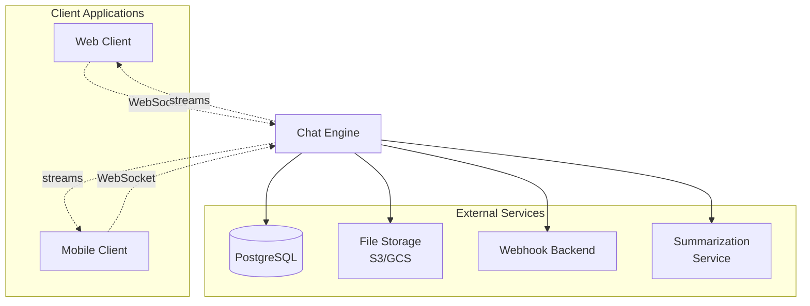

**System Architecture**:

Chat Engine handles all chat-related operations. It is deployed as a unified monolithic service, not as separate microservices. Each instance includes an embedded WebSocket server for client connections and provides the following core functionality through internal modules.

**Core Functionality**:

#### Session Management

**ID**: `fdd-chat-engine-session-management`

<!-- fdd-id-content -->
Chat Engine manages session lifecycle operations including create, delete, and retrieve. It invokes the webhook backend with `session.created` event and stores returned capabilities. This functionality handles session type switching and share token generation.
<!-- fdd-id-content -->

#### Message Processing

**ID**: `fdd-chat-engine-message-processing`

<!-- fdd-id-content -->
**ADRs**: ADR-0001 (tree management), ADR-0014 (variant assignment), ADR-0016 (recreation logic)

Chat Engine orchestrates message creation, persistence, and tree management. It validates parent references, assigns variant_index, and enforces tree constraints. Message processing integrates with webhook invocation functionality for backend communication.
<!-- fdd-id-content -->

#### Webhook Integration

**ID**: `fdd-chat-engine-webhook-integration`

<!-- fdd-id-content -->
**ADRs**: ADR-0004 (zero business logic), ADR-0006 (HTTP protocol), ADR-0011 (circuit breaker), ADR-0013 (timeout)

Chat Engine's HTTP client functionality for webhook backend invocation. It constructs event payloads, handles timeouts, and implements circuit breaker pattern.
<!-- fdd-id-content -->

#### Response Streaming

**ID**: `fdd-chat-engine-response-streaming`

<!-- fdd-id-content -->
**ADRs**: ADR-0003 (streaming architecture), ADR-0009 (cancellation), ADR-0012 (backpressure)

Chat Engine manages WebSocket frame streaming functionality. It pipes data from webhook backend to client via WebSocket messages. This handles connection state tracking, multiple concurrent streams per WebSocket connection, partial response saving on disconnect, and backpressure control. Each stream is identified by unique request_id.
<!-- fdd-id-content -->

#### Conversation Export

**ID**: `fdd-chat-engine-conversation-export`

<!-- fdd-id-content -->
Chat Engine provides conversation export functionality that traverses the message tree, formats content to JSON/Markdown/TXT, and uploads to file storage. Supports active path filtering and full tree export.
<!-- fdd-id-content -->

#### Message Search

**ID**: `fdd-chat-engine-message-search`

<!-- fdd-id-content -->
**ADRs**: ADR-0023 (search strategy)

Chat Engine provides full-text search capabilities across messages. It implements session-scoped and cross-session search with ranking, pagination, and context window retrieval.
<!-- fdd-id-content -->

**Key Interactions**:
- Client → Chat Engine: Session and message operations via WebSocket events
- Chat Engine → Webhook Backend: HTTP POST with event payload and session context
- Chat Engine → Client: WebSocket frame-based streaming with JSON messages
- Chat Engine → File Storage: File upload with signed URL generation for exports
- Chat Engine → Database: All persistence operations for sessions, messages, and metadata
- Chat Engine → Summarization Service: Context summarization requests

### 3.3 API Contracts

See [`api/README.md`](api/README.md) for comprehensive protocol documentation.

#### 3.3.1 HTTP REST API (Client ↔ Chat Engine)

**Specification**: [`api/http-protocol.json`](api/http-protocol.json) (OpenAPI 3.0.3)

**Base URL**: `https://chat-engine/api/v1`

**Authentication**: JWT Bearer token in Authorization header

**14 REST endpoints** across 3 categories:
- **Session Management (9)**: Create, get, delete, switch type, export, share, access shared, search
- **Message Operations (5)**: List, get, stop, variants, multi-send

For complete endpoint definitions, request/response schemas, and examples, see the OpenAPI specification file.

#### 3.3.2 WebSocket API (Client ↔ Chat Engine)

**Specification**: [`api/websocket-protocol.json`](api/websocket-protocol.json) (GTS JSON Schema)

**URL**: `wss://chat-engine/ws`

**Authentication**: JWT in handshake or first message

**3 Client→Server streaming operations**:
- `message.send` - Send message with streaming response
- `message.recreate` - Recreate response with streaming
- `session.summarize` - Generate summary with streaming

**Server→Client events**: Connection, response, streaming, and push events

For complete event schemas, streaming protocol, and examples, see the WebSocket protocol specification file.

#### 3.3.3 Webhook API (Chat Engine ↔ Webhook Backend)

**Specification**: [`api/webhook-protocol.json`](api/webhook-protocol.json) (GTS JSON Schema)

**Method**: HTTP POST

**Content-Type**: `application/json`

**Accept**: `application/json`, `text/event-stream`

**7 Webhook operations**:
- `session.created` - Session creation notification
- `message.new` - New user message processing
- `message.recreate` - Message regeneration request
- `message.aborted` - Streaming cancellation notification
- `session.deleted` - Session deletion notification
- `session.summary` - Session summarization request
- `session_type.health_check` - Backend health check

For complete webhook schemas, SSE streaming format, and resilience patterns, see the Webhook protocol specification file.

### 3.4 Interactions & Sequences

#### S1: Configure Session Type

**Use Case**: Admin configures new session type
**Actors**: `fdd-chat-engine-actor-admin`
**PRD Reference**: Backend configuration (implicit in `fdd-chat-engine-fr-create-session`)

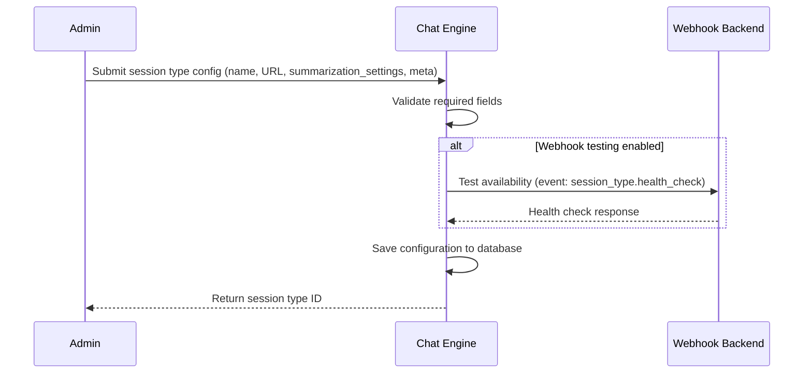

#### S2: Create Session and Send First Message

**Use Case**: `fdd-chat-engine-usecase-create-session`
**Actors**: `fdd-chat-engine-actor-client`, `fdd-chat-engine-actor-webhook-backend`

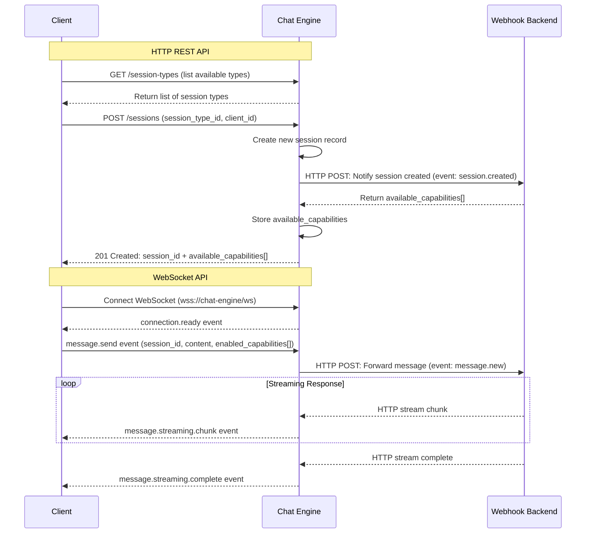

#### S3: Send Message with File Attachments

**Use Case**: `fdd-chat-engine-fr-attach-files`
**Actors**: `fdd-chat-engine-actor-client`, `fdd-chat-engine-actor-file-storage`

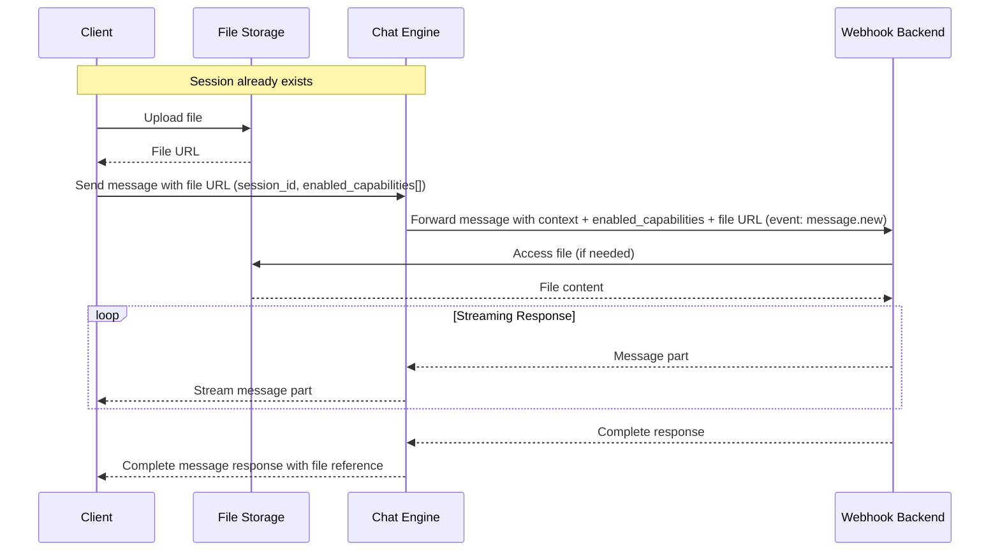

#### S4: Switch Session Type Mid-Conversation

**Use Case**: `fdd-chat-engine-fr-switch-session-type`
**Actors**: `fdd-chat-engine-actor-client`, `fdd-chat-engine-actor-webhook-backend`

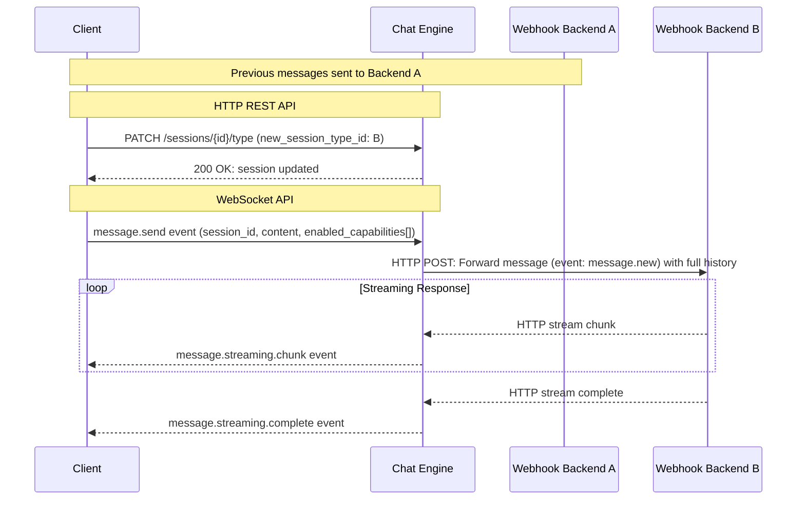

#### S5: Recreate Assistant Response (Variant Creation)

**Use Case**: `fdd-chat-engine-usecase-recreate-response`
**Actors**: `fdd-chat-engine-actor-client`, `fdd-chat-engine-actor-webhook-backend`

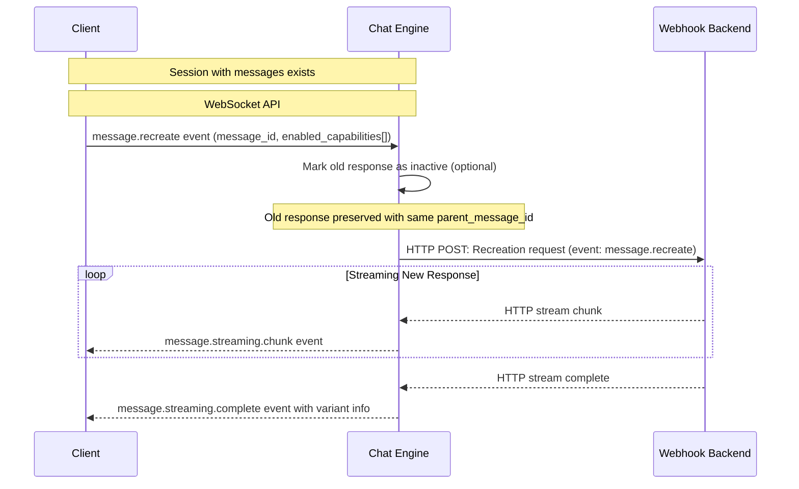

#### S6: Branch from Historical Message

**Use Case**: `fdd-chat-engine-usecase-branch-message`
**Actors**: `fdd-chat-engine-actor-client`, `fdd-chat-engine-actor-webhook-backend`

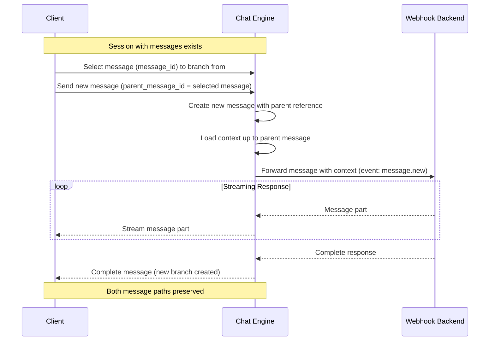

#### S7: Navigate Message Variants

**Use Case**: `fdd-chat-engine-fr-navigate-variants`
**Actors**: `fdd-chat-engine-actor-client`

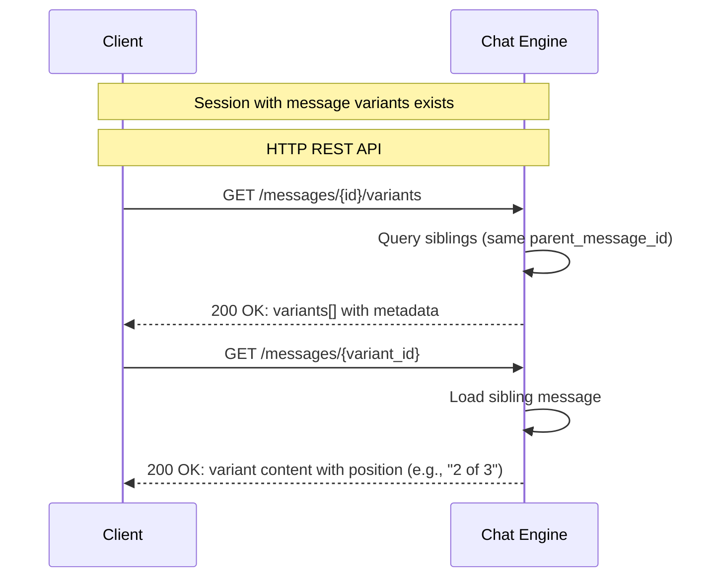

#### S8: Export Session

**Use Case**: `fdd-chat-engine-usecase-export-session`
**Actors**: `fdd-chat-engine-actor-client`

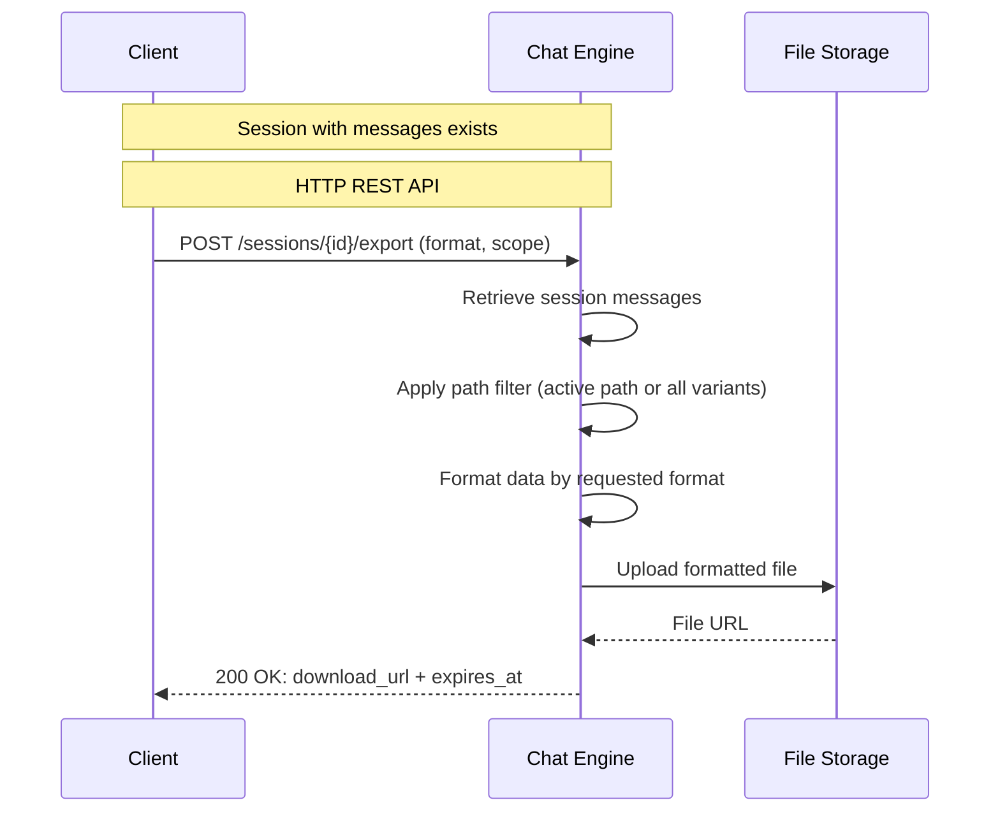

#### S9: Share Session

**Use Case**: `fdd-chat-engine-usecase-share-session`
**Actors**: `fdd-chat-engine-actor-user-a`, `fdd-chat-engine-actor-user-b`

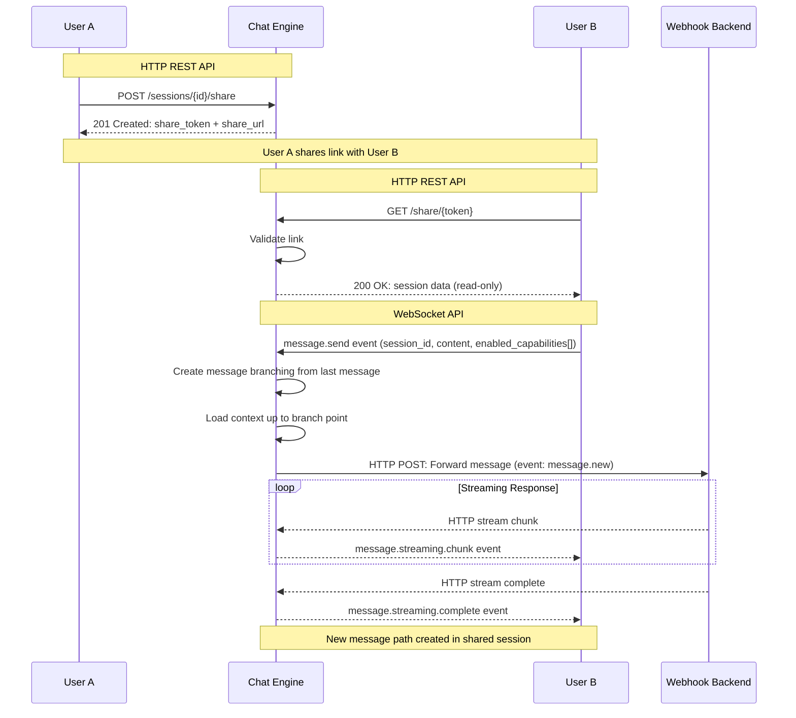

#### S10: Stop Streaming Response

**Use Case**: `fdd-chat-engine-fr-stop-streaming`
**Actors**: `fdd-chat-engine-actor-client`

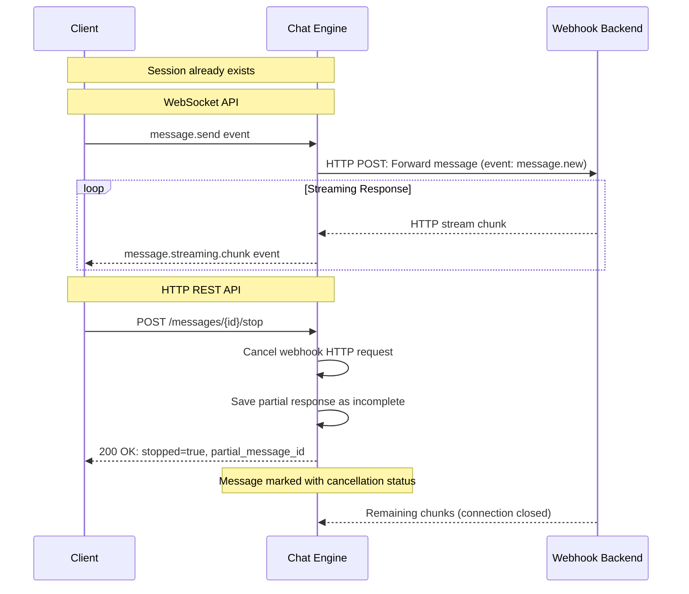

#### S11: Search Session History

**Use Case**: `fdd-chat-engine-fr-search-session`
**Actors**: `fdd-chat-engine-actor-client`

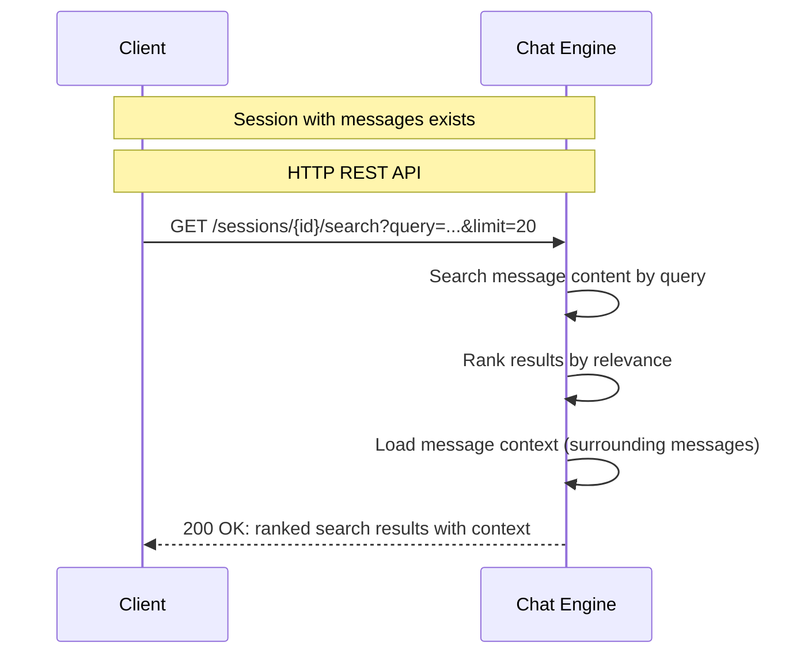

#### S12: Search Across Sessions

**Use Case**: `fdd-chat-engine-fr-search-sessions`
**Actors**: `fdd-chat-engine-actor-client`

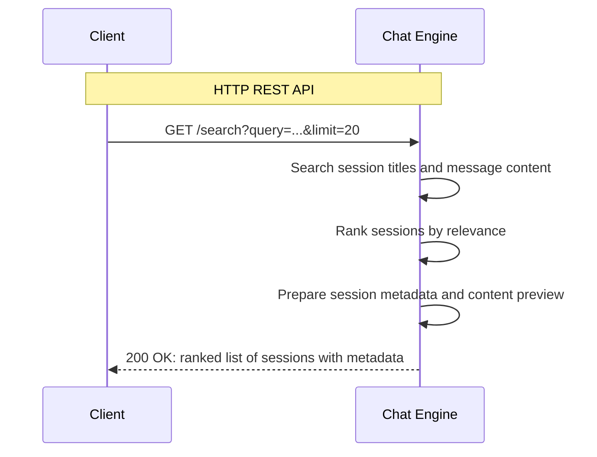

#### S13: Generate Session Summary

**Use Case**: `fdd-chat-engine-fr-session-summary`
**Actors**: `fdd-chat-engine-actor-client`, `fdd-chat-engine-actor-webhook-backend`

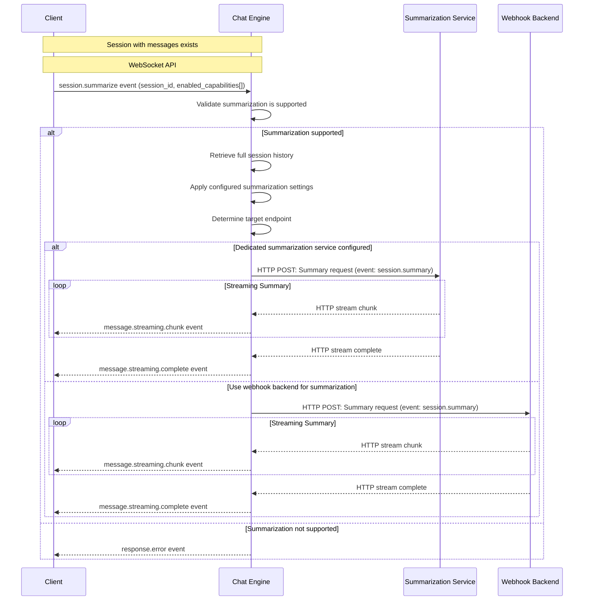

## 4. Additional Context

#### Context: Message Tree Traversal

**ID**: `fdd-chat-engine-design-context-tree-traversal`

<!-- fdd-id-content -->
**ADRs**: ADR-0001 (tree structure), ADR-0007 (branching)

Message tree traversal follows parent_message_id references. Active path is computed by following is_active = true flags from root. Full tree export requires recursive CTE queries to traverse all branches. Database indexes on parent_message_id are critical for performance.
<!-- fdd-id-content -->

#### Context: Webhook Circuit Breaker

**ID**: `fdd-chat-engine-design-context-circuit-breaker`

<!-- fdd-id-content -->
**ADRs**: ADR-0007

Circuit breaker pattern prevents cascade failures from slow/failing webhook backends. After 5 consecutive failures, circuit opens for 30 seconds (configurable). Half-open state allows single test request. Success closes circuit; failure reopens. Implemented per session_type_id.
<!-- fdd-id-content -->

#### Context: Streaming Backpressure

**ID**: `fdd-chat-engine-design-context-backpressure`

<!-- fdd-id-content -->
**ADRs**: ADR-0007

Streaming implementation uses bidirectional data streams with backpressure handling. If client is slow, Chat Engine buffers chunks in memory (up to 10MB limit). If buffer fills, webhook request is paused via HTTP/2 flow control. Client disconnect cancels webhook request immediately.
<!-- fdd-id-content -->

#### Context: Search Performance

**ID**: `fdd-chat-engine-design-context-search`

<!-- fdd-id-content -->
**ADRs**: ADR-0007

Full-text search uses PostgreSQL's tsvector with GIN indexes on message content. Search is case-insensitive with stemming (English). Ranking uses ts_rank_cd for document length normalization. Cross-session search is limited by client_id partition to prevent noisy neighbors. Pagination uses cursor-based queries (created_at + message_id) for consistency.
<!-- fdd-id-content -->

#### Context: File Storage Integration

**ID**: `fdd-chat-engine-design-context-file-storage`

<!-- fdd-id-content -->
**ADRs**: ADR-0005

Chat Engine never stores file content. Clients upload directly to file storage (S3/GCS) via presigned URLs generated by separate file service. Chat Engine only stores file URLs in messages and forwards them to webhook backends. This reduces latency and infrastructure costs. File URLs must be signed with expiration to prevent unauthorized access.
<!-- fdd-id-content -->

#### Context: Session Type Configuration Security

**ID**: `fdd-chat-engine-design-context-security`

<!-- fdd-id-content -->
Session type webhook URLs are stored in plaintext in database. Webhook backends must implement their own authentication (API keys, mutual TLS). Chat Engine does not validate webhook responses beyond HTTP status codes. Malicious webhook backends can return arbitrary content. Session type creation should be restricted to admin users only.
<!-- fdd-id-content -->
