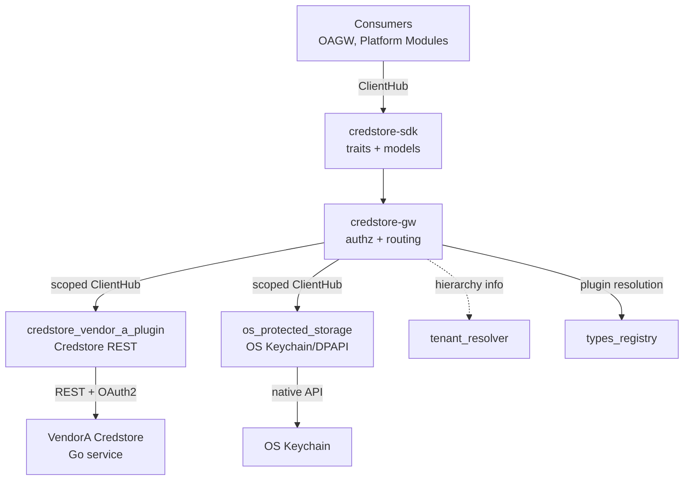
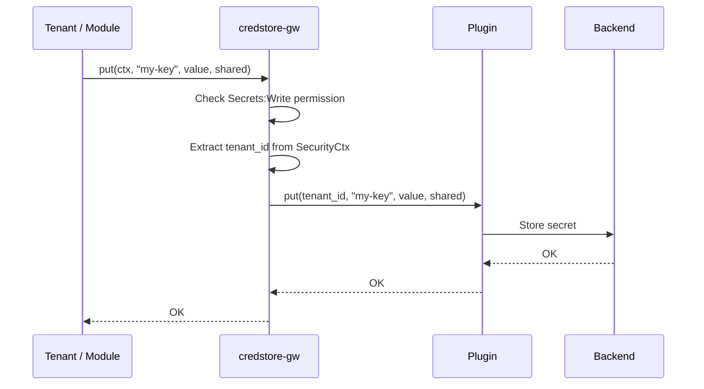
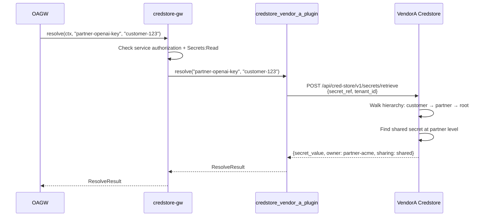
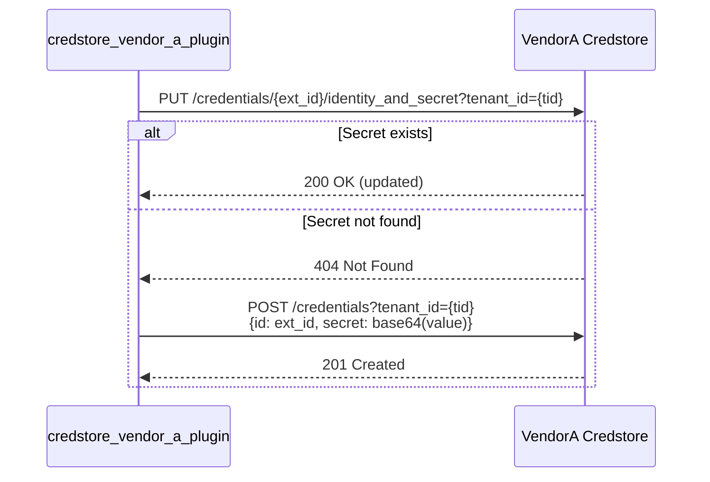
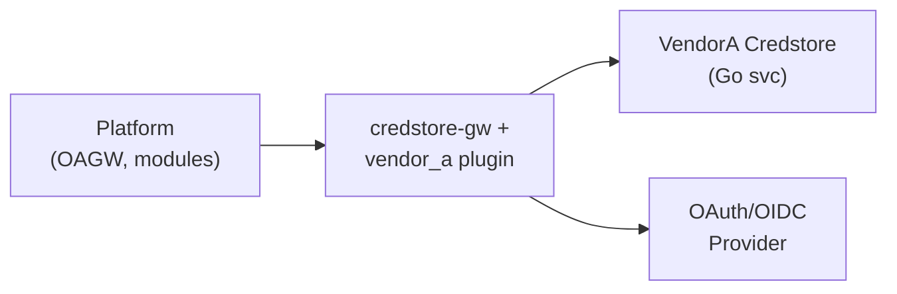
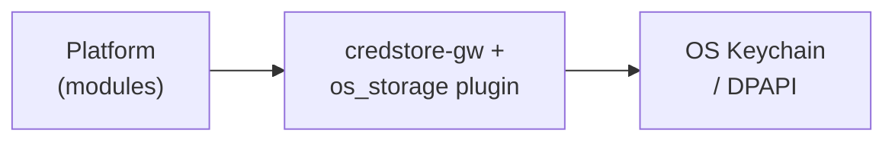

# Technical Design — CredStore

<!--
=============================================================================
TECHNICAL DESIGN DOCUMENT
=============================================================================
PURPOSE: Define HOW the system is built — architecture, components, APIs,
data models, and technical decisions that realize the requirements.

DESIGN IS PRIMARY: DESIGN defines the "what" (architecture and behavior).
ADRs record the "why" (rationale and trade-offs) for selected design
decisions; ADRs are not a parallel spec, it's a traceability artifact.

SCOPE:
  ✓ Architecture overview and vision
  ✓ Design principles and constraints
  ✓ Component model and interactions
  ✓ API contracts and interfaces
  ✓ Data models and database schemas
  ✓ Technology stack choices

NOT IN THIS DOCUMENT (see other templates):
  ✗ Requirements → PRD.md
  ✗ Detailed rationale for decisions → ADR/
  ✗ Step-by-step implementation flows → features/

STANDARDS ALIGNMENT:
  - IEEE 1016-2009 (Software Design Description)
  - IEEE 42010 (Architecture Description — viewpoints, views, concerns)
  - ISO/IEC 15288 / 12207 (Architecture & Design Definition processes)

ARCHITECTURE VIEWS (per IEEE 42010):
  - Context view: system boundaries and external actors
  - Functional view: components and their responsibilities
  - Information view: data models and flows
  - Deployment view: infrastructure topology

DESIGN LANGUAGE:
  - Be specific and clear; no fluff, bloat, or emoji
  - Reference PRD requirements using `fdd-credstore-req-{slug}` IDs
  - Reference ADR documents using `fdd-credstore-adr-{slug}` IDs
=============================================================================
-->

## 1. Architecture Overview

### 1.1 Architectural Vision

CredStore follows the ModKit Gateway + Plugins pattern (same architecture as `tenant_resolver`). A gateway module (`credstore-gw`) exposes a stable public API to platform consumers and enforces authorization policy. Backend-specific storage is implemented as plugins that register via the GTS type system and are selected at runtime by configuration.

The SDK crate (`credstore-sdk`) defines two trait boundaries: `CredStoreGatewayClient` for consumers and `CredStorePluginClient` for backend implementations. Consumers depend only on the gateway trait and never interact with plugins directly. This decoupling allows runtime backend selection without changing consumer code.

The architecture supports two access patterns: (1) tenant self-service where the tenant ID is derived from SecurityCtx, and (2) service-to-service retrieval where OAGW provides an explicit tenant_id for hierarchical resolution. Authorization is enforced exclusively in the gateway layer — plugins are pure storage adapters with no policy logic.

### 1.2 Architecture Drivers

#### Functional Drivers

| Requirement | Design Response |
|-------------|-----------------|
| `fdd-credstore-req-put-secret` | Plugin `put` with tenant_id, key, value, sharing → backend storage |
| `fdd-credstore-req-get-secret` | Plugin `get` with tenant_id, key → backend lookup |
| `fdd-credstore-req-delete-secret` | Plugin `delete` with tenant_id, key → backend removal |
| `fdd-credstore-req-tenant-scoping` | Gateway extracts tenant_id from SecurityCtx before delegating to plugin |
| `fdd-credstore-req-sharing-modes` | `sharing` field on Secret model, passed through to plugin and backend |
| `fdd-credstore-req-hierarchical-resolve` | Plugin `resolve` delegates to backend (VendorA Credstore implements walk-up natively) |
| `fdd-credstore-req-secret-shadowing` | Backend hierarchical resolution returns first match (own secret takes precedence) |
| `fdd-credstore-req-service-retrieve` | Gateway `resolve` accepts explicit tenant_id; requires service-level authorization |
| `fdd-credstore-req-authz-gateway` | Gateway checks SecurityCtx permissions before any plugin call |
| `fdd-credstore-req-os-storage` | OS protected storage plugin; `resolve` falls back to simple `get` (no hierarchy) |
| `fdd-credstore-req-rw-separation` | VendorA plugin configures separate RO/RW OAuth2 client credentials |

#### NFR Allocation

| NFR ID | NFR Summary | Allocated To | Design Response | Verification Approach |
|--------|-------------|--------------|-----------------|----------------------|
| `fdd-credstore-req-nfr-confidentiality` | Secret values never in logs | Gateway + plugins | `SecretValue` wrapper type with custom `Debug`/`Display` that redacts content; log scrubbing at transport layer | Automated log scan in integration tests |

### 1.3 Architecture Layers

```
┌─────────────────────────────────────────────────────────────┐
│                    Consumers (OAGW, modules)                │
├─────────────────────────────────────────────────────────────┤
│  credstore-sdk    │ Public API traits, models, errors       │
├─────────────────────────────────────────────────────────────┤
│  credstore-gw     │ Authorization, plugin selection, REST   │
├─────────────────────────────────────────────────────────────┤
│  Plugins          │ Backend-specific storage adapters        │
│  ┌──────────────────────┐  ┌──────────────────────────────┐ │
│  │ credstore_vendor_a    │  │ os_protected_storage (P2)    │ │
│  │ (Credstore REST)     │  │ (macOS Keychain / Win DPAPI) │ │
│  └──────────────────────┘  └──────────────────────────────┘ │
├─────────────────────────────────────────────────────────────┤
│  External          │ VendorA Credstore, OS keychain         │
└─────────────────────────────────────────────────────────────┘
```

| Layer | Responsibility | Technology |
|-------|---------------|------------|
| SDK | Public and plugin trait definitions, models, errors | Rust crate (`credstore-sdk`) |
| Gateway | Authorization enforcement, plugin resolution, REST API | Rust crate (`credstore-gw`), Axum |
| Plugins | Backend-specific secret storage operations | Rust crates, HTTP client / OS APIs |
| External | Secret persistence and encryption | VendorA Credstore (Go), OS keychain |

## 2. Principles & Constraints

### 2.1 Design Principles

#### Authorization in Gateway

- [ ] `p1` - **ID**: `fdd-credstore-design-authz-gateway`

Authorization is enforced exclusively in the gateway. Plugins are "storage adapters" and MUST NOT implement authorization or policy decisions. This prevents inconsistent behavior across backends.

#### Stateless Key Mapping

- [ ] `p1` - **ID**: `fdd-credstore-design-stateless-mapping`

The VendorA Credstore plugin uses a deterministic, stateless mapping from `(tenant_id, key)` to Credstore ExternalID. No local mapping database is required. This simplifies operations and eliminates a failure mode.

#### Tenant from SecurityCtx

- [ ] `p1` - **ID**: `fdd-credstore-design-tenant-from-ctx`

For self-service operations, the tenant is always derived from `SecurityCtx.tenant_id()`. This reduces API surface, prevents misuse, and aligns with existing platform patterns (consistent with `tenant_resolver`).

### 2.2 Constraints

#### OAuth2 for Credstore

- [ ] `p1` - **ID**: `fdd-credstore-design-oauth2`

All Credstore REST calls require OAuth2 client credentials authentication. Token acquisition and caching are handled by a shared `oauth_token_provider` component.

#### No Secret Logging

- [ ] `p1` - **ID**: `fdd-credstore-design-no-secret-logging`

Secret values MUST NOT appear in any log output, error messages, or debug traces. The `SecretValue` type implements `Debug` and `Display` with redacted output.

## 3. Technical Architecture

### 3.1 Domain Model

**Technology**: Rust structs

**Core Entities**:

| Entity | Description |
|--------|-------------|
| `SecretRef` | Human-readable key identifying a secret (e.g., `partner-openai-key`) |
| `SecretValue` | Opaque byte wrapper for decrypted secret data. Custom `Debug`/`Display` that redacts content. |
| `SharingMode` | Enum: `Private` (default), `Shared` |
| `ResolveResult` | Result of hierarchical resolution: secret_value, owner_tenant_id, sharing, metadata |

**Relationships**:
- A Secret belongs to exactly one Tenant (via `tenant_id`)
- A `SecretRef` is unique within a tenant's namespace (`tenant_id` + `reference` is unique)
- `ResolveResult` references the owning tenant (which may differ from the requesting tenant)

### 3.2 Component Model



**Components**:

| Component | Responsibility | Interface |
|-----------|---------------|-----------|
| `credstore-sdk` | Trait definitions, models, error types | `CredStoreGatewayClient`, `CredStorePluginClient` |
| `credstore-gw` | Authorization, plugin selection, REST endpoints | Axum routes, ClientHub registration |
| `credstore_vendor_a_plugin` | VendorA Credstore REST integration | HTTP client, ExternalID mapping |
| `os_protected_storage` | OS keychain integration (P2) | Platform-native secure storage APIs |

**Interactions**:
- Consumer → Gateway: via `CredStoreGatewayClient` trait through ClientHub
- Gateway → Plugin: via `CredStorePluginClient` trait through scoped ClientHub (GTS instance ID)
- VendorA Plugin → Credstore: HTTP REST with OAuth2 bearer token
- VendorA Plugin → OAuth provider: token acquisition and caching
- Gateway → tenant_resolver: hierarchy queries for resolve operations (if needed)

### 3.3 API Contracts

**Technology**: REST/OpenAPI + Rust traits (ClientHub)

#### ClientHub API (in-process)

`CredStoreGatewayClient` trait:

| Method | Signature | Description |
|--------|-----------|-------------|
| `get` | `(ctx: &SecurityCtx, key: &SecretRef) → Result<Option<SecretValue>>` | Retrieve own secret |
| `put` | `(ctx: &SecurityCtx, key: &SecretRef, value: SecretValue, sharing: SharingMode) → Result<()>` | Create or update secret |
| `delete` | `(ctx: &SecurityCtx, key: &SecretRef) → Result<()>` | Delete own secret |
| `resolve` | `(ctx: &SecurityCtx, key: &SecretRef, tenant_id: TenantId) → Result<Option<ResolveResult>>` | Hierarchical resolution (service-to-service) |

`CredStorePluginClient` trait:

| Method | Signature | Description |
|--------|-----------|-------------|
| `get` | `(tenant_id: &TenantId, key: &SecretRef) → Result<Option<SecretValue>>` | Get secret from backend |
| `put` | `(tenant_id: &TenantId, key: &SecretRef, value: SecretValue, sharing: SharingMode) → Result<()>` | Store secret in backend |
| `delete` | `(tenant_id: &TenantId, key: &SecretRef) → Result<()>` | Delete secret from backend |
| `resolve` | `(key: &SecretRef, tenant_id: &TenantId) → Result<Option<ResolveResult>>` | Hierarchical resolution (backend-native) |

Note: Plugin `resolve` — plugins without hierarchy support fall back to simple `get` and return `sharing: Private` with `owner_tenant_id` equal to the requested `tenant_id`.

#### REST API

| Method | Path | Description | Stability |
|--------|------|-------------|-----------|
| `POST` | `/api/credstore/v1/secrets` | Create secret | stable |
| `PUT` | `/api/credstore/v1/secrets/{ref}` | Update secret value and/or sharing mode | stable |
| `GET` | `/api/credstore/v1/secrets/{ref}` | Get own secret value | stable |
| `DELETE` | `/api/credstore/v1/secrets/{ref}` | Delete own secret | stable |
| `POST` | `/api/credstore/v1/secrets/resolve` | Hierarchical resolve (service-to-service) | stable |

**Create Secret Request:**
```json
{
  "reference": "partner-openai-key",
  "value": "sk-proj-xyz789...",
  "sharing": "private"
}
```

**Resolve Request:**
```json
{
  "secret_ref": "partner-openai-key",
  "tenant_id": "customer-123"
}
```

**Resolve Response (200 OK):**
```json
{
  "secret_value": "sk-proj-abc123...",
  "owner_tenant_id": "partner-acme",
  "sharing": "shared",
  "metadata": {
    "created_at": "2026-02-04T10:00:00Z"
  }
}
```

**Error Responses:**

| Status | Error Type | Scenario |
|--------|-----------|----------|
| 401 | Unauthorized | Invalid or missing token |
| 403 | AccessDenied | Insufficient permissions; or secret exists but is private (not shared) |
| 404 | NotFound | Secret reference not found (own or in hierarchy) |
| 409 | Conflict | Secret with this reference already exists (create-only endpoint) |
| 500 | InternalError | Backend or encryption errors |

### 3.4 External Interfaces & Protocols

#### VendorA Credstore REST API

- [ ] `p1` - **ID**: `fdd-credstore-design-interface-vendor_a-rest`

**Type**: External System

**Direction**: outbound

**Data Format**: JSON over HTTP/REST

**Authentication**: OAuth2 client credentials (token acquired via shared `oauth_token_provider`)

**Endpoints used:**

| Operation | Credstore Endpoint | Notes |
|-----------|-------------------|-------|
| Read | `GET /credentials/{external_id}?tenant_id={tid}&include_secret=true` | 404 → `None` |
| Write (update) | `PUT /credentials/{external_id}/identity_and_secret?tenant_id={tid}` | If 404, fall through to create |
| Write (create) | `POST /credentials?tenant_id={tid}` | Body includes `id=external_id`, `secret=<base64>` |
| Delete | `DELETE /credentials/{external_id}?tenant_id={tid}` | |
| Resolve | `POST /api/cred-store/v1/secrets/retrieve` | Hierarchical lookup (Credstore-native) |

**ExternalID Mapping:**
```
raw     = "{tenant_id}:{key}"
escaped = base64url_no_pad(raw)
external_id = "{escaped}@secret"
```

This deterministic, stateless mapping avoids maintaining a local mapping database and achieves idempotent operations.

**Compatibility**: Plugin adapts to Credstore API version. ExternalID format must remain stable across versions to avoid breaking lookups.

### 3.5 Sequences & Interactions

#### Self-Service CRUD (put example)



#### Hierarchical Resolve (OAGW)



#### Write Flow (VendorA Credstore — upsert)



**Key Flows**: Reference use cases from PRD:
- `fdd-credstore-uc-create-shared` → Self-Service CRUD
- `fdd-credstore-uc-hierarchical-resolve` → Hierarchical Resolve
- `fdd-credstore-uc-shadowing` → Hierarchical Resolve (own secret found first)
- `fdd-credstore-uc-private-denied` → Hierarchical Resolve (403/404 response)
- `fdd-credstore-uc-crud` → Self-Service CRUD

### 3.6 Database Schema

No local database. Secrets are persisted in the external backend (VendorA Credstore or OS keychain). The gateway and plugins are stateless.

**VendorA Credstore stores** (managed by Credstore, not by us):

| Field | Type | Description |
|-------|------|-------------|
| `id` | UUID | Credstore internal ID |
| `external_id` | string | Our deterministic ExternalID (`base64url({tenant}:{key})@secret`) |
| `tenant_id` | string | Owning tenant |
| `secret` | bytes (encrypted) | Encrypted secret value |
| `sharing` | enum | `private` or `shared` |
| `created_at` | timestamp | Creation time |

### 3.7 Deployment Topology

**Kubernetes Environment:**



**Desktop/VM Environment (P2):**



### 3.8 Technology Stack

| Layer | Technology | Rationale |
|-------|------------|-----------|
| Gateway | Axum (REST), ModKit module macro | Platform standard for HTTP services |
| VendorA Plugin | `modkit-http` (`HttpClient`) | Platform-standard HTTP client with OAuth2 support |
| OAuth2 | Shared `oauth_token_provider` component | Centralized token acquisition and caching |
| OS Plugin (P2) | `keyring` crate or platform-native FFI | Cross-platform OS keychain access |
| Serialization | `serde` | Platform standard |
| Errors | `thiserror` | Platform standard |

## 4. Additional context

### Plugin Registration

Following the ModKit plugin pattern (as documented in `docs/MODKIT_PLUGINS.md` and exemplified by `tenant_resolver`):

1. `credstore-gw` registers the plugin GTS schema during init
2. Each plugin registers its GTS instance and scoped `CredStorePluginClient` in ClientHub
3. Gateway resolves the active plugin via GTS instance query and vendor configuration

**GTS Types:**
- Schema: `gts.x.core.modkit.plugin.v1~credstore.plugin.v1~`
- VendorA instance: `gts.x.core.modkit.plugin.v1~credstore.plugin.v1~vendor_a.app._.plugin.v1`
- OS storage instance: `gts.x.core.modkit.plugin.v1~credstore.plugin.v1~os_protected.app._.plugin.v1`

### Configuration

**Gateway:**
```yaml
modules:
  credstore:
    vendor: "vendor_a"  # Selects plugin by matching vendor
```

**VendorA Plugin:**
```yaml
modules:
  credstore_vendor_a_plugin:
    vendor: "vendor_a"
    priority: 100
    base_url: "https://credstore.internal.example.com"
    client_id: "credstore-client"
    client_secret: "${CREDSTORE_CLIENT_SECRET}"
    # Optional: separate RO/RW credentials
    # ro_client_id: "credstore-ro"
    # ro_client_secret: "${CREDSTORE_RO_SECRET}"
    scopes: ["credstore"]
    timeout_ms: 5000
    retry_count: 3
```

### Error Mapping

| Backend Response | Plugin Error | Gateway/Consumer Error |
|-----------------|-------------|----------------------|
| Credstore 404 | `None` | `NotFound` |
| Credstore 401/403 | `PermissionError` | `Internal` (credentials misconfigured) |
| Credstore 5xx | `BackendError` (retryable) | `Internal` |
| Credstore timeout | `BackendError` (retryable) | `Internal` |
| OS keychain item not found | `None` | `NotFound` |
| OS keychain access denied | `PermissionError` | `Internal` |

## 5. Traceability

- **PRD**: [PRD.md](./PRD.md)
- **ADRs**: [ADR/](./ADR/)
- **Features**: [features/](./features/)
