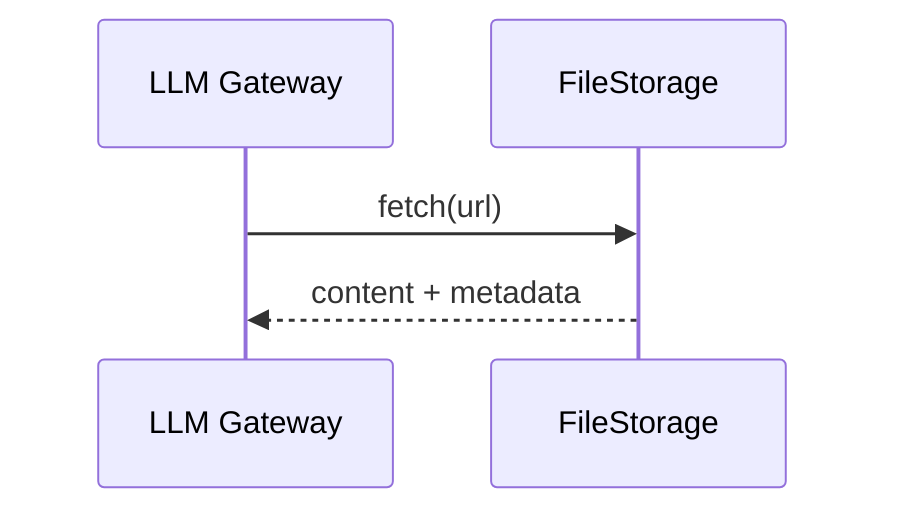
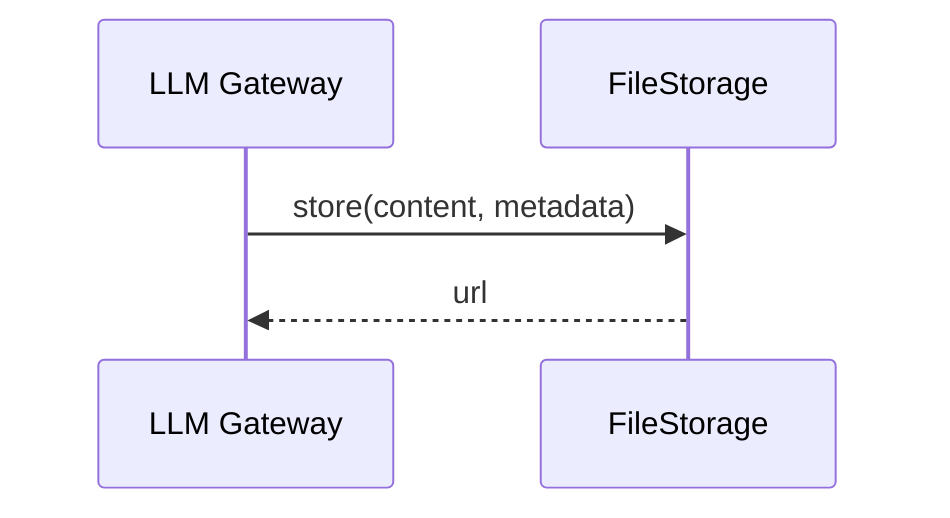
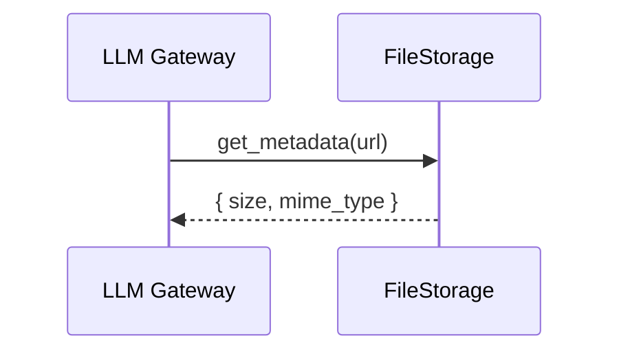

# FileStorage — PRD (LLM Gateway Scope)

Media storage for LLM Gateway inputs and outputs.

## Scenarios

### S1 Fetch Media by URL

LLM Gateway fetches uploaded media (images, audio, video, documents) before sending to provider.

### S2 Store Generated Content

LLM Gateway stores generated media (images, audio, video) and returns URL to consumer.

### S3 Get Metadata

LLM Gateway checks file size before processing.

## Errors

| Error | HTTP | Description |
|-------|------|-------------|
| `file_not_found` | 404 | File does not exist |
| `file_too_large` | 413 | File exceeds size limit |
| `storage_unavailable` | 503 | Service unavailable |
