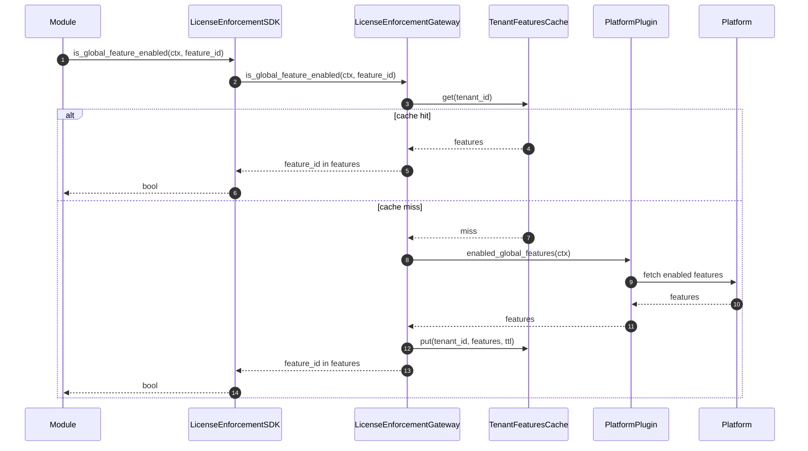
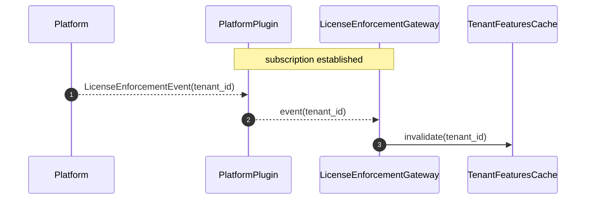

# Design document for phase 1 of license enforcement

This document describes the technical design of license enforcement in scope of phase 1. For general context, see [Design document](./DESIGN.md).

## General information

### What is the License Enforcer module?

The License Enforcer module is HyperSpot’s **central feature-gating component**. It allows other modules to ask “is tenant X allowed to use feature Y?” without embedding any Platform-specific licensing logic in those modules.

### What is “phase 1” in this document?

Phase 1 provides the minimal functionality needed for feature gating:

- **Tenant-scoped**: license checks are performed in the tenant scope provided by `SecurityCtx`.
- **Read-only checks**: the module answers whether a feature is enabled; it does not manage subscriptions.
- **Global feature set**: the gateway can list “enabled global features” for a tenant and test membership.
- **Best-effort freshness**: gateway uses a cache with a configurable TTL and event-driven invalidation (phase 2 candidate).

### Plugin architecture for this module

This module is designed around the ModKit **Gateway + Plugin** pattern:

- **SDK / public API**: `LicenseEnforcementClient` is what other modules call (registered unscoped in ClientHub by the gateway).
- **Gateway**: performs caching and delegates Platform calls to a selected plugin.
- **Platform plugin(s)**: implement `LicenseEnforcementPlugin` and encapsulate the Platform-specific API calls and (optionally) event subscriptions.

In deployments with multiple licensing backends, multiple plugins can coexist and the gateway selects the plugin based on configuration and/or context.

## License enforcement

In phase 1, we just need to check whether a tenant has access to certain features.

#### SDK interface

The SDK should provide methods:

```rust,ignore
trait LicenseEnforcementClient {
    async fn is_global_feature_enabled(&self, ctx: &SecurityCtx, feature_id: &LicenseFeatureID) -> Result<bool>;

    async fn enabled_global_features(&self, ctx: &SecurityCtx) -> Result<Set<LicenseFeatureID>>
}
```

> Note: Security context contains information about tenant scope

> Note: There is no need to implement pagination for `enabled_global_features`.

#### Gateway technical design

Gateway maintains a cache of features available for each tenant. The TTL of cache entries should be configurable.

- Tenant IDs serve as cache keys, and values are sets of available global features.

- On a cache miss, the gateway uses the plugin client to request a list of available global features from the platform and puts them into the cache.

- (phase 2 candidate) Gateway subscribes to platform change events through the plugin and invalidates the cache record for the tenant when an event is received.





> In addition to possible shared cache, gateway itself does not need any persistent DB storage.

#### Plugin interface

The plugin is responsible for interacting with a specific Platform.

The plugin provides the following methods:

```rust,restignore
pub trait LicenseEnforcementPlugin {
    async fn enabled_global_features(&self, ctx: &SecurityCtx) -> Result<Set<LicenseFeatureID>>
    fn subscribe(&self) -> Subscription<'static, LicenseEnforcementEvent> // phase 2 candidate
}

pub struct Subscription {
    stream: BoxStream<'static, LicenseEnforcementEvent>,
    cancel: CancellationToken
}

pub struct LicenseEnforcementEvent {
    tenant_id: TenantId,
    event_time: time::OffsetDateTime
}
```

> Note: Security context contains information about tenant scope.

> Note: There is no need to implement pagination for `enabled_global_features`.

> Depending on the platform event system, the plugin might maintain a table in persistent storage to track offsets in the platform event queue.

## Quotas

Quota restriction is out of scope for phase 1. We do not restrict the usage of resources by tenants.