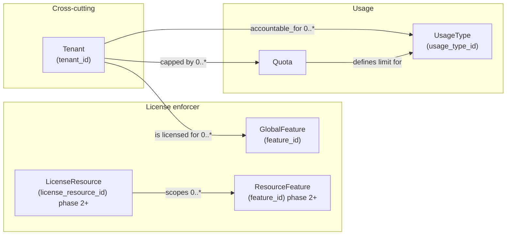

# Licensing, usage, quotas

This document describes how Hyperspot’s `license enforcement` should think about licensing in a way that maps to the **platform it integrates with** (named Platform below).

This document describes a few concerns related to how customers are charged: 

- License enforcement

- Quota enforcement

- Usage reporting

`license_enforcer` module handles the first concern, while the two latter concerns should belong to `usage_module`. However, this document discusses the full picture.

## Problem statement

A system operator might want to:

- restrict access to features based on purchased subscription/offering (trial/paid);
- provide different sets of features to different users of given tenant (for example, basic seats, premium seats);
- charge tenants based on usage (tokens, premium requests, chats) and/or licensed resources (seats/users);
- enforce caps per tenant / per user / per chat;
- provide auditable explanations (reports) for what a tenant is charged for.

## What Hyperspot should (and should not) do

Hyperspot should **not** implement licensing/charging logic itself.

Instead Hyperspot should:

- ask Platform **what is enabled** (features)
- ask Platform **what is allowed** (quota/usage)
- **report usage** to Platform in the shape expected by the configured usage types

## Implementation phases

### Phase 1

Main concerns: license enforcement (what is enabled), basic usage reporting

- Modules should be able to enable/disable certain functionality depending on what is offered to tenants

- Modules should be able to report basic usage types scoped to tenants: number of seats in organization, total token consumption by token. 

More granular usage (per user) is out-of-scope of this epic.

Technical design for phase 1 is specified in (Phase 1 design document)[./DESIGN-phase1.md]

### Phase 2+

> BLOCKER DEPENDENCY: requirements required

Main concerns might be: 

- More granular license enforcement (e.g. what is enabled for particular user)

- More granular usage reporting (e.g. what is consumed by particular user)

- Quota restrictions

## Licensing/usage/quotas domain model

Licensing domain model is based on:

- **Feature**: `feature_id` (can be mapped to/from GTS ID)
  - **global (tenant) features** (feature set scoped to specific tenant)
  - **resource features** (feature set can depend on resource and acquired license policies)

**Features** allow the following interactions:

- Platform provides **features**
- HyperSpot (application) checks **features**.

> Example of feature id in HyperSpot: `gts.x.core.lic.feat.v1~a.b.c.d.v1`
On platform-side feature id might be something different. Plugin should be able to map feature ids from Platform to HyperSpot and vice versa.

**Offering**: commercial package that provides features and is associated with one or more **usage types** is NOT part of HyperSpot license enforcer domain model. HyperSpot should decouple features, and usages/quotas

> **Offering** concept does not belong to HyperSpot.

- **Usage type**: what is metered (e.g., `tokens`, `requests`, `storage`, `seats`, …)
- **Quota / usage / overage**:

**Usages** and **quotas** are involved in the following interactions:

- HyperSpot requests information about current usages and quotas from Platform. 
- HyperSpot reports usages

**License Resource** - (not required until phase 2) smaller scope for licensing features and usage tracking.

**License resources** are involved in the following interactions:
 
- Platform provides **features** scoped to given **resource**
- HyperSpot can create **license resource**
- HyperSpot can report usage to **usage item** scoped to given **resource**.
- HyperSpot can request certain set of features for given **license resource** and tenant.

### Domain model diagram

