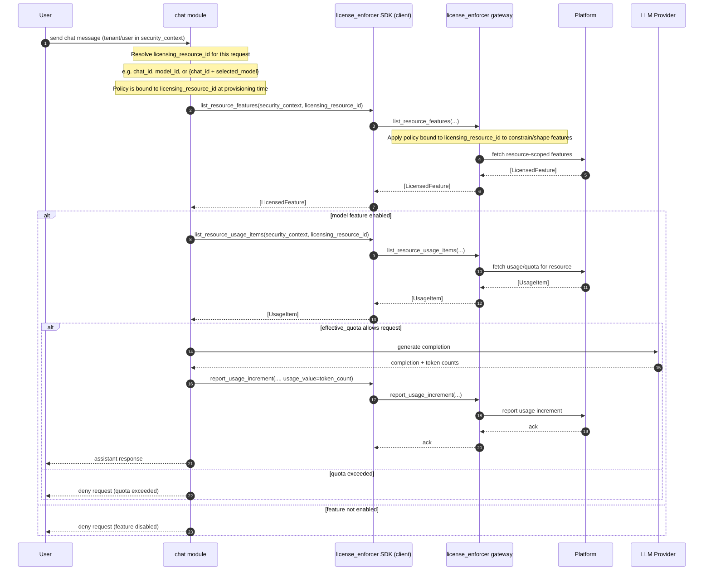
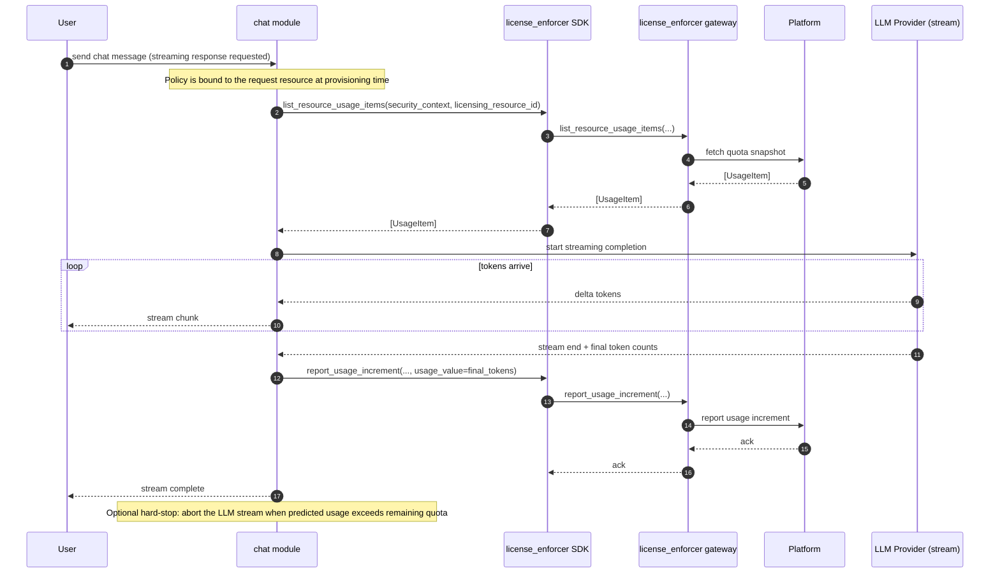
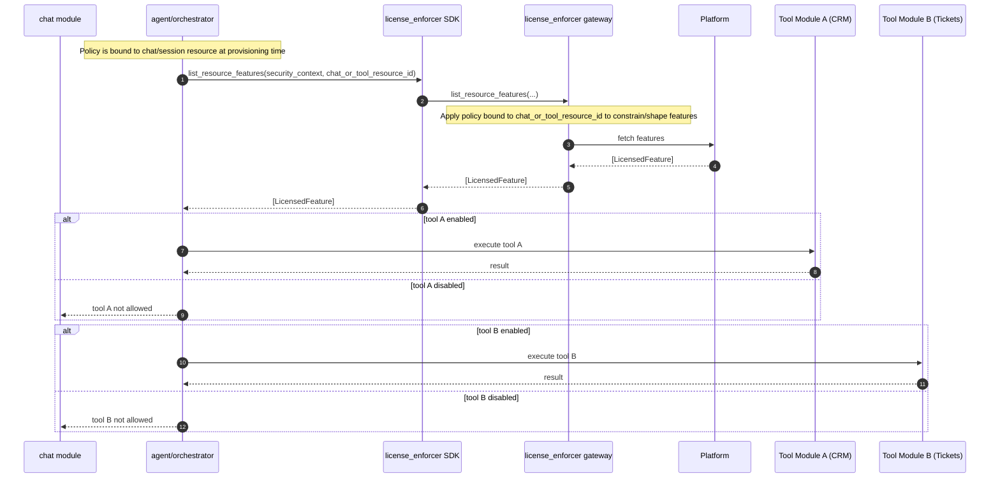
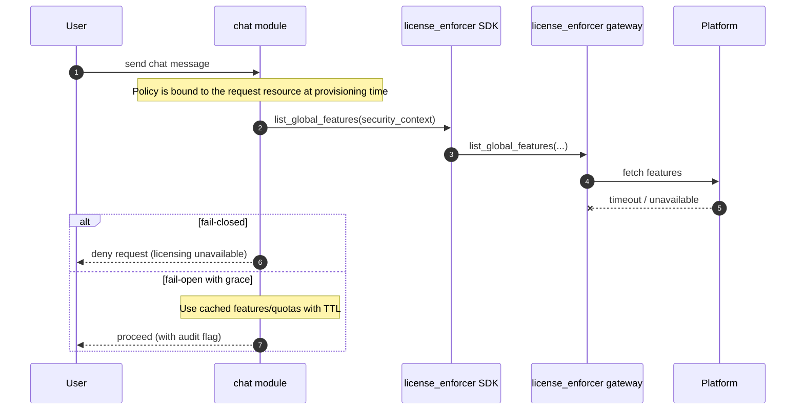
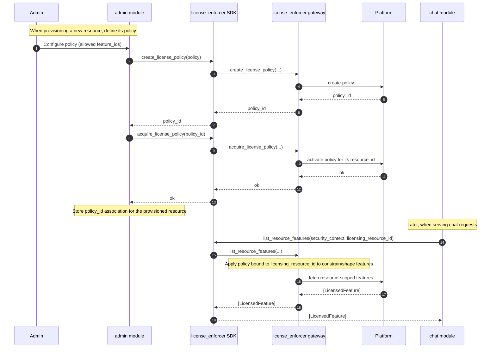
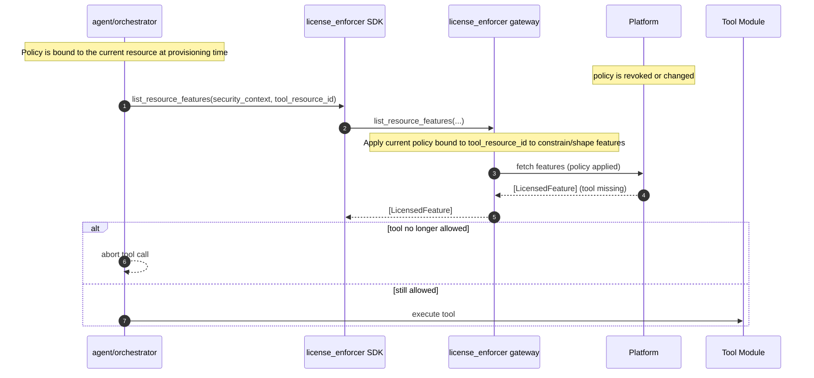
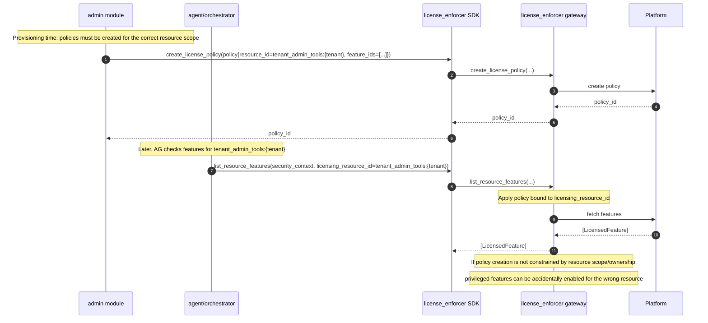

# Licensing, usage, quotas

This document describes how Hyperspot’s `license_enforcer` module should think about licensing in a way that maps to the **platform it integrates with** (named Platform below).

## Problem statement

A system operator might want to:

- restrict access to features based on purchased subscription/offering (trial/paid)
- provide different sets of features to different users of given tenant (for example, basic seats, premium seats)
- charge tenants based on usage (tokens, premium requests, chats) and/or licensed resources (seats/users)
- enforce caps per tenant / per user / per chat
- provide auditable explanations (reports) for what a tenant is charged for

## What Hyperspot should (and should not) do

Hyperspot should **not** implement licensing/charging logic itself.

Instead Hyperspot should:

- ask Platform **what is enabled** (features)
- ask Platform **what is allowed** (quota/usage)
- **report usage** to Platform in the shape expected by the configured usage types

## Licensing/usage/quotas domain model

Licensing domain model is based on:

- **Feature**: `feature_id` (can be mapped to/from GTS ID)
  - **global (tenant) features** (feature set scoped to specific tenant)
  - **resource features** (feature set can depend on which offering item is licensed on a resource)

**Features** allow the following interactions:

- Platform provides **features**
- HyperSpot (application) checks **features**.

**Offering**: commercial package that provides features and is associated with one or more **usage types** is NOT part of HyperSpot license enforcer domain model. HyperSpot decouples features, and usages/quotas

- **Usage type**: what is metered (e.g., `tokens`, `requests`, `storage`, `seats`, …)
- **Quota / usage / overage**:
  - `effective_quota` is the effective limit

> Hyperspot should **not assume usage is strictly monotonic**: some usage types might be counters (requests), but some are gauges/snapshots (for example, file storage)

**Usages** and **quotas** are involved in the following interactions:

- HyperSpot requests information about current usages and quotas from Platform. 
- HyperSpot reports usages

**Licensing resource** - resource for which license should be acquired.

**Licensing resources** are involved in the following interactions:
 
- Platform provides **features** scoped to given **resource**
- Platform provides usage and quota scoped to given **resource**
- HyperSpot can acquire license for **resource**
- HyperSpot can release license for **resource**
- HyperSpot can report usage to **usage item** scoped to given **resource**.

**License policies** - policies tell which **license features** should be enabled for given resource.
 
Policies are involved in the following interactions:
 
- HyperSpot creates/updates **license policy** for a resource during provisioning
- HyperSpot acquires (activates) **license policy** for a resource during provisioning
- HyperSpot releases (revokes) **license policy** when the resource is deleted or policy is revoked

## Features

We need two checks (plugin API), which map to Account Server:

1. `list_global_features(security_context) -> [LicensedFeature]`
2. `list_resource_features(security_context, licensing_resource_id) -> [LicensedFeature]`

 Notes:

- `security_context` must identify the **tenant** (and optionally user) we’re evaluating.
- Resource-level checks are needed for cases like “which features(LLM models/tools) are enabled for this user/session/chat resource”.

## Quotas and usages

We need:

1. `list_global_usage_items(security_context) -> [UsageItem]`
2. `list_resource_usage_items(security_context, licensing_resource_id) -> [UsageItem]`
3. `report_usage(security_context, usage_item_id, usage_value)`
4. `report_usage_increment(security_context, usage_item_id, usage_value)`

Usage item includes:
- Scope (tenant, licensing_resource_id)
- Usage ID - GTS ID
- Type of usage (gauge, counter) 
- Additional platform-specific attributes
- Optional quota (float number)
- Current value (float number)

> For API ergonomics it might be helpful to introduce batch `report_usage_batch` method (phase 2).

> Gateway is integration layer responsible for how to map hyperspot usage item ids to Platform usage types or offerings.

> It might happen that Platform does not have any quotas per resource. For, example quotas might be per offering and/or per tenant.

## Managing license resources (phase 2) and policies

To manage license resources plugin should provide the following methods:

1. `acquire_license_resource(resource_id)`
2. `release_license_resource(resource_id)`
3. `get_resource(resource_id) -> Resource`

1. `create_license_policy(policy)`
2. `release_license_policy(policy_id)`
3. `acquire_license_policy(policy_id)`
4. `get_policy()->Policy`

`resource_id` is GTS ID including type of resource, `policy_id` is also GTS ID.

Policy domain model includes:
- resource_id
- list of features_ids
- state

> For API ergonomics it might be helpful to introduce batch methods to acquire and release license resources.

## Components

- Platform (not part of HyperSpot) - responsible for associating features, usages, licenses.
- License enforcer gateway (swappable module) - module responsible for integration with Platform and mapping HyperSpot license model to/from Platform license model. 
- Plugin SDK - stable API available for other modules to delegate license-related concerns. 

## Edge cases, fault-tolerance, 

 It is possible that platform does not have any transactional mechanism on API level (reserve usage and commit).

 It is responsibility of gateway to:

 - Cache usages, features, quotas and invalidate caches
 - Retry usage reporting when usage report fail
 - Prevent race conditions 

 Additional notes:
 
 - Usage reporting retry requires an idempotency key (usage event id), otherwise retries can cause over-billing.
 - If the gateway buffers usage increments (during outage), it must define ordering and deduplication rules.
 - Policy creation/update should be safe under retries (idempotent) and must define cache invalidation behavior.
 - Policy lifecycle semantics need to be defined (when a policy becomes effective for a resource, and what happens on revoke).

 > Assumption: platform usage items are not shared between applications. Otherwise, preventing race conditions
 might not be possible on application level.

## Examples

### Example 1: Single chat message with model gating + post-hoc usage reporting

Scenario: A user in a tenant sends a chat message. HyperSpot needs to:

- check whether the tenant/user can use the requested LLM model (resource features)
- check whether the tenant/user has remaining quota for this usage type
- call the LLM provider
- report measured usage after completion (tokens billed, requests, etc.)



 Notes:

- For LLM chat, the billable usage often becomes known only after the LLM provider returns token counts, so the natural operation is `report_usage_increment(...)`.
- **Limitation:** If the quota is near the limit, post-hoc reporting can overshoot (race conditions across instances). The design does not yet define a reservation / pre-authorization mechanism.
- **Limitation:** Without atomic “check+consume”, two instances can each see both quotas as available and overspend.

---

### Example 2: Streaming response with mid-stream enforcement

Scenario: The assistant response is streamed. HyperSpot may need to stop streaming when a quota is reached.



 Notes:

- **Limitation:** The current model has `list_*_usage_items` and `report_usage_increment`, but it does not define:
  - how to enforce during streaming (prediction vs reservation)
  - whether partial streams should be billed
  - what happens if reporting fails after the user already received the streamed output
- For enterprise enforcement, you typically need one of:
  - **reservation/commit** (`reserve_usage` then `commit_usage` / `release_reservation`)
  - **idempotent reporting** with a request id and server-side de-duplication
 - **Limitation:** If the gateway retries usage increments during outage, retries must be idempotent and bounded, otherwise backlog replay can cause over-billing or thundering herd.

---

### Example 3: Tool calling / agentic flows (multiple modules need feature checks)

Scenario: The chat agent decides to call enterprise tools (e.g., CRM search, ticket creation). Each tool is a separately licensed feature.



 Notes:

- **Limitation:** The design does not specify how feature IDs should be composed for “tool execution” vs “tool visibility” vs “tool data access”. In practice, enterprises often require multiple gates:
  - can see tool
  - can invoke tool
  - can access a specific external system connection (per-connection licensing_resource_id)

---

### Example 4: Seat-based licensing as licensed resources (phase 2)

 Scenario: The tenant has a limited number of “premium seats”. Each assigned seat is a licensed resource bound to a user.

 ```mermaid
 sequenceDiagram
     autonumber
     participant A as Admin
     participant UM as user management module
     participant LE as license_enforcer SDK
     participant LEG as license_enforcer gateway
     participant P as Platform

     A->>UM: assign premium seat to user
     Note over UM: resource_id identifies the seat allocation
     Note over UM: e.g. seat:{tenant_id}:{user_id}

     UM->>LE: acquire_license_resource(resource_id)
     LE->>LEG: acquire_license_resource(...)
     LEG->>P: acquire

     alt seat acquired
         P-->>LEG: ok
         LEG-->>LE: ok
         LE-->>UM: ok
         UM->>UM: apply entitlement change
         UM-->>A: success
     else no seats available / denied
         P-->>LEG: denied
         LEG-->>LE: denied
         LE-->>UM: denied
         UM-->>A: reject change (no seats available)
     end

     opt seat revocation
         A->>UM: remove premium seat from user
         UM->>UM: remove entitlement
         UM->>LE: release_license_resource(resource_id)
         LE->>LEG: release_license_resource(...)
         LEG->>P: release
         P-->>LEG: ok
         LEG-->>LE: ok
         LE-->>UM: ok
     end
 ```

 Notes:

 - **Limitation:** This flow needs explicit semantics for:
   - idempotency and safe retry semantics for acquire/release (to avoid double-acquire or double-release)
   - leases/TTLs and cleanup (crashes can leak acquired seats)
   - consistency between seat allocation and entitlement changes (if entitlement update fails after acquire, you need compensating release; if release fails after entitlement removal, you may leak seats)
 - **Limitation:** The design does not define the canonical `resource_id` scheme for seat allocations.

---

### Example 5: Platform outage / degraded mode (policy decision)

Scenario: Platform is temporarily unavailable. HyperSpot still receives chat requests.



 Notes:

- **Limitation:** The design does not define the enforcement policy under Platform outage:
  - fail-open vs fail-closed, caching TTLs, and audit flags need explicit policy.
  - **Limitation:** If the gateway retries usage increments during outage, retries must be idempotent and bounded, otherwise backlog replay can cause over-billing or thundering herd.

---

### Example 6 (Phase 2): Acquire / release license resources for ephemeral chat sessions

 Scenario: Creating a chat session acquires a license resource (e.g., “active chat session” or “conversation slot”), and releasing it is needed for accurate gauge-like limits.

 ```mermaid
 sequenceDiagram
     autonumber
     participant U as User
     participant CH as chat module
     participant LE as license_enforcer SDK
     participant LEG as license_enforcer gateway
     participant P as Platform

     U->>CH: create chat session
     CH->>LE: acquire_license_resource(resource_id)
     LE->>LEG: acquire_license_resource(...)
     LEG->>P: acquire
     P-->>LEG: ok
     LEG-->>LE: ok
     LE-->>CH: ok
     CH-->>U: chat created

     Note over CH: later...
     U->>CH: close chat session
     CH->>LE: release_license_resource(resource_id)
     LE->>LEG: release_license_resource(...)
     LEG->>P: release
     P-->>LEG: ok
     LEG-->>LE: ok
     LE-->>CH: ok
 ```

 Notes:

 - **Limitation:** This flow needs explicit semantics for:
   - idempotency and safe retry semantics for acquire/release (to avoid double-acquire or double-release)
   - leases/TTLs and cleanup (crashes can leak acquired resources)
   - consistency between resource allocation and chat session state changes (if session creation fails after acquire, you need compensating release; if release fails after session close, you may leak resources)
 - **Limitation:** The design does not define the canonical `resource_id` scheme for chat sessions.

---

### Example 7: Multi-scope quotas (tenant + user) and how to model it with resource usage items

 Scenario: An enterprise wants both:

 - a tenant-wide monthly token budget
 - a per-user daily token budget

 ```mermaid
 sequenceDiagram
     autonumber
     participant CH as chat module
     participant LE as license_enforcer SDK
     participant LEG as license_enforcer gateway
     participant P as Platform
     participant LLM as LLM Provider

     Note over CH: tenant_id and user_id are present in security_context
     Note over CH: represent per-user quota as licensing_resource_id = user:{user_id}

     CH->>LE: list_global_usage_items(security_context)
     LE->>LEG: list_global_usage_items(...)
     LEG->>P: fetch tenant-wide usage/quota (monthly_tokens)
     P-->>LEG: UsageItem(tenant/monthly_tokens)
     LEG-->>LE: UsageItem(tenant/monthly_tokens)
     LE-->>CH: UsageItem(tenant/monthly_tokens)

     CH->>LE: list_resource_usage_items(security_context, licensing_resource_id)
     LE->>LEG: list_resource_usage_items(...)
     LEG->>P: fetch per-user usage/quota (daily_tokens)
     P-->>LEG: UsageItem(user/daily_tokens)
     LEG-->>LE: UsageItem(user/daily_tokens)
     LE-->>CH: UsageItem(user/daily_tokens)

     alt both quotas allow request
         CH->>LLM: generate completion
         LLM-->>CH: completion + token counts

         CH->>LE: report_usage_increment(...tenant/monthly_tokens..., +tokens)
         LE->>LEG: report_usage_increment(...)
         LEG->>P: report tenant usage increment
         P-->>LEG: ack
         LEG-->>LE: ack

         CH->>LE: report_usage_increment(...user/daily_tokens..., +tokens)
         LE->>LEG: report_usage_increment(...)
         LEG->>P: report user usage increment
         P-->>LEG: ack
         LEG-->>LE: ack
     else one quota exceeded
         Note over CH: return error identifying which quota was hit
     end
 ```

 Notes:

 - **Limitation:** Without atomic “check+consume”, two instances can each see both quotas as available and overspend.

---

### Example 8: Active/active race (two concurrent requests overspend quota)

 Scenario: Two requests for the same tenant arrive concurrently on different HyperSpot instances.

 ```mermaid
 sequenceDiagram
     autonumber
     participant CH1 as chat module (instance A)
     participant CH2 as chat module (instance B)
     participant LE as license_enforcer SDK
     participant LEG as license_enforcer gateway
     participant P as Platform
     participant LLM as LLM Provider

     par concurrent requests
         CH1->>LE: list_global_usage_items(security_context)
         LE->>LEG: list_global_usage_items(...)
         LEG->>P: fetch current usage/quota
         and
         CH2->>LE: list_global_usage_items(security_context)
         LE->>LEG: list_global_usage_items(...)
         LEG->>P: fetch current usage/quota
     end
     P-->>LEG: UsageItem{quota=1000, current=990}
     P-->>LEG: UsageItem{quota=1000, current=990}

     Note over CH1,CH2: both decide there is room for a ~20 token request

     par both call LLM
         CH1->>LLM: generate completion
         CH2->>LLM: generate completion
     end
     LLM-->>CH1: token_count=20
     LLM-->>CH2: token_count=20

     par post-hoc report
         CH1->>LE: report_usage_increment(+20)
         LE->>LEG: report_usage_increment(...)
         LEG->>P: report (+20)
         and
         CH2->>LE: report_usage_increment(+20)
         LE->>LEG: report_usage_increment(...)
         LEG->>P: report (+20)
     end

     Note over P: quota is now exceeded (1010/1000)
 ```

 Notes:

 - **Limitation:** This is an inherent problem with “check then report” for counters. The design needs one of:
   - a Platform-side atomic operation (e.g., `check_and_consume(usage_item_id, delta)`)
   - a reservation model (`reserve_usage` → `commit_usage`)
   - strict rate-limiting at a single choke point

---

### Example 9: Policy-driven model/tool allowlist per department (policy binding)

 Scenario: Security wants to restrict which LLM models/tools are available for a specific department. Policy is created and activated for a resource (e.g., chat space or project) during provisioning.



 Notes:

- **Limitation:** Policy state is mentioned but not defined (draft/active/revoked/versioned). Examples assume policy is “active”.
- **Limitation:** If policy is updated, consumers need a strategy: synchronous update + cache invalidation, or eventual consistency with TTL.

---

### Example 10: Policy update or revocation during an ongoing chat

Scenario: A policy is revoked/changed while an agent is still running. The next tool call should be blocked, but already-produced output may have been delivered.



Notes:

- **Limitation:** The design does not define consistency guarantees for policy changes (immediate vs eventual) and how caches are invalidated.
- **Limitation:** If a policy change happens mid-stream or mid-tool-execution, you need a rule for whether to stop immediately, allow completion, and how to bill.
- **Limitation:** If policy binding changes are eventual, the design needs a TTL + revalidation strategy for cached feature sets.

---

### Example 11: Policy scope / ownership mismatch (confused deputy)

Scenario: A policy is created for one resource (e.g., workspace) but is mistakenly used to authorize actions on a different resource (e.g., tenant-global admin tool). This can create a confused-deputy vulnerability unless validated.




---

### Open questions

- **Atomic enforcement**: `list_*` + `report_usage_increment` is not sufficient for strict counter quotas under concurrency.
- **Idempotency**: `report_usage_increment` should be idempotent (request id / usage event id) to support retries and to avoid double-billing.
- **Degraded mode**: fail-open vs fail-closed, caching TTLs, and audit flags need explicit policy.
- **Streaming semantics**: partial billing, mid-stream stops, and “already delivered to user but cannot be billed” need defined behavior.
- **Resource lifetimes (phase 2)**: acquire/release should have leases/TTLs + cleanup to avoid leaked resources.
- **Batching**: high-volume chat requires `report_usage_batch` to reduce overhead and to support buffering during outages.
