# LLM Gateway PRD

## Notation

- `[ ]` — not implemented
- `[x]` — implemented

---

## Overview

LLM Gateway provides unified access to multiple LLM providers. Consumers interact with a single interface regardless of underlying provider.

**Core capabilities**:
- Text generation (chat completion)
- Multimodal input/output (images, audio, video, documents)
- Embeddings generation
- Tool/function calling
- Structured output with schema validation

---

## Content Model

Gateway supports multimodal content in messages:
- Text
- Images (input and output)
- Audio (input and output)
- Video (input and output)
- Documents
- Tool calls and results

Media can be provided via FileStorage URL or inline data URL. Generated media is stored in FileStorage and returned as URL.

---

## Tools

Consumer can provide tools for function calling:
- Reference to Type Registry schema
- Inline schema definition
- Provider-compatible format

Gateway resolves references, converts to provider format, and returns tool calls with preserved identifiers. Tool execution is consumer responsibility.

---

## Plugins

Gateway supports configurable plugins with noop defaults:

| Plugin | Purpose |
|--------|---------|
| Hook Plugin | Pre-call and post-response interception (moderation, PII, transformation) |
| Usage Plugin | Budget checks and usage reporting |
| Audit Plugin | Compliance event logging |

---

## Dependencies

| Dependency | Role |
|------------|------|
| Model Registry | Model catalog, availability checks |
| Outbound API Gateway | External API calls to providers |
| FileStorage | Media storage and retrieval |
| Type Registry | Tool schema resolution |

---

## Design Principles

**Stateless**: Gateway does not store conversation history. Consumer provides full context with each request. Exception: temporary async job state.

**Pass-through**: Gateway normalizes but does not interpret content. Tool execution and response parsing are consumer responsibility.

---

## P1 — Core

### [ ] S1.1 Chat Completion

Consumer sends messages, Gateway routes to provider based on model, returns response with usage.

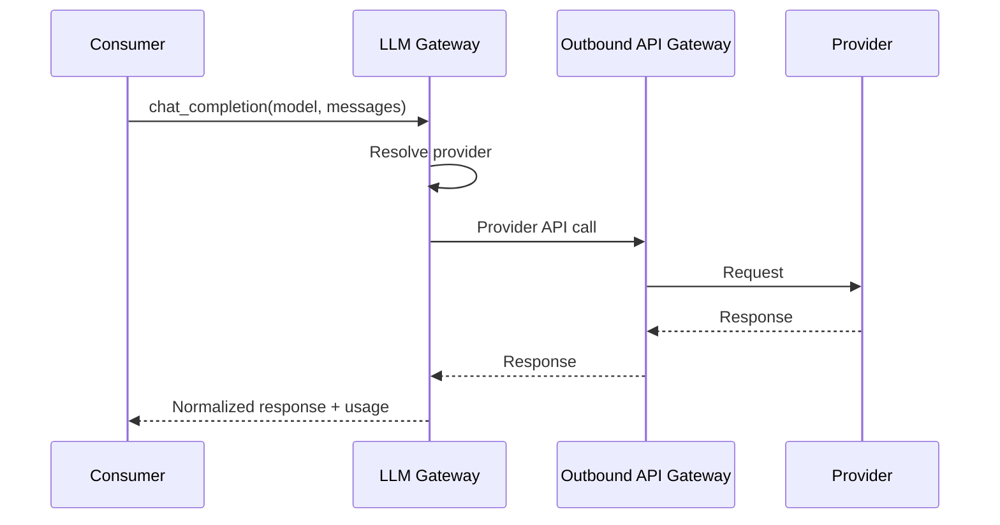
```mermaid
sequenceDiagram
    participant C as Consumer
    participant GW as LLM Gateway
    participant OB as Outbound API Gateway
    participant P as Provider

    C->>GW: chat_completion(model, messages)
    GW->>GW: Resolve provider
    GW->>OB: Provider API call
    OB->>P: Request
    P-->>OB: Response
    OB-->>GW: Response
    GW-->>C: Normalized response + usage
```

---

### [ ] S1.2 Streaming Chat Completion

Same as S1.1, but response is streamed. Gateway normalizes provider events to unified format.

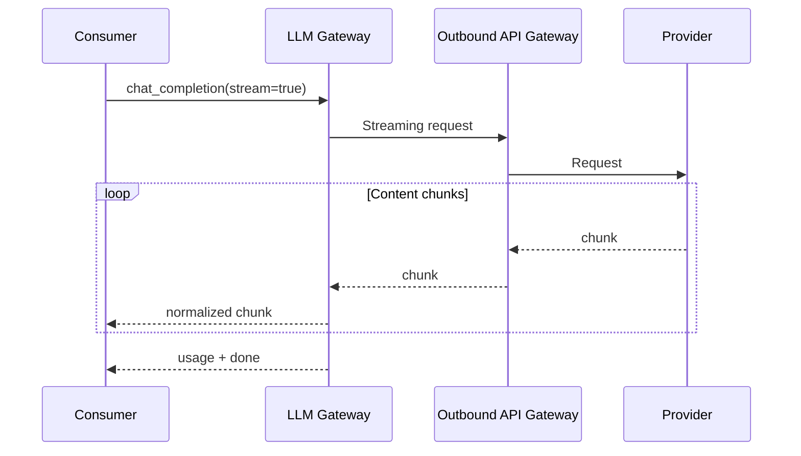
```mermaid
sequenceDiagram
    participant C as Consumer
    participant GW as LLM Gateway
    participant OB as Outbound API Gateway
    participant P as Provider

    C->>GW: chat_completion(stream=true)
    GW->>OB: Streaming request
    OB->>P: Request
    loop Content chunks
        P-->>OB: chunk
        OB-->>GW: chunk
        GW-->>C: normalized chunk
    end
    GW-->>C: usage + done
```

---

### [ ] S1.3 Embeddings Generation

Consumer sends text(s), Gateway returns vector embeddings.

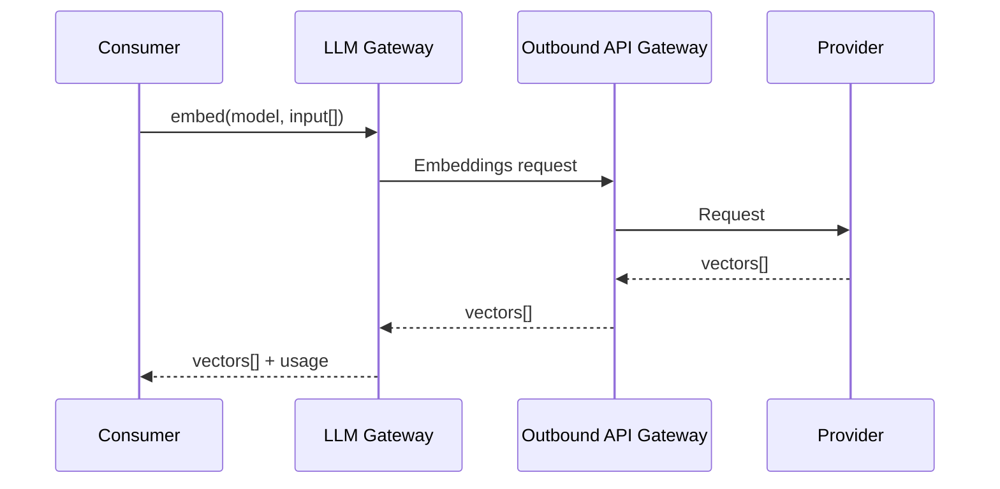
```mermaid
sequenceDiagram
    participant C as Consumer
    participant GW as LLM Gateway
    participant OB as Outbound API Gateway
    participant P as Provider

    C->>GW: embed(model, input[])
    GW->>OB: Embeddings request
    OB->>P: Request
    P-->>OB: vectors[]
    OB-->>GW: vectors[]
    GW-->>C: vectors[] + usage
```

---

### [ ] S1.4 Vision (Image Analysis)

Consumer sends message with image URLs. Gateway fetches from FileStorage, routes to vision-capable model.

```mermaid
sequenceDiagram
    participant C as Consumer
    participant FS as FileStorage
    participant GW as LLM Gateway
    participant OB as Outbound API Gateway
    participant P as Provider

    C->>GW: chat_completion(messages with image URLs)
    GW->>FS: Fetch images
    FS-->>GW: image content
    GW->>OB: Request with images
    OB->>P: Request
    P-->>OB: Analysis
    OB-->>GW: Analysis
    GW-->>C: Response + usage
```

---

### [ ] S1.5 Image Generation

Consumer sends text prompt. Gateway generates image, stores in FileStorage, returns URL.

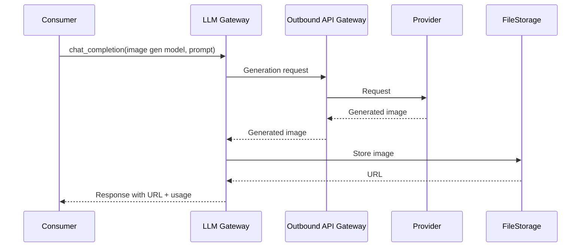
```mermaid
sequenceDiagram
    participant C as Consumer
    participant GW as LLM Gateway
    participant OB as Outbound API Gateway
    participant P as Provider
    participant FS as FileStorage

    C->>GW: chat_completion(image gen model, prompt)
    GW->>OB: Generation request
    OB->>P: Request
    P-->>OB: Generated image
    OB-->>GW: Generated image
    GW->>FS: Store image
    FS-->>GW: URL
    GW-->>C: Response with URL + usage
```

---

### [ ] S1.6 Speech-to-Text

Consumer sends message with audio URL. Gateway fetches audio, returns transcription.

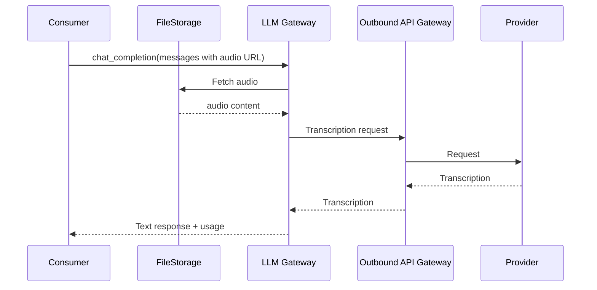
```mermaid
sequenceDiagram
    participant C as Consumer
    participant FS as FileStorage
    participant GW as LLM Gateway
    participant OB as Outbound API Gateway
    participant P as Provider

    C->>GW: chat_completion(messages with audio URL)
    GW->>FS: Fetch audio
    FS-->>GW: audio content
    GW->>OB: Transcription request
    OB->>P: Request
    P-->>OB: Transcription
    OB-->>GW: Transcription
    GW-->>C: Text response + usage
```

---

### [ ] S1.7 Text-to-Speech

Consumer sends text. Gateway synthesizes audio, stores in FileStorage, returns URL. Supports streaming mode.

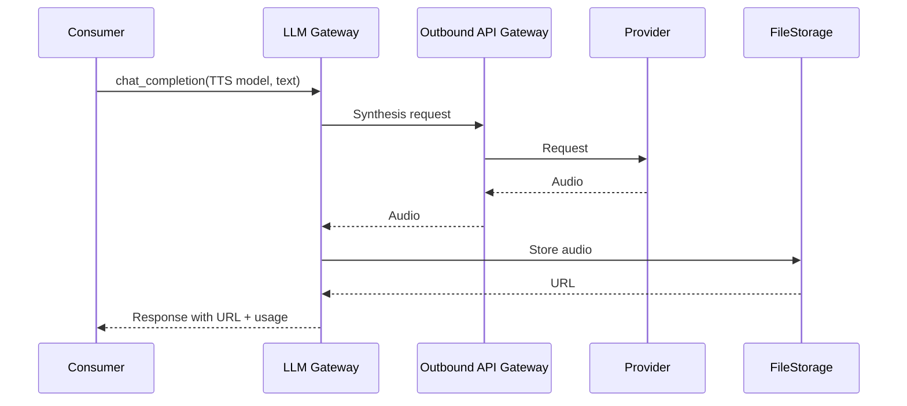
```mermaid
sequenceDiagram
    participant C as Consumer
    participant GW as LLM Gateway
    participant OB as Outbound API Gateway
    participant P as Provider
    participant FS as FileStorage

    C->>GW: chat_completion(TTS model, text)
    GW->>OB: Synthesis request
    OB->>P: Request
    P-->>OB: Audio
    OB-->>GW: Audio
    GW->>FS: Store audio
    FS-->>GW: URL
    GW-->>C: Response with URL + usage
```

---

### [ ] S1.8 Video Understanding

Consumer sends message with video URL. Gateway fetches video, returns analysis.

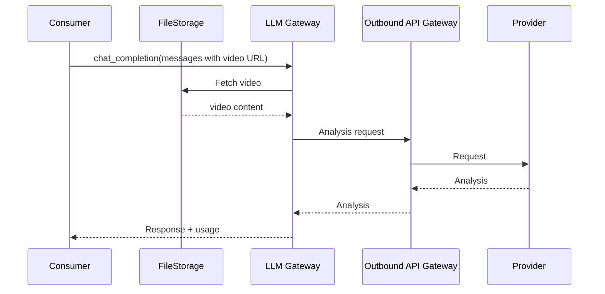
```mermaid
sequenceDiagram
    participant C as Consumer
    participant FS as FileStorage
    participant GW as LLM Gateway
    participant OB as Outbound API Gateway
    participant P as Provider

    C->>GW: chat_completion(messages with video URL)
    GW->>FS: Fetch video
    FS-->>GW: video content
    GW->>OB: Analysis request
    OB->>P: Request
    P-->>OB: Analysis
    OB-->>GW: Analysis
    GW-->>C: Response + usage
```

---

### [ ] S1.9 Video Generation

Consumer sends text prompt. Gateway generates video, stores in FileStorage, returns URL. Typically requires async mode due to long processing.

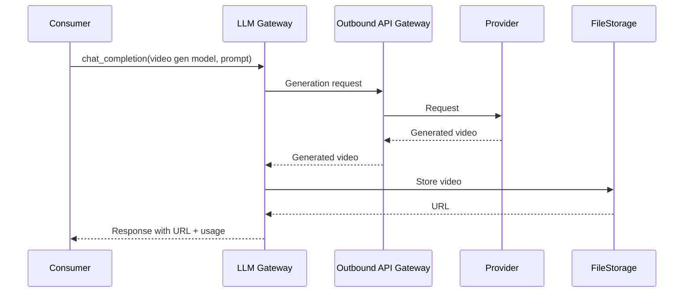
```mermaid
sequenceDiagram
    participant C as Consumer
    participant GW as LLM Gateway
    participant OB as Outbound API Gateway
    participant P as Provider
    participant FS as FileStorage

    C->>GW: chat_completion(video gen model, prompt)
    GW->>OB: Generation request
    OB->>P: Request
    P-->>OB: Generated video
    OB-->>GW: Generated video
    GW->>FS: Store video
    FS-->>GW: URL
    GW-->>C: Response with URL + usage
```

---

### [ ] S1.10 Tool/Function Calling

Consumer sends request with tool definitions. Gateway resolves schema references, converts to provider format. Model returns tool calls for consumer to execute.

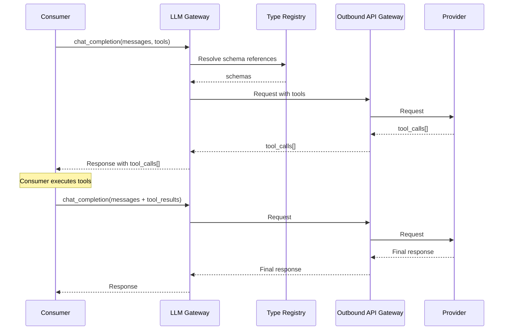
```mermaid
sequenceDiagram
    participant C as Consumer
    participant GW as LLM Gateway
    participant TR as Type Registry
    participant OB as Outbound API Gateway
    participant P as Provider

    C->>GW: chat_completion(messages, tools)
    GW->>TR: Resolve schema references
    TR-->>GW: schemas
    GW->>OB: Request with tools
    OB->>P: Request
    P-->>OB: tool_calls[]
    OB-->>GW: tool_calls[]
    GW-->>C: Response with tool_calls[]
    Note over C: Consumer executes tools
    C->>GW: chat_completion(messages + tool_results)
    GW->>OB: Request
    OB->>P: Request
    P-->>OB: Final response
    OB-->>GW: Final response
    GW-->>C: Response
```

---

### [ ] S1.11 Structured Output

Consumer requests response matching JSON schema. Gateway validates response against schema.

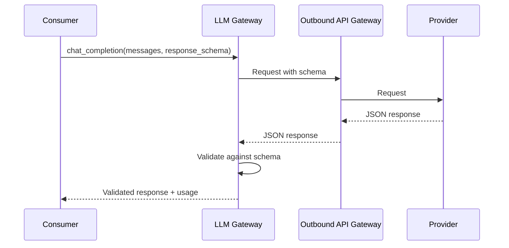
```mermaid
sequenceDiagram
    participant C as Consumer
    participant GW as LLM Gateway
    participant OB as Outbound API Gateway
    participant P as Provider

    C->>GW: chat_completion(messages, response_schema)
    GW->>OB: Request with schema
    OB->>P: Request
    P-->>OB: JSON response
    OB-->>GW: JSON response
    GW->>GW: Validate against schema
    GW-->>C: Validated response + usage
```

---

### [ ] S1.12 Model Discovery

Consumer queries available models and capabilities. Gateway delegates to Model Registry.

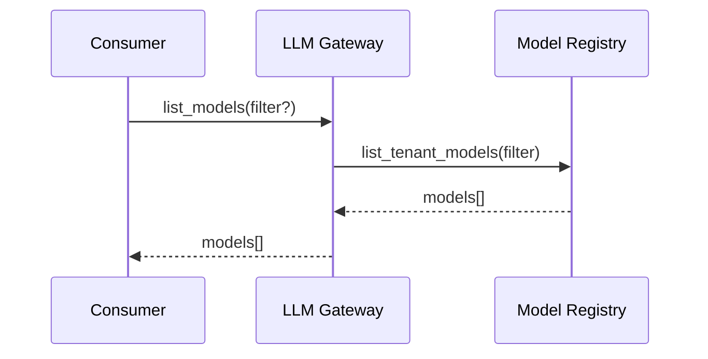
```mermaid
sequenceDiagram
    participant C as Consumer
    participant GW as LLM Gateway
    participant MR as Model Registry

    C->>GW: list_models(filter?)
    GW->>MR: list_tenant_models(filter)
    MR-->>GW: models[]
    GW-->>C: models[]
```

Model info includes: capabilities, context limits, pricing.

---

### [ ] S1.13 Document Understanding

Consumer sends message with document URL. Gateway fetches document, routes to capable model.

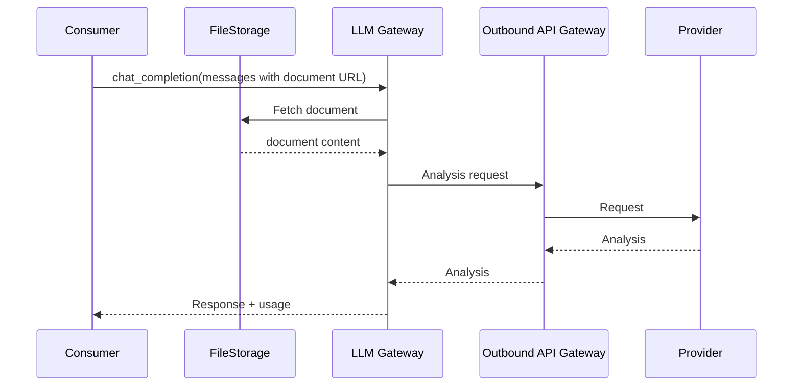
```mermaid
sequenceDiagram
    participant C as Consumer
    participant FS as FileStorage
    participant GW as LLM Gateway
    participant OB as Outbound API Gateway
    participant P as Provider

    C->>GW: chat_completion(messages with document URL)
    GW->>FS: Fetch document
    FS-->>GW: document content
    GW->>OB: Analysis request
    OB->>P: Request
    P-->>OB: Analysis
    OB-->>GW: Analysis
    GW-->>C: Response + usage
```

---

### [ ] S1.14 Async Jobs

Consumer can request async execution for long-running operations. Gateway returns job ID, consumer polls for result.

Gateway abstracts provider behavior:
- Sync provider + async request → Gateway simulates job
- Async provider + sync request → Gateway polls internally

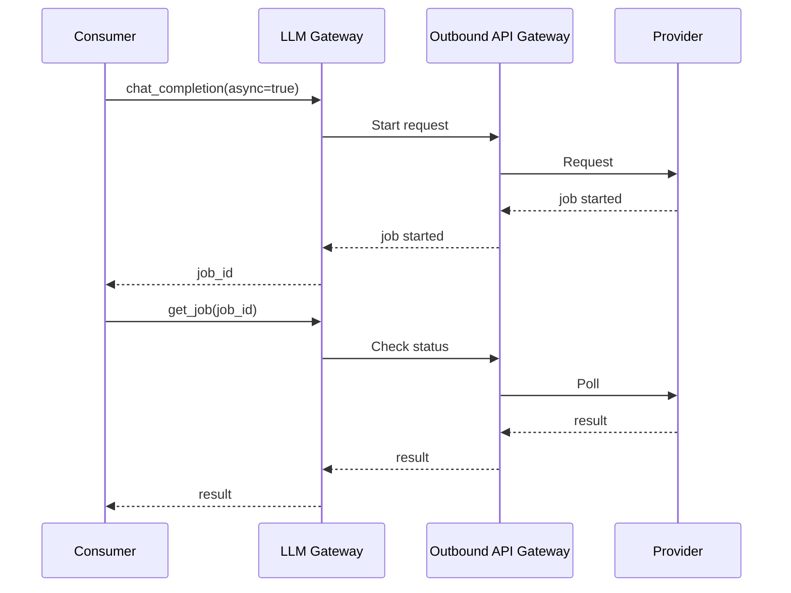
```mermaid
sequenceDiagram
    participant C as Consumer
    participant GW as LLM Gateway
    participant OB as Outbound API Gateway
    participant P as Provider

    C->>GW: chat_completion(async=true)
    GW->>OB: Start request
    OB->>P: Request
    P-->>OB: job started
    OB-->>GW: job started
    GW-->>C: job_id

    C->>GW: get_job(job_id)
    GW->>OB: Check status
    OB->>P: Poll
    P-->>OB: result
    OB-->>GW: result
    GW-->>C: result
```

---

### [ ] S1.15 Realtime Audio

Bidirectional audio streaming via WebSocket for voice conversations.

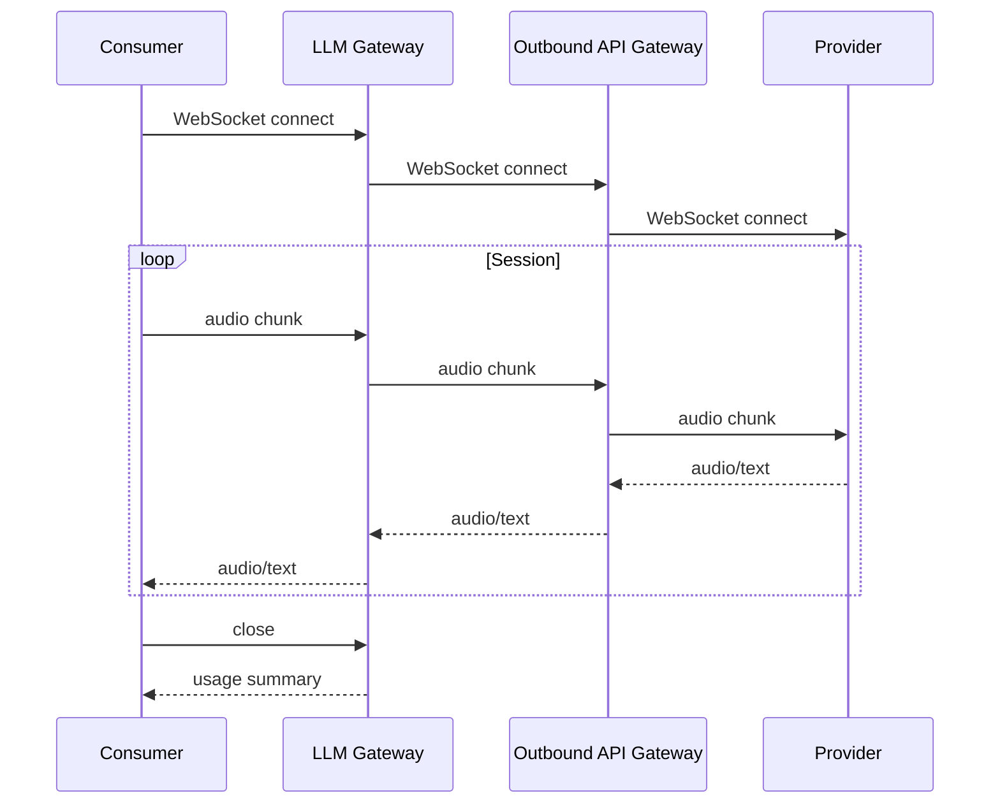
```mermaid
sequenceDiagram
    participant C as Consumer
    participant GW as LLM Gateway
    participant OB as Outbound API Gateway
    participant P as Provider

    C->>GW: WebSocket connect
    GW->>OB: WebSocket connect
    OB->>P: WebSocket connect

    loop Session
        C->>GW: audio chunk
        GW->>OB: audio chunk
        OB->>P: audio chunk
        P-->>OB: audio/text
        OB-->>GW: audio/text
        GW-->>C: audio/text
    end

    C->>GW: close
    GW-->>C: usage summary
```

---

### [ ] S1.16 Usage Tracking

Gateway reports usage after each request via Usage Plugin: tokens, cost estimate, latency, attribution (tenant, user, conversation, model).

---

## P2 — Reliability & Governance

### [ ] S2.1 Provider Fallback

When primary provider fails, Gateway automatically switches to fallback provider with matching capabilities.

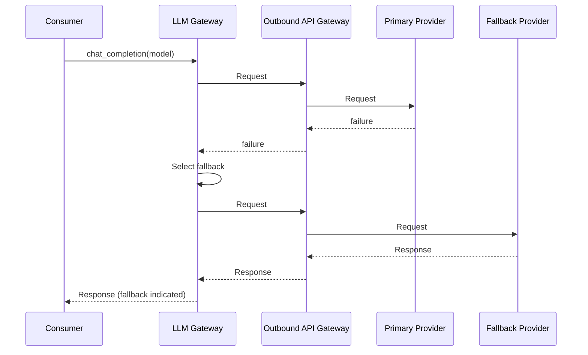
```mermaid
sequenceDiagram
    participant C as Consumer
    participant GW as LLM Gateway
    participant OB as Outbound API Gateway
    participant P1 as Primary Provider
    participant P2 as Fallback Provider

    C->>GW: chat_completion(model)
    GW->>OB: Request
    OB->>P1: Request
    P1-->>OB: failure
    OB-->>GW: failure
    GW->>GW: Select fallback
    GW->>OB: Request
    OB->>P2: Request
    P2-->>OB: Response
    OB-->>GW: Response
    GW-->>C: Response (fallback indicated)
```

---

### [ ] S2.2 Retry with Backoff

Transient failures trigger automatic retry with exponential backoff before fallback.

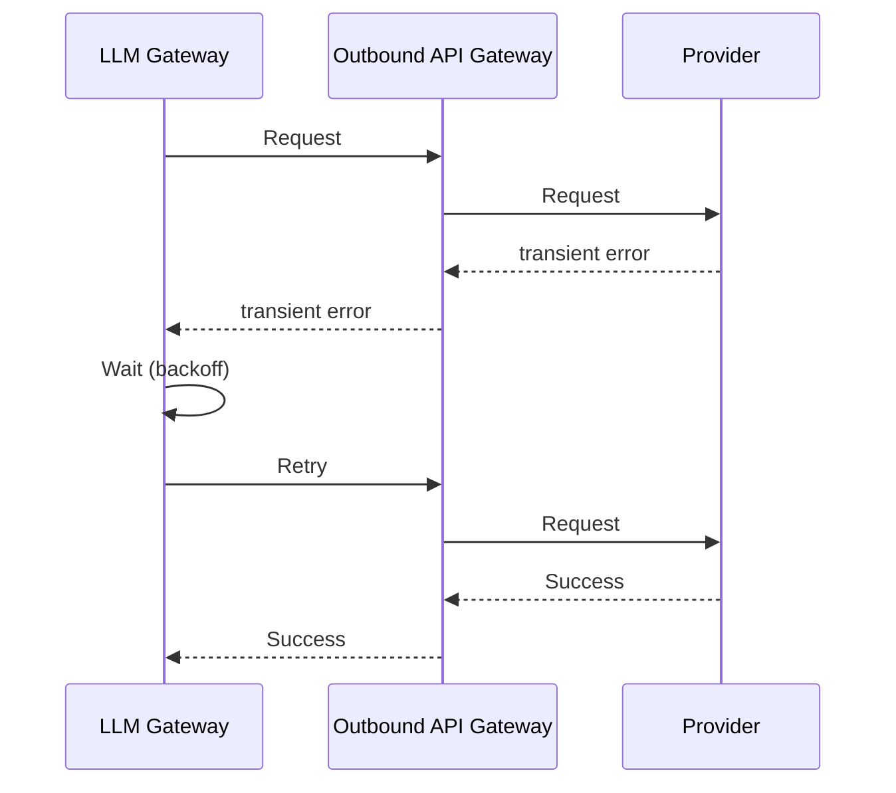
```mermaid
sequenceDiagram
    participant GW as LLM Gateway
    participant OB as Outbound API Gateway
    participant P as Provider

    GW->>OB: Request
    OB->>P: Request
    P-->>OB: transient error
    OB-->>GW: transient error
    GW->>GW: Wait (backoff)
    GW->>OB: Retry
    OB->>P: Request
    P-->>OB: Success
    OB-->>GW: Success
```

---

### [ ] S2.3 Timeout Enforcement

Gateway enforces request timeouts. On timeout → retry → fallback → error.

---

### [ ] S2.4 Pre-Call Interceptor

Before sending to provider, Gateway invokes Hook Plugin. Plugin can allow, block, or modify request.

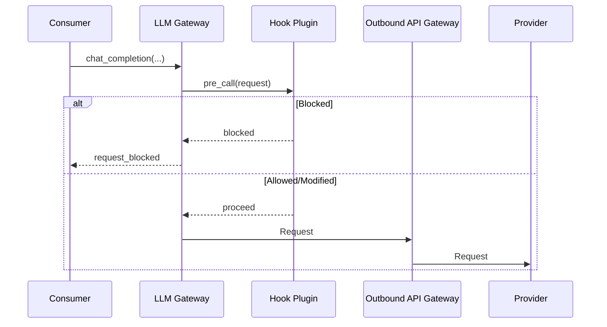
```mermaid
sequenceDiagram
    participant C as Consumer
    participant GW as LLM Gateway
    participant HP as Hook Plugin
    participant OB as Outbound API Gateway
    participant P as Provider

    C->>GW: chat_completion(...)
    GW->>HP: pre_call(request)
    alt Blocked
        HP-->>GW: blocked
        GW-->>C: request_blocked
    else Allowed/Modified
        HP-->>GW: proceed
        GW->>OB: Request
        OB->>P: Request
    end
```

---

### [ ] S2.5 Post-Response Interceptor

After receiving response, Gateway invokes Hook Plugin. Plugin can allow, block, or modify response.

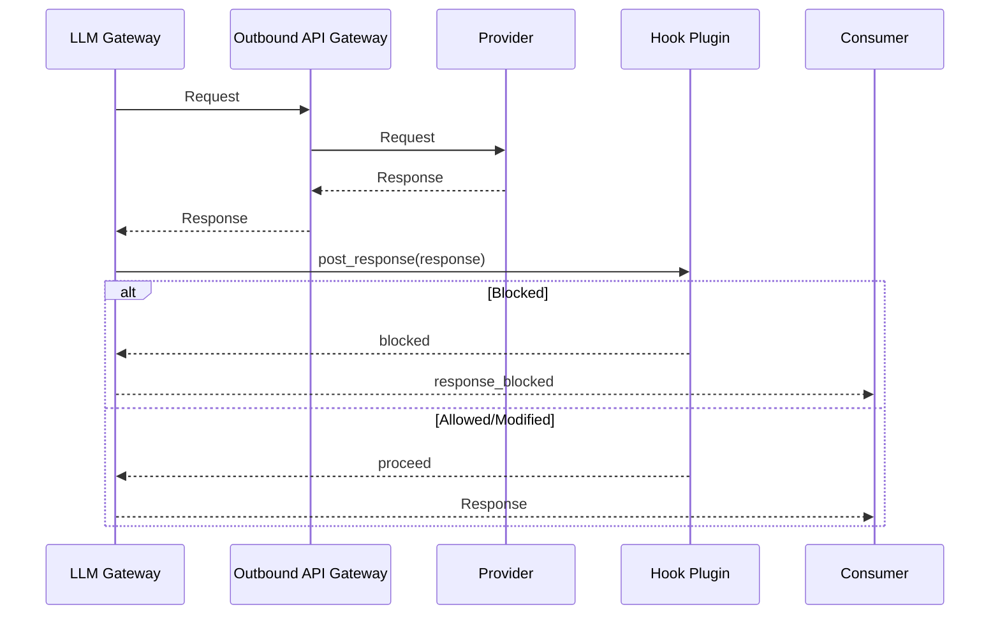
```mermaid
sequenceDiagram
    participant GW as LLM Gateway
    participant OB as Outbound API Gateway
    participant P as Provider
    participant HP as Hook Plugin
    participant C as Consumer

    GW->>OB: Request
    OB->>P: Request
    P-->>OB: Response
    OB-->>GW: Response
    GW->>HP: post_response(response)
    alt Blocked
        HP-->>GW: blocked
        GW-->>C: response_blocked
    else Allowed/Modified
        HP-->>GW: proceed
        GW-->>C: Response
    end
```

---

### [ ] S2.6 Per-Tenant Budget Enforcement

Gateway checks budget before execution via Usage Plugin. Rejects if exhausted, reports actual usage after completion.

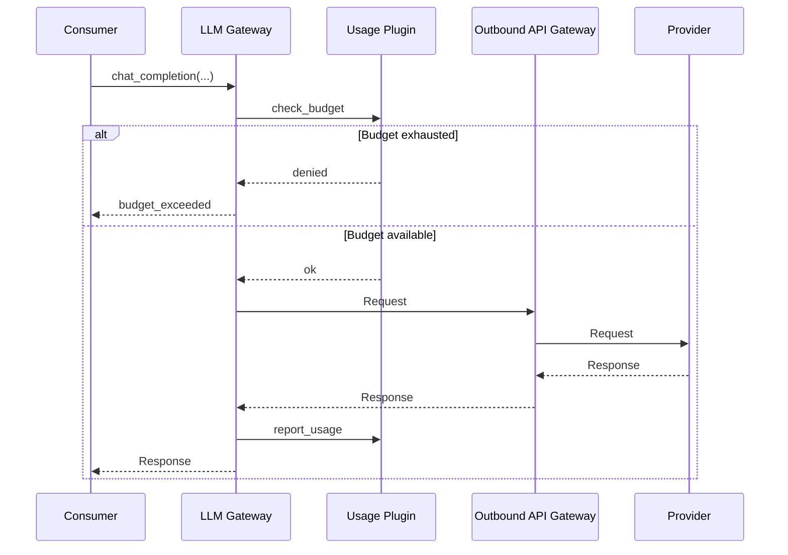
```mermaid
sequenceDiagram
    participant C as Consumer
    participant GW as LLM Gateway
    participant UP as Usage Plugin
    participant OB as Outbound API Gateway
    participant P as Provider

    C->>GW: chat_completion(...)
    GW->>UP: check_budget
    alt Budget exhausted
        UP-->>GW: denied
        GW-->>C: budget_exceeded
    else Budget available
        UP-->>GW: ok
        GW->>OB: Request
        OB->>P: Request
        P-->>OB: Response
        OB-->>GW: Response
        GW->>UP: report_usage
        GW-->>C: Response
    end
```

---

### [ ] S2.7 Request Cancellation

Consumer can cancel in-progress request. Gateway propagates cancellation to provider.

```mermaid
sequenceDiagram
    participant C as Consumer
    participant GW as LLM Gateway
    participant OB as Outbound API Gateway
    participant P as Provider

    C->>GW: chat_completion(request_id)
    GW->>OB: Request
    OB->>P: Request
    C->>GW: cancel(request_id)
    GW->>OB: Cancel
    OB->>P: Cancel
    GW-->>C: cancelled
```

---

### [ ] S2.8 Rate Limiting

Gateway enforces rate limits at tenant and user levels. Rejects requests exceeding limits.

```mermaid
sequenceDiagram
    participant C as Consumer
    participant GW as LLM Gateway
    participant OB as Outbound API Gateway
    participant P as Provider

    C->>GW: chat_completion(...)
    GW->>GW: Check rate limits
    alt Limit exceeded
        GW-->>C: rate_limited
    else Within limits
        GW->>OB: Request
        OB->>P: Request
        P-->>OB: Response
        OB-->>GW: Response
        GW-->>C: Response
    end
```

---

## P3 — Optimization

### [ ] S3.1 Cost-Aware Routing

When multiple providers can serve request, Gateway selects based on cost and latency optimization.

---

### [ ] S3.2 Embeddings Batching

Gateway batches embedding requests within time window for efficiency. No cross-tenant batching. Supports partial failure reporting.

---

## P4 — Enterprise

### [ ] S4.1 Audit Events

Gateway emits audit events via Audit Plugin for compliance: request started, completed, failed, blocked, fallback triggered.

---

## Errors

Gateway returns errors for:
- Model not found / not approved
- Validation errors
- Capability not supported
- Budget exceeded
- Rate limited
- Request/response blocked by hook
- Provider errors and timeouts
- Job not found / expired
