# LLM Gateway Scenarios

## Notation

- `[ ]` — not implemented
- `[x]` — implemented

---

## Content Format

Message content is an array of typed blocks:

```plaintext
content: [
  { type: "text", text: "..." },
  { type: "image", url: "..." },
  { type: "audio", url: "..." },
  { type: "video", url: "..." },
  { type: "document", url: "..." },
  { type: "tool_call", id: "...", schema_id: "...", arguments: {...} },
  { type: "tool_result", tool_call_id: "...", result: {...} }
]
```

| Type | Fields | Direction |
|------|--------|-----------|
| text | text | input/output |
| image | url | input/output |
| audio | url | input/output |
| video | url | input/output |
| document | url | input/output |
| tool_call | id, schema_id, arguments | output |
| tool_result | tool_call_id, result | input |

**Media**: Consumer uploads to FileStorage, provides URLs. Gateway fetches content before sending to provider. Generated media stored via FileStorage, URLs returned.

**Tools**: Consumer defines tools via GTS Schema ID. Gateway resolves schema before sending to provider.

---

## Dependencies

| Dependency | Role |
|------------|------|
| FileStorage | Fetch input media by URL, store generated content |
| Credential Resolver | API keys for providers |
| Type Registry | Read GTS schemas by ID (tool definitions) |
| Usage Tracker | Token/cost reporting |

---

## Design Principles

**Stateless**: Gateway does not store conversation history. Consumer provides full message history with each request. Conversation state is managed by a separate component (Chat Engine). Exception: async job mappings are stored temporarily until job completion/expiry.

**Pass-through**: Gateway normalizes requests/responses but does not interpret content. Tool execution, response parsing — consumer responsibility.

---

## Errors

All errors follow RFC 9457 Problem Details format with GTS error codes.

**Code pattern**: `gts.hx.core.errors.err.v1~hx.llm_gateway.<error>.v1`

| Code | Status | Description |
|------|--------|-------------|
| `model_not_found` | 404 | Requested model not available |
| `job_not_found` | 404 | Async job ID not found |
| `job_expired` | 410 | Async job expired (TTL) |
| `validation_error` | 422 | Invalid request parameters |
| `capability_not_supported` | 422 | Model doesn't support requested capability |
| `schema_validation_failed` | 422 | Response doesn't match requested JSON schema |
| `budget_exceeded` | 429 | Tenant budget exhausted |
| `rate_limited` | 429 | Rate limit exceeded (tenant or user level) |
| `request_blocked` | 403 | Blocked by pre-call interceptor |
| `response_blocked` | 403 | Blocked by post-response interceptor |
| `provider_error` | 502 | Provider returned error |
| `provider_timeout` | 504 | Provider request timed out |

**Response example**:
```json
{
  "type": "https://errors.hyperspot.io/gts.hx.core.errors.err.v1~hx.llm_gateway.rate_limited.v1",
  "title": "Rate Limited",
  "status": 429,
  "code": "gts.hx.core.errors.err.v1~hx.llm_gateway.rate_limited.v1",
  "detail": "User rate limit exceeded",
  "instance": "/api/llm-gateway/v1/chat/completions",
  "trace_id": "abc123"
}
```

---

## P1 — Core

### [ ] S1.1 Chat Completion

Consumer sends chat completion request. Gateway resolves provider based on model, executes request, returns response with usage metrics.

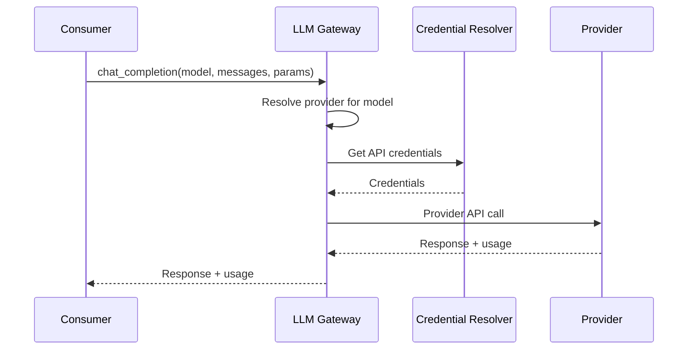
```mermaid
sequenceDiagram
    participant C as Consumer
    participant GW as LLM Gateway
    participant CR as Credential Resolver
    participant P as Provider

    C->>GW: chat_completion(model, messages, params)
    GW->>GW: Resolve provider for model
    GW->>CR: Get API credentials
    CR-->>GW: Credentials
    GW->>P: Provider API call
    P-->>GW: Response + usage
    GW-->>C: Response + usage
```

---

### [ ] S1.2 Streaming Chat Completion

Same as S1.1, but response is streamed via SSE. Gateway forwards provider stream events to consumer, emits final usage on completion.

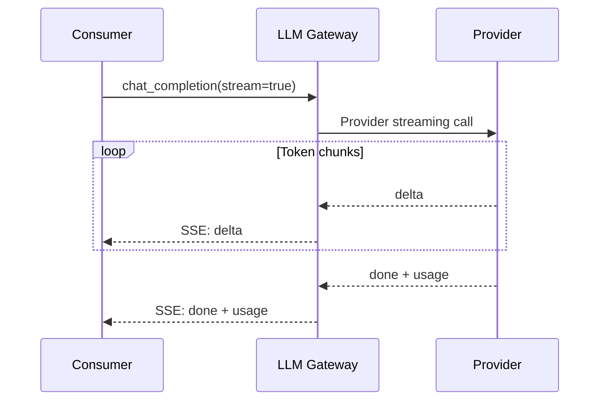
```mermaid
sequenceDiagram
    participant C as Consumer
    participant GW as LLM Gateway
    participant P as Provider

    C->>GW: chat_completion(stream=true)
    GW->>P: Provider streaming call
    loop Token chunks
        P-->>GW: delta
        GW-->>C: SSE: delta
    end
    P-->>GW: done + usage
    GW-->>C: SSE: done + usage
```

**Edge cases**:
- Client disconnect → persist partial response
- Provider timeout → emit error event, close stream

---

### [ ] S1.3 Embeddings Generation

Consumer sends text(s), Gateway returns vector embeddings. Supports single text or batch input.

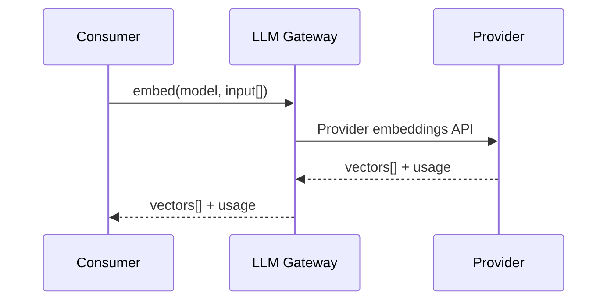
```mermaid
sequenceDiagram
    participant C as Consumer
    participant GW as LLM Gateway
    participant P as Provider

    C->>GW: embed(model, input[])
    GW->>P: Provider embeddings API
    P-->>GW: vectors[] + usage
    GW-->>C: vectors[] + usage
```

---

### [ ] S1.4 Vision (Image Analysis)

Consumer uploads images to FileStorage, then sends message with image URLs. Gateway routes to vision-capable model.

**Request example**:
```plaintext
messages: [{
  role: "user",
  content: [
    { type: "text", text: "What's in these images?" },
    { type: "image", url: "https://storage.example.com/img1.jpg" },
    { type: "image", url: "https://storage.example.com/img2.jpg" }
  ]
}]
```

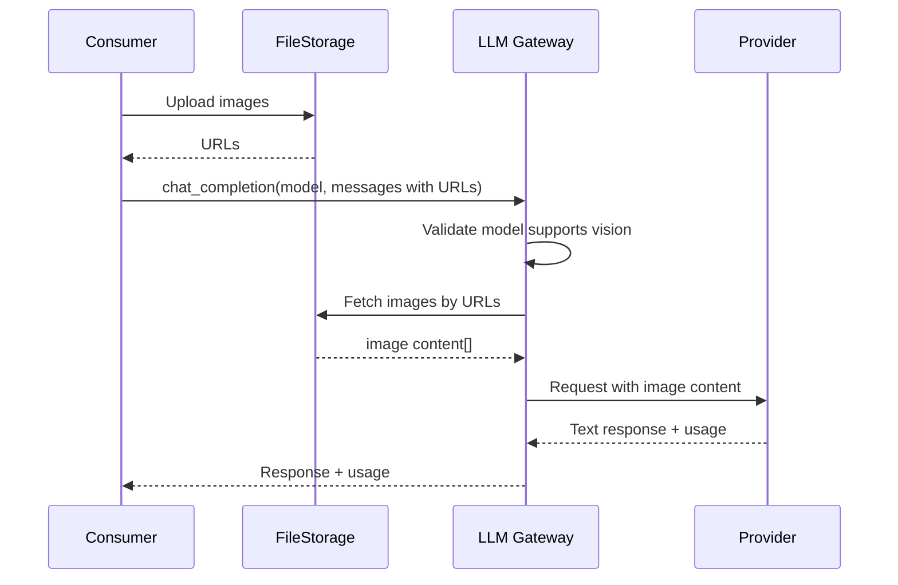
```mermaid
sequenceDiagram
    participant C as Consumer
    participant FS as FileStorage
    participant GW as LLM Gateway
    participant P as Provider

    C->>FS: Upload images
    FS-->>C: URLs
    C->>GW: chat_completion(model, messages with URLs)
    GW->>GW: Validate model supports vision
    GW->>FS: Fetch images by URLs
    FS-->>GW: image content[]
    GW->>P: Request with image content
    P-->>GW: Text response + usage
    GW-->>C: Response + usage
```

**Multiple images**: supported in single message

---

### [ ] S1.5 Image Generation

Consumer sends text prompt to image generation model. Gateway generates image, stores via FileStorage, returns URL.

**Request example**:
```plaintext
model: "dall-e-3"
messages: [{
  role: "user",
  content: [
    { type: "text", text: "A sunset over mountains, oil painting style" }
  ]
}]
params: { size: "1024x1024", quality: "hd" }
```

**Response example**:
```plaintext
content: [
  { type: "image", url: "https://storage.example.com/generated/abc123.png" }
]
usage: { ... }
```

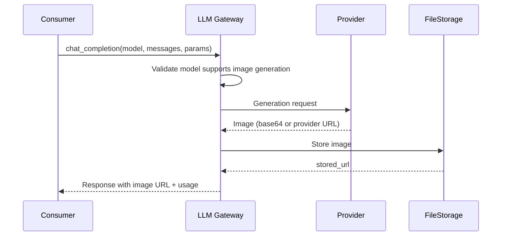
```mermaid
sequenceDiagram
    participant C as Consumer
    participant GW as LLM Gateway
    participant P as Provider
    participant FS as FileStorage

    C->>GW: chat_completion(model, messages, params)
    GW->>GW: Validate model supports image generation
    GW->>P: Generation request
    P-->>GW: Image (base64 or provider URL)
    GW->>FS: Store image
    FS-->>GW: stored_url
    GW-->>C: Response with image URL + usage
```

**Parameters**: size, quality, style, count (via request params)

---

### [ ] S1.6 Speech-to-Text (Transcription)

Consumer uploads audio to FileStorage, then sends message with audio URL. Gateway returns transcribed text.

**Request example**:
```plaintext
messages: [{
  role: "user",
  content: [
    { type: "text", text: "Transcribe this audio" },
    { type: "audio", url: "https://storage.example.com/recording.mp3" }
  ]
}]
```

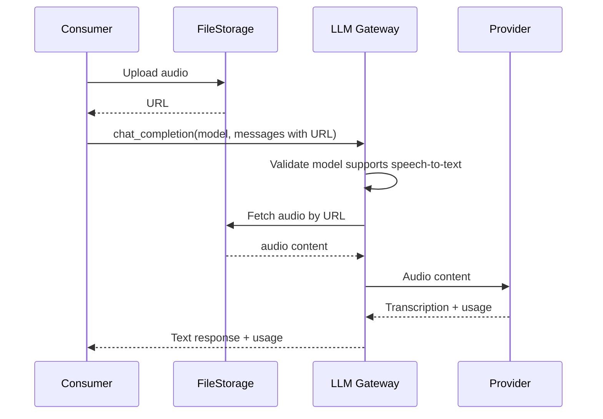
```mermaid
sequenceDiagram
    participant C as Consumer
    participant FS as FileStorage
    participant GW as LLM Gateway
    participant P as Provider

    C->>FS: Upload audio
    FS-->>C: URL
    C->>GW: chat_completion(model, messages with URL)
    GW->>GW: Validate model supports speech-to-text
    GW->>FS: Fetch audio by URL
    FS-->>GW: audio content
    GW->>P: Audio content
    P-->>GW: Transcription + usage
    GW-->>C: Text response + usage
```

**Parameters**: language hint, timestamps, word-level timing (via request params)

---

### [ ] S1.7 Text-to-Speech (Synthesis)

Consumer sends text to TTS model. Gateway synthesizes audio, stores via FileStorage, returns URL.

**Request example**:
```plaintext
model: "tts-1-hd"
messages: [{
  role: "user",
  content: [
    { type: "text", text: "Hello, welcome to our platform." }
  ]
}]
params: { voice: "alloy", speed: 1.0 }
```

**Response example**:
```plaintext
content: [
  { type: "audio", url: "https://storage.example.com/generated/xyz789.mp3" }
]
usage: { ... }
```

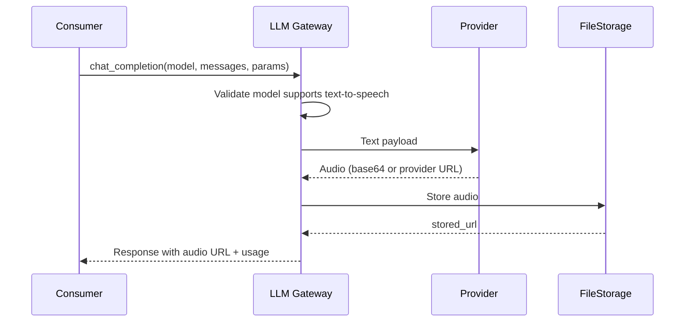
```mermaid
sequenceDiagram
    participant C as Consumer
    participant GW as LLM Gateway
    participant P as Provider
    participant FS as FileStorage

    C->>GW: chat_completion(model, messages, params)
    GW->>GW: Validate model supports text-to-speech
    GW->>P: Text payload
    P-->>GW: Audio (base64 or provider URL)
    GW->>FS: Store audio
    FS-->>GW: stored_url
    GW-->>C: Response with audio URL + usage
```

**Parameters**: voice, speed, pitch (via request params)

**Streaming**: for real-time synthesis, stream audio chunks directly (no storage)

---

### [ ] S1.8 Video Understanding

Consumer uploads video to FileStorage, then sends message with video URL. Gateway returns analysis.

**Request example**:
```plaintext
messages: [{
  role: "user",
  content: [
    { type: "text", text: "Describe what happens in this video" },
    { type: "video", url: "https://storage.example.com/clip.mp4" }
  ]
}]
```

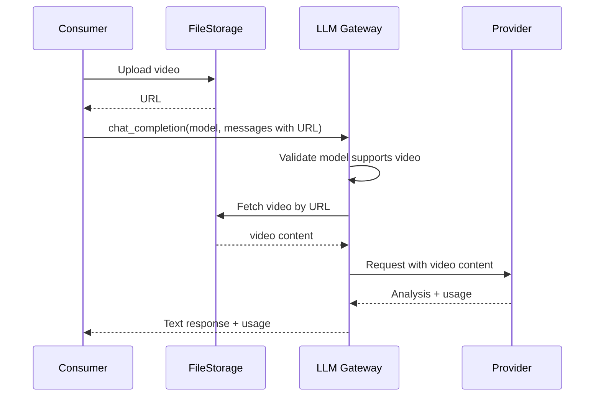
```mermaid
sequenceDiagram
    participant C as Consumer
    participant FS as FileStorage
    participant GW as LLM Gateway
    participant P as Provider

    C->>FS: Upload video
    FS-->>C: URL
    C->>GW: chat_completion(model, messages with URL)
    GW->>GW: Validate model supports video
    GW->>FS: Fetch video by URL
    FS-->>GW: video content
    GW->>P: Request with video content
    P-->>GW: Analysis + usage
    GW-->>C: Text response + usage
```

**Considerations**:
- Provider-specific duration/size limits

---

### [ ] S1.9 Video Generation

Consumer sends text prompt to video generation model. Gateway generates video, stores via FileStorage, returns URL.

**Request example**:
```plaintext
model: "sora-1"
messages: [{
  role: "user",
  content: [
    { type: "text", text: "A cat playing piano in a jazz club" }
  ]
}]
params: { duration: 10, resolution: "1080p" }
```

**Response example**:
```plaintext
content: [
  { type: "video", url: "https://storage.example.com/generated/vid456.mp4" }
]
usage: { ... }
```

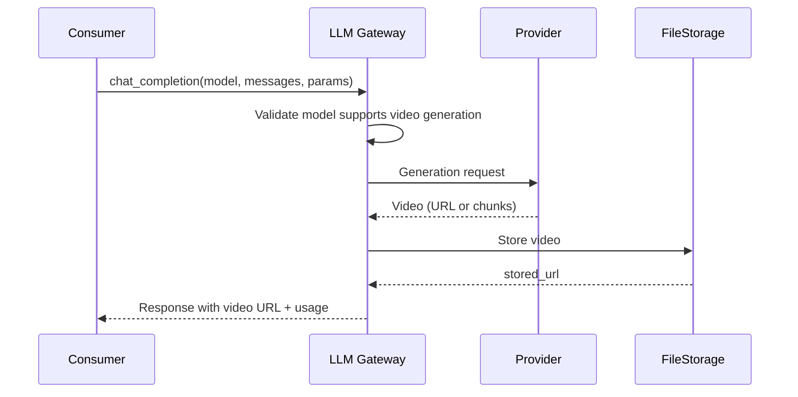
```mermaid
sequenceDiagram
    participant C as Consumer
    participant GW as LLM Gateway
    participant P as Provider
    participant FS as FileStorage

    C->>GW: chat_completion(model, messages, params)
    GW->>GW: Validate model supports video generation
    GW->>P: Generation request
    P-->>GW: Video (URL or chunks)
    GW->>FS: Store video
    FS-->>GW: stored_url
    GW-->>C: Response with video URL + usage
```

**Parameters**: duration, resolution, aspect_ratio (via request params)

---

### [ ] S1.10 Tool/Function Calling

Consumer sends request with tools defined by GTS Schema ID. Gateway resolves schemas, forwards to provider. Model may return tool calls. Consumer executes tools, sends results back.

**Tool Schema ID**: `gts.hx.core.faas.func.v1~<vendor>.<app>.<namespace>.<func_name>.v1`

**Request example**:
```plaintext
tools: [
  { schema_id: "gts.hx.core.faas.func.v1~acme.crm.contacts.search.v1" },
  { schema_id: "gts.hx.core.faas.func.v1~acme.crm.orders.create.v1" }
]
```

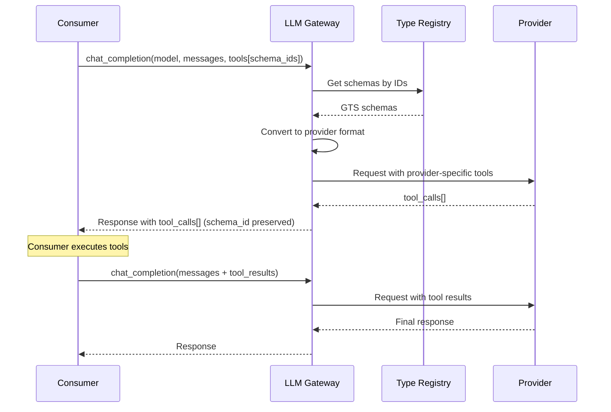
```mermaid
sequenceDiagram
    participant C as Consumer
    participant GW as LLM Gateway
    participant TR as Type Registry
    participant P as Provider

    C->>GW: chat_completion(model, messages, tools[schema_ids])
    GW->>TR: Get schemas by IDs
    TR-->>GW: GTS schemas
    GW->>GW: Convert to provider format
    GW->>P: Request with provider-specific tools
    P-->>GW: tool_calls[]
    GW-->>C: Response with tool_calls[] (schema_id preserved)
    Note over C: Consumer executes tools
    C->>GW: chat_completion(messages + tool_results)
    GW->>P: Request with tool results
    P-->>GW: Final response
    GW-->>C: Response
```

**Gateway role**:
- Reads schemas from Type Registry
- Converts to provider-specific format (OpenAI functions, Anthropic tools, etc.)
- Does not execute tools — consumer handles execution

---

### [ ] S1.11 Structured Output

Consumer requests JSON output with schema validation. Gateway passes schema to provider, validates response.

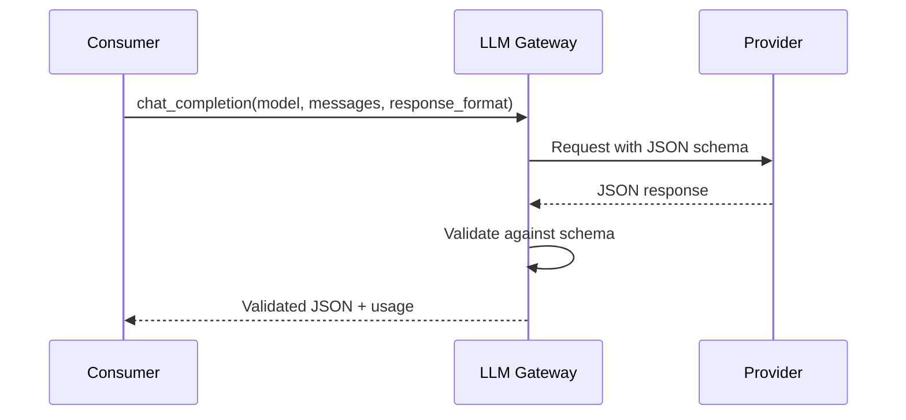
```mermaid
sequenceDiagram
    participant C as Consumer
    participant GW as LLM Gateway
    participant P as Provider

    C->>GW: chat_completion(model, messages, response_format)
    GW->>P: Request with JSON schema
    P-->>GW: JSON response
    GW->>GW: Validate against schema
    GW-->>C: Validated JSON + usage
```

**response_format**: `{ type: "json_schema", schema: {...} }`

**Validation failure**: Return `schema_validation_failed` with raw response in Problem extensions.

---

### [ ] S1.12 Model Discovery

Consumer queries available models and their capabilities.

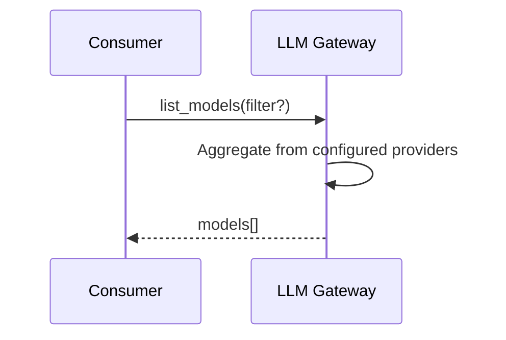
```mermaid
sequenceDiagram
    participant C as Consumer
    participant GW as LLM Gateway

    C->>GW: list_models(filter?)
    GW->>GW: Aggregate from configured providers
    GW-->>C: models[]
```

**Model info**:
- id, name, provider
- capabilities: chat, vision, audio, video, embeddings, tools, json_mode
- context_window, max_output_tokens
- pricing (per 1M tokens)

---

### [ ] S1.13 Document Understanding

Consumer uploads document to FileStorage, sends URL. Gateway fetches document, passes to capable model.

**Supported formats**: Provider-dependent (typically PDF, images)

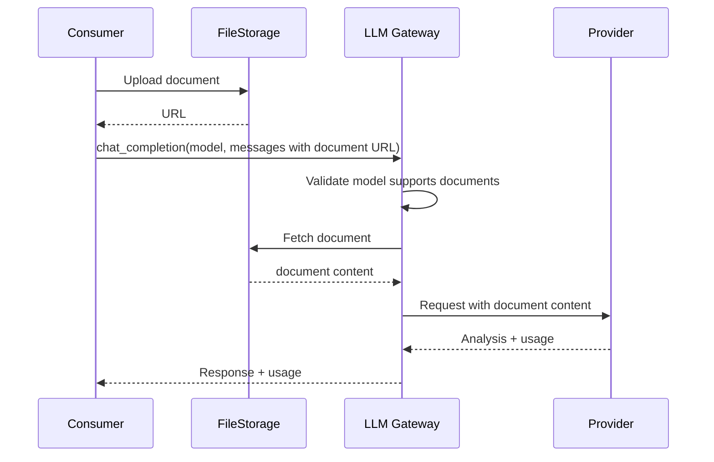
```mermaid
sequenceDiagram
    participant C as Consumer
    participant FS as FileStorage
    participant GW as LLM Gateway
    participant P as Provider

    C->>FS: Upload document
    FS-->>C: URL
    C->>GW: chat_completion(model, messages with document URL)
    GW->>GW: Validate model supports documents
    GW->>FS: Fetch document
    FS-->>GW: document content
    GW->>P: Request with document content
    P-->>GW: Analysis + usage
    GW-->>C: Response + usage
```

---

### [ ] S1.14 Async Jobs

For long-running operations (video generation), Gateway generates own job ID, stores mapping to provider job ID.

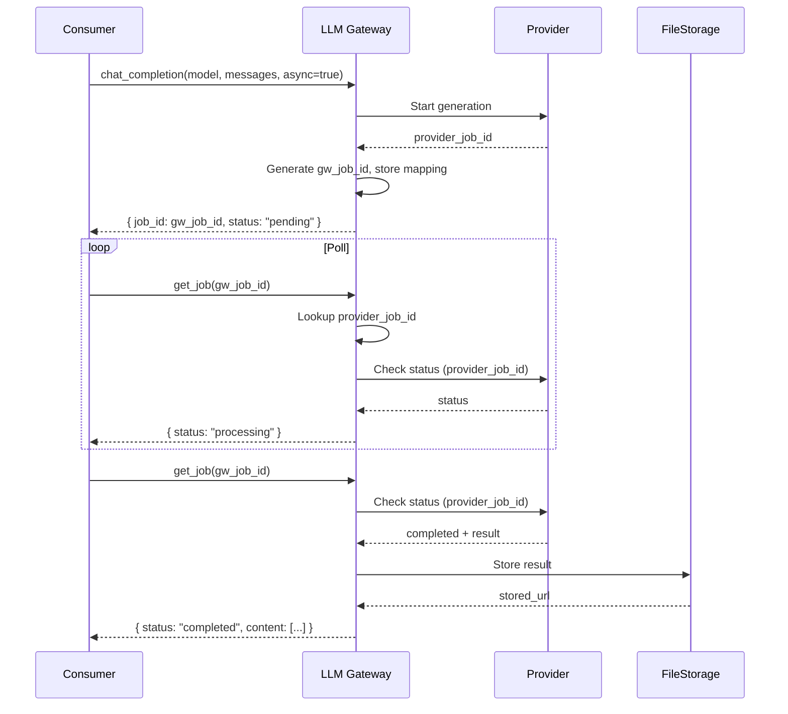
```mermaid
sequenceDiagram
    participant C as Consumer
    participant GW as LLM Gateway
    participant P as Provider
    participant FS as FileStorage

    C->>GW: chat_completion(model, messages, async=true)
    GW->>P: Start generation
    P-->>GW: provider_job_id
    GW->>GW: Generate gw_job_id, store mapping
    GW-->>C: { job_id: gw_job_id, status: "pending" }

    loop Poll
        C->>GW: get_job(gw_job_id)
        GW->>GW: Lookup provider_job_id
        GW->>P: Check status (provider_job_id)
        P-->>GW: status
        GW-->>C: { status: "processing" }
    end

    C->>GW: get_job(gw_job_id)
    GW->>P: Check status (provider_job_id)
    P-->>GW: completed + result
    GW->>FS: Store result
    FS-->>GW: stored_url
    GW-->>C: { status: "completed", content: [...] }
```

**Job states**: pending → processing → completed | failed

**Storage**: Gateway stores job mapping (gw_job_id → provider_job_id, status, metadata).

**Cleanup**: Jobs expire after configurable TTL.

---

### [ ] S1.15 Realtime Audio

Bidirectional audio streaming via WebSocket for voice conversations.

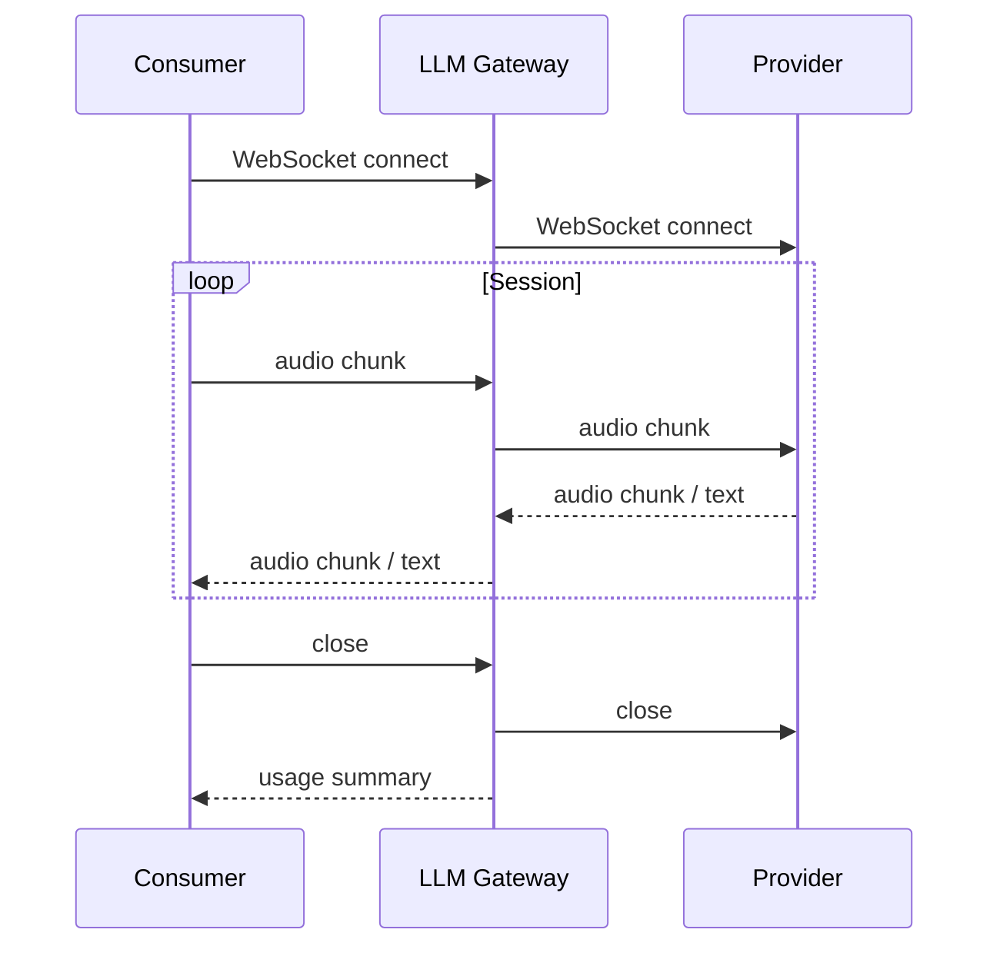
```mermaid
sequenceDiagram
    participant C as Consumer
    participant GW as LLM Gateway
    participant P as Provider

    C->>GW: WebSocket connect
    GW->>P: WebSocket connect

    loop Session
        C->>GW: audio chunk
        GW->>P: audio chunk
        P-->>GW: audio chunk / text
        GW-->>C: audio chunk / text
    end

    C->>GW: close
    GW->>P: close
    GW-->>C: usage summary
```

**Events**: audio_delta, text_delta, function_call, session_end

**Use case**: Voice assistants, real-time translation

---

## P2 — Reliability & Governance

### [ ] S2.1 Provider Fallback

When primary provider fails, Gateway automatically switches to next provider in fallback chain.

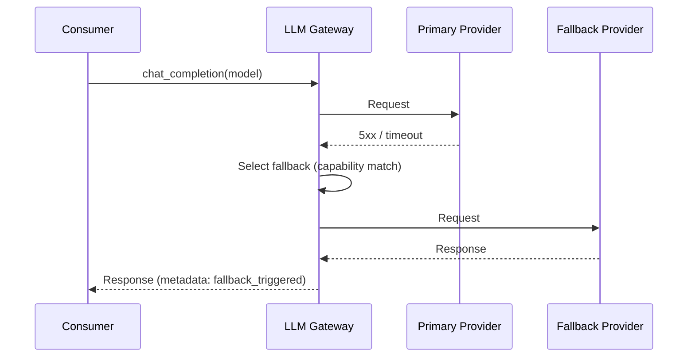
```mermaid
sequenceDiagram
    participant C as Consumer
    participant GW as LLM Gateway
    participant P1 as Primary Provider
    participant P2 as Fallback Provider

    C->>GW: chat_completion(model)
    GW->>P1: Request
    P1-->>GW: 5xx / timeout
    GW->>GW: Select fallback (capability match)
    GW->>P2: Request
    P2-->>GW: Response
    GW-->>C: Response (metadata: fallback_triggered)
```

**Trigger conditions**:
- HTTP 5xx
- Connection timeout
- Rate limit (429) with exhausted retry budget

---

### [ ] S2.2 Retry with Backoff

Transient failures trigger automatic retry with exponential backoff before fallback.

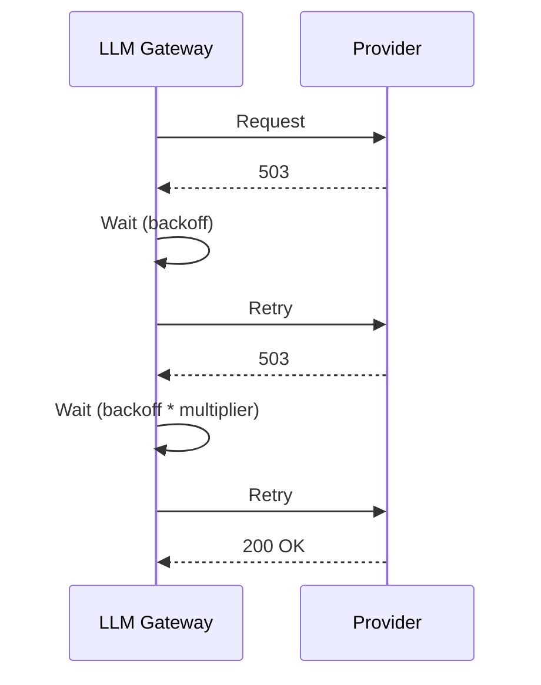
```mermaid
sequenceDiagram
    participant GW as LLM Gateway
    participant P as Provider

    GW->>P: Request
    P-->>GW: 503
    GW->>GW: Wait (backoff)
    GW->>P: Retry #1
    P-->>GW: 503
    GW->>GW: Wait (backoff * multiplier)
    GW->>P: Retry #2
    P-->>GW: 200 OK
```

**Retryable**: 429, 5xx
**Non-retryable**: 4xx (except 429)

---

### [ ] S2.3 Timeout Enforcement

Gateway enforces connection, read, and total request timeouts. On timeout → retry → fallback → error.

---

### [ ] S2.4 Pre-Call Interceptor

Before sending request to provider, Gateway invokes registered hooks. Hooks can allow, block, or modify the request.

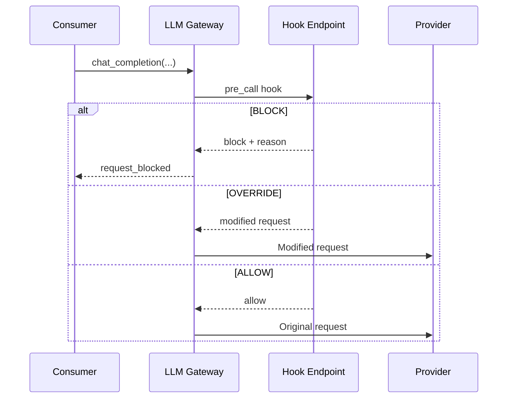
```mermaid
sequenceDiagram
    participant C as Consumer
    participant GW as LLM Gateway
    participant HK as Hook Endpoint
    participant P as Provider

    C->>GW: chat_completion(...)
    GW->>HK: pre_call hook
    alt BLOCK
        HK-->>GW: block + reason
        GW-->>C: request_blocked
    else OVERRIDE
        HK-->>GW: modified request
        GW->>P: Modified request
    else ALLOW
        HK-->>GW: allow
        GW->>P: Original request
    end
```

---

### [ ] S2.5 Post-Response Interceptor

After receiving provider response, Gateway invokes hooks. Hooks can allow, block, or modify the response.

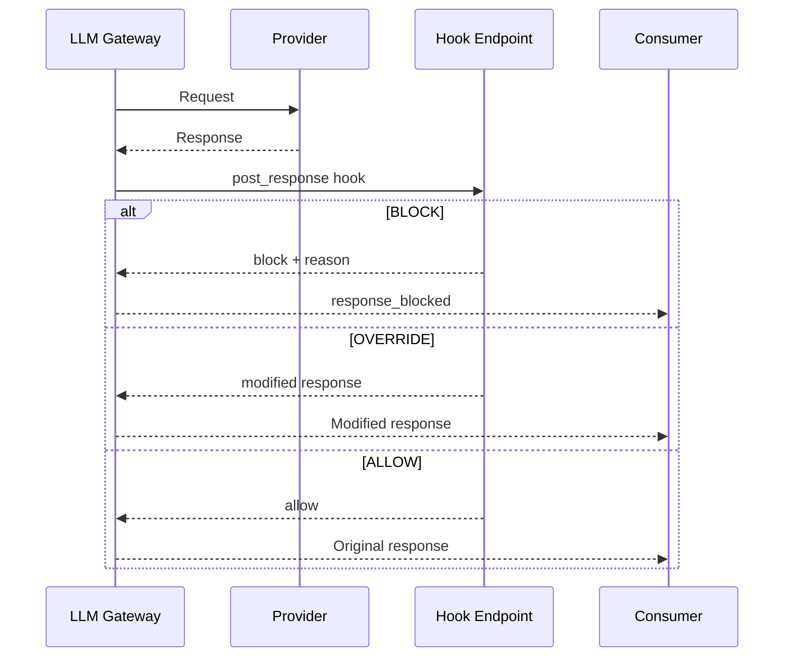
```mermaid
sequenceDiagram
    participant GW as LLM Gateway
    participant P as Provider
    participant HK as Hook Endpoint
    participant C as Consumer

    GW->>P: Request
    P-->>GW: Response
    GW->>HK: post_response hook
    alt BLOCK
        HK-->>GW: block + reason
        GW-->>C: response_blocked
    else OVERRIDE
        HK-->>GW: modified response
        GW-->>C: Modified response
    else ALLOW
        HK-->>GW: allow
        GW-->>C: Original response
    end
```

---

### [ ] S2.6 Per-Tenant Budget Enforcement

Gateway checks tenant budget before execution. Rejects if budget exhausted, deducts actual usage after completion.

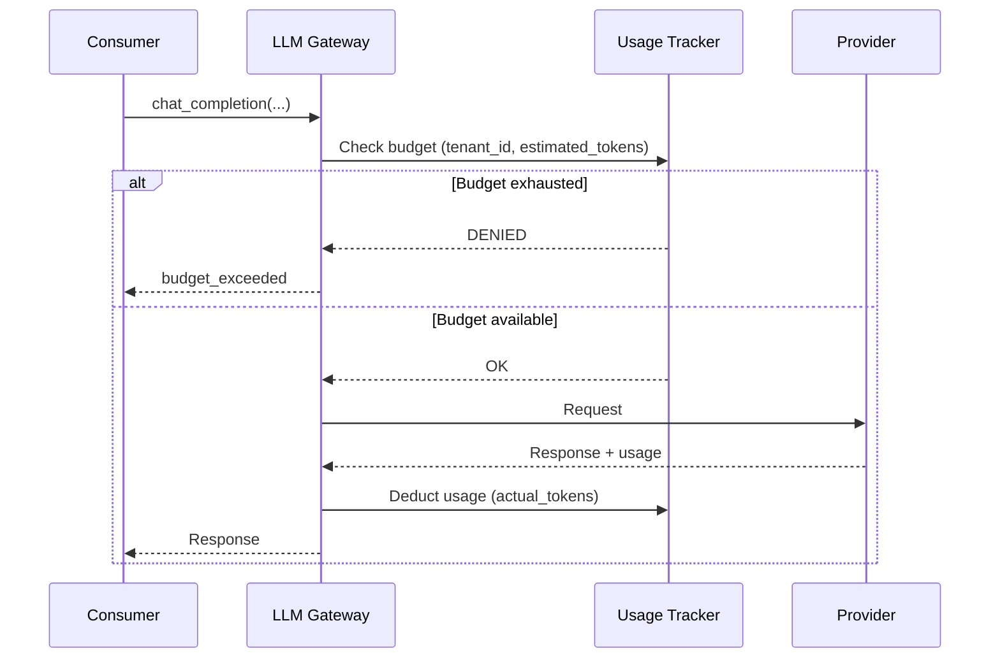
```mermaid
sequenceDiagram
    participant C as Consumer
    participant GW as LLM Gateway
    participant UT as Usage Tracker
    participant P as Provider

    C->>GW: chat_completion(...)
    GW->>UT: Check budget (tenant_id, estimated_tokens)
    alt Budget exhausted
        UT-->>GW: DENIED
        GW-->>C: budget_exceeded
    else Budget available
        UT-->>GW: OK
        GW->>P: Request
        P-->>GW: Response + usage
        GW->>UT: Deduct usage (actual_tokens)
        GW-->>C: Response
    end
```

---

### [ ] S2.7 Request Cancellation

Consumer cancels in-progress request. Gateway propagates cancellation to provider, cleans up resources.

```mermaid
sequenceDiagram
    participant C as Consumer
    participant GW as LLM Gateway
    participant P as Provider

    C->>GW: chat_completion(request_id)
    GW->>P: Request
    C->>GW: cancel(request_id)
    GW->>P: Cancel request
    P-->>GW: cancelled
    GW-->>C: { status: "cancelled" }
```

**Streaming**: Close SSE connection, emit cancellation event.

**Async jobs**: Mark job as cancelled, stop polling provider.

**Partial results**: Optionally return partial response if available.

---

### [ ] S2.8 Rate Limiting

Gateway enforces rate limits at multiple levels. Rejects requests exceeding any limit.

```mermaid
sequenceDiagram
    participant C as Consumer
    participant GW as LLM Gateway
    participant P as Provider

    C->>GW: chat_completion(...)
    GW->>GW: Check tenant limit
    GW->>GW: Check user limit
    alt Any limit exceeded
        GW-->>C: rate_limited
    else All limits OK
        GW->>P: Request
        P-->>GW: Response
        GW-->>C: Response
    end
```

**Levels** (checked in order):
| Level | Key | Description |
|-------|-----|-------------|
| Tenant | tenant_id | Aggregate limit for all users in tenant |
| User | tenant_id + user_id | Per-user limit within tenant |

**Limit types**:
- Requests per second (RPS)
- Concurrent requests
- Tokens per minute (TPM)

**Problem extensions**: `level` (tenant|user), `retry_after` (seconds)

**Headers**: `X-RateLimit-Limit`, `X-RateLimit-Remaining`, `X-RateLimit-Reset`, `Retry-After`

---

## P3 — Optimization

### [ ] S3.1 Cost-Aware Routing

When multiple providers can serve request, Gateway selects based on cost/latency score.

**Factors**:
- Model pricing (per token)
- Current provider latency (from metrics)
- Required capabilities filter

**Selection**: lowest weighted score among capable providers.

---

### [ ] S3.2 Embeddings Batching

Gateway collects embedding requests within time window, batches to single provider call.

**Constraints**:
- No cross-tenant batching
- Partial failure → return error per failed item

---

### [ ] S3.3 Usage Tracking

Gateway reports usage metrics to Usage Tracker after each request.

**Reported**: tokens (prompt, completion), cost estimate, latency, provider, model

**Attribution**: tenant_id, user_id, conversation_id, model_id

---

## P4 — Enterprise

### [ ] S4.1 Audit Events

Gateway emits audit events for compliance tracking.

| Event | Trigger |
|-------|---------|
| llm.request.started | Request initiated |
| llm.request.completed | Request succeeded |
| llm.request.failed | Request failed |
| llm.request.blocked | Blocked by interceptor |
| llm.fallback.triggered | Fallback activated |

**Content policy**: full | redacted | metadata_only (per tenant)
