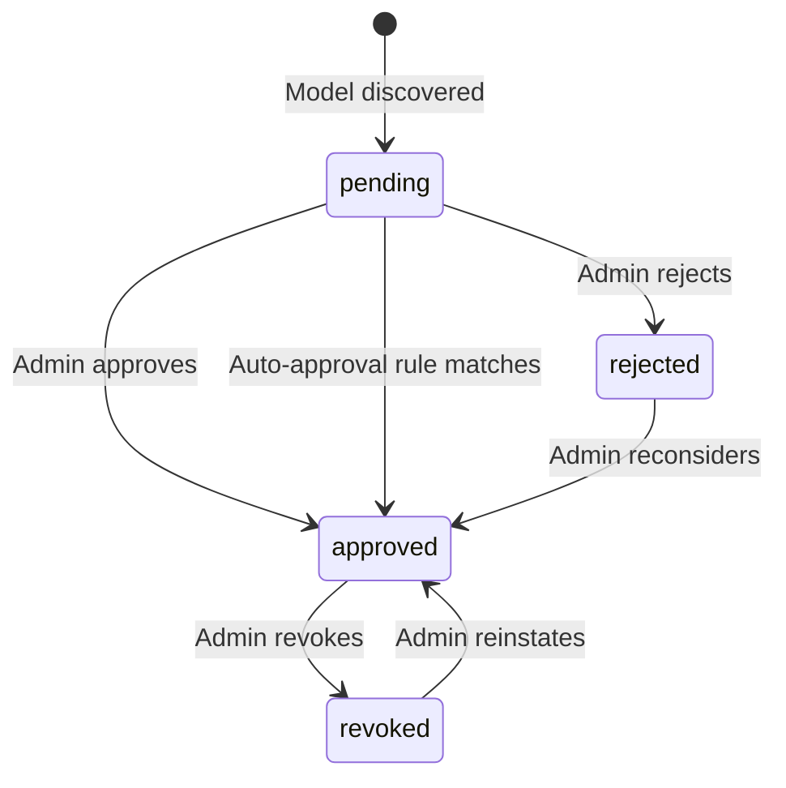

# PRD: Model Registry

## 1. Overview

**Purpose**: Model Registry provides a centralized catalog of AI models with tenant-level availability and approval workflows.

Model Registry is the authoritative source for model metadata, capabilities, pricing, and tenant access control. It tracks which models are available from which providers and manages approval workflows. LLM Gateway queries the registry to resolve model identifiers to provider endpoints and verify tenant access.

**Key Concepts**:

- **Canonical Model ID**: Deterministic identifier in format `{provider}::{provider_model_id}` (e.g., `openai::gpt-4o`). Parsing rule: split on **first** `::` occurrence.
- **Tenant Hierarchy**: Tree structure with root tenant at top; providers and approvals inherit down the tree (additive only)
- **Provider Plugins**: Each provider type has its own plugin; all requests route through Outbound API Gateway

**Target Users**:

- **LLM Gateway** — Primary consumer for model resolution and availability checks
- **Tenant Administrators** — Approve/reject models, manage tenant-specific providers
- **Platform Administrators** — Configure root tenant providers

**Key Problems Solved**:

- **Model discovery**: Automatic polling of provider APIs to discover available models
- **Unified identification**: Canonical IDs abstract provider-specific naming
- **Access control**: Tenant-level approval workflow with hierarchical inheritance
- **Pricing normalization**: AICredits-based pricing with tier support (sync/batch/cached)

**Success Criteria**:

- Model resolution latency < 10ms P99
- 99.9% availability

### 1.1 Background

LLM Gateway requires a centralized source of truth for model availability, capabilities, and pricing. Without Model Registry, each consumer would need to maintain its own model catalog, leading to inconsistency and duplicated approval workflows.

### 1.2 Goals

1. Single source of truth for AI model metadata across the platform
2. Tenant-controlled model availability with inheritance from parent tenants
3. Streamlined approval process

### 1.3 Scope

#### In Scope

- Model catalog CRUD (models, providers)
- Tenant-level model availability configuration
- Approval workflows (request → approve/reject)
- Base pricing metadata (AICredits per tier)
- Model capabilities metadata
- Cache management with TTL-based invalidation

#### Out of Scope

| Item | Reason / Owner |
|------|----------------|
| LLM inference execution | LLM Gateway |
| Provider credential management | OAGW |
| Usage metering & billing | License Manager |
| Tenant hierarchy management | Tenant Resolver |
| Actual rate limiting enforcement | Infrastructure / OAGW |
| Audit log storage & retention | Core platform |
| Model fine-tuning / training | Not in scope for v1 |
| Provider API contracts | Each provider plugin |
| Provider plugin architecture | DESIGN.md |
| Notifications | Separate notification system |

### 1.4 Assumptions

1. Tenant Resolver provides tenant hierarchy data reliably and is highly available
2. OAGW handles all provider authentication
3. OAGW enforces outbound URL policy (blocks internal networks, requires HTTPS)
4. Each provider plugin exposes an endpoint returning available models (implementation is plugin responsibility)
5. Redis is available for distributed caching; if unavailable, fallback to direct DB queries
6. Platform authenticates requests and provides verified tenant context
7. Platform provides audit logging for all operations
8. Platform provides distributed tracing, structured logging, metrics, and health endpoints

### 1.5 Risks

| Risk | Impact | Mitigation |
|------|--------|------------|
| Cache invalidation delay | Stale model data served (up to TTL) | TTL-based expiry (own data 30 min, inherited 5 min) |
| Tenant hierarchy changes | Inherited approvals may become invalid | Invalidate tenant cache on re-parenting event |
| Provider removes model without notice | Requests fail until catalog synced | Periodic sync detection |

### 1.6 Glossary

| Term | Definition |
|------|------------|
| AICredits | Internal platform currency for model usage pricing |
| OAGW | Outbound API Gateway - handles provider authentication and circuit breaking |
| GTS | Global Type System - platform-wide type definitions and contracts |
| Root Tenant | Top-level tenant from which all other tenants inherit |
| Canonical ID | Unique model identifier in format `{provider}::{provider_model_id}` |
| Provider Plugin | Module responsible for communication with specific LLM provider |

## 2. Actors

### 2.1 Human Actors

#### Tenant Administrator

**ID**: `cpt-cf-model-registry-actor-tenant-admin`

<!-- cpt-cf-id-content -->
**Role**: Approves or rejects models for tenant access. Manages tenant-specific providers. Can only restrict access compared to parent tenant, not expand.
<!-- cpt-cf-id-content -->

#### Platform Administrator

**ID**: `cpt-cf-model-registry-actor-platform-admin`

<!-- cpt-cf-id-content -->
**Role**: Manages root tenant configuration. Configures global providers. Sets baseline that all tenants inherit.
<!-- cpt-cf-id-content -->

### 2.2 System Actors

#### LLM Gateway

**ID**: `cpt-cf-model-registry-actor-llm-gateway`

<!-- cpt-cf-id-content -->
**Role**: Queries registry to resolve model identifiers (canonical ID) to provider details. Checks tenant availability. Retrieves model capabilities and pricing.
<!-- cpt-cf-id-content -->

#### Outbound API Gateway

**ID**: `cpt-cf-model-registry-actor-oagw`

<!-- cpt-cf-id-content -->
**Role**: Executes provider API calls for model discovery. Handles credential injection. Model Registry has no knowledge of credentials.
<!-- cpt-cf-id-content -->

#### Provider API

**ID**: `cpt-cf-model-registry-actor-provider-api`

<!-- cpt-cf-id-content -->
**Role**: External provider endpoint (OpenAI, Anthropic, Azure, etc.) that returns available models list.
<!-- cpt-cf-id-content -->

## 3. Domain Model

### 3.1 Core Entities

#### Provider

Represents a configured AI provider for a tenant.

**Fields**: id, tenant_id, name, type (plugin type), base_url, status (active/disabled), discovery config (enabled, interval), timestamps.

**Inheritance**: Providers inherit down tenant hierarchy (additive only). Child tenant sees parent's providers + own. Child cannot hide inherited providers.

**Health**: ProviderHealth stored at provider's owner tenant only. Child tenants inherit health status from parent.

#### Model

Represents an AI model in the catalog.

**Fields**:
- **Identification**: canonical_id (`{provider}::{provider_model_id}`), provider_id, tenant_id, provider_model_id
- **Display**: name, description
- **Capabilities (Tier 1)**: Boolean flags for text/image/audio/video/document input/output, tools, structured_output, streaming, embeddings, realtime_audio, batch_api
- **Limits (Tier 2)**: context_window, max_output_tokens, max_images_per_request, max_image_size_mb, max_audio_duration_sec
- **Pricing**: AICredits per tier (sync/batch/cached) for input/output tokens and media (base pricing only)
- **Status**: active, deprecated (soft-delete with deprecated_at timestamp)
- **Version**: Provider's model version, stored as-is

#### ModelApproval

Tracks tenant approval status for a model.

**Fields**: id, model_canonical_id, tenant_id, status (pending/approved/rejected/revoked), approved_at, approved_by, auto_approval_rule_id (reference to rule that triggered auto-approval, null for manual), rejected_at, rejected_by, revoked_at, revoked_by, timestamps.

**Concurrency**: First write wins - once status changes from `pending`, subsequent approve/reject requests are rejected.

**State Machine**:

#### AutoApprovalRule (P2)

Defines rules for automatic model approval.

**Fields**: id, tenant_id (root = platform-wide), criteria, action (allow/block), priority, created_at, created_by.

**Criteria schema**:
- `provider_type`: string | "*" (required, "*" = any)
- `provider_id`: string | "*" (required, "*" = any)
- `capabilities`: string[] (optional, empty = any)

**Matching**: ALL criteria must match (AND). Model must have ALL listed capabilities (subset matching).

**Rule evaluation**:
- Platform (root tenant) rules set the ceiling
- Tenant rules can only restrict further, not expand
- `block` from platform = blocked for all descendants
- Tenant cannot `allow` what platform blocked

**Authorization**: Read/list visible to tenant admins only.

#### ProviderHealth (P2)

Tracks provider health status from synthetic probes.

**Fields**: provider_id, tenant_id, status (healthy/degraded/unhealthy), metrics (latency p50/p99, consecutive failures/successes), last_check, last_success, last_error, last_error_message.

**Status thresholds**:
- `unhealthy`: 3+ consecutive failures
- `degraded`: response latency > 2000ms
- `healthy`: 2+ consecutive successes, latency OK

**Authorization**: `status` field visible to all authenticated users. Error details (`last_error_message`, `last_error`) visible to tenant admins only.

#### Alias (P2)

Maps human-friendly names to canonical model IDs.

**Fields**: name (1-64 chars, alphanumeric + hyphen/underscore), tenant_id, canonical_id (must be canonical ID, not another alias), created_at, created_by.

**Resolution order**: Tenant alias → Parent tenant alias → ... → Root tenant alias → Canonical ID

**Shadowing**: Child tenant aliases can shadow parent aliases. Child tenant controls their namespace.

## 4. Functional Requirements

### P1 — Core (MVP)

#### Tenant Isolation

- [ ] `p1` - **ID**: `cpt-cf-model-registry-fr-tenant-isolation`

<!-- cpt-cf-id-content -->
The system must enforce tenant isolation for all operations.

- All API operations MUST include tenant context
- Model/Approval queries MUST filter by tenant hierarchy (current tenant + ancestors)
- Write operations MUST validate tenant ownership
- Admin operations (approve/reject) MUST verify actor has admin role for target tenant
<!-- cpt-cf-id-content -->

#### Authorization

- [ ] `p1` - **ID**: `cpt-cf-model-registry-fr-authorization`

<!-- cpt-cf-id-content -->
The system must enforce role-based authorization.

| Operation | Required Role |
|-----------|---------------|
| List/Get models | Any authenticated user |
| Request model approval | Tenant member |
| Approve/Reject request | Tenant admin |
| Manage providers | Platform admin (root tenant) |

**Actors**: `cpt-cf-model-registry-actor-tenant-admin`, `cpt-cf-model-registry-actor-platform-admin`
<!-- cpt-cf-id-content -->

#### Input Validation

- [ ] `p1` - **ID**: `cpt-cf-model-registry-fr-input-validation`

<!-- cpt-cf-id-content -->
The system must validate all input data.

| Field | Validation |
|-------|------------|
| Canonical ID | Must match pattern `{provider}::{model_id}`, provider must exist. Parse on first `::`. |
| Provider name | 1-32 chars, lowercase alphanumeric + hyphen |
| Capabilities | Must conform to GTS capability schema |
| Pricing values | Non-negative decimal (AICredits) |
<!-- cpt-cf-id-content -->

#### Cache Isolation

- [ ] `p1` - **ID**: `cpt-cf-model-registry-fr-cache-isolation`

<!-- cpt-cf-id-content -->
The system must isolate cached data by tenant.

Cache keys MUST include tenant_id as prefix.

Format: `mr:{tenant_id}:{entity}:{id}`

**TTL strategy**:
- Own data (tenant created): TTL 30 min
- Inherited data (from parent): TTL 5 min

**Cache invalidation on tenant re-parenting**: On `tenant.reparented` event, invalidate ALL cache entries for that tenant.

**Redis unavailable**: Fallback to direct DB queries (latency SLOs may be violated).
<!-- cpt-cf-id-content -->

#### Get Tenant Model

- [ ] `p1` - **ID**: `cpt-cf-model-registry-fr-get-tenant-model`

<!-- cpt-cf-id-content -->
The system must resolve a canonical model ID for a tenant, returning model info and provider details if approved.

Resolution:
1. Look up model in catalog by canonical ID
2. Check tenant approval status (direct or inherited)
3. Return model info + provider details

Response structure defined in GTS contract.

**Actors**: `cpt-cf-model-registry-actor-llm-gateway`
<!-- cpt-cf-id-content -->

#### List Tenant Models

- [ ] `p1` - **ID**: `cpt-cf-model-registry-fr-list-tenant-models`

<!-- cpt-cf-id-content -->
The system must return all models available for a tenant.

Includes:
- Models from tenant's own providers (if approved)
- Models inherited from parent tenant hierarchy (if approved at any level)

Follows OData pagination standard. Supports OData `$filter` for filtering by capability, provider, approval_status.

Capability filtering uses subset matching: model must have AT LEAST requested capabilities.

**Actors**: `cpt-cf-model-registry-actor-llm-gateway`
<!-- cpt-cf-id-content -->

#### Model Discovery

- [ ] `p1` - **ID**: `cpt-cf-model-registry-fr-model-discovery`

<!-- cpt-cf-id-content -->
The system must periodically poll providers for available models via Outbound API Gateway.

**Scheduling**: Fixed concurrency limit + staggered intervals across (tenant, provider) pairs.

Per (tenant, provider) pair where discovery is enabled:
- Fetch models from provider's models endpoint (plugin responsibility)
- New models → create with `pending` status
- Existing models → update metadata (capabilities, limits, pricing)
- Missing models → soft-delete (mark as `deprecated`)

**Actors**: `cpt-cf-model-registry-actor-oagw`, `cpt-cf-model-registry-actor-provider-api`
<!-- cpt-cf-id-content -->

#### Model Approval

- [ ] `p1` - **ID**: `cpt-cf-model-registry-fr-model-approval`

<!-- cpt-cf-id-content -->
The system must support tenant-level model approval workflow.

Approval granularity (P1): Tenant-level — approval grants access to all users in tenant.

States: `pending` → `approved` | `rejected`, `approved` → `revoked`, `rejected` → `approved`, `revoked` → `approved`

Concurrency: First write wins - once status changes from `pending`, subsequent approve/reject requests are rejected with `invalid_transition` error.

**Actors**: `cpt-cf-model-registry-actor-tenant-admin`
<!-- cpt-cf-id-content -->

#### Provider Management

- [ ] `p1` - **ID**: `cpt-cf-model-registry-fr-provider-management`

<!-- cpt-cf-id-content -->
The system must support tenant-scoped provider configuration.

Provider inheritance:
- Providers inherit down tenant hierarchy (additive only)
- Child tenant sees parent's providers + own providers
- Child cannot hide or disable inherited providers

Provider config:
- ID, name, type (plugin), base URL, status (active/disabled)
- Discovery enabled/interval

Credentials handled by OAGW — not stored in Model Registry.

**Actors**: `cpt-cf-model-registry-actor-platform-admin`
<!-- cpt-cf-id-content -->

#### Model Pricing

- [ ] `p1` - **ID**: `cpt-cf-model-registry-fr-model-pricing`

<!-- cpt-cf-id-content -->
The system must store and provide model base pricing in AICredits.

Pricing structure:
- Unit: AICredits (internal platform currency)
- Tiers: sync, batch, cached (different rates per tier)
- Media: per image input, per audio minute, per image output

Model Registry returns **base pricing only**. Caller (LLM Gateway) fetches tenant multiplier from License Manager and computes final price.

**Actors**: `cpt-cf-model-registry-actor-llm-gateway`
<!-- cpt-cf-id-content -->

### P2 — Enhanced Features

#### Auto-Approval Rules

- [ ] `p2` - **ID**: `cpt-cf-model-registry-fr-auto-approval`

<!-- cpt-cf-id-content -->
The system must support automatic model approval based on configurable rules.

Rule hierarchy:
- Platform (root tenant) rules set the ceiling (max allowed)
- Tenant rules can only restrict further
- Tenant cannot auto-approve what platform blocked

Rule matching:
- Criteria: provider type, provider ID, required capabilities (all must match)
- Action: `allow` or `block`
- Priority ordering for conflict resolution

Auto-approved models store reference to the triggering rule (`auto_approval_rule_id`).

**Actors**: `cpt-cf-model-registry-actor-tenant-admin`, `cpt-cf-model-registry-actor-platform-admin`
<!-- cpt-cf-id-content -->

#### Provider Health Monitoring

- [ ] `p2` - **ID**: `cpt-cf-model-registry-fr-health-monitoring`

<!-- cpt-cf-id-content -->
The system must track provider health via synthetic probes for LLM Gateway routing decisions.

Probe method:
- Call provider's models endpoint (lightweight, read-only)
- Granularity: per provider (not per model)
- No actual inference calls (cost concern)

Health status:
- `healthy`: responding normally, latency acceptable
- `degraded`: responding but latency > threshold
- `unhealthy`: consecutive failures exceed threshold

Health stored at provider owner tenant only. Child tenants inherit parent's health status.

**Actors**: `cpt-cf-model-registry-actor-oagw`, `cpt-cf-model-registry-actor-provider-api`
<!-- cpt-cf-id-content -->

#### Alias Management

- [ ] `p2` - **ID**: `cpt-cf-model-registry-fr-alias-management`

<!-- cpt-cf-id-content -->
The system must support model aliases with hierarchical scoping.

Alias scope:
- Root tenant: global aliases visible to all tenants
- Child tenant: can override global aliases, add tenant-specific aliases

Resolution order: tenant → parent → ... → root → canonical ID

Constraint: Alias target MUST be a canonical ID, not another alias (prevents circular references).

**Actors**: `cpt-cf-model-registry-actor-tenant-admin`, `cpt-cf-model-registry-actor-platform-admin`
<!-- cpt-cf-id-content -->

#### Degraded Mode

- [ ] `p2` - **ID**: `cpt-cf-model-registry-fr-degraded-mode`

<!-- cpt-cf-id-content -->
The system must define tiered behavior when database is unavailable.

- Model capabilities and metadata: serve from stale cache (up to 30 min TTL)
- Approval verification: fail request with `service_unavailable` error

P1 behavior: DB unavailable = all requests fail (fail-closed).
<!-- cpt-cf-id-content -->

#### Tenant Re-parenting

- [ ] `p2` - **ID**: `cpt-cf-model-registry-fr-tenant-reparenting`

<!-- cpt-cf-id-content -->
The system must handle tenant hierarchy changes.

When tenant moves to different parent:
- Tenant Resolver owns re-parenting logic
- Model Registry invalidates all cache entries for affected tenant on `tenant.reparented` event
- Re-evaluation of approvals happens on next access
<!-- cpt-cf-id-content -->

#### Bulk Operations

- [ ] `p2` - **ID**: `cpt-cf-model-registry-fr-bulk-operations`

<!-- cpt-cf-id-content -->
The system must support batch approval operations: `approve_models(model_ids[])`, `reject_models(model_ids[])`.
<!-- cpt-cf-id-content -->

#### Manual Discovery/Probe Trigger

- [ ] `p2` - **ID**: `cpt-cf-model-registry-fr-manual-trigger`

<!-- cpt-cf-id-content -->
The system must allow platform admins to manually trigger discovery and health probes.
<!-- cpt-cf-id-content -->

### P3 — Fine-Grained Access Control

#### User Group Approval

- [ ] `p3` - **ID**: `cpt-cf-model-registry-fr-user-group-approval`

<!-- cpt-cf-id-content -->
The system must support model approval scoped to user groups within a tenant.

**Actors**: `cpt-cf-model-registry-actor-tenant-admin`
<!-- cpt-cf-id-content -->

#### User-Level Override

- [ ] `p3` - **ID**: `cpt-cf-model-registry-fr-user-level-override`

<!-- cpt-cf-id-content -->
The system must support individual user restrictions/allowances for model access.

**Actors**: `cpt-cf-model-registry-actor-tenant-admin`
<!-- cpt-cf-id-content -->

## 5. Use Cases

### UC-001: Get Tenant Model

- [ ] `p1` - **ID**: `cpt-cf-model-registry-uc-get-tenant-model`

<!-- cpt-cf-id-content -->
**Actor**: `cpt-cf-model-registry-actor-llm-gateway`

**Preconditions**: Tenant context available.

**Flow**:
1. LLM Gateway sends `get_tenant_model(ctx, canonical_id)`
2. Registry looks up model in catalog
3. Registry checks tenant approval (direct or inherited from parent)
4. Registry returns model info + provider details

**Postconditions**: Model info returned or error.

**Acceptance criteria**:
- Returns `model_not_found` (404) if model not in catalog
- Returns `model_not_approved` (403) if not approved for tenant (or any ancestor)
- Returns `model_deprecated` (410) if model was soft-deleted
<!-- cpt-cf-id-content -->

### UC-002: List Tenant Models

- [ ] `p1` - **ID**: `cpt-cf-model-registry-uc-list-tenant-models`

<!-- cpt-cf-id-content -->
**Actor**: `cpt-cf-model-registry-actor-llm-gateway`

**Preconditions**: Tenant context available.

**Flow**:
1. LLM Gateway sends `list_tenant_models(ctx)` with OData query params
2. Registry collects approved models for tenant (direct + inherited)
3. Registry applies OData filters
4. Registry returns paginated models list

**Postconditions**: Filtered models list returned.

**Acceptance criteria**:
- Follows OData pagination standard
- Supports `$filter` by capability flags, provider ID, provider type, approval_status
- Returns only approved models by default
- Excludes deprecated models
<!-- cpt-cf-id-content -->

### UC-003: Model Discovery

- [ ] `p1` - **ID**: `cpt-cf-model-registry-uc-model-discovery`

<!-- cpt-cf-id-content -->
**Actor**: Internal (scheduled job)

**Preconditions**: Provider configured with `discovery.enabled = true`.

**Flow**:
1. Scheduler triggers discovery for (tenant, provider) pair
2. Registry sends GET to provider's models endpoint via OAGW
3. Provider returns models list
4. Registry compares with current catalog:
   - New model → create as `pending`
   - Existing model → update metadata
   - Missing model → mark as `deprecated` (soft-delete)

**Postconditions**: Catalog updated.

**Acceptance criteria**:
- Discovery runs per (tenant, provider) pair
- Fixed concurrency limit with staggered intervals
- Deprecated models are soft-deleted (hidden, not purged)
<!-- cpt-cf-id-content -->

### UC-004: Model Approval

- [ ] `p1` - **ID**: `cpt-cf-model-registry-uc-model-approval`

<!-- cpt-cf-id-content -->
**Actor**: `cpt-cf-model-registry-actor-tenant-admin`

**Preconditions**: Model in `pending` status for tenant.

**Flow**:
1. Tenant admin reviews pending model (use `$filter=approval_status eq 'pending'`)
2. Admin approves or rejects
3. Registry updates approval status

**Postconditions**: Model approval status updated.

**Acceptance criteria**:
- State transitions: `pending` → `approved` | `rejected`
- Approval is tenant-scoped (P1)
- Approval recorded with actor and timestamp
- Concurrent requests: first write wins
<!-- cpt-cf-id-content -->

### UC-005: Model Revocation

- [ ] `p1` - **ID**: `cpt-cf-model-registry-uc-model-revocation`

<!-- cpt-cf-id-content -->
**Actor**: `cpt-cf-model-registry-actor-tenant-admin`

**Preconditions**: Model in `approved` status for tenant.

**Flow**:
1. Tenant admin selects approved model
2. Admin initiates revocation
3. Registry updates status to `revoked`

**Postconditions**: Model access revoked.

**Acceptance criteria**:
- Revoked models return `model_not_approved` on access attempts
- In-flight requests complete, new requests rejected
- Revocation recorded with actor and timestamp
- Model can be reinstated: `revoked` → `approved`
<!-- cpt-cf-id-content -->

### UC-006: Register Provider

- [ ] `p1` - **ID**: `cpt-cf-model-registry-uc-register-provider`

<!-- cpt-cf-id-content -->
**Actor**: `cpt-cf-model-registry-actor-platform-admin`

**Preconditions**: Provider plugin exists for the specified type.

**Flow**:
1. Admin provides provider config (name, type, base_url, discovery config)
2. Registry validates config against plugin requirements
3. Registry creates provider record with status `active`

**Postconditions**: Provider available for model sync.

**Acceptance criteria**:
- Provider ID must be unique within tenant
- Plugin type must be supported
<!-- cpt-cf-id-content -->

### UC-007: Disable Provider

- [ ] `p1` - **ID**: `cpt-cf-model-registry-uc-disable-provider`

<!-- cpt-cf-id-content -->
**Actor**: `cpt-cf-model-registry-actor-platform-admin`

**Preconditions**: Provider is active.

**Flow**:
1. Admin requests provider disable
2. Registry marks provider status as `disabled`
3. Registry suspends discovery for this provider

**Postconditions**: Provider disabled, models not resolvable.

**Acceptance criteria**:
- Disabled provider's models return `provider_not_found`
- Discovery suspended
<!-- cpt-cf-id-content -->

### UC-008: Re-enable Provider

- [ ] `p1` - **ID**: `cpt-cf-model-registry-uc-reenable-provider`

<!-- cpt-cf-id-content -->
**Actor**: `cpt-cf-model-registry-actor-platform-admin`

**Preconditions**: Provider is disabled.

**Flow**:
1. Admin requests provider re-enable
2. Registry marks provider status as `active`
3. Discovery resumes on next scheduled run

**Postconditions**: Provider active, models resolvable.
<!-- cpt-cf-id-content -->

### UC-009: Get Model Pricing

- [ ] `p1` - **ID**: `cpt-cf-model-registry-uc-get-pricing`

<!-- cpt-cf-id-content -->
**Actor**: `cpt-cf-model-registry-actor-llm-gateway`

**Preconditions**: Model exists.

**Flow**:
1. Gateway sends `get_pricing(model_id)`
2. Registry retrieves base pricing for model
3. Registry returns base pricing by tier

**Postconditions**: Base pricing returned.

**Acceptance criteria**:
- Returns base pricing in AICredits (caller computes final price)
- Tiers: sync, batch, cached
- Media pricing included if applicable
<!-- cpt-cf-id-content -->

### UC-010: Configure Auto-Approval Rule

- [ ] `p2` - **ID**: `cpt-cf-model-registry-uc-auto-approval-rule`

<!-- cpt-cf-id-content -->
**Actor**: `cpt-cf-model-registry-actor-tenant-admin`, `cpt-cf-model-registry-actor-platform-admin`

**Preconditions**: Actor has admin role for target tenant.

**Flow**:
1. Admin defines rule criteria (provider type, provider ID, capabilities)
2. Admin sets action (`allow` or `block`) and priority
3. Registry validates rule does not expand beyond platform ceiling
4. Registry creates rule

**Postconditions**: Rule active for future model discoveries.

**Acceptance criteria**:
- Tenant rules cannot allow what platform blocked
- Rules evaluated in priority order
- Auto-approved models reference the triggering rule
<!-- cpt-cf-id-content -->

### UC-011: Check Provider Health

- [ ] `p2` - **ID**: `cpt-cf-model-registry-uc-provider-health`

<!-- cpt-cf-id-content -->
**Actor**: `cpt-cf-model-registry-actor-llm-gateway`

**Preconditions**: Provider exists and health monitoring enabled.

**Flow**:
1. Gateway queries provider health status
2. Registry returns health status (healthy/degraded/unhealthy)
3. Gateway uses status for routing decisions

**Postconditions**: Health status returned.

**Acceptance criteria**:
- Status field visible to all authenticated users
- Error details visible only to tenant admins
- Child tenants inherit parent's provider health
<!-- cpt-cf-id-content -->

### UC-012: Create Alias

- [ ] `p2` - **ID**: `cpt-cf-model-registry-uc-create-alias`

<!-- cpt-cf-id-content -->
**Actor**: `cpt-cf-model-registry-actor-tenant-admin`, `cpt-cf-model-registry-actor-platform-admin`

**Preconditions**: Target canonical ID exists.

**Flow**:
1. Admin provides alias name and target canonical ID
2. Registry validates alias name format (1-64 chars, alphanumeric + hyphen/underscore)
3. Registry validates target is canonical ID (not another alias)
4. Registry creates alias scoped to tenant

**Postconditions**: Alias resolvable for tenant and descendants.

**Acceptance criteria**:
- Alias name must be unique within tenant
- Target must be canonical ID, not alias (prevents cycles)
- Child tenant aliases can shadow parent aliases
<!-- cpt-cf-id-content -->

### UC-013: Resolve Alias

- [ ] `p2` - **ID**: `cpt-cf-model-registry-uc-resolve-alias`

<!-- cpt-cf-id-content -->
**Actor**: `cpt-cf-model-registry-actor-llm-gateway`

**Preconditions**: Alias or canonical ID provided.

**Flow**:
1. Gateway sends model identifier (alias or canonical ID)
2. Registry checks tenant aliases → parent aliases → ... → root aliases
3. Registry returns resolved canonical ID

**Postconditions**: Canonical ID returned.

**Acceptance criteria**:
- Resolution order: tenant → parent → ... → root → canonical ID
- Non-existent alias falls through to canonical ID lookup
<!-- cpt-cf-id-content -->

### UC-014: Handle Degraded Mode

- [ ] `p2` - **ID**: `cpt-cf-model-registry-uc-degraded-mode`

<!-- cpt-cf-id-content -->
**Actor**: `cpt-cf-model-registry-actor-llm-gateway`

**Preconditions**: Database unavailable.

**Flow**:
1. Gateway requests model info
2. Registry detects DB unavailable
3. For metadata: serve from stale cache (up to TTL)
4. For approval check: return `service_unavailable` error

**Postconditions**: Partial response or error returned.

**Acceptance criteria**:
- Metadata served from cache (best-effort)
- Approval verification always fails when DB unavailable
- Error clearly indicates degraded state
<!-- cpt-cf-id-content -->

### UC-015: Handle Tenant Re-parenting

- [ ] `p2` - **ID**: `cpt-cf-model-registry-uc-tenant-reparenting`

<!-- cpt-cf-id-content -->
**Actor**: Internal (event handler)

**Preconditions**: Tenant Resolver emits `tenant.reparented` event.

**Flow**:
1. Registry receives `tenant.reparented` event
2. Registry invalidates ALL cache entries for affected tenant
3. Next access triggers fresh resolution with new hierarchy

**Postconditions**: Cache invalidated, approvals re-evaluated on access.

**Acceptance criteria**:
- All cache keys with tenant prefix invalidated
- No stale inherited data served after re-parenting
<!-- cpt-cf-id-content -->

### UC-016: Bulk Approve Models

- [ ] `p2` - **ID**: `cpt-cf-model-registry-uc-bulk-approve`

<!-- cpt-cf-id-content -->
**Actor**: `cpt-cf-model-registry-actor-tenant-admin`

**Preconditions**: Models in `pending` status for tenant.

**Flow**:
1. Admin provides list of model IDs to approve
2. Registry validates all models exist and are in valid state
3. Registry approves all models in single transaction

**Postconditions**: All models approved or none (atomic).

**Acceptance criteria**:
- Atomic operation (all succeed or all fail)
- Returns list of results per model
- Maximum batch size enforced (configurable)
<!-- cpt-cf-id-content -->

### UC-017: Trigger Manual Discovery

- [ ] `p2` - **ID**: `cpt-cf-model-registry-uc-manual-discovery`

<!-- cpt-cf-id-content -->
**Actor**: `cpt-cf-model-registry-actor-platform-admin`

**Preconditions**: Provider configured with discovery enabled.

**Flow**:
1. Admin requests immediate discovery for provider
2. Registry queues discovery job with high priority
3. Discovery runs outside normal schedule

**Postconditions**: Provider catalog updated.

**Acceptance criteria**:
- Does not affect normal discovery schedule
- Returns job status (queued/running/completed)
- Rate limited to prevent abuse
<!-- cpt-cf-id-content -->

### UC-018: Approve Model for User Group

- [ ] `p3` - **ID**: `cpt-cf-model-registry-uc-user-group-approval`

<!-- cpt-cf-id-content -->
**Actor**: `cpt-cf-model-registry-actor-tenant-admin`

**Preconditions**: Model approved at tenant level, user groups defined.

**Flow**:
1. Admin selects approved model
2. Admin restricts access to specific user groups
3. Registry creates group-scoped approval

**Postconditions**: Model accessible only to specified groups.

**Acceptance criteria**:
- Group approval is restriction (not expansion) of tenant approval
- Users in multiple groups get union of permissions
<!-- cpt-cf-id-content -->

### UC-019: Override User Access

- [ ] `p3` - **ID**: `cpt-cf-model-registry-uc-user-override`

<!-- cpt-cf-id-content -->
**Actor**: `cpt-cf-model-registry-actor-tenant-admin`

**Preconditions**: Model has tenant or group approval.

**Flow**:
1. Admin selects user and model
2. Admin grants or revokes access for specific user
3. Registry creates user-level override

**Postconditions**: User access modified independent of group/tenant.

**Acceptance criteria**:
- User override takes precedence over group and tenant approvals
- Can both grant (if tenant allows) and revoke access
<!-- cpt-cf-id-content -->

## 6. Auditable Operations

The following operations MUST be logged for audit compliance:

| Operation | Audit Fields |
|-----------|--------------|
| Model approved | model_id, tenant_id, actor_id, timestamp |
| Model rejected | model_id, tenant_id, actor_id, timestamp |
| Model revoked | model_id, tenant_id, actor_id, timestamp |
| Provider registered | provider_id, tenant_id, actor_id, timestamp |
| Provider disabled | provider_id, tenant_id, actor_id, timestamp |
| Provider enabled | provider_id, tenant_id, actor_id, timestamp |
| Alias created (P2) | alias_name, target, tenant_id, actor_id, timestamp |
| Alias updated (P2) | alias_name, old_target, new_target, tenant_id, actor_id, timestamp |
| Alias deleted (P2) | alias_name, tenant_id, actor_id, timestamp |
| Auto-approval rule created (P2) | rule_id, criteria, tenant_id, actor_id, timestamp |
| Auto-approval rule updated (P2) | rule_id, tenant_id, actor_id, timestamp |
| Auto-approval rule deleted (P2) | rule_id, tenant_id, actor_id, timestamp |

Read operations are not audited (high volume, low value).

## 7. Non-Functional Requirements

### Performance

- [ ] `p1` - **ID**: `cpt-cf-model-registry-nfr-performance`

<!-- cpt-cf-id-content -->
| Operation | P50 | P99 |
|-----------|-----|-----|
| `get_tenant_model` | 2ms | 10ms |
| `list_tenant_models` | 10ms | 50ms |
| `approve_model` | - | 100ms |
| Discovery job (per provider) | - | 30s |

Caching: Distributed cache (Redis) with TTL-based invalidation.
- Own data: 30 min TTL
- Inherited data: 5 min TTL
<!-- cpt-cf-id-content -->

### Availability

- [ ] `p1` - **ID**: `cpt-cf-model-registry-nfr-availability`

<!-- cpt-cf-id-content -->
Target: 99.9% availability.

P1: DB unavailable = requests fail (fail-closed).

P2: Tiered degraded mode (metadata from cache, approval check fails).

Redis unavailable: Fallback to direct DB queries (higher latency).
<!-- cpt-cf-id-content -->

### Scale

- [ ] `p1` - **ID**: `cpt-cf-model-registry-nfr-scale`

<!-- cpt-cf-id-content -->
| Dimension | Target |
|-----------|--------|
| Models per provider | 100 |
| Providers per tenant | 20 |
| Tenants | 10,000 |
| Total models (worst case) | ~2,000,000 |
| Read:Write ratio | 1000:1 |
<!-- cpt-cf-id-content -->

### Rate Limiting

- [ ] `p1` - **ID**: `cpt-cf-model-registry-nfr-rate-limiting`

<!-- cpt-cf-id-content -->
The system must specify rate limits for admin operations (enforcement by infrastructure).

| Operation | Limit |
|-----------|-------|
| Model approval requests | 100/min per tenant |
| Provider management | 10/min (platform-wide) |

All limits must be configurable.
<!-- cpt-cf-id-content -->

## 8. Error Codes

| Code | HTTP Status | Description |
|------|-------------|-------------|
| `model_not_found` | 404 | Model identifier does not exist in catalog |
| `model_not_approved` | 403 | Model exists but not approved for tenant |
| `model_deprecated` | 410 | Model was removed by provider (soft-deleted) |
| `provider_not_found` | 404 | Provider identifier does not exist |
| `provider_disabled` | 404 | Provider exists but is disabled |
| `invalid_transition` | 409 | Invalid approval state transition (e.g., concurrent modification) |
| `validation_error` | 400 | Input validation failed |
| `unauthorized` | 403 | Actor lacks required role for operation |
| `service_unavailable` | 503 | Database unavailable |

Error responses follow RFC 9457 Problem Details standard.

## 9. Security Considerations

| Threat | Mitigation |
|--------|------------|
| Tenant data leakage | Tenant ID prefix in all cache keys; query filters enforce tenant scope |
| Unauthorized approval | Role-based authorization checks on all admin operations |
| Cache poisoning | TTL-based expiry; no user-controlled cache keys |
| Provider credential exposure | Credentials handled by OAGW, not stored in Model Registry |
| Privilege escalation via hierarchy | Child tenants can only restrict, not expand parent permissions |
| Stale approval served | Approval status always verified from DB (P1 fail-closed) |

## 10. Dependencies

| Module | Role |
|--------|------|
| Outbound API Gateway | Execute provider API calls (discovery) |
| Tenant Resolver | Resolve tenant hierarchy (parent, children) |
| GTS | API contract types |

## 11. Consumers

| Module | Usage |
|--------|-------|
| LLM Gateway | Model resolution, availability checks, pricing |
| Chat Engine | Model selection for conversations |
| Tenant Admin UI | Approval management, provider configuration |

## 12. Public Library Interfaces

To be defined in DESIGN.md.

Key interfaces:
- `ModelRegistryClient` — SDK for LLM Gateway integration
- `AdminClient` — SDK for Tenant Admin UI

## 13. Acceptance Criteria

| Category | Criteria | Priority |
|----------|----------|----------|
| Functional | All P1 Use Cases pass acceptance tests | P1 |
| Performance | `get_tenant_model` < 10ms P99 | P1 |
| Performance | `list_tenant_models` < 50ms P99 | P1 |
| Availability | 99.9% uptime | P1 |
| Security | Tenant isolation enforced for all operations | P1 |
| Security | Authorization checks pass for all protected endpoints | P1 |
| Integration | LLM Gateway can resolve models and check availability | P1 |
| Integration | Tenant Admin UI can manage approvals | P1 |

## 14. Open Questions

| # | Question | Status | Decision |
|---|----------|--------|----------|
| 1 | Database-level locking vs application-level for approval concurrency | Deferred | ADR to be created |
| 2 | Specific QPS targets per endpoint | Deferred | DESIGN.md |
| 3 | Provider plugin retry policies | Deferred | DESIGN.md |

## 15. Migration & Rollback

**Initial deployment**: No migration required (greenfield).

**Schema changes**:
- Forward-compatible changes only
- Rollback via previous deployment + compatible schema

**Data migration**: To be defined per release in DESIGN.md.

**Cache invalidation on deployment**: Clear all cache keys on major version deployment.

## 16. Traceability

| Artifact | Link |
|----------|------|
| LLM Gateway PRD | `modules/llm_gateway/docs/PRD.md` |
| ADR: Stateless Gateway | `modules/llm_gateway/docs/ADR/0001-fdd-llmgw-adr-stateless.md` |
| ADR: Pass-through Content | `modules/llm_gateway/docs/ADR/0002-fdd-llmgw-adr-pass-through.md` |
| ADR: Circuit Breaking | `modules/llm_gateway/docs/ADR/0004-fdd-llmgw-adr-circuit-breaking.md` |
| OData Pagination Standard | `docs/modkit_unified_system/07_odata_pagination_select_filter.md` |
| Error Handling Standard | `docs/modkit_unified_system/05_errors_rfc9457.md` |
| GTS Contracts | `gts/` (to be defined) |
