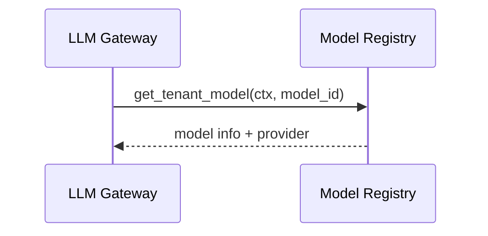
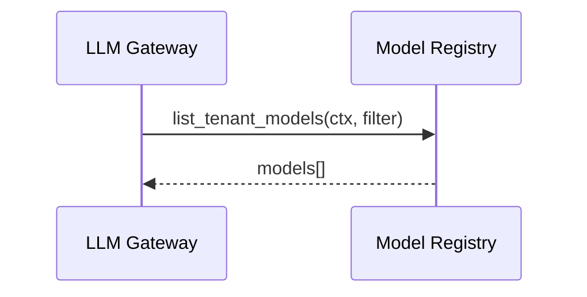
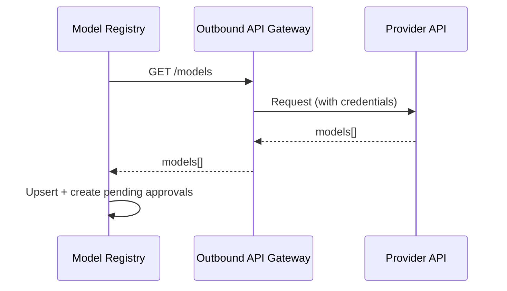

# Model Registry — PRD

Model catalog with tenant-level availability and approval workflow.

## Scenarios

### S1 Get Tenant Model

LLM Gateway resolves model availability for current tenant.

### S2 List Tenant Models

LLM Gateway queries available models for current tenant.

### S3 Model Discovery

Registry polls providers for available models via Outbound API Gateway.

### S4 Model Approval

New models require tenant admin approval before becoming available.

**Statuses**: `pending` → `approved` | `rejected` | `revoked`

**Auto-approval**: configurable per tenant/provider

## Dependencies

| Module | Role |
|--------|------|
| Outbound API Gateway | Provider API calls |
| Tenant Resolver | Tenant context |

## Errors

| Error | HTTP | Description |
|-------|------|-------------|
| `model_not_found` | 404 | Model not in catalog |
| `model_not_approved` | 403 | Model not approved for tenant |
| `model_deprecated` | 410 | Model sunset |
