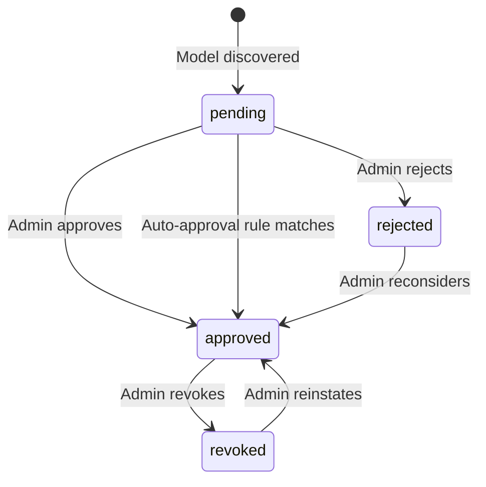

# PRD

## 1. Overview

**Purpose**: Model Registry provides a centralized catalog of AI models with tenant-level availability and approval workflow.

Model Registry is the authoritative source for model metadata, capabilities, and tenant access control. It tracks which models are available from which providers, manages approval workflows for new models, and monitors provider health for routing decisions. LLM Gateway queries the registry to resolve model identifiers to provider endpoints and verify tenant access.

The registry supports automatic model discovery from providers, requiring tenant admin approval before models become available. It also tracks provider health metrics (latency, error rates) to inform Gateway routing decisions.

**Target Users**:
- **LLM Gateway** - Primary consumer for model resolution and availability checks
- **Tenant Administrators** - Approve/reject models for their tenant

**Key Problems Solved**:
- **Model discovery**: Automatic polling of provider APIs to discover available models
- **Access control**: Tenant-level approval workflow for model access
- **Health tracking**: Provider health metrics for intelligent routing

**Success Criteria**:
- All scenarios (S1-S6) implemented and operational
- Model resolution latency < 10ms P99
- Provider health status updated within health check interval

**Capabilities**:
- Model catalog management
- Tenant-level model availability
- Model approval workflow
- Provider health monitoring
- Model capability and pricing metadata

## 2. Actors

### 2.1 Human Actors

#### Tenant Administrator

**ID**: `cpt-cf-model-registry-actor-tenant-admin`

**Role**: Approves or rejects models for tenant access. Configures auto-approval policies per provider.

### 2.2 System Actors

#### LLM Gateway

**ID**: `cpt-cf-model-registry-actor-llm-gateway`

**Role**: Queries registry to resolve model to provider, check tenant availability, and get model capabilities.

#### Outbound API Gateway

**ID**: `cpt-cf-model-registry-actor-outbound-api-gateway`

**Role**: Executes provider API calls for model discovery and health probes.

#### Provider API

**ID**: `cpt-cf-model-registry-actor-provider-api`

**Role**: External provider endpoint that returns available models list and responds to health probes.

## 3. Functional Requirements

#### Get Tenant Model

- [ ] `p1` - **ID**: `cpt-cf-model-registry-fr-get-tenant-model-v1`

The system must resolve model availability for a tenant, returning model info and provider details if approved.

**Actors**: `cpt-cf-model-registry-actor-llm-gateway`

#### List Tenant Models

- [ ] `p1` - **ID**: `cpt-cf-model-registry-fr-list-tenant-models-v1`

The system must return all models available for a tenant, supporting filtering by capability and provider.

**Actors**: `cpt-cf-model-registry-actor-llm-gateway`

#### Model Discovery

- [ ] `p1` - **ID**: `cpt-cf-model-registry-fr-model-discovery-v1`

The system must poll providers for available models via Outbound API Gateway, upserting new models and creating pending approvals.

**Actors**: `cpt-cf-model-registry-actor-outbound-api-gateway`, `cpt-cf-model-registry-actor-provider-api`

#### Model Approval

- [ ] `p1` - **ID**: `cpt-cf-model-registry-fr-model-approval-v1`

The system must support model approval workflow with statuses: pending, approved, rejected, revoked. Must support auto-approval configuration per tenant/provider.

**Actors**: `cpt-cf-model-registry-actor-tenant-admin`

#### Provider Health Monitoring

- [ ] `p1` - **ID**: `cpt-cf-model-registry-fr-health-monitoring-v1`

The system must track provider health metrics (latency, error rate, availability status) via periodic health probes for LLM Gateway routing decisions.

**Actors**: `cpt-cf-model-registry-actor-outbound-api-gateway`, `cpt-cf-model-registry-actor-provider-api`

## 4. Use Cases

#### UC-001: Get Tenant Model

- [ ] `p1` - **ID**: `cpt-cf-model-registry-usecase-get-tenant-model-v1`
**Actor**: `cpt-cf-model-registry-actor-llm-gateway`

**Preconditions**: Model exists in catalog.

**Flow**:
1. LLM Gateway sends get_tenant_model(ctx, model_id)
2. Registry looks up model in catalog
3. Registry checks tenant approval status
4. Registry returns model info + provider

**Postconditions**: Model info returned or error.

**Acceptance criteria**:
- Returns model_not_found if model not in catalog
- Returns model_not_approved if not approved for tenant
- Returns model_deprecated if model sunset

#### UC-002: List Tenant Models

- [ ] `p1` - **ID**: `cpt-cf-model-registry-usecase-list-tenant-models-v1`
**Actor**: `cpt-cf-model-registry-actor-llm-gateway`

**Preconditions**: Tenant context available.

**Flow**:
1. LLM Gateway sends list_tenant_models(ctx, filter)
2. Registry queries approved models for tenant
3. Registry applies filters
4. Registry returns models list

**Postconditions**: Filtered models list returned.

**Acceptance criteria**:
- Supports filtering by capability, provider, modality
- Returns only approved models
- Includes capabilities, context limits, pricing

#### UC-003: Model Discovery

- [ ] `p1` - **ID**: `cpt-cf-model-registry-usecase-model-discovery-v1`
**Actor**: Internal (scheduled job)

**Preconditions**: Provider configured in registry.

**Flow**:
1. Registry triggers discovery (scheduled or manual)
2. Registry sends GET /models via Outbound API Gateway
3. Provider returns models list
4. Registry upserts models
5. Registry creates pending approvals for new models

**Postconditions**: Catalog updated, pending approvals created.

**Acceptance criteria**:
- New models create pending approvals
- Existing models updated with latest metadata
- Removed models marked as deprecated

#### UC-004: Model Approval

- [ ] `p1` - **ID**: `cpt-cf-model-registry-usecase-model-approval-v1`
**Actor**: `cpt-cf-model-registry-actor-tenant-admin`

**Preconditions**: Model in pending status for tenant.

**Flow**:
1. Tenant admin reviews pending model
2. Admin approves or rejects
3. Registry updates approval status
4. Model becomes available (if approved)

**Postconditions**: Model approval status updated.

**Acceptance criteria**:
- Statuses: pending → approved | rejected | revoked
- Auto-approval configurable per tenant/provider
- Revoked models immediately unavailable

**State Machine**:

**State descriptions**:
- **pending**: New model discovered, awaiting tenant admin decision
- **approved**: Model available for tenant use
- **rejected**: Model explicitly denied for tenant
- **revoked**: Previously approved model access withdrawn

#### UC-005: Model Revocation

- [ ] `p1` - **ID**: `cpt-cf-model-registry-usecase-model-revocation-v1`
**Actor**: `cpt-cf-model-registry-actor-tenant-admin`

**Preconditions**: Model in approved status for tenant.

**Flow**:
1. Tenant admin selects approved model
2. Admin initiates revocation
3. Registry updates status to revoked
4. Model immediately becomes unavailable for tenant

**Postconditions**: Model access revoked.

**Acceptance criteria**:
- Revoked models return model_not_approved on access attempts
- Active streaming requests may continue, new requests rejected
- Revocation is auditable (timestamp, admin who revoked)
- Model can be reinstated (revoked → approved)

#### UC-006: Provider Health Monitoring

- [ ] `p1` - **ID**: `cpt-cf-model-registry-usecase-health-monitoring-v1`
**Actor**: Internal (scheduled job)

**Preconditions**: Provider configured with health endpoint.

**Flow**:
1. Registry triggers health probe (on interval)
2. Registry sends probe via Outbound API Gateway
3. Provider responds (or times out/errors)
4. Registry updates provider health state

**Postconditions**: Provider health metrics updated.

**Acceptance criteria**:
- Metrics: latency, error rate, availability status
- Health state available for Gateway routing
- Configurable health check interval

## 5. Non-functional requirements

#### N/A

- [ ] `p1` - **ID**: `cpt-cf-model-registry-nfr-na`

<!-- NFRs to be defined later -->
