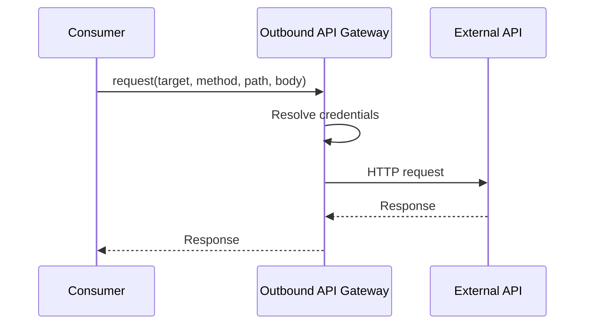
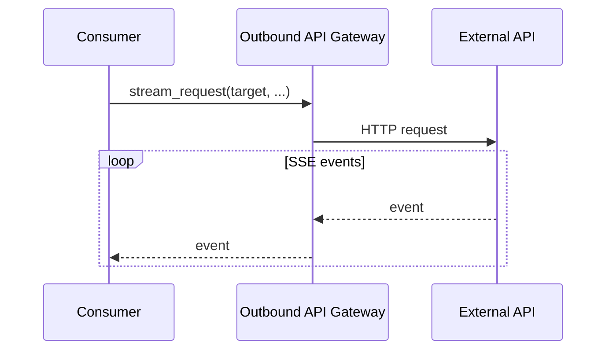
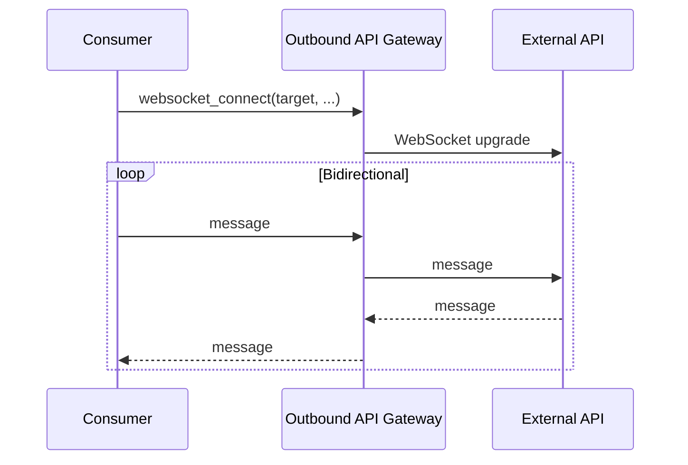

# Outbound API Gateway — PRD

Centralized gateway for external API calls with credentials, reliability, and observability.

## Scenarios

### S1 HTTP Request

### S2 Streaming (SSE)

### S3 WebSocket

## Features

| Feature | Description |
|---------|-------------|
| **Credentials** | Bearer, API key, Basic, OAuth2 |
| **Retry** | Exponential backoff for 429, 5xx |
| **Circuit Breaker** | Fail fast when target is down |
| **Rate Limiting** | Per-target outbound limits |
| **Timeouts** | Connect, read, total |

## Dependencies

| Module | Role |
|--------|------|
| Credential Resolver | API keys, tokens |

## Errors

| Error | HTTP | Description |
|-------|------|-------------|
| `target_not_found` | 404 | Unknown target |
| `connection_timeout` | 504 | Connection timeout |
| `circuit_open` | 503 | Circuit breaker open |
| `rate_limited` | 429 | Outbound rate limit |
