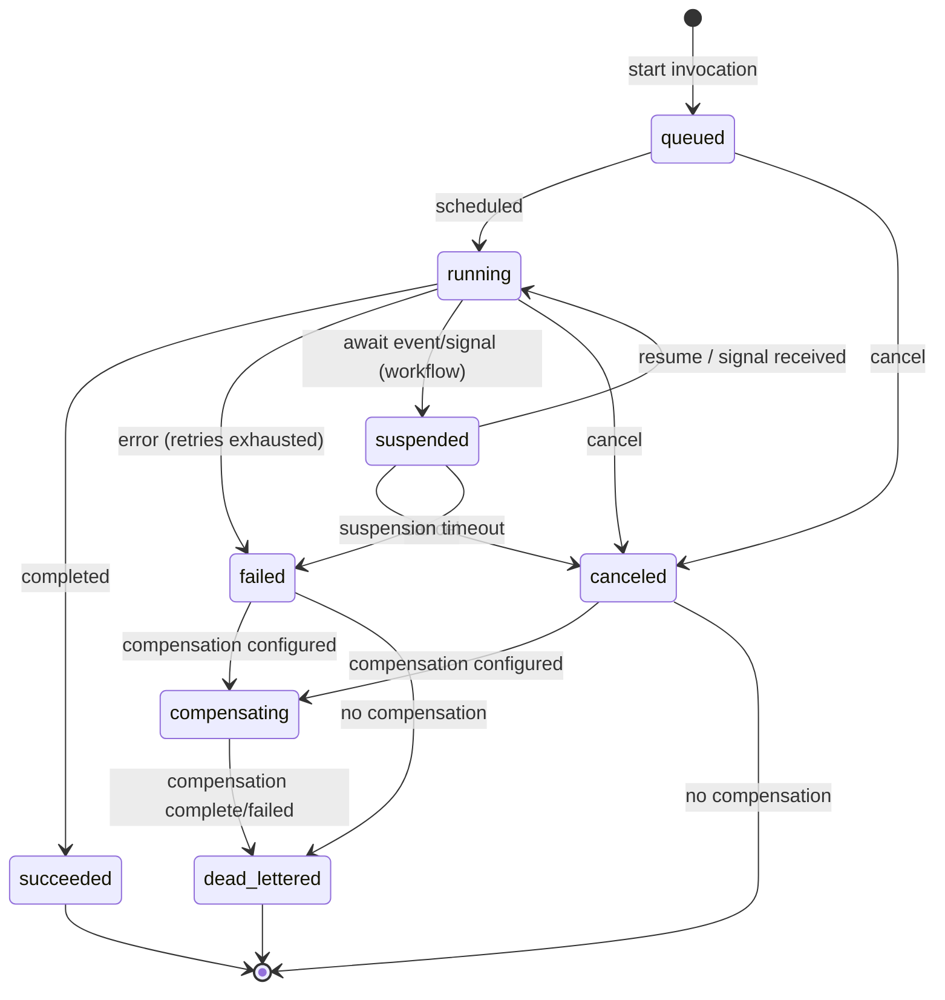
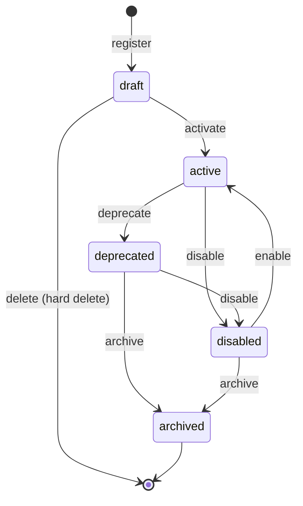

# ADR — Serverless Runtime Domain Model and APIs

## Status

Proposed

## Context

The Serverless Runtime module needs a stable, implementation-agnostic domain model and API contract that:

- supports runtime creation, registration, and invocation of functions and workflows
- provides tenant-safe isolation with security context propagation
- enables observability, governance, and lifecycle management
- can be satisfied by different implementation technologies (Temporal, Starlark, cloud-native FaaS)

This ADR defines:

- core domain entities and their relationships
- GTS-based identifier conventions
- API contracts for definition management, invocation, scheduling, and observability
- error taxonomy and status model
- governance and quota structures

This document is intentionally implementation-agnostic per the PRD requirements and serves as the unified contract
between API consumers and runtime implementations.

## Goals

- Provide a stable domain model for functions and workflows (unified as entrypoints).
- Satisfy PRD business requirements for governance, durability, security context, and observability.
- Keep runtime implementation agnostic (Temporal, Starlark, cloud FaaS, etc.).
- Provide a consistent API surface with explicit validation, lifecycle control, and auditability.

## Non-Goals

- Selecting a specific runtime technology.
- Defining workflow DSL syntax in detail (implementation-specific).
- Defining UI/UX for authoring or debugging workflows.

---

## Domain Model

This section defines the core domain entities following
the [GTS specification](https://github.com/globaltypesystem/gts-spec).
All type definitions use GTS identifiers and JSON Schema for validation.

### Entrypoints

Functions and workflows are unified as **entrypoints** — registered definitions that can be invoked via the runtime API.
They are distinguished via GTS type inheritance:

| Entrypoint Type                                                                              | Description          |
|----------------------------------------------------------------------------------------------|----------------------|
| gts.x.core.serverless.entrypoint.v1~                                                         | Base entrypoint type |
| gts.x.core.serverless.entrypoint.v1~x.core.serverless.function.v1~                           | Function type        |
| gts.x.core.serverless.entrypoint.v1~x.core.serverless.workflow.v1~                           | Workflow type        |
| gts.x.core.serverless.entrypoint.v1~x.core.serverless.function.v1~vendor.app.my_func.v1~     | Custom function      |
| gts.x.core.serverless.entrypoint.v1~x.core.serverless.workflow.v1~vendor.app.my_workflow.v1~ | Custom workflow      |

**Invocation modes:**

- **sync** — caller waits for completion and receives the result in the response. Best for short runs.
- **async** — caller receives an `invocation_id` immediately and polls for status/results later.

### Supporting Types

The following GTS types are referenced by entrypoint definitions. Each is a standalone schema that can be
validated independently and referenced via `gts://` URIs.

| GTS Type                                    | Description                                     |
|---------------------------------------------|-------------------------------------------------|
| `gts.x.core.serverless.owner_ref.v1~`       | Ownership reference with visibility semantics   |
| `gts.x.core.serverless.io_schema.v1~`       | Input/output contract (GTS ref, schema, void)   |
| `gts.x.core.serverless.limits.v1~`          | Base limits (adapters derive specific types)    |
| `gts.x.core.serverless.retry_policy.v1~`    | Retry behavior configuration                    |
| `gts.x.core.serverless.implementation.v1~`  | Code, spec, or adapter reference                |
| `gts.x.core.serverless.workflow_traits.v1~` | Workflow-specific execution traits              |
| `gts.x.core.serverless.status.v1~`          | Invocation status (derived types per state)     |
| `gts.x.core.serverless.err.v1~`             | Error types (derived types per error kind)      |
| `gts.x.core.serverless.timeline_event.v1~`  | Invocation timeline event for execution history |

#### OwnerRef

**GTS ID:** `gts.x.core.serverless.owner_ref.v1~`

Defines ownership and default visibility for an entrypoint. Per PRD BR-002, the `owner_type` determines
the default access scope:

- `user` — private to the owning user by default
- `tenant` — visible to authorized users within the tenant
- `system` — platform-provided, managed by the system

Extended sharing beyond default visibility is managed through access control integration (PRD BR-123).

```json
{
  "$schema": "https://json-schema.org/draft/2020-12/schema",
  "$id": "gts://gts.x.core.serverless.owner_ref.v1~",
  "title": "Owner Reference",
  "description": "Ownership reference. owner_type determines default visibility: user=private, tenant=tenant-visible, system=platform-provided.",
  "type": "object",
  "properties": {
    "owner_type": {
      "type": "string",
      "enum": [
        "user",
        "tenant",
        "system"
      ]
    },
    "id": {
      "type": "string"
    },
    "tenant_id": {
      "type": "string"
    }
  },
  "required": [
    "owner_type",
    "id",
    "tenant_id"
  ]
}
```

#### IOSchema

**GTS ID:** `gts.x.core.serverless.io_schema.v1~`

Defines the input/output contract for an entrypoint. Per PRD BR-033 and BR-038, inputs and outputs
are validated before invocation.

Each of `params` and `returns` accepts:

- **Inline JSON Schema** — any valid JSON Schema object
- **GTS reference** — `{ "$ref": "gts://gts.x.some.type.v1~" }` for reusable types
- **Void** — `null` or absent indicates no input/output

```json
{
  "$schema": "https://json-schema.org/draft/2020-12/schema",
  "$id": "gts://gts.x.core.serverless.io_schema.v1~",
  "title": "IO Schema",
  "description": "Input/output contract. params/returns accept JSON Schema, GTS $ref, or null for void.",
  "type": "object",
  "properties": {
    "params": {
      "description": "Input schema. Use $ref with gts:// URI for GTS types. Null or absent for void.",
      "oneOf": [
        {
          "type": "object"
        },
        {
          "type": "null"
        }
      ]
    },
    "returns": {
      "description": "Output schema. Use $ref with gts:// URI for GTS types. Null or absent for void.",
      "oneOf": [
        {
          "type": "object"
        },
        {
          "type": "null"
        }
      ]
    },
    "errors": {
      "type": "array",
      "items": {
        "type": "string",
        "x-gts-ref": "gts.*"
      },
      "description": "GTS error type IDs.",
      "default": []
    }
  }
}
```

#### Limits

**GTS ID:** `gts.x.core.serverless.limits.v1~`

Base resource limits schema. Per PRD BR-005, BR-013, and BR-029, the runtime enforces limits to
prevent resource exhaustion and runaway executions.

The base schema defines only universal limits. Adapters register derived GTS types
with adapter-specific fields. The runtime validates limits against the adapter's schema based
on the `implementation.adapter` field.

**Base fields:**

- `timeout_seconds` — maximum execution duration before termination (BR-029)
- `max_concurrent` — maximum concurrent invocations of this entrypoint (BR-013)

```json
{
  "$schema": "https://json-schema.org/draft/2020-12/schema",
  "$id": "gts://gts.x.core.serverless.limits.v1~",
  "title": "Entrypoint Limits (Base)",
  "description": "Base limits schema. Adapters derive type-specific schemas via GTS inheritance.",
  "type": "object",
  "properties": {
    "timeout_seconds": {
      "type": "integer",
      "minimum": 1,
      "default": 30,
      "description": "Max execution duration in seconds."
    },
    "max_concurrent": {
      "type": "integer",
      "minimum": 1,
      "default": 100,
      "description": "Max concurrent invocations."
    }
  },
  "additionalProperties": true
}
```

**Adapter-Derived Limits (Examples):**

Adapters register their own GTS types extending the base:

| GTS Type                                                                        | Adapter    | Additional Fields                       |
|---------------------------------------------------------------------------------|------------|-----------------------------------------|
| `gts.x.core.serverless.limits.v1~x.core.serverless.adapter.starlark.limits.v1~` | Starlark   | `memory_mb`, `cpu`                      |
| `gts.x.core.serverless.limits.v1~x.core.serverless.adapter.lambda.limits.v1~`   | AWS Lambda | `memory_mb`, `ephemeral_storage_mb`     |
| `gts.x.core.serverless.limits.v1~x.core.serverless.adapter.temporal.limits.v1~` | Temporal   | (worker-based, no per-execution limits) |

**Example: Starlark Adapter Limits**

```json
{
  "$schema": "https://json-schema.org/draft/2020-12/schema",
  "$id": "gts://gts.x.core.serverless.limits.v1~x.core.serverless.adapter.starlark.limits.v1~",
  "title": "Starlark Adapter Limits",
  "description": "Limits for Starlark embedded runtime.",
  "allOf": [
    {
      "$ref": "gts://gts.x.core.serverless.limits.v1~"
    },
    {
      "type": "object",
      "properties": {
        "memory_mb": {
          "type": "integer",
          "minimum": 1,
          "maximum": 512,
          "default": 128,
          "description": "Memory allocation in MB."
        },
        "cpu": {
          "type": "number",
          "minimum": 0.1,
          "maximum": 1.0,
          "default": 0.2,
          "description": "CPU allocation in fractional cores."
        }
      }
    }
  ]
}
```

**Example: Lambda Adapter Limits**

```json
{
  "$schema": "https://json-schema.org/draft/2020-12/schema",
  "$id": "gts://gts.x.core.serverless.limits.v1~x.core.serverless.adapter.lambda.limits.v1~",
  "title": "Lambda Adapter Limits",
  "description": "Limits for AWS Lambda adapter. CPU is derived from memory tier.",
  "allOf": [
    {
      "$ref": "gts://gts.x.core.serverless.limits.v1~"
    },
    {
      "type": "object",
      "properties": {
        "memory_mb": {
          "type": "integer",
          "minimum": 128,
          "maximum": 10240,
          "default": 128,
          "description": "Memory allocation in MB (CPU scales with memory)."
        },
        "ephemeral_storage_mb": {
          "type": "integer",
          "minimum": 512,
          "maximum": 10240,
          "default": 512,
          "description": "Ephemeral storage in MB."
        }
      }
    }
  ]
}
```

#### RetryPolicy

**GTS ID:** `gts.x.core.serverless.retry_policy.v1~`

Configures retry behavior for failed invocations. Per PRD BR-020, supports exponential backoff
with configurable limits:

- `max_attempts` — total attempts including the initial invocation (0 = no retries)
- `initial_delay_ms` — delay before the first retry
- `max_delay_ms` — maximum delay between retries
- `backoff_multiplier` — multiplier applied to delay after each retry
- `non_retryable_errors` — GTS error types that should not trigger retries

```json
{
  "$schema": "https://json-schema.org/draft/2020-12/schema",
  "$id": "gts://gts.x.core.serverless.retry_policy.v1~",
  "title": "Retry Policy",
  "description": "Retry configuration for failed invocations.",
  "type": "object",
  "properties": {
    "max_attempts": {
      "type": "integer",
      "minimum": 0,
      "default": 3
    },
    "initial_delay_ms": {
      "type": "integer",
      "minimum": 0,
      "default": 200
    },
    "max_delay_ms": {
      "type": "integer",
      "minimum": 0,
      "default": 10000
    },
    "backoff_multiplier": {
      "type": "number",
      "minimum": 1.0,
      "default": 2.0
    },
    "non_retryable_errors": {
      "type": "array",
      "items": {
        "type": "string",
        "x-gts-ref": "gts.*"
      }
    }
  },
  "required": [
    "max_attempts"
  ]
}
```

#### Implementation

**GTS ID:** `gts.x.core.serverless.implementation.v1~`

Defines how an entrypoint is implemented. The `adapter` field explicitly identifies the runtime
adapter, enabling validation of adapter-specific limits and traits.

**Fields:**

- `adapter` — GTS type ID of the adapter (e.g., `gts.x.core.serverless.adapter.starlark.v1~`). Required for limits
  validation.
- `kind` — implementation kind: `code`, `workflow_spec`, or `adapter_ref`
- Kind-specific payload with implementation details

**Kinds:**

- `code` — inline source code for embedded runtimes (Starlark, WASM, etc.)
- `workflow_spec` — declarative workflow definition (Serverless Workflow DSL, Temporal, etc.)
- `adapter_ref` — reference to an adapter-provided definition for hot-plug registration (PRD BR-036)

```json
{
  "$schema": "https://json-schema.org/draft/2020-12/schema",
  "$id": "gts://gts.x.core.serverless.implementation.v1~",
  "title": "Entrypoint Implementation",
  "description": "Implementation definition with explicit adapter for limits validation.",
  "type": "object",
  "properties": {
    "adapter": {
      "type": "string",
      "x-gts-ref": "gts.x.core.serverless.adapter.*",
      "description": "GTS type ID of the adapter (e.g., gts.x.core.serverless.adapter.starlark.v1~)."
    }
  },
  "required": [
    "adapter"
  ],
  "oneOf": [
    {
      "properties": {
        "kind": {
          "const": "code"
        },
        "code": {
          "type": "object",
          "properties": {
            "language": {
              "type": "string",
              "description": "Source language (e.g., starlark, wasm)."
            },
            "source": {
              "type": "string",
              "description": "Inline source code."
            }
          },
          "required": [
            "language",
            "source"
          ]
        }
      },
      "required": [
        "kind",
        "code"
      ]
    },
    {
      "properties": {
        "kind": {
          "const": "workflow_spec"
        },
        "workflow_spec": {
          "type": "object",
          "properties": {
            "format": {
              "type": "string",
              "description": "Workflow format (e.g., serverless-workflow)."
            },
            "spec": {
              "type": "object",
              "description": "Workflow specification object."
            }
          },
          "required": [
            "format",
            "spec"
          ]
        }
      },
      "required": [
        "kind",
        "workflow_spec"
      ]
    },
    {
      "properties": {
        "kind": {
          "const": "adapter_ref"
        },
        "adapter_ref": {
          "type": "object",
          "properties": {
            "definition_id": {
              "type": "string",
              "description": "Adapter-specific definition identifier."
            }
          },
          "required": [
            "definition_id"
          ]
        }
      },
      "required": [
        "kind",
        "adapter_ref"
      ]
    }
  ]
}
```

**Validation Flow:**

1. Parse `implementation.adapter` to get the adapter GTS type (e.g., `gts.x.core.serverless.adapter.starlark.v1~`)
2. Derive the adapter's limits schema: `gts.x.core.serverless.limits.v1~x.core.serverless.adapter.starlark.limits.v1~`
3. Validate `traits.limits` against the derived limits schema
4. Reject entrypoint if limits contain fields not supported by the adapter

#### WorkflowTraits

**GTS ID:** `gts.x.core.serverless.workflow_traits.v1~`

Workflow-specific execution traits required for durable orchestrations. Includes:

- `compensation` — saga pattern support (PRD BR-133): entrypoint references for compensation on failure/cancel
- `checkpointing` — durability strategy: `automatic`, `manual`, or `disabled` (PRD BR-009)
- `max_suspension_days` — maximum time a workflow can remain suspended waiting for events (PRD BR-009)

**Compensation Design:**

Since all possible runtimes cannot generically implement compensation logic (e.g., "compensate all completed steps")
compensation handlers are explicit entrypoint references. The workflow author defines a separate function or workflow
that implements the compensation logic:

- `on_failure` — GTS ID of entrypoint to invoke when workflow fails, or `null` for no compensation
- `on_cancel` — GTS ID of entrypoint to invoke when workflow is canceled, or `null` for no compensation

The compensation entrypoint receives the workflow's execution context and can perform rollback actions.

```json
{
  "$schema": "https://json-schema.org/draft/2020-12/schema",
  "$id": "gts://gts.x.core.serverless.workflow_traits.v1~",
  "title": "Workflow Traits",
  "description": "Workflow-specific execution traits: compensation, checkpointing, suspension.",
  "type": "object",
  "properties": {
    "compensation": {
      "type": "object",
      "description": "Compensation handlers for saga pattern. Each handler is an entrypoint reference or null.",
      "properties": {
        "on_failure": {
          "oneOf": [
            {
              "type": "string",
              "x-gts-ref": "gts.x.core.serverless.entrypoint.*",
              "description": "GTS ID of entrypoint to invoke on workflow failure."
            },
            {
              "type": "null"
            }
          ],
          "default": null,
          "description": "Entrypoint to invoke for compensation on failure, or null for no compensation."
        },
        "on_cancel": {
          "oneOf": [
            {
              "type": "string",
              "x-gts-ref": "gts.x.core.serverless.entrypoint.*",
              "description": "GTS ID of entrypoint to invoke on workflow cancellation."
            },
            {
              "type": "null"
            }
          ],
          "default": null,
          "description": "Entrypoint to invoke for compensation on cancel, or null for no compensation."
        }
      }
    },
    "checkpointing": {
      "type": "object",
      "properties": {
        "strategy": {
          "enum": [
            "automatic",
            "manual",
            "disabled"
          ],
          "default": "automatic"
        }
      }
    },
    "max_suspension_days": {
      "type": "integer",
      "minimum": 1,
      "default": 30
    }
  },
  "required": [
    "compensation",
    "checkpointing",
    "max_suspension_days"
  ]
}
```

#### InvocationStatus

**GTS ID:** `gts.x.core.serverless.status.v1~`

Invocation lifecycle states. Each state is a derived GTS type extending the base status type.
Per PRD BR-016 and BR-015, invocations transition through these states during their lifecycle.

**GTS Schema:**

```json
{
  "$schema": "https://json-schema.org/draft/2020-12/schema",
  "$id": "gts://gts.x.core.serverless.status.v1~",
  "title": "Invocation Status",
  "description": "Base type for invocation status. Concrete statuses are derived types.",
  "type": "string",
  "enum": [
    "queued",
    "running",
    "suspended",
    "succeeded",
    "failed",
    "canceled",
    "compensating",
    "dead_lettered"
  ]
}
```

**Derived Status Types:**

| GTS Type                                                                     | Description                         |
|------------------------------------------------------------------------------|-------------------------------------|
| `gts.x.core.serverless.status.v1~x.core.serverless.status.queued.v1~`        | Waiting to be scheduled             |
| `gts.x.core.serverless.status.v1~x.core.serverless.status.running.v1~`       | Currently executing                 |
| `gts.x.core.serverless.status.v1~x.core.serverless.status.suspended.v1~`     | Paused, waiting for event or signal |
| `gts.x.core.serverless.status.v1~x.core.serverless.status.succeeded.v1~`     | Completed successfully              |
| `gts.x.core.serverless.status.v1~x.core.serverless.status.failed.v1~`        | Failed after retries exhausted      |
| `gts.x.core.serverless.status.v1~x.core.serverless.status.canceled.v1~`      | Canceled by user or system          |
| `gts.x.core.serverless.status.v1~x.core.serverless.status.compensating.v1~`  | Running compensation logic          |
| `gts.x.core.serverless.status.v1~x.core.serverless.status.dead_lettered.v1~` | Moved to dead letter queue (BR-028) |

**Invocation Status State Machine:**



**Allowed Transitions:**

| From          | To            | Trigger                                      |
|---------------|---------------|----------------------------------------------|
| (start)       | queued        | `start_invocation` API call                  |
| queued        | running       | Scheduler picks up invocation                |
| queued        | canceled      | `control_invocation(Cancel)` before start    |
| running       | succeeded     | Execution completes successfully             |
| running       | failed        | Execution fails after retry exhaustion       |
| running       | suspended     | Workflow awaits event/signal (workflow only) |
| running       | canceled      | `control_invocation(Cancel)` during run      |
| suspended     | running       | `control_invocation(Resume)` or signal       |
| suspended     | canceled      | `control_invocation(Cancel)` while suspended |
| suspended     | failed        | Suspension timeout exceeded                  |
| failed        | compensating  | Compensation handler configured              |
| failed        | dead_lettered | No compensation, moved to DLQ                |
| canceled      | compensating  | Compensation handler configured              |
| compensating  | dead_lettered | Compensation complete or failed              |

#### Error

**GTS ID:** `gts.x.core.serverless.err.v1~`

Standardized error types for invocation failures. Per PRD BR-129, errors include a stable identifier,
human-readable message, and structured details.

**GTS Schema:**

```json
{
  "$schema": "https://json-schema.org/draft/2020-12/schema",
  "$id": "gts://gts.x.core.serverless.err.v1~",
  "title": "Serverless Error",
  "description": "Base error type. Concrete errors are derived types.",
  "type": "object",
  "properties": {
    "message": {
      "type": "string",
      "description": "Human-readable error message."
    },
    "category": {
      "type": "string",
      "enum": [
        "retryable",
        "non_retryable",
        "resource_limit",
        "timeout",
        "canceled"
      ],
      "description": "Error category for retry decisions."
    },
    "details": {
      "type": "object",
      "description": "Error-specific structured payload."
    }
  },
  "required": [
    "message",
    "category"
  ]
}
```

#### ValidationError

**GTS ID:** `gts.x.core.serverless.err.v1~x.core.serverless.err.validation.v1~`

Validation error for definition and input validation failures. Per PRD BR-011, validation errors
include the location in the definition and suggested corrections. Returned only when validation fails;
success returns the validated definition. A single validation error can contain multiple issues,
each with its own error type and location.

**GTS Schema:**

```json
{
  "$schema": "https://json-schema.org/draft/2020-12/schema",
  "$id": "gts://gts.x.core.serverless.err.v1~x.core.serverless.err.validation.v1~",
  "title": "Validation Error",
  "description": "Validation error with multiple issues, each with error type and location.",
  "allOf": [
    {
      "$ref": "gts://gts.x.core.serverless.err.v1~"
    },
    {
      "type": "object",
      "properties": {
        "issues": {
          "type": "array",
          "description": "List of validation issues.",
          "minItems": 1,
          "items": {
            "type": "object",
            "description": "A single validation issue with type, location, and message.",
            "properties": {
              "error_type": {
                "type": "string",
                "description": "Specific validation error type (e.g., 'schema_mismatch', 'missing_field', 'invalid_format')."
              },
              "location": {
                "type": "object",
                "description": "Location of the issue in the definition or input.",
                "properties": {
                  "path": {
                    "type": "string",
                    "description": "JSON path to the error location (e.g., '$.traits.limits.timeout_seconds')."
                  },
                  "line": {
                    "type": ["integer", "null"],
                    "description": "Line number in source code (for code implementations)."
                  },
                  "column": {
                    "type": ["integer", "null"],
                    "description": "Column number in source code (for code implementations)."
                  }
                },
                "required": ["path"]
              },
              "message": {
                "type": "string",
                "description": "Human-readable description of the issue."
              },
              "suggestion": {
                "type": ["string", "null"],
                "description": "Suggested correction or fix for the issue."
              }
            },
            "required": ["error_type", "location", "message"]
          }
        }
      },
      "required": ["issues"]
    }
  ]
}
```

#### InvocationTimelineEvent

**GTS ID:** `gts.x.core.serverless.timeline_event.v1~`

Represents a single event in the invocation execution timeline. Used for debugging, auditing,
and execution history visualization per PRD BR-016 and BR-130.

**GTS Schema:**

```json
{
  "$schema": "https://json-schema.org/draft/2020-12/schema",
  "$id": "gts://gts.x.core.serverless.timeline_event.v1~",
  "title": "Invocation Timeline Event",
  "description": "A single event in the execution timeline.",
  "type": "object",
  "properties": {
    "at": {
      "type": "string",
      "format": "date-time",
      "description": "Timestamp when the event occurred."
    },
    "event_type": {
      "type": "string",
      "enum": [
        "started",
        "step_started",
        "step_completed",
        "step_failed",
        "step_retried",
        "suspended",
        "resumed",
        "signal_received",
        "checkpoint_created",
        "compensation_started",
        "compensation_completed",
        "succeeded",
        "failed",
        "canceled",
        "dead_lettered"
      ],
      "description": "Type of timeline event."
    },
    "status": {
      "type": "string",
      "x-gts-ref": "gts.x.core.serverless.status.*",
      "description": "Invocation status after this event."
    },
    "step_name": {
      "type": ["string", "null"],
      "description": "Name of the step (for step-related events)."
    },
    "duration_ms": {
      "type": ["integer", "null"],
      "minimum": 0,
      "description": "Duration of the step or action in milliseconds."
    },
    "message": {
      "type": ["string", "null"],
      "description": "Human-readable description of the event."
    },
    "details": {
      "type": "object",
      "description": "Event-specific structured data.",
      "default": {}
    }
  },
  "required": ["at", "event_type", "status"]
}
```

#### Entrypoint (Base Type)

**GTS ID:** `gts.x.core.serverless.entrypoint.v1~`

The base entrypoint schema defines common fields for all functions and workflows.

**Entrypoint Status State Machine:**



**Allowed Transitions:**

| From       | To         | Action     | Description                                           |
|------------|------------|------------|-------------------------------------------------------|
| (start)    | draft      | register   | New entrypoint registered                             |
| draft      | active     | activate   | Entrypoint ready for invocation                       |
| draft      | (deleted)  | delete     | Hard delete (only in draft status)                    |
| active     | deprecated | deprecate  | Mark as deprecated (still callable, discouraged)      |
| active     | disabled   | disable    | Disable invocation (not callable)                     |
| deprecated | disabled   | disable    | Disable deprecated entrypoint                         |
| deprecated | archived   | archive    | Archive for historical reference                      |
| disabled   | active     | enable     | Re-enable for invocation                              |
| disabled   | archived   | archive    | Archive disabled entrypoint                           |

**Status Behavior:**

| Status     | Callable | Editable | Visible in Registry | Notes                              |
|------------|----------|----------|---------------------|------------------------------------|
| draft      | No       | Yes      | Yes                 | Work in progress                   |
| active     | Yes      | No       | Yes                 | Production-ready, immutable        |
| deprecated | Yes      | No       | Yes                 | Callable but discouraged           |
| disabled   | No       | No       | Yes                 | Temporarily unavailable            |
| archived   | No       | No       | Optional            | Historical reference, soft-deleted |

**GTS Schema:**

```json
{
  "$schema": "https://json-schema.org/draft/2020-12/schema",
  "$id": "gts://gts.x.core.serverless.entrypoint.v1~",
  "title": "Serverless Entrypoint",
  "description": "Base schema for serverless entrypoints (functions and workflows). Identity is the GTS instance address.",
  "type": "object",
  "properties": {
    "version": {
      "type": "string",
      "pattern": "^\\d+\\.\\d+\\.\\d+$"
    },
    "tenant_id": {
      "type": "string"
    },
    "owner": {
      "$ref": "gts://gts.x.core.serverless.owner_ref.v1~"
    },
    "status": {
      "type": "string",
      "enum": [
        "draft",
        "active",
        "deprecated",
        "disabled",
        "archived"
      ],
      "default": "draft"
    },
    "tags": {
      "type": "array",
      "items": {
        "type": "string"
      },
      "default": []
    },
    "title": {
      "type": "string"
    },
    "description": {
      "type": "string"
    },
    "schema": {
      "$ref": "gts://gts.x.core.serverless.io_schema.v1~"
    },
    "traits": {
      "type": "object",
      "properties": {
        "invocation": {
          "type": "object",
          "properties": {
            "supported": {
              "type": "array",
              "items": {
                "enum": [
                  "sync",
                  "async"
                ]
              }
            },
            "default": {
              "enum": [
                "sync",
                "async"
              ]
            }
          },
          "required": [
            "supported",
            "default"
          ]
        },
        "is_idempotent": {
          "type": "boolean",
          "default": false
        },
        "caching": {
          "type": "object",
          "properties": {
            "max_age_seconds": {
              "type": "integer",
              "default": 0
            }
          }
        },
        "rate_limit": {
          "type": "object",
          "description": "Rate limiting configuration for this entrypoint.",
          "properties": {
            "max_requests_per_second": {
              "type": "number",
              "minimum": 0,
              "description": "Maximum invocations per second. 0 means no limit."
            },
            "max_requests_per_minute": {
              "type": "integer",
              "minimum": 0,
              "description": "Maximum invocations per minute. 0 means no limit."
            },
            "burst_size": {
              "type": "integer",
              "minimum": 1,
              "default": 10,
              "description": "Maximum burst size for rate limiting."
            }
          }
        },
        "limits": {
          "$ref": "gts://gts.x.core.serverless.limits.v1~"
        },
        "retry": {
          "$ref": "gts://gts.x.core.serverless.retry_policy.v1~"
        }
      },
      "required": [
        "invocation",
        "limits",
        "retry"
      ]
    },
    "implementation": {
      "$ref": "gts://gts.x.core.serverless.implementation.v1~"
    },
    "created_at": {
      "type": "string",
      "format": "date-time"
    },
    "updated_at": {
      "type": "string",
      "format": "date-time"
    }
  },
  "required": [
    "version",
    "tenant_id",
    "owner",
    "status",
    "title",
    "schema",
    "traits",
    "implementation"
  ],
  "additionalProperties": true
}
```

#### Function

**GTS ID:** `gts.x.core.serverless.entrypoint.v1~x.core.serverless.function.v1~`

Functions are stateless, short-lived entrypoints designed for request/response invocation:

- Stateless with respect to the runtime (durable state lives externally)
- Typically short-lived and bounded by platform timeout limits
- Commonly used as building blocks for APIs, event handlers, and single-step jobs
- Authors SHOULD design for idempotency when side effects are possible

**GTS Schema:**

```json
{
  "$schema": "https://json-schema.org/draft/2020-12/schema",
  "$id": "gts://gts.x.core.serverless.entrypoint.v1~x.core.serverless.function.v1~",
  "title": "Serverless Function",
  "description": "Stateless, short-lived entrypoint for request/response invocation.",
  "allOf": [
    {
      "$ref": "gts://gts.x.core.serverless.entrypoint.v1~"
    }
  ]
}
```

**Instance Example:**

GTS Address: `gts.x.core.serverless.entrypoint.v1~x.core.serverless.function.v1~vendor.app.billing.calculate_tax.v1~`

```json
{
  "version": "1.0.0",
  "tenant_id": "t_123",
  "owner": {
    "owner_type": "user",
    "id": "u_456",
    "tenant_id": "t_123"
  },
  "status": "active",
  "tags": [
    "billing",
    "tax"
  ],
  "title": "Calculate Tax",
  "description": "Calculate tax for invoice.",
  "schema": {
    "params": {
      "type": "object",
      "properties": {
        "invoice_id": {
          "type": "string"
        },
        "amount": {
          "type": "number"
        }
      },
      "required": [
        "invoice_id",
        "amount"
      ]
    },
    "returns": {
      "type": "object",
      "properties": {
        "tax": {
          "type": "number"
        },
        "total": {
          "type": "number"
        }
      }
    },
    "errors": [
      "gts.x.core.serverless.err.v1~x.core._.validation.v1~"
    ]
  },
  "traits": {
    "invocation": {
      "supported": [
        "sync",
        "async"
      ],
      "default": "async"
    },
    "is_idempotent": true,
    "caching": {
      "max_age_seconds": 0
    },
    "limits": {
      "timeout_seconds": 30,
      "memory_mb": 128,
      "cpu": 0.2,
      "max_concurrent": 100
    },
    "retry": {
      "max_attempts": 3,
      "initial_delay_ms": 200,
      "max_delay_ms": 10000,
      "backoff_multiplier": 2.0
    }
  },
  "implementation": {
    "adapter": "gts.x.core.serverless.adapter.starlark.v1~",
    "kind": "code",
    "code": {
      "language": "starlark",
      "source": "def main(ctx, input):\n  return {\"tax\": input.amount * 0.1, \"total\": input.amount * 1.1}\n"
    }
  },
  "created_at": "2026-01-01T00:00:00.000Z",
  "updated_at": "2026-01-01T00:00:00.000Z"
}
```

#### Workflow

**GTS ID:** `gts.x.core.serverless.entrypoint.v1~x.core.serverless.workflow.v1~`

Workflows are durable, multi-step orchestrations that coordinate actions over time:

- Persisted invocation state (durable progress across restarts)
- Supports long-running behavior (timers, waiting on external events, human-in-the-loop)
- Encodes orchestration logic (fan-out/fan-in, branching, retries, compensation)
- Individual steps commonly call functions or external integrations

The runtime is responsible for:

- Step identification and retry scheduling
- Compensation orchestration
- Checkpointing and suspend/resume
- Event subscription and event-driven continuation

**GTS Schema:**

```json
{
  "$schema": "https://json-schema.org/draft/2020-12/schema",
  "$id": "gts://gts.x.core.serverless.entrypoint.v1~x.core.serverless.workflow.v1~",
  "title": "Serverless Workflow",
  "description": "Durable, multi-step orchestration with state persistence.",
  "allOf": [
    {
      "$ref": "gts://gts.x.core.serverless.entrypoint.v1~"
    },
    {
      "type": "object",
      "properties": {
        "traits": {
          "type": "object",
          "properties": {
            "workflow": {
              "$ref": "gts://gts.x.core.serverless.workflow_traits.v1~"
            }
          },
          "required": [
            "workflow"
          ]
        }
      },
      "required": [
        "traits"
      ]
    }
  ]
}
```

**Instance Example:**

GTS Address: `gts.x.core.serverless.entrypoint.v1~x.core.serverless.workflow.v1~vendor.app.orders.process_order.v1~`

```json
{
  "version": "1.0.0",
  "tenant_id": "t_123",
  "owner": {
    "owner_type": "tenant",
    "id": "t_123",
    "tenant_id": "t_123"
  },
  "status": "active",
  "tags": [
    "orders",
    "processing"
  ],
  "title": "Process Order Workflow",
  "description": "Multi-step order processing with payment and fulfillment.",
  "schema": {
    "params": {
      "type": "object",
      "properties": {
        "order_id": {
          "type": "string"
        },
        "customer_id": {
          "type": "string"
        }
      },
      "required": [
        "order_id",
        "customer_id"
      ]
    },
    "returns": {
      "type": "object",
      "properties": {
        "status": {
          "type": "string"
        },
        "tracking_id": {
          "type": "string"
        }
      }
    },
    "errors": []
  },
  "traits": {
    "invocation": {
      "supported": [
        "async"
      ],
      "default": "async"
    },
    "is_idempotent": false,
    "caching": {
      "max_age_seconds": 0
    },
    "limits": {
      "timeout_seconds": 86400,
      "memory_mb": 256,
      "cpu": 0.5,
      "max_concurrent": 50
    },
    "retry": {
      "max_attempts": 5,
      "initial_delay_ms": 1000,
      "max_delay_ms": 60000,
      "backoff_multiplier": 2.0
    },
    "workflow": {
      "compensation": {
        "on_failure": "gts.x.core.serverless.entrypoint.v1~x.core.serverless.function.v1~vendor.app.orders.rollback_order.v1~",
        "on_cancel": null
      },
      "checkpointing": {
        "strategy": "automatic"
      },
      "max_suspension_days": 30
    }
  },
  "implementation": {
    "adapter": "gts.x.core.serverless.adapter.starlark.v1~",
    "kind": "code",
    "code": {
      "language": "starlark",
      "source": "def main(ctx, input):\n  # workflow steps...\n  return {\"status\": \"completed\"}\n"
    }
  },
  "created_at": "2026-01-01T00:00:00.000Z",
  "updated_at": "2026-01-01T00:00:00.000Z"
}
```

### InvocationRecord

**GTS ID:** `gts.x.core.serverless.invocation.v1~`

An invocation record tracks the lifecycle of a single entrypoint execution, including status, parameters,
results, timing, and observability data. Per PRD BR-016, BR-022, and BR-035, invocations are queryable
with tenant and correlation identifiers for traceability.

**GTS Schema:**

```json
{
  "$schema": "https://json-schema.org/draft/2020-12/schema",
  "$id": "gts://gts.x.core.serverless.invocation.v1~",
  "title": "Invocation Record",
  "description": "Tracks lifecycle of a single entrypoint execution.",
  "type": "object",
  "properties": {
    "invocation_id": {
      "type": "string",
      "description": "Opaque unique identifier for this invocation."
    },
    "entrypoint_id": {
      "type": "string",
      "x-gts-ref": "gts.x.core.serverless.entrypoint.*",
      "description": "GTS ID of the invoked entrypoint."
    },
    "entrypoint_version": {
      "type": "string",
      "pattern": "^\\d+\\.\\d+\\.\\d+$"
    },
    "tenant_id": {
      "type": "string"
    },
    "status": {
      "type": "string",
      "x-gts-ref": "gts.x.core.serverless.status.*",
      "description": "GTS status type ID."
    },
    "mode": {
      "type": "string",
      "enum": [
        "sync",
        "async"
      ]
    },
    "params": {
      "type": "object",
      "description": "Input parameters passed to the entrypoint."
    },
    "result": {
      "description": "Execution result (null if not completed or failed).",
      "oneOf": [
        {
          "type": "object"
        },
        {
          "type": "null"
        }
      ]
    },
    "error": {
      "description": "Error details (null if succeeded or still running).",
      "oneOf": [
        {
          "type": "object",
          "properties": {
            "error_type_id": {
              "type": "string",
              "x-gts-ref": "gts.*"
            },
            "message": {
              "type": "string"
            },
            "details": {
              "type": "object"
            }
          },
          "required": [
            "error_type_id",
            "message"
          ]
        },
        {
          "type": "null"
        }
      ]
    },
    "timestamps": {
      "type": "object",
      "properties": {
        "created_at": {
          "type": "string",
          "format": "date-time"
        },
        "started_at": {
          "type": [
            "string",
            "null"
          ],
          "format": "date-time"
        },
        "suspended_at": {
          "type": [
            "string",
            "null"
          ],
          "format": "date-time"
        },
        "finished_at": {
          "type": [
            "string",
            "null"
          ],
          "format": "date-time"
        }
      },
      "required": [
        "created_at"
      ]
    },
    "observability": {
      "type": "object",
      "properties": {
        "correlation_id": {
          "type": "string"
        },
        "trace_id": {
          "type": "string"
        },
        "span_id": {
          "type": "string"
        },
        "metrics": {
          "type": "object",
          "properties": {
            "duration_ms": {
              "type": [
                "integer",
                "null"
              ]
            },
            "billed_duration_ms": {
              "type": [
                "integer",
                "null"
              ]
            },
            "cpu_time_ms": {
              "type": [
                "integer",
                "null"
              ]
            },
            "memory_limit_mb": {
              "type": [
                "integer",
                "null"
              ]
            },
            "max_memory_used_mb": {
              "type": [
                "integer",
                "null"
              ]
            },
            "step_count": {
              "type": [
                "integer",
                "null"
              ]
            }
          }
        }
      },
      "required": [
        "correlation_id"
      ]
    }
  },
  "required": [
    "invocation_id",
    "entrypoint_id",
    "entrypoint_version",
    "tenant_id",
    "status",
    "mode",
    "timestamps",
    "observability"
  ]
}
```

**Instance Example:**

```json
{
  "invocation_id": "inv_abc",
  "entrypoint_id": "gts.x.core.serverless.entrypoint.v1~x.core.serverless.function.v1~vendor.app.namespace.calculate_tax.v1~",
  "entrypoint_version": "1.0.0",
  "tenant_id": "t_123",
  "status": "gts.x.core.serverless.status.v1~x.core.serverless.status.running.v1~",
  "mode": "async",
  "params": {
    "invoice_id": "inv_001",
    "amount": 100.0
  },
  "result": null,
  "error": null,
  "timestamps": {
    "created_at": "2026-01-01T00:00:00.000Z",
    "started_at": "2026-01-01T00:00:00.010Z",
    "suspended_at": null,
    "finished_at": null
  },
  "observability": {
    "correlation_id": "corr_789",
    "trace_id": "trace_123",
    "span_id": "span_456",
    "metrics": {
      "duration_ms": null,
      "billed_duration_ms": null,
      "cpu_time_ms": null,
      "memory_limit_mb": 128,
      "max_memory_used_mb": null,
      "step_count": null
    }
  }
}
```

### Schedule

**GTS ID:** `gts.x.core.serverless.schedule.v1~`

A schedule defines a recurring trigger for an entrypoint based on cron expressions or intervals.
Per PRD BR-007 and BR-023, schedules support lifecycle management and configurable missed schedule policies.

**GTS Schema:**

```json
{
  "$schema": "https://json-schema.org/draft/2020-12/schema",
  "$id": "gts://gts.x.core.serverless.schedule.v1~",
  "title": "Schedule",
  "description": "Recurring trigger for an entrypoint.",
  "type": "object",
  "properties": {
    "schedule_id": {
      "type": "string",
      "description": "Opaque unique identifier for this schedule."
    },
    "tenant_id": {
      "type": "string"
    },
    "entrypoint_id": {
      "type": "string",
      "x-gts-ref": "gts.x.core.serverless.entrypoint.*",
      "description": "GTS ID of the entrypoint to invoke."
    },
    "name": {
      "type": "string",
      "description": "Human-readable schedule name."
    },
    "timezone": {
      "type": "string",
      "default": "UTC",
      "description": "IANA timezone for schedule evaluation."
    },
    "expression": {
      "type": "object",
      "oneOf": [
        {
          "properties": {
            "kind": {
              "const": "cron"
            },
            "value": {
              "type": "string",
              "description": "Cron expression."
            }
          },
          "required": [
            "kind",
            "value"
          ]
        },
        {
          "properties": {
            "kind": {
              "const": "interval"
            },
            "value": {
              "type": "string",
              "description": "ISO 8601 duration (e.g., PT1H)."
            }
          },
          "required": [
            "kind",
            "value"
          ]
        }
      ]
    },
    "input_overrides": {
      "type": "object",
      "description": "Parameters merged with entrypoint defaults for each scheduled run.",
      "default": {}
    },
    "missed_policy": {
      "type": "string",
      "enum": [
        "skip",
        "catch_up",
        "backfill"
      ],
      "default": "skip",
      "description": "Policy for missed schedules: skip (ignore), catch_up (execute once), backfill (execute each)."
    },
    "status": {
      "type": "string",
      "enum": [
        "active",
        "paused",
        "disabled"
      ],
      "default": "active"
    },
    "next_run_at": {
      "type": [
        "string",
        "null"
      ],
      "format": "date-time"
    },
    "last_run_at": {
      "type": [
        "string",
        "null"
      ],
      "format": "date-time"
    },
    "created_at": {
      "type": "string",
      "format": "date-time"
    },
    "updated_at": {
      "type": "string",
      "format": "date-time"
    }
  },
  "required": [
    "schedule_id",
    "tenant_id",
    "entrypoint_id",
    "name",
    "expression",
    "status"
  ]
}
```

**Instance Example:**

```json
{
  "schedule_id": "sch_001",
  "tenant_id": "t_123",
  "entrypoint_id": "gts.x.core.serverless.entrypoint.v1~x.core.serverless.function.v1~vendor.app.billing.calculate_tax.v1~",
  "name": "Daily Tax Calculation",
  "timezone": "UTC",
  "expression": {
    "kind": "cron",
    "value": "0 * * * *"
  },
  "input_overrides": {
    "region": "EU"
  },
  "missed_policy": "skip",
  "status": "active",
  "next_run_at": "2026-01-01T01:00:00.000Z",
  "last_run_at": "2026-01-01T00:00:00.000Z",
  "created_at": "2026-01-01T00:00:00.000Z",
  "updated_at": "2026-01-01T00:00:00.000Z"
}
```

### Trigger

**GTS ID:** `gts.x.core.serverless.trigger.v1~`

A trigger binds an event type to an entrypoint, enabling event-driven invocation.
Per PRD BR-007, triggers are one of three supported trigger mechanisms (schedule, API, event).

**GTS Schema:**

```json
{
  "$schema": "https://json-schema.org/draft/2020-12/schema",
  "$id": "gts://gts.x.core.serverless.trigger.v1~",
  "title": "Trigger",
  "description": "Binds an event type to an entrypoint for event-driven invocation.",
  "type": "object",
  "properties": {
    "trigger_id": {
      "type": "string",
      "description": "Opaque unique identifier for this trigger."
    },
    "tenant_id": {
      "type": "string"
    },
    "event_type_id": {
      "type": "string",
      "x-gts-ref": "gts.x.core.events.*",
      "description": "GTS ID of the event type to listen for."
    },
    "event_filter_query": {
      "type": "string",
      "description": "Optional filter expression to match specific events. Syntax TBD during EventBroker implementation."
    },
    "dead_letter_queue": {
      "type": "object",
      "description": "Dead letter queue configuration for failed event processing. DLQ management API is out of scope and will be defined during EventBroker implementation.",
      "properties": {
        "enabled": {
          "type": "boolean",
          "default": true,
          "description": "Whether failed events should be moved to DLQ after retry exhaustion."
        },
        "retry_policy": {
          "$ref": "gts://gts.x.core.serverless.retry_policy.v1~",
          "description": "Retry policy before moving to DLQ. Uses exponential backoff with configurable attempts."
        },
        "dlq_handler": {
          "oneOf": [
            {
              "type": "string",
              "x-gts-ref": "gts.x.core.serverless.entrypoint.*",
              "description": "GTS ID of entrypoint to invoke for DLQ items."
            },
            {
              "type": "null"
            }
          ],
          "default": null,
          "description": "Optional entrypoint for custom DLQ handling, or null for default DLQ storage."
        }
      }
    },
    "entrypoint_id": {
      "type": "string",
      "x-gts-ref": "gts.x.core.serverless.entrypoint.*",
      "description": "GTS ID of the entrypoint to invoke."
    },
    "status": {
      "type": "string",
      "enum": [
        "active",
        "paused",
        "disabled"
      ],
      "default": "active"
    },
    "created_at": {
      "type": "string",
      "format": "date-time"
    },
    "updated_at": {
      "type": "string",
      "format": "date-time"
    }
  },
  "required": [
    "trigger_id",
    "tenant_id",
    "event_type_id",
    "entrypoint_id",
    "status"
  ]
}
```

**Instance Example:**

```json
{
  "trigger_id": "trg_001",
  "tenant_id": "t_123",
  "event_type_id": "gts.x.core.events.event.v1~vendor.app.orders.approved.v1~",
  "event_filter_query": "payload.order_id != null",
  "entrypoint_id": "gts.x.core.serverless.entrypoint.v1~x.core.serverless.workflow.v1~vendor.app.orders.process_approval.v1~",
  "dead_letter_queue": {
    "enabled": true,
    "retry_policy": {
      "max_attempts": 3,
      "initial_delay_ms": 1000,
      "max_delay_ms": 30000,
      "backoff_multiplier": 2.0
    },
    "dlq_handler": null
  },
  "status": "active",
  "created_at": "2026-01-01T00:00:00.000Z",
  "updated_at": "2026-01-01T00:00:00.000Z"
}
```

### TenantRuntimePolicy

**GTS ID:** `gts.x.core.serverless.tenant_policy.v1~`

Tenant-level governance settings including quotas, retention policies, and defaults.
Per PRD BR-021, BR-106, and BR-107, tenants are provisioned with isolation and governance settings.

**GTS Schema:**

```json
{
  "$schema": "https://json-schema.org/draft/2020-12/schema",
  "$id": "gts://gts.x.core.serverless.tenant_policy.v1~",
  "title": "Tenant Runtime Policy",
  "description": "Tenant-level governance settings for the serverless runtime.",
  "type": "object",
  "properties": {
    "tenant_id": {
      "type": "string",
      "description": "Tenant identifier (also serves as the policy identity)."
    },
    "enabled": {
      "type": "boolean",
      "default": true,
      "description": "Whether the serverless runtime is enabled for this tenant."
    },
    "quotas": {
      "type": "object",
      "description": "Resource quotas for the tenant.",
      "properties": {
        "max_concurrent_executions": {
          "type": "integer",
          "minimum": 1
        },
        "max_definitions": {
          "type": "integer",
          "minimum": 1
        },
        "max_schedules": {
          "type": "integer",
          "minimum": 0
        },
        "max_execution_history_mb": {
          "type": "integer",
          "minimum": 1
        },
        "max_memory_per_execution_mb": {
          "type": "integer",
          "minimum": 1
        },
        "max_cpu_per_execution": {
          "type": "number",
          "minimum": 0
        },
        "max_execution_duration_seconds": {
          "type": "integer",
          "minimum": 1
        }
      }
    },
    "retention": {
      "type": "object",
      "description": "Retention policies for execution history and audit logs.",
      "properties": {
        "execution_history_days": {
          "type": "integer",
          "minimum": 1,
          "default": 7
        },
        "audit_log_days": {
          "type": "integer",
          "minimum": 1,
          "default": 90
        }
      }
    },
    "policies": {
      "type": "object",
      "description": "Governance policies.",
      "properties": {
        "allowed_runtimes": {
          "type": "array",
          "items": {
            "type": "string"
          },
          "description": "List of allowed adapter/runtime types."
        }
      }
    },
    "idempotency": {
      "type": "object",
      "description": "Idempotency configuration for invocations.",
      "properties": {
        "deduplication_window_seconds": {
          "type": "integer",
          "minimum": 60,
          "maximum": 2628000,
          "default": 86400,
          "description": "Duration in seconds to retain idempotency keys for deduplication."
        }
      }
    },
    "defaults": {
      "type": "object",
      "description": "Default limits applied to new entrypoints.",
      "properties": {
        "timeout_seconds": {
          "type": "integer",
          "minimum": 1,
          "default": 30
        },
        "memory_mb": {
          "type": "integer",
          "minimum": 1,
          "default": 128
        },
        "cpu": {
          "type": "number",
          "minimum": 0,
          "default": 0.2
        }
      }
    },
    "created_at": {
      "type": "string",
      "format": "date-time"
    },
    "updated_at": {
      "type": "string",
      "format": "date-time"
    }
  },
  "required": [
    "tenant_id",
    "enabled",
    "quotas",
    "retention"
  ]
}
```

**Instance Example:**

```json
{
  "tenant_id": "t_123",
  "enabled": true,
  "quotas": {
    "max_concurrent_executions": 200,
    "max_definitions": 500,
    "max_schedules": 50,
    "max_execution_history_mb": 10240,
    "max_memory_per_execution_mb": 512,
    "max_cpu_per_execution": 2.0,
    "max_execution_duration_seconds": 86400
  },
  "retention": {
    "execution_history_days": 7,
    "audit_log_days": 90
  },
  "policies": {
    "allowed_runtimes": [
      "starlark",
      "temporal"
    ]
  },
  "idempotency": {
    "deduplication_window_seconds": 3600
  },
  "defaults": {
    "timeout_seconds": 30,
    "memory_mb": 128,
    "cpu": 0.2
  },
  "created_at": "2026-01-01T00:00:00.000Z",
  "updated_at": "2026-01-01T00:00:00.000Z"
}
```

---

## APIs

Follows [DNA (Development Norms & Architecture)](https://github.com/hypernetix/DNA) guidelines.

**Single Resource Response**

```json
{
  "id": "sch_001",
  "name": "Daily Tax Calculation",
  "status": "active",
  "created_at": "2026-01-20T10:30:15.123Z"
}
```

**List Response** (cursor-based pagination)

```json
{
  "items": [
    {
      "id": "inv_001",
      "status": "running"
    },
    {
      "id": "inv_002",
      "status": "succeeded"
    }
  ],
  "page_info": {
    "next_cursor": "eyJpZCI6Imludl8wMDIifQ",
    "prev_cursor": null,
    "has_more": true
  }
}
```

**Error Response** (RFC 9457 Problem Details)

Content-Type: `application/problem+json`

```json
{
  "type": "gts://gts.x.core.serverless.err.v1~x.core._.validation.v1~",
  "title": "Validation Error",
  "status": 400,
  "detail": "Input validation failed for field 'params.amount'",
  "instance": "/api/serverless-runtime/v1/invocations",
  "trace_id": "abc123",
  "errors": [
    {
      "path": "$.params.amount",
      "message": "Must be a positive number"
    }
  ]
}
```

**Pagination Parameters**

| Parameter | Default | Max | Description                    |
|-----------|---------|-----|--------------------------------|
| `limit`   | 25      | 200 | Items per page                 |
| `cursor`  | —       | —   | Opaque cursor from `page_info` |

**Filtering** (OData-style `$filter`)

```
GET /api/serverless-runtime/v1/invocations?$filter=status eq 'running' and created_at ge 2026-01-01T00:00:00.000Z
```

Operators: `eq`, `ne`, `lt`, `le`, `gt`, `ge`, `in`, `and`, `or`, `not`

**Sorting** (OData-style `$orderby`)

```
GET /api/serverless-runtime/v1/invocations?$orderby=created_at desc,status asc
```

---

### Entrypoint Registry API

**Path Parameter `{id}` Format:**

The `{id}` path parameter is a URL-safe opaque identifier assigned by the system at registration time (e.g.,
`ep_a1b2c3d4`).
It is **not** the full GTS address. The GTS address is returned in the response body and can be used in `entrypoint_id`
fields when starting invocations. To look up an entrypoint by GTS address, use the list endpoint with a filter.

**Versioning:**

Entrypoint versioning is inherent in the GTS address (e.g., `...my_func.v1~`, `...my_func.v2~`). Each version is a
separate entrypoint registration. To create a new version, register a new entrypoint with an incremented version
in the GTS address. The `PUT` endpoint only allows updates to entrypoints in `draft` status; once an entrypoint
is `active`, it is immutable and a new version must be registered instead.

| Method   | Endpoint                                             | Description                                          |
|----------|------------------------------------------------------|------------------------------------------------------|
| `POST`   | `/api/serverless-runtime/v1/entrypoints`             | Register new entrypoint (or new version)             |
| `POST`   | `/api/serverless-runtime/v1/entrypoints:validate`    | Validate without saving                              |
| `GET`    | `/api/serverless-runtime/v1/entrypoints`             | List entrypoints (filter by GTS prefix for versions) |
| `GET`    | `/api/serverless-runtime/v1/entrypoints/{id}`        | Get by ID                                            |
| `PUT`    | `/api/serverless-runtime/v1/entrypoints/{id}`        | Update entrypoint (draft status only)                |
| `POST`   | `/api/serverless-runtime/v1/entrypoints/{id}:status` | Update status (activate, deprecate, disable, enable) |
| `DELETE` | `/api/serverless-runtime/v1/entrypoints/{id}`        | Hard delete (draft only) or archive                  |

**Entrypoint Status Actions:**

The `:status` endpoint accepts a JSON body with `action` field:

```json
{
  "action": "deprecate"
}
```

Valid actions and state transitions:

| Action      | Description                      | Transition                         |
|-------------|----------------------------------|------------------------------------|
| `activate`  | Activate a draft entrypoint      | `draft` → `active`                 |
| `deprecate` | Mark as deprecated (still works) | `active` → `deprecated`            |
| `disable`   | Disable (not callable)           | `active`/`deprecated` → `disabled` |
| `enable`    | Re-enable a disabled entrypoint  | `disabled` → `active`              |

---

### Invocation API

| Method | Endpoint                                                         | Description                  |
|--------|------------------------------------------------------------------|------------------------------|
| `POST` | `/api/serverless-runtime/v1/invocations`                         | Start invocation             |
| `GET`  | `/api/serverless-runtime/v1/invocations`                         | List invocations             |
| `GET`  | `/api/serverless-runtime/v1/invocations/{invocation_id}`         | Get status                   |
| `POST` | `/api/serverless-runtime/v1/invocations/{invocation_id}:control` | Control invocation lifecycle |

**Invocation Control Actions:**

The `:control` endpoint accepts a JSON body with `action` field:

```json
{
  "action": "cancel"
}
```

Valid actions and state requirements:

| Action    | Description                                       | Valid From States         |
|-----------|---------------------------------------------------|---------------------------|
| `cancel`  | Cancel a running or queued invocation             | `queued`, `running`       |
| `suspend` | Suspend a running workflow                        | `running` (workflow only) |
| `resume`  | Resume a suspended invocation                     | `suspended`               |
| `retry`   | Retry a failed invocation with same parameters    | `failed`                  |
| `replay`  | Create new invocation from completed one's params | `succeeded`, `failed`     |

**Start Invocation Request**

```json
{
  "entrypoint_id": "gts.x.core.serverless.entrypoint.v1~x.core.serverless.function.v1~...",
  "mode": "async",
  "params": {
    "invoice_id": "inv_001",
    "amount": 100.0
  },
  "dry_run": false
}
```

- `dry_run`: Validates readiness without creating a durable record or side effects.
- `Idempotency-Key` header prevents duplicate starts. Retention is configurable per tenant via
  `TenantRuntimePolicy.idempotency.deduplication_window_seconds` (default: 1 hour, per BR-134).

---

### Schedule API

| Method   | Endpoint                                            | Description       |
|----------|-----------------------------------------------------|-------------------|
| `POST`   | `/api/serverless-runtime/v1/schedules`              | Create schedule   |
| `GET`    | `/api/serverless-runtime/v1/schedules`              | List schedules    |
| `GET`    | `/api/serverless-runtime/v1/schedules/{id}`         | Get by ID         |
| `PUT`    | `/api/serverless-runtime/v1/schedules/{id}`         | Update            |
| `POST`   | `/api/serverless-runtime/v1/schedules/{id}:pause`   | Pause             |
| `POST`   | `/api/serverless-runtime/v1/schedules/{id}:resume`  | Resume            |
| `DELETE` | `/api/serverless-runtime/v1/schedules/{id}`         | Delete            |
| `GET`    | `/api/serverless-runtime/v1/schedules/{id}/history` | Execution history |

---

### Trigger API (Event-Driven)

| Method   | Endpoint                                   | Description    |
|----------|--------------------------------------------|----------------|
| `POST`   | `/api/serverless-runtime/v1/triggers`      | Create trigger |
| `GET`    | `/api/serverless-runtime/v1/triggers`      | List triggers  |
| `GET`    | `/api/serverless-runtime/v1/triggers/{id}` | Get by ID      |
| `PUT`    | `/api/serverless-runtime/v1/triggers/{id}` | Update         |
| `DELETE` | `/api/serverless-runtime/v1/triggers/{id}` | Delete         |

---

### Tenant Runtime Policy API

| Method | Endpoint                                                        | Description   |
|--------|-----------------------------------------------------------------|---------------|
| `GET`  | `/api/serverless-runtime/v1/tenants/{tenant_id}/runtime-policy` | Get policy    |
| `PUT`  | `/api/serverless-runtime/v1/tenants/{tenant_id}/runtime-policy` | Update policy |

---

### Quota Usage API

| Method | Endpoint                                                       | Description                  |
|--------|----------------------------------------------------------------|------------------------------|
| `GET`  | `/api/serverless-runtime/v1/tenants/{tenant_id}/usage`         | Get current usage vs. quotas |
| `GET`  | `/api/serverless-runtime/v1/tenants/{tenant_id}/usage/history` | Get usage history over time  |

**Usage Response:**

```json
{
  "tenant_id": "t_123",
  "timestamp": "2026-01-21T12:00:00.000Z",
  "current": {
    "concurrent_executions": 45,
    "total_definitions": 120,
    "total_schedules": 15,
    "execution_history_mb": 2048
  },
  "quotas": {
    "max_concurrent_executions": 200,
    "max_definitions": 500,
    "max_schedules": 50,
    "max_execution_history_mb": 10240
  },
  "utilization_percent": {
    "concurrent_executions": 22.5,
    "definitions": 24.0,
    "schedules": 30.0,
    "execution_history": 20.0
  }
}
```

---

## Rust Domain Types and Runtime Traits

This section provides a Rust-oriented representation of the domain model and an abstract
`ServerlessRuntime` interface that can be implemented by adapters (Temporal, Starlark, cloud FaaS).
These types are transport-agnostic and intended for SDK or core runtime crates.

### Core Types (Rust)

```rust
use chrono::{DateTime, Utc};
use serde_json::Value as JsonValue;

pub type GtsId = String;
pub type EntrypointId = String;
pub type InvocationId = String;
pub type ScheduleId = String;
pub type TriggerId = String;
pub type TenantId = String;

#[derive(Clone, Debug, PartialEq, Eq)]
pub enum DefinitionStatus {
    Draft,
    Active,
    Deprecated,
    Disabled,
    Archived,
}

#[derive(Clone, Debug, PartialEq, Eq)]
pub enum InvocationMode {
    Sync,
    Async,
}

/// Entrypoint type derived from GTS chain (not stored, computed from entrypoint_id).
#[derive(Clone, Debug, PartialEq, Eq)]
pub enum EntrypointType {
    Function,
    Workflow,
}

impl EntrypointType {
    /// Determines entrypoint type by checking the GTS chain for known base types.
    pub fn from_gts_id(entrypoint_id: &str) -> Option<Self> {
        if entrypoint_id.contains("x.core.serverless.function.") {
            Some(EntrypointType::Function)
        } else if entrypoint_id.contains("x.core.serverless.workflow.") {
            Some(EntrypointType::Workflow)
        } else {
            None
        }
    }
}

#[derive(Clone, Debug, PartialEq, Eq)]
pub enum ScheduleStatus {
    Active,
    Paused,
    Disabled,
}

#[derive(Clone, Debug, PartialEq, Eq)]
pub enum MissedSchedulePolicy {
    Skip,
    CatchUp,
    Backfill,
}

#[derive(Clone, Debug, PartialEq, Eq)]
pub enum ImplementationKind {
    Code,
    WorkflowSpec,
    AdapterRef,
}

#[derive(Clone, Debug)]
pub struct EntrypointSchema {
    pub params: JsonValue,
    pub returns: JsonValue,
    pub errors: Vec<GtsId>,
}

#[derive(Clone, Debug)]
pub struct EntrypointTraits {
    pub supported_invocations: Vec<InvocationMode>,
    pub default_invocation: InvocationMode,
    pub is_idempotent: bool,
    pub caching_max_age_seconds: u64,
    pub rate_limit: Option<RateLimit>,
    pub limits: EntrypointLimits,
    pub retry: RetryPolicy,
    pub workflow: Option<WorkflowTraits>,
}

#[derive(Clone, Debug)]
pub struct RateLimit {
    pub max_requests_per_second: Option<f64>,
    pub max_requests_per_minute: Option<u64>,
    pub burst_size: u64,
}

#[derive(Clone, Debug)]
pub struct WorkflowTraits {
    pub compensation: CompensationConfig,
    pub checkpointing: CheckpointingConfig,
    pub max_suspension_days: u64,
}

#[derive(Clone, Debug)]
pub struct CompensationConfig {
    /// GTS ID of entrypoint to invoke on workflow failure, or None for no compensation.
    pub on_failure: Option<EntrypointId>,
    /// GTS ID of entrypoint to invoke on workflow cancellation, or None for no compensation.
    pub on_cancel: Option<EntrypointId>,
}

#[derive(Clone, Debug, PartialEq, Eq)]
pub enum CheckpointingStrategy {
    Automatic,
    Manual,
    Disabled,
}

#[derive(Clone, Debug)]
pub struct CheckpointingConfig {
    pub strategy: CheckpointingStrategy,
}

/// Base limits; adapters may extend with additional fields (memory_mb, cpu, etc.)
#[derive(Clone, Debug)]
pub struct EntrypointLimits {
    pub timeout_seconds: u64,
    pub max_concurrent: u64,
    /// Adapter-specific limits (e.g., memory_mb, cpu for Starlark adapter)
    pub extra: Option<serde_json::Map<String, serde_json::Value>>,
}

#[derive(Clone, Debug)]
pub struct RetryPolicy {
    pub max_attempts: u32,
    pub initial_delay_ms: u64,
    pub max_delay_ms: u64,
    pub backoff_multiplier: f32,
    pub non_retryable_errors: Vec<GtsId>,
}

/// Implementation with explicit adapter for limits validation.
#[derive(Clone, Debug)]
pub struct EntrypointImplementation {
    /// GTS type ID of the adapter (e.g., gts.x.core.serverless.adapter.starlark.v1~)
    pub adapter: GtsId,
    pub kind: ImplementationKind,
    pub payload: ImplementationPayload,
}

#[derive(Clone, Debug)]
pub enum ImplementationPayload {
    Code { language: String, source: String },
    WorkflowSpec { format: String, spec: JsonValue },
    AdapterRef { definition_id: String },
}

/// Entrypoint definition. Identity is the GTS instance address (external).
/// Entrypoint type (function/workflow) is derived from the GTS chain.
#[derive(Clone, Debug)]
pub struct EntrypointDefinition {
    pub version: String,
    pub tenant_id: TenantId,
    /// Owner determines default visibility (per PRD BR-002):
    /// - User-scoped: private by default
    /// - Tenant-scoped: visible to tenant users by default
    /// - System: platform-provided
    pub owner: OwnerRef,
    pub status: DefinitionStatus,
    pub tags: Vec<String>,
    pub title: String,
    pub description: String,
    pub schema: EntrypointSchema,
    pub traits: EntrypointTraits,
    pub implementation: EntrypointImplementation,
    pub created_at: DateTime<Utc>,
    pub updated_at: DateTime<Utc>,
}

#[derive(Clone, Debug, PartialEq, Eq)]
pub enum OwnerType {
    /// User-scoped: private to the owning user by default.
    User,
    /// Tenant-scoped: visible to authorized users within the tenant by default.
    Tenant,
    /// System-provided: managed by the platform.
    System,
}

#[derive(Clone, Debug)]
pub struct OwnerRef {
    pub owner_type: OwnerType,
    pub id: String,
    pub tenant_id: TenantId,
}

#[derive(Clone, Debug)]
pub struct InvocationRecord {
    pub invocation_id: InvocationId,
    /// GTS type ID; entrypoint type (function/workflow) is derived from the chain.
    pub entrypoint_id: EntrypointId,
    pub entrypoint_version: String,
    pub tenant_id: TenantId,
    pub status: GtsId,
    pub mode: InvocationMode,
    pub params: JsonValue,
    pub result: Option<JsonValue>,
    pub error: Option<RuntimeErrorPayload>,
    pub timestamps: InvocationTimestamps,
    pub observability: InvocationObservability,
}

#[derive(Clone, Debug)]
pub struct InvocationTimestamps {
    pub created_at: DateTime<Utc>,
    pub started_at: Option<DateTime<Utc>>,
    pub suspended_at: Option<DateTime<Utc>>,
    pub finished_at: Option<DateTime<Utc>>,
}

#[derive(Clone, Debug)]
pub struct InvocationObservability {
    pub correlation_id: String,
    pub trace_id: Option<String>,
    pub span_id: Option<String>,
    pub metrics: InvocationMetrics,
}

#[derive(Clone, Debug)]
pub struct InvocationMetrics {
    pub duration_ms: Option<u64>,
    pub billed_duration_ms: Option<u64>,
    pub cpu_time_ms: Option<u64>,
    pub memory_limit_mb: u64,
    pub max_memory_used_mb: Option<u64>,
    pub step_count: Option<u64>,
}

#[derive(Clone, Debug)]
pub struct Schedule {
    pub schedule_id: ScheduleId,
    pub tenant_id: TenantId,
    pub entrypoint_id: EntrypointId,
    pub name: String,
    pub timezone: String,
    pub expression: ScheduleExpression,
    pub input_overrides: JsonValue,
    pub missed_policy: MissedSchedulePolicy,
    pub status: ScheduleStatus,
    pub next_run_at: Option<DateTime<Utc>>,
    pub last_run_at: Option<DateTime<Utc>>,
    pub created_at: DateTime<Utc>,
    pub updated_at: DateTime<Utc>,
}

#[derive(Clone, Debug)]
pub struct ScheduleExpression {
    pub kind: String,
    pub value: String,
}

#[derive(Clone, Debug)]
pub struct Trigger {
    pub trigger_id: TriggerId,
    pub tenant_id: TenantId,
    /// GTS event type ID to listen for.
    pub event_type_id: GtsId,
    /// Filter expression syntax TBD during EventBroker implementation.
    pub event_filter_query: Option<String>,
    pub entrypoint_id: EntrypointId,
    pub dead_letter_queue: Option<DeadLetterQueueConfig>,
    pub status: TriggerStatus,
    pub created_at: DateTime<Utc>,
    pub updated_at: DateTime<Utc>,
}

#[derive(Clone, Debug)]
pub struct DeadLetterQueueConfig {
    pub enabled: bool,
    /// Retry policy before moving to DLQ.
    pub retry_policy: RetryPolicy,
    /// Optional entrypoint for custom DLQ handling, or None for default DLQ storage.
    pub dlq_handler: Option<EntrypointId>,
}

#[derive(Clone, Debug, PartialEq, Eq)]
pub enum TriggerStatus {
    Active,
    Paused,
    Disabled,
}

#[derive(Clone, Debug)]
pub struct TenantRuntimePolicy {
    pub tenant_id: TenantId,
    pub enabled: bool,
    pub quotas: TenantQuotas,
    pub retention: TenantRetention,
    pub policies: TenantPolicies,
    pub idempotency: TenantIdempotency,
    pub defaults: TenantDefaults,
}

#[derive(Clone, Debug)]
pub struct TenantQuotas {
    pub max_concurrent_executions: u64,
    pub max_definitions: u64,
    pub max_schedules: u64,
    pub max_execution_history_mb: u64,
    pub max_memory_per_execution_mb: u64,
    pub max_cpu_per_execution: f32,
    pub max_execution_duration_seconds: u64,
}

#[derive(Clone, Debug)]
pub struct TenantRetention {
    pub execution_history_days: u64,
    pub audit_log_days: u64,
}

#[derive(Clone, Debug)]
pub struct TenantPolicies {
    pub allowed_runtimes: Vec<String>,
}

#[derive(Clone, Debug)]
pub struct TenantIdempotency {
    pub deduplication_window_seconds: u64,
}

/// Default limits for new entrypoints (base limits only; adapters may add more).
#[derive(Clone, Debug)]
pub struct TenantDefaults {
    pub timeout_seconds: u64,
    pub memory_mb: u64,
    pub cpu: f32,
}
```

### Runtime Errors

```rust
#[derive(Clone, Debug, PartialEq, Eq)]
pub enum RuntimeErrorCategory {
    Retryable,
    NonRetryable,
    ResourceLimit,
    Timeout,
    Canceled,
}

#[derive(Clone, Debug)]
pub struct RuntimeErrorPayload {
    /// GTS error type ID (e.g., gts.x.core.serverless.err.v1~x.core._.validation.v1~)
    pub error_type_id: GtsId,
    pub message: String,
    pub category: RuntimeErrorCategory,
    pub details: serde_json::Value,
}
```

### Abstract Runtime Interface

```rust
use async_trait::async_trait;
use modkit_security::SecurityCtx;

#[derive(Clone, Debug)]
pub struct InvocationRequest {
    pub entrypoint_id: EntrypointId,
    pub mode: InvocationMode,
    pub params: serde_json::Value,
    pub dry_run: bool,
    pub idempotency_key: Option<String>,
}

#[derive(Clone, Debug)]
pub struct InvocationResult {
    pub record: InvocationRecord,
}

/// Actions for entrypoint lifecycle status transitions.
#[derive(Clone, Debug, PartialEq, Eq)]
pub enum EntrypointStatusAction {
    /// Mark entrypoint as deprecated (still callable but discouraged).
    Deprecate,
    /// Disable entrypoint (not callable, can be re-enabled).
    Disable,
    /// Re-enable a disabled entrypoint.
    Enable,
    /// Activate a draft entrypoint.
    Activate,
}

/// Control actions for invocation lifecycle.
#[derive(Clone, Debug, PartialEq, Eq)]
pub enum InvocationControlAction {
    /// Cancel a running or queued invocation.
    Cancel,
    /// Suspend a running invocation (workflow only).
    Suspend,
    /// Resume a suspended invocation.
    Resume,
    /// Retry a failed invocation with same parameters.
    Retry,
    /// Replay a completed invocation (create new invocation with same parameters).
    Replay,
}

#[async_trait]
pub trait ServerlessRuntime: Send + Sync {
    async fn register_entrypoint(
        &self,
        ctx: &SecurityCtx,
        entrypoint: EntrypointDefinition,
    ) -> Result<EntrypointDefinition, RuntimeErrorPayload>;

    /// Validate entrypoint definition without saving.
    /// Returns Ok(()) on success, Err(ValidationError) on validation failure.
    async fn validate_entrypoint(
        &self,
        ctx: &SecurityCtx,
        entrypoint: EntrypointDefinition,
    ) -> Result<(), RuntimeErrorPayload>;

    async fn list_entrypoints(
        &self,
        ctx: &SecurityCtx,
        filter: EntrypointListFilter,
    ) -> Result<Vec<EntrypointDefinition>, RuntimeErrorPayload>;

    async fn get_entrypoint(
        &self,
        ctx: &SecurityCtx,
        entrypoint_id: &EntrypointId,
    ) -> Result<EntrypointDefinition, RuntimeErrorPayload>;

    /// Transition entrypoint status (deprecate, disable, enable, activate).
    async fn update_entrypoint_status(
        &self,
        ctx: &SecurityCtx,
        entrypoint_id: &EntrypointId,
        action: EntrypointStatusAction,
    ) -> Result<EntrypointDefinition, RuntimeErrorPayload>;

    async fn start_invocation(
        &self,
        ctx: &SecurityCtx,
        request: InvocationRequest,
    ) -> Result<InvocationResult, RuntimeErrorPayload>;

    async fn get_invocation(
        &self,
        ctx: &SecurityCtx,
        invocation_id: &InvocationId,
    ) -> Result<InvocationRecord, RuntimeErrorPayload>;

    /// Control invocation lifecycle (cancel, suspend, resume, retry, replay).
    async fn control_invocation(
        &self,
        ctx: &SecurityCtx,
        invocation_id: &InvocationId,
        action: InvocationControlAction,
    ) -> Result<InvocationRecord, RuntimeErrorPayload>;

    async fn list_invocations(
        &self,
        ctx: &SecurityCtx,
        filter: InvocationListFilter,
    ) -> Result<Vec<InvocationRecord>, RuntimeErrorPayload>;

    async fn get_invocation_timeline(
        &self,
        ctx: &SecurityCtx,
        invocation_id: &InvocationId,
    ) -> Result<Vec<InvocationTimelineEvent>, RuntimeErrorPayload>;

    async fn create_schedule(
        &self,
        ctx: &SecurityCtx,
        schedule: Schedule,
    ) -> Result<Schedule, RuntimeErrorPayload>;

    async fn list_schedules(
        &self,
        ctx: &SecurityCtx,
        filter: ScheduleListFilter,
    ) -> Result<Vec<Schedule>, RuntimeErrorPayload>;

    async fn patch_schedule(
        &self,
        ctx: &SecurityCtx,
        schedule_id: &ScheduleId,
        patch: SchedulePatch,
    ) -> Result<Schedule, RuntimeErrorPayload>;

    async fn pause_schedule(
        &self,
        ctx: &SecurityCtx,
        schedule_id: &ScheduleId,
    ) -> Result<Schedule, RuntimeErrorPayload>;

    async fn resume_schedule(
        &self,
        ctx: &SecurityCtx,
        schedule_id: &ScheduleId,
    ) -> Result<Schedule, RuntimeErrorPayload>;

    async fn delete_schedule(
        &self,
        ctx: &SecurityCtx,
        schedule_id: &ScheduleId,
    ) -> Result<(), RuntimeErrorPayload>;

    async fn get_schedule_history(
        &self,
        ctx: &SecurityCtx,
        schedule_id: &ScheduleId,
    ) -> Result<Vec<InvocationRecord>, RuntimeErrorPayload>;

    async fn create_trigger(
        &self,
        ctx: &SecurityCtx,
        trigger: Trigger,
    ) -> Result<Trigger, RuntimeErrorPayload>;

    async fn list_triggers(
        &self,
        ctx: &SecurityCtx,
        filter: TriggerListFilter,
    ) -> Result<Vec<Trigger>, RuntimeErrorPayload>;

    async fn delete_trigger(
        &self,
        ctx: &SecurityCtx,
        trigger_id: &TriggerId,
    ) -> Result<(), RuntimeErrorPayload>;

    async fn get_tenant_runtime_policy(
        &self,
        ctx: &SecurityCtx,
        tenant_id: &TenantId,
    ) -> Result<TenantRuntimePolicy, RuntimeErrorPayload>;

    async fn update_tenant_runtime_policy(
        &self,
        ctx: &SecurityCtx,
        tenant_id: &TenantId,
        policy: TenantRuntimePolicy,
    ) -> Result<TenantRuntimePolicy, RuntimeErrorPayload>;

    async fn get_tenant_usage(
        &self,
        ctx: &SecurityCtx,
        tenant_id: &TenantId,
    ) -> Result<TenantUsage, RuntimeErrorPayload>;

    async fn get_tenant_usage_history(
        &self,
        ctx: &SecurityCtx,
        tenant_id: &TenantId,
        filter: UsageHistoryFilter,
    ) -> Result<Vec<TenantUsage>, RuntimeErrorPayload>;
}

/// GTS ID: gts.x.core.serverless.err.v1~x.core.serverless.err.validation.v1~
/// Validation error extending base error, containing multiple issues.
/// Returned only when validation fails; success returns the validated definition.
#[derive(Clone, Debug)]
pub struct ValidationError {
    /// Inherited from base error type.
    pub message: String,
    /// Inherited from base error type (always NonRetryable for validation errors).
    pub category: RuntimeErrorCategory,
    /// Inherited from base error type.
    pub details: Option<serde_json::Value>,
    /// List of validation issues (at least one).
    pub issues: Vec<ValidationIssue>,
}

/// A single validation issue with error type, location, and message.
#[derive(Clone, Debug)]
pub struct ValidationIssue {
    /// Specific validation error type (e.g., "schema_mismatch", "missing_field").
    pub error_type: String,
    /// Location of the issue in the definition or input.
    pub location: ValidationLocation,
    /// Human-readable description of the issue.
    pub message: String,
    /// Suggested correction or fix for the issue.
    pub suggestion: Option<String>,
}

/// Location of a validation issue within a definition or input.
#[derive(Clone, Debug)]
pub struct ValidationLocation {
    /// JSON path to the error location (e.g., "$.traits.limits.timeout_seconds").
    pub path: String,
    /// Line number in source code (for code implementations).
    pub line: Option<u64>,
    /// Column number in source code (for code implementations).
    pub column: Option<u64>,
}

#[derive(Clone, Debug, Default)]
pub struct EntrypointListFilter {
    pub tenant_id: Option<TenantId>,
    /// GTS ID prefix for filtering (supports wildcards per GTS spec section 10).
    pub entrypoint_id_prefix: Option<String>,
    pub status: Option<DefinitionStatus>,
    pub runtime: Option<String>,
    pub tags: Vec<String>,
}

#[derive(Clone, Debug, Default)]
pub struct InvocationListFilter {
    pub tenant_id: Option<TenantId>,
    pub entrypoint_id: Option<EntrypointId>,
    pub status: Option<GtsId>,
    pub mode: Option<InvocationMode>,
    pub correlation_id: Option<String>,
}

#[derive(Clone, Debug, Default)]
pub struct ScheduleListFilter {
    pub tenant_id: Option<TenantId>,
    pub entrypoint_id: Option<EntrypointId>,
    pub status: Option<ScheduleStatus>,
}

#[derive(Clone, Debug, Default)]
pub struct TriggerListFilter {
    pub tenant_id: Option<TenantId>,
    pub event_type_id: Option<GtsId>,
    pub entrypoint_id: Option<EntrypointId>,
}

#[derive(Clone, Debug)]
pub struct SchedulePatch {
    pub name: Option<String>,
    pub timezone: Option<String>,
    pub expression: Option<ScheduleExpression>,
    pub input_overrides: Option<JsonValue>,
    pub missed_policy: Option<MissedSchedulePolicy>,
    pub status: Option<ScheduleStatus>,
}

#[derive(Clone, Debug)]
pub struct TenantUsage {
    pub tenant_id: TenantId,
    pub timestamp: DateTime<Utc>,
    pub current: UsageMetrics,
    pub quotas: TenantQuotas,
    pub utilization_percent: UsageUtilization,
}

#[derive(Clone, Debug)]
pub struct UsageMetrics {
    pub concurrent_executions: u64,
    pub total_definitions: u64,
    pub total_schedules: u64,
    pub execution_history_mb: u64,
}

#[derive(Clone, Debug)]
pub struct UsageUtilization {
    pub concurrent_executions: f64,
    pub definitions: f64,
    pub schedules: f64,
    pub execution_history: f64,
}

#[derive(Clone, Debug, Default)]
pub struct UsageHistoryFilter {
    pub start_time: Option<DateTime<Utc>>,
    pub end_time: Option<DateTime<Utc>>,
    pub granularity: Option<UsageGranularity>,
}

#[derive(Clone, Debug, PartialEq, Eq)]
pub enum UsageGranularity {
    Hourly,
    Daily,
    Weekly,
}

/// GTS ID: gts.x.core.serverless.timeline_event.v1~
#[derive(Clone, Debug)]
pub struct InvocationTimelineEvent {
    pub at: DateTime<Utc>,
    pub event_type: TimelineEventType,
    pub status: GtsId,
    pub step_name: Option<String>,
    pub duration_ms: Option<u64>,
    pub message: Option<String>,
    pub details: JsonValue,
}

#[derive(Clone, Debug, PartialEq, Eq)]
pub enum TimelineEventType {
    Started,
    StepStarted,
    StepCompleted,
    StepFailed,
    StepRetried,
    Suspended,
    Resumed,
    SignalReceived,
    CheckpointCreated,
    CompensationStarted,
    CompensationCompleted,
    Succeeded,
    Failed,
    Canceled,
    DeadLettered,
}
```

---

## Implementation Considerations

- Authorization checks MUST be enforced on all operations (definition management, invocation lifecycle, schedules,
  debug, tenant policy).
- In-flight invocations MUST continue with their original definition version.
- Audit events MUST include `tenant_id`, `actor`, and `correlation_id`.
- Observability MUST include correlation and trace identifiers, and metrics segmented by tenant and entrypoint.

