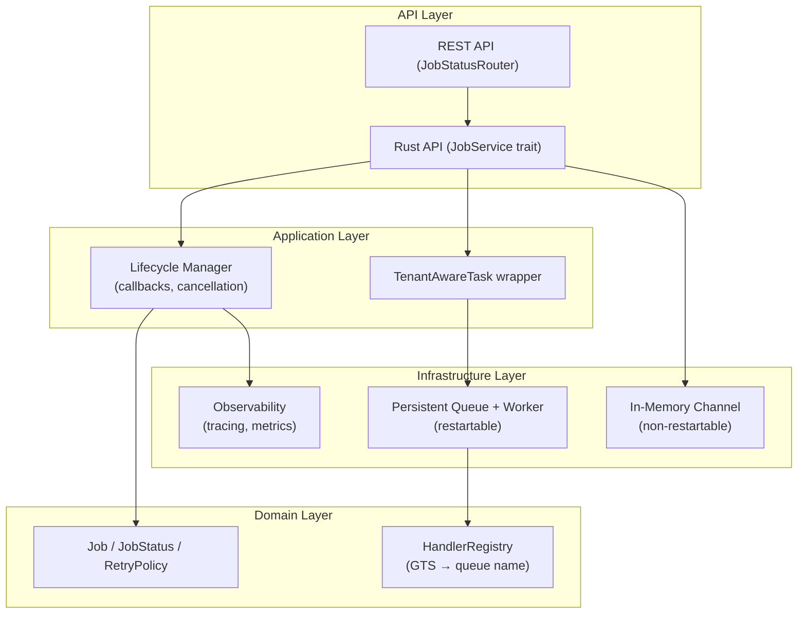
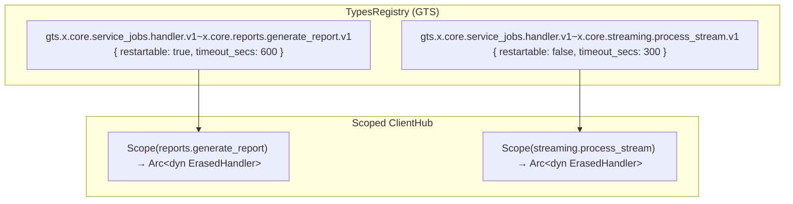
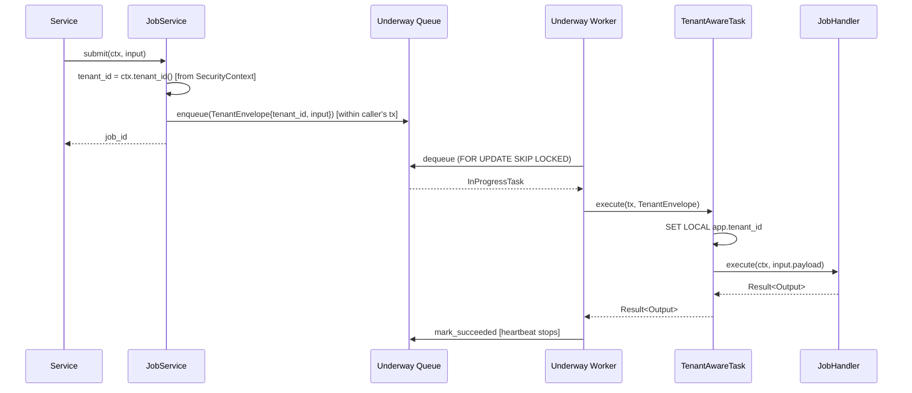
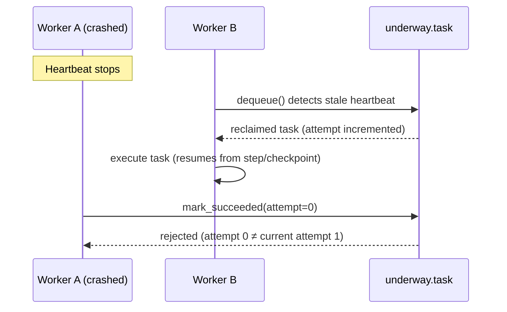
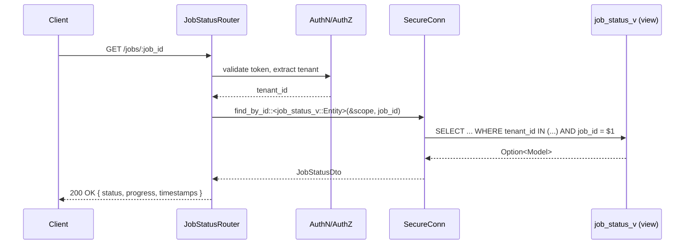

# Technical Design — Service Jobs

## 1. Architecture Overview

### 1.1 Architectural Vision

The Service Jobs module provides a lightweight, embedded job execution system that runs within the service process as Tokio tasks. This approach avoids external infrastructure dependencies while providing robust job lifecycle management.

The architecture supports two types of async work:
- **Restartable jobs**: Serializable inputs, persisted to PostgreSQL, survive restarts with heartbeat-based fencing
- **Non-restartable jobs**: Non-serializable inputs, in-memory channel only, lost on restart

Both types are exposed through a unified `JobService` API with consistent timeout, cancellation, progress reporting, and observability primitives.

> **ADR status: proposed.** The persistence backend for restartable jobs is under evaluation — purpose-built (Secure ORM), upstream contribution to [Underway](https://github.com/maxcountryman/underway), or Underway fork. See [ADR-0001](./ADR-0001-fdd-service-jobs-adr-embedded-pg-job-system.md) for the three options and the Secure ORM compatibility analysis. Sections marked **(Underway-specific)** apply only to Options B/C.

### 1.2 Architecture Drivers

#### Functional Drivers

| Requirement | Design Response |
|-------------|-----------------|
| `fdd-service-jobs-req-submit` | Restartable: transactional enqueue (job commits atomically with business logic). Non-restartable: in-memory channel |
| `fdd-service-jobs-req-restart` | Heartbeat-based fencing with automatic stale task reclamation |
| `fdd-service-jobs-req-discovery` | GTS handler IDs mapped to queue names at registration |
| `fdd-service-jobs-req-tenant-scope` | `tenant_id` injected from `SecurityContext` at submission (never caller-supplied); `SET LOCAL app.tenant_id` in execution transaction; status queries via `SecureConn` on database view |
| `fdd-service-jobs-req-rest-status` | REST API layer backed by `SecureConn` on `service_jobs.job_status_v` view; restartable jobs only |

#### NFR Allocation

| NFR ID | NFR Summary | Allocated To | Design Response | Verification Approach |
|--------|-------------|--------------|-----------------|----------------------|
| `fdd-service-jobs-req-submission-latency` | Submit ≤50ms p99 | Job submission path | Non-restartable: in-memory channel. Restartable: transactional INSERT | Load test benchmark |
| `fdd-service-jobs-req-throughput` | ≥1000 jobs/sec | Worker pool | Configurable concurrency + advisory locks | Load test benchmark |
| `fdd-service-jobs-req-execution-start` | Start ≤1s | Worker pool | Polling interval (configurable, default 1s) + channel dispatch for non-restartable | Load test benchmark |
| `fdd-service-jobs-req-retention` | Results retained ≥24h | Per-task TTL | TTL-based retention with background cleanup | Integration test |
| `fdd-service-jobs-req-security` | Zero cross-tenant leaks, authenticated access | Submission + execution + query paths | `tenant_id` from `SecurityContext` (not caller); `SET LOCAL app.tenant_id` in execution tx; `SecureConn` on status view; input validation; no secrets in payloads | Security tests, code review |

### 1.3 Architecture Layers



| Layer | Responsibility | Technology |
|-------|---------------|------------|
| API | Job submission, status queries, cancellation | Rust traits (`JobService`, `JobHandler`) |
| Application | Tenant envelope wrapping, lifecycle callbacks | `TenantAwareTask<T>`, Rust async |
| Domain | Job entity, status transitions, retry policies | Rust structs |
| Infrastructure | Restartable queue/worker, in-memory channel, observability | PostgreSQL (backend TBD per ADR-0001), Tokio, tracing |

### 1.4 Implementation Phases

**P1 (In-Memory):** Core job execution with all features running in-memory. Both restartable and non-restartable jobs use in-memory channels. Jobs support retry/cancellation/progress but do not survive service restarts.

**P2 (Persistence):** Adds persistent queue backend for restartable jobs — transactional enqueue, heartbeat-based fencing, advisory locks, and automatic stale task reclamation. Non-restartable jobs continue to use the P1 in-memory channel. Backend choice (purpose-built, Underway upstream, or Underway fork) per [ADR-0001](./ADR-0001-fdd-service-jobs-adr-embedded-pg-job-system.md).

## 2. Principles & Constraints

### 2.1 Design Principles

#### Two Types of Async Work

- [ ] `p1` - **ID**: `fdd-service-jobs-design-two-types`

**ADRs**: [`fdd-service-jobs-adr-embedded-pg-job-system`](./ADR-0001-fdd-service-jobs-adr-embedded-pg-job-system.md)

All async work uses this module for consistent timeouts, cancellation, and observability. The key difference is persistence:

| Type | Backend | On Crash/Restart |
|------|---------|------------------|
| **Restartable** (serializable inputs) | PostgreSQL (persistent queue) | Job reclaimed via heartbeat fencing, resumes from checkpoint |
| **Non-restartable** (non-serializable inputs) | In-memory channel | Job is lost |

Non-restartable jobs skip database writes entirely, avoiding persistence overhead for work that cannot be restarted anyway.

#### Local Worker Execution

- [ ] `p1` - **ID**: `fdd-service-jobs-design-local-workers`

**ADRs**: [`fdd-service-jobs-adr-embedded-pg-job-system`](./ADR-0001-fdd-service-jobs-adr-embedded-pg-job-system.md)

Workers are Tokio tasks within the service process, not separate processes or external services. This keeps the architecture simple with no external job runner infrastructure.

**Trade-off acknowledged** (PR review item 6): Co-locating workers with the API process means a misbehaving job can affect API responsiveness, and workers cannot be scaled independently of API instances. The following mitigations apply:

- **Dedicated worker runtime**: Workers run on a separate Tokio runtime with its own thread pool, isolated from the API runtime. A CPU-heavy job cannot starve API request handling.
- **Concurrency limits**: Worker concurrency is capped per instance (default: 4 restartable + 4 non-restartable). The queue absorbs bursts; workers drain at a controlled rate.
- **Backpressure on submission**: When the in-memory channel for non-restartable jobs is full (bounded channel), `submit()` returns a backpressure error. Restartable jobs are unbounded (database-backed queue), but worker concurrency limits prevent overload.
- **Timeouts**: Every job has a configurable timeout (default: 5 minutes). Runaway jobs are killed, not allowed to accumulate.
- **Health check integration**: Worker pool health (queue depth, active count, stale job count) is exposed via the service health endpoint. Orchestrators can restart unhealthy instances.

**When to reconsider**: If job workloads become CPU-intensive enough to require dedicated hardware, or if API and worker scaling needs diverge significantly, a separate worker process can be introduced. The persistent queue design supports this — any process with access to the database can run workers. The `JobService` API, handler registration, and queue schema do not assume co-location.

### 2.2 Constraints

#### No External Queue Infrastructure

- [ ] `p1` - **ID**: `fdd-service-jobs-design-no-external`

**ADRs**: [`fdd-service-jobs-adr-embedded-pg-job-system`](./ADR-0001-fdd-service-jobs-adr-embedded-pg-job-system.md)

The system uses PostgreSQL-backed queuing (P2) and in-memory channels (P1) rather than external message queues like RabbitMQ or SQS. The queue runs embedded within the service process — no external job runner or queue infrastructure is required.

**Rationale**: Reduces operational complexity and external dependencies. Uses the existing PostgreSQL instance.

## 3. Technical Architecture

### 3.1 Domain Model

**Technology**: Rust structs

**Location**: TBD — to be populated during implementation

**Core Entities**:

| Entity | Description | Schema |
|--------|-------------|--------|
| Job | Core unit of async work with lifecycle, tracking, and retry state | TBD |
| JobStatus | Status state machine for job lifecycle transitions | TBD |
| JobResult | Success or failure result of a completed job | TBD |
| JobError | Error details including code, message, and retryability | TBD |
| RetryPolicy | Configuration for retry behavior with exponential backoff | TBD |
| JobProgress | Progress information for long-running jobs | TBD |
| JobContext | Execution context provided to job handlers at runtime | TBD |

**Relationships**:
- Job → JobStatus: Tracks current lifecycle state via the state machine
- Job → JobResult: Stores success output or failure error on completion
- Job → RetryPolicy: Governs retry attempts and backoff behavior
- Job → JobProgress: Running jobs may report progress percentage and message
- Job → JobContext: Workers construct a context for each handler execution

#### Job

```rust
pub struct Job {
    /// Unique job identifier
    pub job_id: JobId,

    /// Tenant context (always required; system-level jobs use root tenant)
    pub tenant_id: String,

    /// Handler identifier (registered function name)
    pub handler_id: HandlerId,

    /// Current job status
    pub status: JobStatus,

    /// Serialized input parameters
    pub input: serde_json::Value,

    /// Serialized result (when completed)
    pub result: Option<JobResult>,

    /// Retry configuration
    pub retry_policy: RetryPolicy,

    /// Current attempt number (0-indexed)
    pub attempt: u32,

    /// Optional idempotency key
    pub idempotency_key: Option<String>,

    /// Optional priority (higher = more urgent)
    pub priority: i32,

    /// Caller context (service, user, correlation_id)
    pub context: JobContext,

    /// Progress information (for long-running jobs)
    pub progress: Option<JobProgress>,

    /// Checkpoint data for resuming after restart
    pub checkpoint: Option<serde_json::Value>,

    /// Timestamps
    pub created_at: DateTime<Utc>,
    pub started_at: Option<DateTime<Utc>>,
    pub completed_at: Option<DateTime<Utc>>,

    /// Scheduled execution time (None = immediate)
    pub scheduled_at: Option<DateTime<Utc>>,

    /// Next retry time (set on failure if retries remain)
    pub next_retry_at: Option<DateTime<Utc>>,

    /// Worker tracking (for restart recovery)
    pub worker_id: Option<String>,
    pub claimed_at: Option<DateTime<Utc>>,
}
```

> **Note:** Only restartable jobs are persisted. Non-restartable jobs exist only in-memory.

#### JobStatus

```rust
pub enum JobStatus {
    /// Queued, waiting for a worker
    Pending,
    /// Currently executing
    Running,
    /// Completed successfully
    Succeeded,
    /// Failed, may retry if attempts remain
    Failed,
    /// Canceled by request
    Canceled,
    /// Failed after retry exhaustion, moved to DLQ
    DeadLettered,
}
```

**State Machine:**

```
                         ┌─────────────┐
              submit     │   Pending   │◄──────────────────┐
             ─────────►  └──────┬──────┘                   │
                                │                          │
                                │ worker picks up          │ retry (if retries remain)
                                ▼                          │
                         ┌─────────────┐                   │
                         │   Running   │───────────────────┤
                         └──────┬──────┘                   │
                                │                          │
             ┌──────────────────┼──────────────────┐       │
             │                  │                  │       │
             ▼                  ▼                  ▼       │
      ┌──────────┐       ┌──────────┐       ┌──────────┐   │
      │ Succeeded│       │ Canceled │       │  Failed  │───┘
      └──────────┘       └──────────┘       └────┬─────┘
                                                 │
                                                 │ retries exhausted
                                                 ▼
                                          ┌─────────────┐
                                          │DeadLettered │
                                          └─────────────┘
```

**Transitions:**
- `Pending → Running`: Worker claims and starts executing the job
- `Running → Succeeded`: Handler completes successfully
- `Running → Failed`: Handler returns error or times out
- `Running → Canceled`: Cancellation requested while running
- `Pending → Canceled`: Cancellation requested while pending
- `Failed → Pending`: Automatic retry if retries remain (after backoff delay)
- `Failed → DeadLettered`: No retries remaining, moved to DLQ

#### JobResult

```rust
pub enum JobResult {
    Success {
        output: serde_json::Value,
    },
    Failure {
        error: JobError,
        retryable: bool,
    },
}
```

#### JobError

```rust
pub struct JobError {
    /// Error code for programmatic handling
    pub code: String,
    /// Human-readable message
    pub message: String,
    /// Additional error details
    pub details: Option<serde_json::Value>,
    /// Whether this error is retryable
    pub retryable: bool,
}
```

#### RetryPolicy

```rust
pub struct RetryPolicy {
    /// Maximum retry attempts (0 = no retries)
    pub max_attempts: u32,
    /// Initial delay before first retry (ms)
    pub initial_delay_ms: u64,
    /// Maximum delay between retries (ms)
    pub max_delay_ms: u64,
    /// Backoff multiplier
    pub backoff_multiplier: f64,
}

impl Default for RetryPolicy {
    fn default() -> Self {
        Self {
            max_attempts: 3,
            initial_delay_ms: 1000,
            max_delay_ms: 30000,
            backoff_multiplier: 2.0,
        }
    }
}
```

#### JobProgress

```rust
pub struct JobProgress {
    /// Percentage complete (0-100)
    pub percent: Option<u8>,
    /// Status message
    pub message: Option<String>,
    /// Last update time
    pub updated_at: DateTime<Utc>,
}
```

#### JobContext

```rust
pub struct JobContext {
    /// Originating service
    pub service_id: String,
    /// Correlation ID for tracing
    pub correlation_id: String,
    /// Tenant context (always required; system-level jobs use root tenant)
    pub tenant_id: String,
    /// Optional user context
    pub user_id: Option<String>,
    /// Cancellation token for cooperative cancellation
    pub cancellation_token: CancellationToken,
    /// Checkpoint data from previous run (if restarted).
    /// This is a copy of `Job.checkpoint`, provided to the handler at execution time.
    /// Workers populate this from the persisted Job when constructing the context.
    pub checkpoint: Option<serde_json::Value>,
}

impl JobContext {
    /// Save checkpoint data to resume from on restart
    pub async fn save_checkpoint(&self, data: impl Serialize) -> Result<(), JobError>;

    /// Report progress (convenience method)
    pub async fn report_progress(&self, percent: u8, message: &str) -> Result<(), JobError>;
}
```

### 3.2 Component Model



**Components:**

| Component | Responsibility | Interface |
|-----------|---------------|-----------|
| JobService | Job submission, status queries, cancellation | Rust API |
| JobStatusRouter | REST endpoints for status, result, and list queries | HTTP/REST |
| WorkerPool | Execute jobs from queue | Internal |
| HandlerRegistry | Store and lookup job handlers | Internal |
| JobStore | Persist job state (P2) | Internal |

### 3.3 API Contracts

**Technology**: Rust traits and structs

**Location**: TBD — to be populated during implementation

**Primary Interface**: `JobService` trait

| Method | Description | Stability |
|--------|-------------|-----------|
| `submit<H: JobHandler>(&self, input: H::Input) -> Result<JobId>` | Submit a job for async execution | stable |
| `submit_with_options<H>(&self, input: H::Input, opts: SubmitOptions) -> Result<JobId>` | Submit with idempotency key, priority, delay | stable |
| `get_status(&self, job_id: JobId) -> Result<JobStatus>` | Query job status | stable |
| `get_result<H: JobHandler>(&self, job_id: JobId) -> Result<Option<H::Output>>` | Retrieve job result | stable |
| `cancel(&self, job_id: JobId) -> Result<bool>` | Cancel pending or running job | stable |
| `list_jobs(&self, filter: JobFilter) -> Result<Vec<JobSummary>>` | List jobs with filtering | stable |

**SubmitOptions**:

```rust
pub struct SubmitOptions {
    /// Idempotency key — prevents duplicate job creation.
    /// Scoped to (tenant_id, handler_id, idempotency_key).
    pub idempotency_key: Option<String>,

    /// Job priority (higher = more urgent). Default: 0.
    pub priority: Option<i32>,

    /// Delay before first execution. Default: immediate.
    pub delay: Option<Duration>,
}
```

**Idempotent Submission Semantics**:

When `idempotency_key` is provided, `submit_with_options` enforces uniqueness on `(tenant_id, handler_id, idempotency_key)`:

- **Duplicate detected**: Returns the existing job's `JobId`. No new job is created and the input payload is **not** merged or updated. The caller receives the same stable `JobId` regardless of how many times it retries.
- **No duplicate**: Creates a new job and returns its `JobId`.
- **Scope**: Idempotency keys are tenant-scoped. The same key used by different tenants or different handlers creates separate jobs.
- **Lifetime**: The idempotency key remains active for the lifetime of the job row (including terminal states). Once the job is cleaned up by retention (§ 3.14), the key becomes available for reuse.

For restartable jobs, this maps to Underway's `concurrency_key` column, set to `{handler_id}:{idempotency_key}`. Underway's `ON CONFLICT` handling on `concurrency_key` returns the existing task ID. For non-restartable jobs, idempotency is checked in-memory against active and recently completed jobs.

This satisfies the PRD acceptance criterion: "Duplicate submissions with same idempotency key return existing job ID" (`fdd-service-jobs-req-idempotent`).

**Handler Interface**: `JobHandler` trait (see § 3.5)

**Security**: All API calls require authenticated context. Tenant scoping is enforced as follows:

- **Submission**: `tenant_id` is always taken from the authenticated `SecurityContext`, never from the caller's input. The `TenantEnvelope` is constructed internally by `JobService` using `ctx.tenant_id()`. Callers cannot specify or override the tenant.
- **Status/result/cancel/list**: Scoped via `AccessScope` built from the authenticated context. Uses `SecureConn` for database queries (restartable) or in-process filtering (non-restartable).
- **Input validation**: `tenant_id` is validated as a well-formed UUID at submission time. Malformed values are rejected with `invalid_input` before any database write.

#### REST API: Job Status

Read-only REST endpoints for external consumers. Backed by the same `JobService` trait used internally.

| Method | Path | Description | Stability |
|--------|------|-------------|-----------|
| `GET` | `/jobs/:job_id` | Get job status, progress, and timestamps | stable |
| `GET` | `/jobs/:job_id/result` | Get job result (output or error) | stable |
| `GET` | `/jobs` | List jobs with query filters (`handler_id`, `status`, `created_after`, `created_before`, `limit`, `offset`) | stable |

**Authentication**: All endpoints require a valid bearer token. Tenant is extracted from the authenticated context.

**Authorization**: Responses are scoped to the caller's tenant. Requesting a job belonging to another tenant returns `404 Not Found` (not `403`) to avoid leaking job existence.

**Scope — restartable jobs only**: REST endpoints query the database view `service_jobs.job_status_v` (see § 3.11) and therefore return **restartable jobs only**. Non-restartable jobs exist only in-memory within the submitting service instance — they have no database rows and are not queryable cross-instance. Callers that need status for non-restartable work must use the in-process `JobService` Rust API on the same instance. This is a direct consequence of the design principle that non-restartable jobs "skip database writes entirely" (§ 2.1).

**Pagination/ordering**:
- Default sort: `created_at DESC`
- Default `limit`: 50
- Max `limit`: 200 (values above max are clamped)
- `offset` is supported for pagination; responses are stable for a fixed ordering

**Response format**: JSON. Successful responses use `200 OK`. Error responses follow the platform standard error envelope.

**Error envelope example**:
```json
{
  "type": "https://errors.hyperspot.dev/job_not_found",
  "title": "Job not found",
  "status": 404,
  "detail": "Job does not exist or is not visible to this tenant",
  "instance": "/jobs/2f43d0c1-1c2e-4c69-a76b-0b2a9d3b2a3f"
}
```

**Error responses**:

| Status | Condition |
|--------|-----------|
| `401 Unauthorized` | Missing or invalid bearer token |
| `404 Not Found` | Job does not exist or belongs to another tenant |

### 3.4 External Interfaces & Protocols

#### Job Status REST API

- [ ] `p1` - **ID**: `fdd-service-jobs-design-interface-rest-status`

**Type**: Protocol

**Direction**: inbound

**Specification**: HTTP/1.1 REST, JSON responses

**Data Format**: JSON response bodies; see § 3.3 REST API for endpoint details

**Compatibility**: Backward-compatible within major version. New response fields may be added without a breaking change. Removal or renaming of fields requires a major version bump.

### 3.5 Job Handler

#### Handler Trait

```rust
#[async_trait]
pub trait JobHandler: Send + Sync + 'static {
    /// Input type (deserializable from JSON)
    type Input: DeserializeOwned + Send;

    /// Output type (serializable to JSON)
    type Output: Serialize + Send;

    /// Handler identifier
    fn handler_id(&self) -> &'static str;

    /// Execute the job
    async fn execute(
        &self,
        ctx: JobContext,
        input: Self::Input,
    ) -> Result<Self::Output, JobError>;

    /// Default retry policy (can be overridden per-job)
    fn default_retry_policy(&self) -> RetryPolicy {
        RetryPolicy::default()
    }

    /// Default timeout (None = no timeout)
    fn default_timeout(&self) -> Option<Duration> {
        Some(Duration::from_secs(300)) // 5 minutes
    }

    /// Whether this handler's jobs can be restarted after a crash.
    /// Return false for handlers with non-serializable inputs.
    fn restartable(&self) -> bool {
        true
    }

    /// Called after successful completion (optional callback)
    async fn on_success(&self, ctx: &JobContext, output: &Self::Output) -> Result<(), JobError> {
        let _ = (ctx, output);
        Ok(())
    }

    /// Called after permanent failure (DLQ) (optional callback)
    async fn on_failure(&self, ctx: &JobContext, error: &JobError) -> Result<(), JobError> {
        let _ = (ctx, error);
        Ok(())
    }
}
```

#### Handler Variants

Restartable handlers are persisted to the database queue. Non-restartable handlers run via in-memory channel only.

```rust
// Restartable handler: persisted, survives restarts
#[async_trait]
pub trait JobHandler: Send + Sync + 'static {
    type Input: DeserializeOwned + Send;   // Serializable
    type Output: Serialize + Send;          // Serializable

    fn restartable(&self) -> bool { true }  // Default: restartable
}

// Non-restartable handler: runs in-memory, no DB writes
impl JobHandler for StreamProcessorHandler {
    type Input = ();  // Actual input held in handler struct
    type Output = ();

    fn restartable(&self) -> bool { false }  // In-memory only
}
```

#### Underway Task Adapter (Underway-specific — Options B/C)

If Underway is adopted, the `TenantAwareTask` adapter bridges our `JobHandler` trait to Underway's `Task` trait. It uses the platform-provided `set_tenant_context` from `modkit-db` to set the session variable.

> **Open compliance issue**: This adapter receives a raw `sqlx::Transaction` from Underway and the module must provide a raw `PgPool`. See § 3.18 for the Secure ORM compliance analysis.

```rust
/// Wraps a JobHandler as an Underway Task with tenant isolation.
pub struct TenantAwareTask<H: JobHandler> {
    handler: Arc<H>,
}

impl<H: JobHandler> underway::Task for TenantAwareTask<H> {
    type Input = TenantEnvelope<H::Input>;
    type Output = H::Output;

    async fn execute(
        &self,
        mut tx: Transaction<'_, Postgres>,
        input: Self::Input,
    ) -> Result<Self::Output> {
        // Set tenant context via platform API (encapsulates SET LOCAL internally)
        modkit_db::secure::set_tenant_context(&mut tx, input.tenant_id).await?;

        // Build JobContext from envelope metadata
        let ctx = JobContext::from_envelope(&input, tx);

        // Delegate to our JobHandler
        self.handler.execute(ctx, input.payload).await
    }
}

/// Tenant envelope wrapping any serializable job input.
#[derive(Serialize, Deserialize)]
pub struct TenantEnvelope<T> {
    pub tenant_id: Uuid,
    pub correlation_id: String,
    pub user_id: Option<String>,
    pub payload: T,
}
```

#### Handler Metadata (GTS Schema)

```rust
/// Registered in GTS for each handler
pub struct JobHandlerSpec {
    pub handler_id: String,
    pub restartable: bool,
    pub timeout_secs: Option<u32>,
    pub max_retries: Option<u32>,
}
```

#### Registration Example

```rust
// Define a handler with notification callback
struct GenerateReportHandler {
    notification_service: Arc<NotificationService>,
}

#[async_trait]
impl JobHandler for GenerateReportHandler {
    type Input = GenerateReportInput;
    type Output = GenerateReportOutput;

    fn handler_id(&self) -> &'static str {
        "reports.generate"
    }

    async fn execute(
        &self,
        ctx: JobContext,
        input: Self::Input,
    ) -> Result<Self::Output, JobError> {
        if ctx.cancellation_token.is_cancelled() {
            return Err(JobError::cancelled());
        }

        ctx.report_progress(25, "Fetching data...").await?;
        let data = fetch_report_data(&input).await?;

        ctx.report_progress(75, "Generating report...").await?;
        let report = generate_report(data).await?;

        Ok(GenerateReportOutput { report_url: report.url })
    }

    fn default_timeout(&self) -> Option<Duration> {
        Some(Duration::from_secs(600)) // 10 minutes for reports
    }

    async fn on_success(&self, ctx: &JobContext, output: &Self::Output) -> Result<(), JobError> {
        if let Some(user_id) = &ctx.user_id {
            self.notification_service
                .notify(user_id, "Your report is ready", &output.report_url)
                .await
                .map_err(|e| JobError::new("notification_failed", e.to_string()))?;
        }
        Ok(())
    }
}

// Register at startup
let handler = GenerateReportHandler {
    notification_service: notification_svc.clone(),
};
job_registry.register(handler);
```

### 3.6 Worker Architecture

Workers are Tokio tasks running on a **dedicated Tokio runtime** within the service process, separate from the API runtime's thread pool. This prevents job execution from starving API request handling. See § 2.1 "Local Worker Execution" for the trade-off analysis and mitigations.

#### Execution Model (P1: In-Memory / Non-Restartable)

Non-restartable jobs use an in-memory channel. Even though no database writes occur for job persistence, handlers may call business services that use `SecureConn`. Therefore, workers must establish tenant context before executing non-restartable handlers:

```rust
// Workers consume from an in-memory channel
for _ in 0..config.worker_count {
    tokio::spawn(async move {
        loop {
            let job = job_queue.recv().await;  // In-memory channel

            // Non-restartable handlers may still access business tables via SecureConn.
            // Establish tenant context via AccessScope from the job's SecurityContext.
            let scope = AccessScope::tenant(job.ctx.tenant_id);
            execute_job_with_scope(job, &scope).await;
        }
    });
}
```

> **Note**: Non-restartable jobs do not use `SET LOCAL` (there is no persistent transaction). Instead, the worker passes an `AccessScope` built from the job's `SecurityContext` to any `SecureConn` queries the handler makes. This is the standard Secure ORM pattern for request-scoped work.

#### Execution Model (P2: Persistent / Restartable) — Underway-specific, Options B/C

Restartable jobs are managed by the persistent queue's worker, which handles claiming, heartbeats, fencing, and retry. If Underway is adopted, our code configures and starts the worker:

```rust
// Create Underway queue for a restartable handler
let queue = underway::Queue::<TenantAwareTask<GenerateReportHandler>>::builder()
    .name("reports.generate")  // Maps to GTS handler ID
    .pool(pool.clone())
    .build()
    .await?;

// Start Underway worker (handles polling, claiming, heartbeats, fencing)
let worker = underway::Worker::new(queue.into(), tenant_aware_task);
worker.run_every(jiff::Span::new().seconds(1)).await?;
```

Underway's worker internally uses `FOR UPDATE SKIP LOCKED` for atomic claiming with heartbeat-based lease fencing. Stale tasks (where heartbeat has stopped) are automatically reclaimed with an incremented attempt number, preventing split-brain scenarios. See [ADR-0001 § Tenant Isolation Strategy](./ADR-0001-fdd-service-jobs-adr-embedded-pg-job-system.md#tenant-isolation-strategy) for how tenant context is injected during execution.

#### Worker Configuration

| Setting | Default | Description |
|---------|---------|-------------|
| `worker_count` | 4 | Concurrent tasks per instance (non-restartable) |
| `restartable_concurrency` | 4 | Concurrent tasks per instance (restartable) |
| `poll_interval` | 1s | Polling interval when idle (restartable) |
| `heartbeat_interval` | 30s | Heartbeat frequency for stale detection (restartable) |
| `channel_capacity` | 256 | Bounded channel size for non-restartable jobs. `submit()` returns backpressure error when full. |
| `worker_runtime_threads` | 2 | Thread count for the dedicated worker Tokio runtime. Separate from the API runtime. |

### 3.7 Checkpointing — Underway-specific, Options B/C

Long-running restartable jobs use Underway's step-function model for checkpointing. Each step's output becomes the next step's input, and step transitions are persisted atomically. If the service restarts mid-job, Underway resumes from the last completed step.

```rust
// Define a multi-step job using Underway's Job builder
let processing_job = underway::Job::builder()
    .step(|cx, input: ProcessingInput| async move {
        // Step 1: Fetch data
        let data = fetch_data(&input).await?;
        underway::To::next(FetchedData { records: data, input })
    })
    .step(|cx, data: FetchedData| async move {
        // Step 2: Process records (resumable from last completed step)
        let result = process_records(&data.records).await?;
        underway::To::done(ProcessingOutput { count: result.len() })
    })
    .name("data_processing")
    .pool(pool)
    .build()
    .await?;
```

For fine-grained checkpointing within a single step, handlers can write checkpoint data to the execution transaction. On restart, the step re-executes but can read previous checkpoint state:

```rust
async fn execute(&self, ctx: JobContext, input: Self::Input) -> Result<Self::Output, JobError> {
    let start_index = match &ctx.checkpoint {
        Some(cp) => cp.get("processed_count").and_then(|v| v.as_u64()).unwrap_or(0),
        None => 0,
    };

    for (i, record) in input.records.iter().enumerate().skip(start_index as usize) {
        process_record(record).await?;

        if (i + 1) % 100 == 0 {
            ctx.save_checkpoint(json!({ "processed_count": i + 1 })).await?;
            ctx.report_progress((i * 100 / input.records.len()) as u8, "Processing...").await?;
        }
    }

    Ok(ProcessingOutput { count: input.records.len() })
}
```

**Semantics:**
- **Step-level** (Underway-managed): Each step transition is persisted atomically. On restart, execution resumes at the last incomplete step.
- **Intra-step** (application-managed): `ctx.save_checkpoint(data)` writes to the execution transaction for within-step resume.

### 3.8 Restart Recovery — Underway-specific, Options B/C

Underway handles restart recovery automatically via heartbeat-based fencing. No startup scan or `claimed_at` heuristic is needed.

**How it works:**

1. Each running task sends periodic heartbeats (default: every 30 seconds) to `underway.task.last_heartbeat_at`
2. Underway's dequeue query includes a CTE that checks for stale tasks: `last_heartbeat_at < now() - heartbeat`
3. Stale tasks are reclaimed atomically with an incremented attempt number
4. The old worker's subsequent completion/failure writes are rejected (fenced) because the attempt number no longer matches

**Fencing guarantees:**

```
Worker A claims task (attempt 0) → heartbeat stops (crash)
Worker B reclaims task (attempt 1) → starts executing
Worker A recovers, tries to mark task succeeded → rejected (attempt 0 ≠ max attempt 1)
```

This eliminates the brittle `claimed_at < now() - 5 minutes` heuristic from the original design, which would incorrectly bounce legitimately long-running jobs.

When a reclaimed job is picked up:
1. Underway's worker invokes `TenantAwareTask::execute` with the original input (including tenant envelope)
2. For step-function jobs, Underway resumes at the last incomplete step
3. For single-step jobs with intra-step checkpoints, the handler reads checkpoint data and resumes

Non-restartable jobs are not in the database and simply disappear on restart.

### 3.9 Callback Design

Callbacks are defined as methods on the `JobHandler` trait, not per-job:

```rust
impl JobHandler for ReportHandler {
    async fn on_success(&self, ctx: &JobContext, output: &Self::Output) -> Result<(), JobError> {
        self.notification_service.notify_user(ctx.user_id, &output.report_url).await?;
        Ok(())
    }
}
```

**Why this works:**
- Handlers re-register on service startup
- Callbacks are always available after restart
- For per-job callback configuration, include it in the job input

### 3.10 Built-in Handlers

#### Large File Download Handler

```rust
pub struct DownloadFileInput {
    pub url: String,
    pub dest: PathBuf,
    pub chunk_size: Option<usize>,  // Default: 1MB
}

pub struct DownloadFileOutput {
    pub path: PathBuf,
    pub bytes: u64,
    pub duration_secs: f64,
}
```

**Restart behavior:**
1. Job starts, begins downloading, checkpoints at `bytes_downloaded: 5000000`
2. Service restarts
3. Job is recovered, `ctx.checkpoint` contains `{ "bytes_downloaded": 5000000 }`
4. Handler sends `Range: bytes=5000000-` header
5. Server responds with `206 Partial Content`
6. Download resumes from byte 5,000,000

### 3.11 Database Schema (P2) — Underway-specific, Options B/C

> **Note**: A purpose-built system (Option A) would define its own schema using Secure ORM entities and standard migrations, with `tenant_id` as a first-class column. The view-based approach below is specific to Underway integration.

Restartable jobs use Underway's `underway.task` table (managed by Underway's migrations). We do NOT create a separate `service_jobs` table — this avoids dual-write consistency issues.

#### Table: underway.task (managed by Underway)

Key columns relevant to our integration:

| Column | Type | Description |
|--------|------|-------------|
| id | UUID | PK, task identifier (maps to our JobId) |
| task_queue_name | TEXT | Queue name (maps to our handler_id / GTS ID) |
| input | JSONB | Serialized `TenantEnvelope<T>` — contains `tenant_id`, `correlation_id`, `user_id`, and `payload` |
| state | ENUM | pending/in_progress/succeeded/failed/cancelled |
| retry_policy | COMPOSITE | max_attempts, initial_interval, max_interval, backoff_coefficient |
| concurrency_key | TEXT | Optional idempotency/concurrency key |
| priority | INT | Job priority (higher = more urgent) |
| timeout | INTERVAL | Per-task execution timeout |
| heartbeat | INTERVAL | Heartbeat frequency for stale detection |
| ttl | INTERVAL | Time-to-live before automatic cleanup |
| delay | INTERVAL | Delay before first execution |
| last_heartbeat_at | TIMESTAMP | Last heartbeat (used for fencing) |
| created_at | TIMESTAMP | Creation time |
| completed_at | TIMESTAMP | Completion time |

#### Additional Indexes (our migration)

Applied after Underway's migrations:

```sql
-- Tenant-scoped status queries via JSONB path
CREATE INDEX idx_task_tenant ON underway.task ((input->>'tenant_id'));

-- Tenant + queue + state for filtered status list
CREATE INDEX idx_task_tenant_queue_state ON underway.task (
    (input->>'tenant_id'), task_queue_name, state
);
```

#### Tenant Data Location

Tenant context is stored inside the `input` JSONB column as part of the `TenantEnvelope`:

```json
{
  "tenant_id": "550e8400-e29b-41d4-a716-446655440000",
  "correlation_id": "req-abc-123",
  "user_id": "user-456",
  "payload": { "report_type": "monthly", "format": "pdf" }
}
```

Status queries extract `tenant_id` from `input->>'tenant_id'`. See [ADR-0001 § Tenant Isolation Strategy](./ADR-0001-fdd-service-jobs-adr-embedded-pg-job-system.md#tenant-isolation-strategy) for the full isolation model.

#### Status Query View (Secure ORM Compliant)

To comply with the Secure ORM policy (no raw SQL in module code — see `docs/modkit_unified_system/06_secure_orm_db_access.md`), status queries use a **database view** backed by a SeaORM entity, rather than direct JSONB path queries in handler code.

**Migration** (raw SQL is permitted in migration infrastructure):

```sql
-- service_jobs module migration: create status query view
CREATE SCHEMA IF NOT EXISTS service_jobs;

CREATE VIEW service_jobs.job_status_v AS
SELECT
    t.id                                  AS job_id,
    t.task_queue_name                     AS handler_id,
    (t.input->>'tenant_id')::uuid         AS tenant_id,
    t.state                               AS status,
    t.input->>'correlation_id'            AS correlation_id,
    t.created_at,
    t.updated_at,
    t.completed_at
FROM underway.task t;
```

The JSONB extraction happens in the view definition (migration code), not in module handler/service code. The view projects `tenant_id` as a first-class column, enabling standard `Scopable` scoping.

**Payload redaction**: The view deliberately **excludes** `input->'payload'`. Job payloads may contain PII or large data structures that should not be exposed via REST status endpoints. If a caller needs the original input, they should use the `get_result` API (which returns the handler's typed output, not the raw input).

**SeaORM Entity** (read-only, backed by the view):

```rust
#[derive(Clone, Debug, PartialEq, DeriveEntityModel, Scopable)]
#[sea_orm(table_name = "job_status_v", schema_name = "service_jobs")]
#[secure(tenant_col = "tenant_id", no_resource, no_owner, no_type)]
pub struct Model {
    #[sea_orm(primary_key)]
    pub job_id: Uuid,
    pub handler_id: String,
    pub tenant_id: Uuid,
    pub status: String,
    pub correlation_id: Option<String>,
    pub created_at: DateTimeWithTimeZone,
    pub updated_at: Option<DateTimeWithTimeZone>,
    pub completed_at: Option<DateTimeWithTimeZone>,
}
```

**Usage in REST handler** (fully Secure ORM compliant):

```rust
pub async fn get_job_status(
    Authz(ctx): Authz,
    Extension(db): Extension<Arc<DbHandle>>,
    Path(job_id): Path<Uuid>,
) -> ApiResult<Json<JobStatusDto>> {
    let secure_conn = db.sea_secure();
    let scope = AccessScope::tenant(ctx.tenant_id());

    let job = secure_conn
        .find_by_id::<job_status_v::Entity>(&scope, job_id)?
        .one(&secure_conn)
        .await?
        .ok_or(ApiError::not_found("job_not_found"))?;

    Ok(Json(JobStatusDto::from(job)))
}
```

This eliminates raw SQL from the REST status query path. Tenant scoping is enforced automatically by the `Scopable` derive — `SecureConn` appends `WHERE tenant_id IN (scope.tenant_ids)` to every query against the view.

### 3.12 Error Codes

| Code | Description | Retryable |
|------|-------------|-----------|
| `job_not_found` | Job ID does not exist | No |
| `handler_not_found` | Handler ID not registered | No |
| `invalid_input` | Input validation failed | No |
| `job_timeout` | Job exceeded timeout | Yes |
| `job_canceled` | Job was canceled | No |
| `handler_error` | Handler returned an error | Depends |
| `internal_error` | Unexpected system error | Yes |

### 3.13 Observability

#### Metrics

| Metric | Type | Description |
|--------|------|-------------|
| `jobs_submitted_total` | Counter | Jobs submitted by handler |
| `jobs_completed_total` | Counter | Jobs completed by handler and status |
| `job_duration_seconds` | Histogram | Job execution duration |
| `job_queue_depth` | Gauge | Pending jobs by handler |
| `job_retries_total` | Counter | Retry attempts by handler |

#### Tracing

Jobs propagate trace context from submission through execution:
- Span: `job.execute` with attributes: `job_id`, `handler_id`, `attempt`
- Child spans for handler-internal operations

#### Logging

Structured log fields: `job_id`, `handler_id`, `correlation_id`, `tenant_id`, `attempt`, `status`

### 3.14 Job Retention and Cleanup — Underway-specific, Options B/C

#### Retention Policy

Underway provides built-in TTL-based retention per task. Completed tasks are automatically cleaned up after their TTL expires.

| Job Type | Default TTL | Rationale |
|----------|-------------|-----------|
| Standard jobs | 14 days (Underway default) | Generous window for result retrieval and debugging |
| DLQ jobs | 14 days (same TTL) | DLQ is modeled as a separate Underway queue with its own TTL |

TTL is configurable per handler via the `JobHandler` trait:

```rust
impl JobHandler for GenerateReportHandler {
    // Override Underway's default 14-day TTL
    fn ttl(&self) -> Duration {
        Duration::from_secs(24 * 60 * 60) // 24 hours for report jobs
    }
}
```

#### Cleanup Mechanism

Underway handles cleanup internally — completed tasks past their TTL are purged automatically. No custom cleanup background task is needed.

**Behavior:**
- Underway's TTL is checked during dequeue cycles
- Dead-lettered jobs use the DLQ queue's TTL (configurable independently)
- Metrics track `jobs_cleaned_total` by status (emitted from our observability layer)

### 3.15 Sequences & Interactions

**Key Flows**: `fdd-service-jobs-req-submit`, `fdd-service-jobs-req-restart`, `fdd-service-jobs-req-rest-status`, `fdd-service-jobs-req-report`

**Job Submission Flow (Restartable):**



**Restart Recovery Flow (Underway-Managed):**



**REST Status Query Flow (restartable jobs only):**



### 3.16 Deployment Topology

Workers run as Tokio tasks within each service instance. No external job runner infrastructure is required.

```
┌──────────────────────────────────────────────┐
│              Service Instance                 │
│  ┌────────────────────────────────────────┐  │
│  │             JobService                 │  │
│  │  ┌──────────────┐ ┌────────────────┐   │  │
│  │  │ In-Memory    │ │ Underway       │   │  │
│  │  │ Workers      │ │ Workers        │   │  │
│  │  │ (non-restart)│ │ (restartable)  │   │  │
│  │  └──────────────┘ └───────┬────────┘   │  │
│  └───────────────────────────┼────────────┘  │
└──────────────────────────────┼───────────────┘
                               │
                               ▼
                 ┌─────────────────────┐
                 │   PostgreSQL (P2)   │
                 │   underway.task     │
                 └─────────────────────┘
```

**Scaling**: Add more service instances to increase job processing capacity. Each instance runs its own Underway worker pool. Workers across instances claim jobs atomically via `FOR UPDATE SKIP LOCKED` with heartbeat-based fencing.

### 3.17 Technology Stack

| Layer | Technology | Rationale |
|-------|------------|-----------|
| Runtime | Rust + Tokio | Async runtime already used by platform services |
| Job Queue (P2) | TBD per [ADR-0001](./ADR-0001-fdd-service-jobs-adr-embedded-pg-job-system.md) | Purpose-built (Secure ORM), Underway upstream contribution, or Underway fork |
| Persistence (P2) | PostgreSQL | Already available; schema managed by chosen backend |
| Serialization | serde_json | Standard for Rust JSON serialization; `TenantEnvelope<T>` stored as JSONB |
| Cancellation | tokio_util::CancellationToken | Cooperative cancellation pattern |
| Observability | tracing, metrics | Platform standard observability stack |

### 3.18 Security Considerations

#### Tenant Isolation

- **Restartable jobs**: `tenant_id` is embedded in the `TenantEnvelope` input. During execution, `SET LOCAL app.tenant_id` scopes all Secure ORM queries on business tables. Status queries use the `service_jobs.job_status_v` view with `Scopable` tenant scoping via `SecureConn`. See [ADR-0001 § Tenant Isolation Strategy](./ADR-0001-fdd-service-jobs-adr-embedded-pg-job-system.md#tenant-isolation-strategy).
- **Non-restartable jobs**: `tenant_id` is carried in the in-memory `JobContext`. Handlers may still access business tables via `SecureConn` — workers establish tenant context by passing an `AccessScope` built from the job's `SecurityContext` (see § 3.6). Status is only available on the submitting instance via the in-process Rust API (not cross-instance REST).

#### Secure ORM Compliance

The Secure ORM policy (`docs/modkit_unified_system/06_secure_orm_db_access.md`) states:
- "Modules cannot access raw database connections/pools"
- "No plain SQL in handlers/services/repos. Raw SQL is allowed only in migration infrastructure."

**What is compliant today:**

| Concern | Status | How |
|---------|--------|-----|
| **Status queries** | Compliant | REST handlers query `service_jobs.job_status_v` via `SecureConn` + `Scopable` entity (§ 3.11). No raw SQL. |
| **JSONB extraction** | Compliant | Defined in the database view (migration code, where raw SQL is permitted). |
| **Job handler business logic** | Compliant | Handlers receive `JobContext` with tenant context set. All business DB access uses `SecureConn` / `AccessScope`. |
| **Non-restartable job handlers** | Compliant | Workers pass `AccessScope` built from `SecurityContext`. Standard Secure ORM pattern. |

**What is NOT compliant (Underway-specific, Options B/C only):**

| Concern | Issue |
|---------|-------|
| **Raw `PgPool`** | Underway requires a raw `sqlx::PgPool`. Even if provided via `DatabaseCapability`, the module's dependency tree holds and uses a raw pool. This is a hard violation of "modules cannot access raw database connections/pools." |
| **Tenant context on execution transaction** | Underway provides a raw `sqlx::Transaction` to `Task::execute`. Setting tenant context requires calling raw SQL (`SET LOCAL`) or a platform wrapper (`set_tenant_context`). Either way, the module receives and operates on a raw transaction. |
| **Underway's internal SQL** | Underway executes 81+ raw SQL queries against its `underway` schema. These run inside the module's process using the module-provided pool. |

**Resolution depends on ADR-0001:**
- **Option A (purpose-built)**: Fully compliant. All queries use `SecureConn`. No raw pools. No raw SQL.
- **Option B (upstream contribution)**: Requires a Secure ORM policy exception for the queue library's internal pool, or a platform-level adapter that encapsulates the raw pool and is not considered module code.
- **Option C (fork)**: Same as Option B, unless the fork replaces Underway's internal queries with Secure ORM (which is effectively a rewrite).

**Platform requirement (Options B/C)**: If Underway is adopted, `modkit-db` should expose a `set_tenant_context` function that accepts a sqlx `Transaction` and a tenant ID. This encapsulates the `SET LOCAL` so the module code itself contains no raw SQL string. However, this does not resolve the raw pool issue.

#### Input Validation and Secrets

- **Input validation**: Job inputs are validated at submission; invalid inputs fail fast with `invalid_input`.
- **Secrets handling**: Job payloads must not embed secrets; secrets are provided via environment/configuration.

## 4. Additional Context

### Alternatives Considered

See [ADR-0001](./ADR-0001-fdd-service-jobs-adr-embedded-pg-job-system.md) for the full evaluation of five existing Rust job queue libraries (Underway, Graphile Worker RS, rust-task-queue, kafru, backie) and the three implementation paths under consideration.

| Alternative | Status |
|-------------|--------|
| Underway (upstream contribution or fork) | Under evaluation — best queue mechanics but raw PgPool violates Secure ORM policy |
| Purpose-built queue (Secure ORM) | Under evaluation — full compliance but high correctness risk |
| Graphile Worker RS | Not recommended — LISTEN/NOTIFY is attractive but lacks heartbeat fencing; same Secure ORM incompatibility |
| External job queue (RabbitMQ, SQS) | Rejected — additional infrastructure dependency |
| Serverless Runtime for all async work | Rejected — designed for tenant-defined functions with sandboxing overhead |

### Future Considerations

- **Resolve ADR-0001**: Choose between purpose-built, upstream contribution, or fork. This is the primary open decision for P2.
- LISTEN/NOTIFY wakeups: For sub-second job pickup latency (relevant to all implementation paths)
- Scheduled jobs: Cron-like scheduling (Underway supports `ZonedSchedule`; purpose-built would need implementation)
- Job dependencies: Allow jobs to depend on other jobs completing first
- Job batching: Process multiple items in a single job with partial success

## 5. Traceability

- **PRD**: [PRD.md](./PRD.md)
- **ADRs**: [`ADR-0001` Embedded PostgreSQL-Backed Job System](./ADR-0001-fdd-service-jobs-adr-embedded-pg-job-system.md)
- **Features**: Deferred (no feature specs for this module yet)
