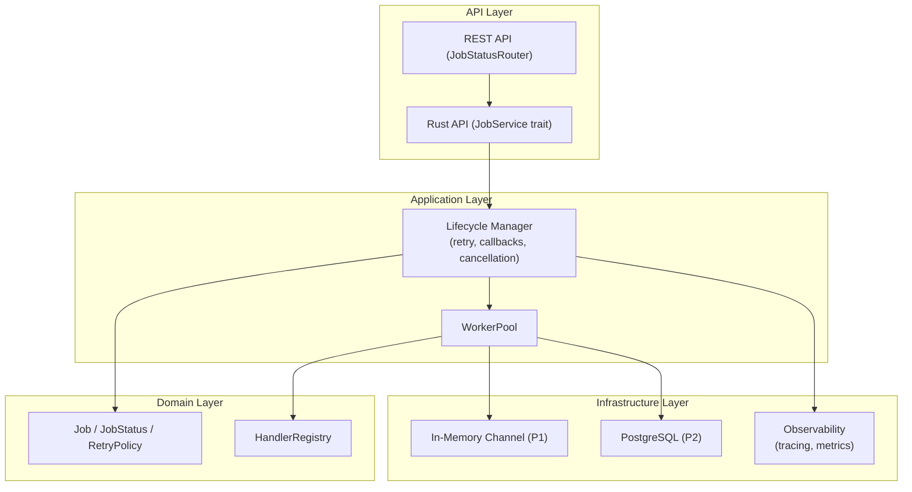
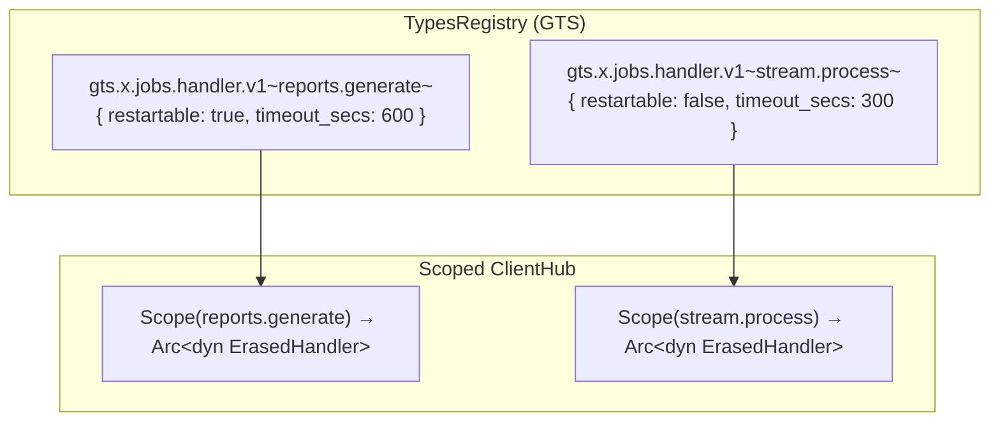
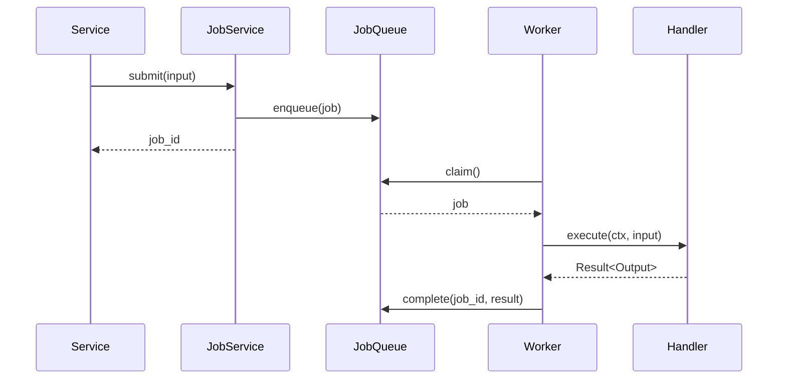
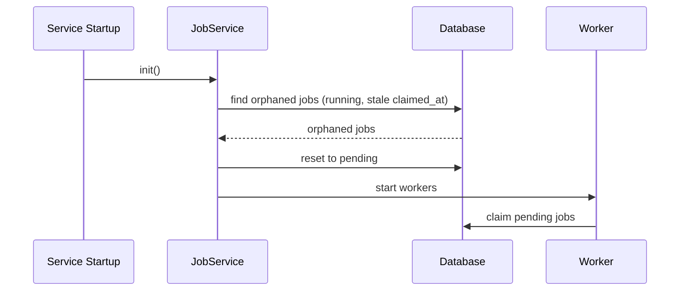
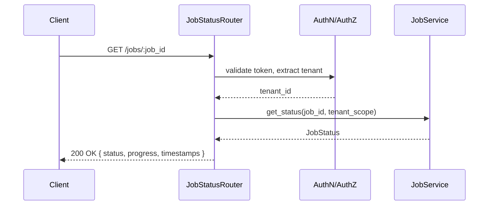

# Technical Design — Service Jobs

## 1. Architecture Overview

### 1.1 Architectural Vision

The Service Jobs module provides a lightweight, embedded job execution system that runs within the service process as Tokio tasks. This approach avoids external infrastructure dependencies while providing robust job lifecycle management.

The architecture supports two types of async work:
- **Restartable jobs**: Serializable inputs, persisted to database, survive restarts
- **Non-restartable jobs**: Non-serializable inputs, in-memory only, lost on restart

Both types benefit from unified timeout, cancellation, progress reporting, and observability primitives.

### 1.2 Architecture Drivers

#### Functional Drivers

| Requirement | Design Response |
|-------------|-----------------|
| `fdd-service-jobs-req-submit` | Async submission via channel to worker pool |
| `fdd-service-jobs-req-restart` | Database persistence with orphan detection on startup |
| `fdd-service-jobs-req-discovery` | GTS-based handler registry for restart recovery |
| `fdd-service-jobs-req-tenant-scope` | Tenant-scoped access via Secure ORM on all DB queries and API paths |
| `fdd-service-jobs-req-rest-status` | REST API layer backed by JobService for external status queries |

#### NFR Allocation

| NFR ID | NFR Summary | Allocated To | Design Response | Verification Approach |
|--------|-------------|--------------|-----------------|----------------------|
| `fdd-service-jobs-req-submission-latency` | Submit ≤50ms p99 | Job submission path | In-memory channel, async DB write | Load test benchmark |
| `fdd-service-jobs-req-throughput` | ≥1000 jobs/sec | Worker pool | Configurable worker count, batch claiming | Load test benchmark |
| `fdd-service-jobs-req-execution-start` | Start ≤1s | Worker pool | Low poll interval, immediate channel dispatch | Load test benchmark |
| `fdd-service-jobs-req-retention` | Results retained ≥24h | JobStore | Configurable retention, background cleanup | Integration test |
| `fdd-service-jobs-req-security` | Zero cross-tenant leaks, authenticated access | Secure ORM, API layer | Tenant-scoped queries, input validation, no secrets in payloads | Security tests, code review |

### 1.3 Architecture Layers


```mermaid
graph TB
    subgraph "API Layer"
        RS["Rust API (JobService trait)"]
        RT["REST API (JobStatusRouter)"]
    end

    subgraph "Application Layer"
        WP[WorkerPool]
        LM["Lifecycle Manager<br/>(retry, callbacks, cancellation)"]
    end

    subgraph "Domain Layer"
        JOB["Job / JobStatus / RetryPolicy"]
        HR[HandlerRegistry]
    end

    subgraph "Infrastructure Layer"
        CH["In-Memory Channel (P1)"]
        PG["PostgreSQL (P2)"]
        OB["Observability<br/>(tracing, metrics)"]
    end

    RT --> RS
    RS --> LM
    LM --> WP
    WP --> HR
    LM --> JOB
    WP --> CH
    WP --> PG
    LM --> OB
```

| Layer | Responsibility | Technology |
|-------|---------------|------------|
| API | Job submission, status queries, cancellation | Rust traits (`JobService`, `JobHandler`) |
| Application | Job lifecycle management, retry logic, callbacks | Rust async |
| Domain | Job entity, status transitions, retry policies | Rust structs |
| Infrastructure | Persistence (P2), worker execution, observability | Tokio, PostgreSQL (P2) |

### 1.4 Implementation Phases

**P1 (In-Memory):** Core job execution with all features running in-memory. Jobs are tracked in memory, support retry/cancellation/progress, but do not survive service restarts.

**P2 (Persistence):** Adds database persistence for restartable jobs, checkpointing, handler discovery via GTS, and restart recovery. Non-restartable jobs continue to run in-memory only.

## 2. Principles & Constraints

### 2.1 Design Principles

#### Two Types of Async Work

- [ ] `p1` - **ID**: `fdd-service-jobs-design-two-types`

**ADRs**: No ADRs for this module yet.

All async work uses this module for consistent timeouts, cancellation, and observability. The key difference is persistence:

| Type | Persisted to DB | On Crash/Restart |
|------|-----------------|------------------|
| **Restartable** (serializable inputs) | Yes | Job resumes automatically |
| **Non-restartable** (non-serializable inputs) | No (in-memory) | Job is lost |

Non-restartable jobs skip database writes entirely, avoiding persistence overhead for work that cannot be restarted anyway.

#### Local Worker Execution

- [ ] `p1` - **ID**: `fdd-service-jobs-design-local-workers`

**ADRs**: No ADRs for this module yet.

Workers are Tokio tasks within the service process, not separate processes or external services. This keeps the architecture simple with no external job runner infrastructure.

### 2.2 Constraints

#### No External Queue Infrastructure

- [ ] `p1` - **ID**: `fdd-service-jobs-design-no-external`

**ADRs**: No ADRs for this module yet.

The system uses database-backed queuing (P2) or in-memory channels (P1) rather than external message queues like RabbitMQ or SQS.

**Rationale**: Reduces operational complexity and external dependencies.

## 3. Technical Architecture

### 3.1 Domain Model

**Technology**: Rust structs

**Location**: TBD — to be populated during implementation

**Core Entities**:

| Entity | Description | Schema |
|--------|-------------|--------|
| Job | Core unit of async work with lifecycle, tracking, and retry state | TBD |
| JobStatus | Status state machine for job lifecycle transitions | TBD |
| JobResult | Success or failure result of a completed job | TBD |
| JobError | Error details including code, message, and retryability | TBD |
| RetryPolicy | Configuration for retry behavior with exponential backoff | TBD |
| JobProgress | Progress information for long-running jobs | TBD |
| JobContext | Execution context provided to job handlers at runtime | TBD |

**Relationships**:
- Job → JobStatus: Tracks current lifecycle state via the state machine
- Job → JobResult: Stores success output or failure error on completion
- Job → RetryPolicy: Governs retry attempts and backoff behavior
- Job → JobProgress: Running jobs may report progress percentage and message
- Job → JobContext: Workers construct a context for each handler execution

#### Job

```rust
pub struct Job {
    /// Unique job identifier
    pub job_id: JobId,

    /// Tenant context (always required; system-level jobs use root tenant)
    pub tenant_id: String,

    /// Handler identifier (registered function name)
    pub handler_id: HandlerId,

    /// Current job status
    pub status: JobStatus,

    /// Serialized input parameters
    pub input: serde_json::Value,

    /// Serialized result (when completed)
    pub result: Option<JobResult>,

    /// Retry configuration
    pub retry_policy: RetryPolicy,

    /// Current attempt number (0-indexed)
    pub attempt: u32,

    /// Optional idempotency key
    pub idempotency_key: Option<String>,

    /// Optional priority (higher = more urgent)
    pub priority: i32,

    /// Caller context (service, user, correlation_id)
    pub context: JobContext,

    /// Progress information (for long-running jobs)
    pub progress: Option<JobProgress>,

    /// Checkpoint data for resuming after restart
    pub checkpoint: Option<serde_json::Value>,

    /// Timestamps
    pub created_at: DateTime<Utc>,
    pub started_at: Option<DateTime<Utc>>,
    pub completed_at: Option<DateTime<Utc>>,

    /// Scheduled execution time (None = immediate)
    pub scheduled_at: Option<DateTime<Utc>>,

    /// Next retry time (set on failure if retries remain)
    pub next_retry_at: Option<DateTime<Utc>>,

    /// Worker tracking (for restart recovery)
    pub worker_id: Option<String>,
    pub claimed_at: Option<DateTime<Utc>>,
}
```

> **Note:** Only restartable jobs are persisted. Non-restartable jobs exist only in-memory.

#### JobStatus

```rust
pub enum JobStatus {
    /// Queued, waiting for a worker
    Pending,
    /// Currently executing
    Running,
    /// Completed successfully
    Succeeded,
    /// Failed, may retry if attempts remain
    Failed,
    /// Canceled by request
    Canceled,
    /// Failed after retry exhaustion, moved to DLQ
    DeadLettered,
}
```

**State Machine:**

```
                         ┌─────────────┐
              submit     │   Pending   │◄──────────────────┐
             ─────────►  └──────┬──────┘                   │
                                │                          │
                                │ worker picks up          │ retry (if retries remain)
                                ▼                          │
                         ┌─────────────┐                   │
                         │   Running   │───────────────────┤
                         └──────┬──────┘                   │
                                │                          │
             ┌──────────────────┼──────────────────┐       │
             │                  │                  │       │
             ▼                  ▼                  ▼       │
      ┌──────────┐       ┌──────────┐       ┌──────────┐  │
      │ Succeeded│       │ Canceled │       │  Failed  │──┘
      └──────────┘       └──────────┘       └────┬─────┘
                                                 │
                                                 │ retries exhausted
                                                 ▼
                                          ┌─────────────┐
                                          │DeadLettered │
                                          └─────────────┘
```

**Transitions:**
- `Pending → Running`: Worker claims and starts executing the job
- `Running → Succeeded`: Handler completes successfully
- `Running → Failed`: Handler returns error or times out
- `Running → Canceled`: Cancellation requested while running
- `Pending → Canceled`: Cancellation requested while pending
- `Failed → Pending`: Automatic retry if retries remain (after backoff delay)
- `Failed → DeadLettered`: No retries remaining, moved to DLQ

#### JobResult

```rust
pub enum JobResult {
    Success {
        output: serde_json::Value,
    },
    Failure {
        error: JobError,
        retryable: bool,
    },
}
```

#### JobError

```rust
pub struct JobError {
    /// Error code for programmatic handling
    pub code: String,
    /// Human-readable message
    pub message: String,
    /// Additional error details
    pub details: Option<serde_json::Value>,
    /// Whether this error is retryable
    pub retryable: bool,
}
```

#### RetryPolicy

```rust
pub struct RetryPolicy {
    /// Maximum retry attempts (0 = no retries)
    pub max_attempts: u32,
    /// Initial delay before first retry (ms)
    pub initial_delay_ms: u64,
    /// Maximum delay between retries (ms)
    pub max_delay_ms: u64,
    /// Backoff multiplier
    pub backoff_multiplier: f64,
}

impl Default for RetryPolicy {
    fn default() -> Self {
        Self {
            max_attempts: 3,
            initial_delay_ms: 1000,
            max_delay_ms: 30000,
            backoff_multiplier: 2.0,
        }
    }
}
```

#### JobProgress

```rust
pub struct JobProgress {
    /// Percentage complete (0-100)
    pub percent: Option<u8>,
    /// Status message
    pub message: Option<String>,
    /// Last update time
    pub updated_at: DateTime<Utc>,
}
```

#### JobContext

```rust
pub struct JobContext {
    /// Originating service
    pub service_id: String,
    /// Correlation ID for tracing
    pub correlation_id: String,
    /// Tenant context (always required; system-level jobs use root tenant)
    pub tenant_id: String,
    /// Optional user context
    pub user_id: Option<String>,
    /// Cancellation token for cooperative cancellation
    pub cancellation_token: CancellationToken,
    /// Checkpoint data from previous run (if restarted).
    /// This is a copy of `Job.checkpoint`, provided to the handler at execution time.
    /// Workers populate this from the persisted Job when constructing the context.
    pub checkpoint: Option<serde_json::Value>,
}

impl JobContext {
    /// Save checkpoint data to resume from on restart
    pub async fn save_checkpoint(&self, data: impl Serialize) -> Result<(), JobError>;

    /// Report progress (convenience method)
    pub async fn report_progress(&self, percent: u8, message: &str) -> Result<(), JobError>;
}
```

### 3.2 Component Model


```mermaid
graph TD
    subgraph "TypesRegistry (GTS)"
        GTS1["gts.x.jobs.handler.v1~reports.generate~<br/>{ restartable: true, timeout_secs: 600 }"]
        GTS2["gts.x.jobs.handler.v1~stream.process~<br/>{ restartable: false, timeout_secs: 300 }"]
    end

    subgraph "Scoped ClientHub"
        CH1["Scope(reports.generate) → Arc&lt;dyn ErasedHandler&gt;"]
        CH2["Scope(stream.process) → Arc&lt;dyn ErasedHandler&gt;"]
    end

    GTS1 --> CH1
    GTS2 --> CH2
```

**Components:**

| Component | Responsibility | Interface |
|-----------|---------------|-----------|
| JobService | Job submission, status queries, cancellation | Rust API |
| JobStatusRouter | REST endpoints for status, result, and list queries | HTTP/REST |
| WorkerPool | Execute jobs from queue | Internal |
| HandlerRegistry | Store and lookup job handlers | Internal |
| JobStore | Persist job state (P2) | Internal |

### 3.3 API Contracts

**Technology**: Rust traits and structs

**Location**: TBD — to be populated during implementation

**Primary Interface**: `JobService` trait

| Method | Description | Stability |
|--------|-------------|-----------|
| `submit<H: JobHandler>(&self, input: H::Input) -> Result<JobId>` | Submit a job for async execution | stable |
| `submit_with_options<H>(&self, input: H::Input, opts: SubmitOptions) -> Result<JobId>` | Submit with idempotency key, priority, delay | stable |
| `get_status(&self, job_id: JobId) -> Result<JobStatus>` | Query job status | stable |
| `get_result<H: JobHandler>(&self, job_id: JobId) -> Result<Option<H::Output>>` | Retrieve job result | stable |
| `cancel(&self, job_id: JobId) -> Result<bool>` | Cancel pending or running job | stable |
| `list_jobs(&self, filter: JobFilter) -> Result<Vec<JobSummary>>` | List jobs with filtering | stable |

**Handler Interface**: `JobHandler` trait (see § 3.5)

**Security**: All API calls require authenticated context and enforce tenant scoping for submit/status/result/cancel/DLQ operations via `AccessScope` and the secure ORM layer.

#### REST API: Job Status

Read-only REST endpoints for external consumers. Backed by the same `JobService` trait used internally.

| Method | Path | Description | Stability |
|--------|------|-------------|-----------|
| `GET` | `/jobs/:job_id` | Get job status, progress, and timestamps | stable |
| `GET` | `/jobs/:job_id/result` | Get job result (output or error) | stable |
| `GET` | `/jobs` | List jobs with query filters (`handler_id`, `status`, `created_after`, `created_before`, `limit`, `offset`) | stable |

**Authentication**: All endpoints require a valid bearer token. Tenant is extracted from the authenticated context.

**Authorization**: Responses are scoped to the caller's tenant. Requesting a job belonging to another tenant returns `404 Not Found` (not `403`) to avoid leaking job existence.

**Pagination/ordering**:
- Default sort: `created_at DESC`
- Default `limit`: 50
- Max `limit`: 200 (values above max are clamped)
- `offset` is supported for pagination; responses are stable for a fixed ordering

**Response format**: JSON. Successful responses use `200 OK`. Error responses follow the platform standard error envelope.

**Error envelope example**:
```json
{
  "type": "https://errors.hyperspot.dev/job_not_found",
  "title": "Job not found",
  "status": 404,
  "detail": "Job does not exist or is not visible to this tenant",
  "instance": "/jobs/2f43d0c1-1c2e-4c69-a76b-0b2a9d3b2a3f"
}
```

**Error responses**:

| Status | Condition |
|--------|-----------|
| `401 Unauthorized` | Missing or invalid bearer token |
| `404 Not Found` | Job does not exist or belongs to another tenant |

### 3.4 External Interfaces & Protocols

#### Job Status REST API

- [ ] `p1` - **ID**: `fdd-service-jobs-design-interface-rest-status`

**Type**: Protocol

**Direction**: inbound

**Specification**: HTTP/1.1 REST, JSON responses

**Data Format**: JSON response bodies; see § 3.3 REST API for endpoint details

**Compatibility**: Backward-compatible within major version. New response fields may be added without a breaking change. Removal or renaming of fields requires a major version bump.

### 3.5 Job Handler

#### Handler Trait

```rust
#[async_trait]
pub trait JobHandler: Send + Sync + 'static {
    /// Input type (deserializable from JSON)
    type Input: DeserializeOwned + Send;

    /// Output type (serializable to JSON)
    type Output: Serialize + Send;

    /// Handler identifier
    fn handler_id(&self) -> &'static str;

    /// Execute the job
    async fn execute(
        &self,
        ctx: JobContext,
        input: Self::Input,
    ) -> Result<Self::Output, JobError>;

    /// Default retry policy (can be overridden per-job)
    fn default_retry_policy(&self) -> RetryPolicy {
        RetryPolicy::default()
    }

    /// Default timeout (None = no timeout)
    fn default_timeout(&self) -> Option<Duration> {
        Some(Duration::from_secs(300)) // 5 minutes
    }

    /// Whether this handler's jobs can be restarted after a crash.
    /// Return false for handlers with non-serializable inputs.
    fn restartable(&self) -> bool {
        true
    }

    /// Called after successful completion (optional callback)
    async fn on_success(&self, ctx: &JobContext, output: &Self::Output) -> Result<(), JobError> {
        let _ = (ctx, output);
        Ok(())
    }

    /// Called after permanent failure (DLQ) (optional callback)
    async fn on_failure(&self, ctx: &JobContext, error: &JobError) -> Result<(), JobError> {
        let _ = (ctx, error);
        Ok(())
    }
}
```

#### Handler Variants

```rust
// Restartable handler: Input/Output are serializable, persisted to DB
#[async_trait]
pub trait JobHandler: Send + Sync + 'static {
    type Input: DeserializeOwned + Send;   // Serializable
    type Output: Serialize + Send;          // Serializable

    fn restartable(&self) -> bool { true }  // Default: restartable (DB-backed)
}

// Non-restartable handler: runs in-memory, no DB writes
impl JobHandler for StreamProcessorHandler {
    type Input = ();  // Actual input held in handler struct
    type Output = ();

    fn restartable(&self) -> bool { false }  // In-memory only
}
```

#### Handler Metadata (GTS Schema)

```rust
/// Registered in GTS for each handler
pub struct JobHandlerSpec {
    pub handler_id: String,
    pub restartable: bool,
    pub timeout_secs: Option<u32>,
    pub max_retries: Option<u32>,
}
```

#### Registration Example

```rust
// Define a handler with notification callback
struct GenerateReportHandler {
    notification_service: Arc<NotificationService>,
}

#[async_trait]
impl JobHandler for GenerateReportHandler {
    type Input = GenerateReportInput;
    type Output = GenerateReportOutput;

    fn handler_id(&self) -> &'static str {
        "reports.generate"
    }

    async fn execute(
        &self,
        ctx: JobContext,
        input: Self::Input,
    ) -> Result<Self::Output, JobError> {
        if ctx.cancellation_token.is_cancelled() {
            return Err(JobError::cancelled());
        }

        ctx.report_progress(25, "Fetching data...").await?;
        let data = fetch_report_data(&input).await?;

        ctx.report_progress(75, "Generating report...").await?;
        let report = generate_report(data).await?;

        Ok(GenerateReportOutput { report_url: report.url })
    }

    fn default_timeout(&self) -> Option<Duration> {
        Some(Duration::from_secs(600)) // 10 minutes for reports
    }

    async fn on_success(&self, ctx: &JobContext, output: &Self::Output) -> Result<(), JobError> {
        if let Some(user_id) = &ctx.user_id {
            self.notification_service
                .notify(user_id, "Your report is ready", &output.report_url)
                .await
                .map_err(|e| JobError::new("notification_failed", e.to_string()))?;
        }
        Ok(())
    }
}

// Register at startup
let handler = GenerateReportHandler {
    notification_service: notification_svc.clone(),
};
job_registry.register(handler);
```

### 3.6 Worker Architecture

Workers are Tokio tasks running within the service process, not separate processes.

#### Execution Model (P1: In-Memory)

```rust
// Workers consume from an in-memory channel
for _ in 0..config.worker_count {
    tokio::spawn(async move {
        loop {
            let job = job_queue.recv().await;  // In-memory channel
            execute_job(job).await;
        }
    });
}
```

#### Polling Model (P2: Database-Backed)

**Note**: SQL shown for clarity only. Module code must use Secure ORM (`SecureConn` / `AccessScope`). Raw SQL is allowed only in migrations.

```sql
-- Atomic job claiming with FOR UPDATE SKIP LOCKED
UPDATE service_jobs
SET status = 'running',
    worker_id = $1,
    claimed_at = NOW(),
    started_at = NOW(),
    attempt = attempt + 1
WHERE id = (
    SELECT id FROM service_jobs
    WHERE status = 'pending'
      AND (scheduled_at IS NULL OR scheduled_at <= NOW())
      AND (next_retry_at IS NULL OR next_retry_at <= NOW())
    ORDER BY priority DESC, created_at ASC
    LIMIT 1
    FOR UPDATE SKIP LOCKED
)
RETURNING *;
```

#### Worker Configuration

| Setting | Default | Description |
|---------|---------|-------------|
| `worker_count` | 4 | Tokio tasks per service instance |
| `poll_interval_ms` | 1000 | Time between polls when idle |
| `batch_size` | 10 | Jobs claimed per poll cycle |

### 3.7 Checkpointing

Long-running restartable jobs can save checkpoint data to resume after restart.

```rust
async fn execute(&self, ctx: JobContext, input: Self::Input) -> Result<Self::Output, JobError> {
    let start_index = match &ctx.checkpoint {
        Some(cp) => cp.get("processed_count").and_then(|v| v.as_u64()).unwrap_or(0),
        None => 0,
    };

    for (i, record) in input.records.iter().enumerate().skip(start_index as usize) {
        if ctx.is_cancelled() {
            return Err(JobError::cancelled());
        }

        process_record(record).await?;

        // Save checkpoint every 100 records
        if (i + 1) % 100 == 0 {
            ctx.save_checkpoint(json!({ "processed_count": i + 1 })).await?;
            ctx.report_progress((i * 100 / input.records.len()) as u8, "Processing...").await?;
        }
    }

    Ok(ProcessingOutput { count: input.records.len() })
}
```

**Semantics:**
- `ctx.checkpoint` contains the last saved checkpoint (if job was restarted)
- `ctx.save_checkpoint(data)` persists checkpoint to database
- Checkpoints are cleared when job completes successfully

### 3.8 Restart Recovery

On startup, workers detect and recover orphaned restartable jobs:

**Note**: SQL shown for clarity only. Module code must use Secure ORM (`SecureConn` / `AccessScope`). Raw SQL is allowed only in migrations.

```sql
-- Recover orphaned restartable jobs: reset to pending
UPDATE service_jobs
SET status = 'pending', worker_id = NULL, claimed_at = NULL
WHERE status = 'running'
  AND claimed_at < NOW() - INTERVAL '5 minutes';
```

When the job is picked up again:
1. System looks up handler by `handler_id` from the GTS-backed lookup table
2. `ctx.checkpoint` contains the last saved checkpoint data
3. Handler can resume from checkpoint rather than starting over

Non-restartable jobs are not in the database and simply disappear on restart.

### 3.9 Callback Design

Callbacks are defined as methods on the `JobHandler` trait, not per-job:

```rust
impl JobHandler for ReportHandler {
    async fn on_success(&self, ctx: &JobContext, output: &Self::Output) -> Result<(), JobError> {
        self.notification_service.notify_user(ctx.user_id, &output.report_url).await?;
        Ok(())
    }
}
```

**Why this works:**
- Handlers re-register on service startup
- Callbacks are always available after restart
- For per-job callback configuration, include it in the job input

### 3.10 Built-in Handlers

#### Large File Download Handler

```rust
pub struct DownloadFileInput {
    pub url: String,
    pub dest: PathBuf,
    pub chunk_size: Option<usize>,  // Default: 1MB
}

pub struct DownloadFileOutput {
    pub path: PathBuf,
    pub bytes: u64,
    pub duration_secs: f64,
}
```

**Restart behavior:**
1. Job starts, begins downloading, checkpoints at `bytes_downloaded: 5000000`
2. Service restarts
3. Job is recovered, `ctx.checkpoint` contains `{ "bytes_downloaded": 5000000 }`
4. Handler sends `Range: bytes=5000000-` header
5. Server responds with `206 Partial Content`
6. Download resumes from byte 5,000,000

### 3.11 Database Schema (P2)

#### Table: service_jobs

| Column | Type | Constraints | Description |
|--------|------|-------------|-------------|
| id | UUID | PK | Job identifier |
| tenant_id | UUID | NOT NULL | Tenant context |
| handler_id | VARCHAR | NOT NULL | Handler identifier |
| status | ENUM | NOT NULL | pending/running/succeeded/failed/canceled/dead_lettered |
| input | JSONB | NOT NULL | Serialized input |
| result | JSONB | | Serialized result |
| checkpoint | JSONB | | Checkpoint data for resuming |
| retry_policy | JSONB | NOT NULL | Retry configuration |
| attempt | INT | NOT NULL DEFAULT 0 | Current attempt |
| idempotency_key | VARCHAR | | Deduplication key; unique constraint on `(idempotency_key, handler_id, tenant_id)` |
| priority | INT | NOT NULL DEFAULT 0 | Job priority |
| progress_percent | SMALLINT | | Progress percentage |
| progress_message | TEXT | | Progress message |
| created_at | TIMESTAMP | NOT NULL | Creation time |
| started_at | TIMESTAMP | | Execution start time |
| completed_at | TIMESTAMP | | Completion time |
| scheduled_at | TIMESTAMP | | Delayed execution time |
| next_retry_at | TIMESTAMP | | Next retry time (set on failure if retries remain) |
| worker_id | VARCHAR | | Claiming worker |
| claimed_at | TIMESTAMP | | Claim time for orphan detection |

**Indexes:**
- `(status, priority DESC, created_at)` - Job claiming
- `(idempotency_key, handler_id, tenant_id)` - Idempotency lookup
- `(handler_id, status)` - Status queries
- `(status, completed_at)` - Retention cleanup queries
- `(tenant_id)` - Tenant scoping and isolation

### 3.12 Error Codes

| Code | Description | Retryable |
|------|-------------|-----------|
| `job_not_found` | Job ID does not exist | No |
| `handler_not_found` | Handler ID not registered | No |
| `invalid_input` | Input validation failed | No |
| `job_timeout` | Job exceeded timeout | Yes |
| `job_canceled` | Job was canceled | No |
| `handler_error` | Handler returned an error | Depends |
| `internal_error` | Unexpected system error | Yes |

### 3.13 Observability

#### Metrics

| Metric | Type | Description |
|--------|------|-------------|
| `jobs_submitted_total` | Counter | Jobs submitted by handler |
| `jobs_completed_total` | Counter | Jobs completed by handler and status |
| `job_duration_seconds` | Histogram | Job execution duration |
| `job_queue_depth` | Gauge | Pending jobs by handler |
| `job_retries_total` | Counter | Retry attempts by handler |

#### Tracing

Jobs propagate trace context from submission through execution:
- Span: `job.execute` with attributes: `job_id`, `handler_id`, `attempt`
- Child spans for handler-internal operations

#### Logging

Structured log fields: `job_id`, `handler_id`, `correlation_id`, `tenant_id`, `attempt`, `status`

### 3.14 Job Retention and Cleanup

#### Retention Policy

Completed jobs (succeeded, failed, canceled, dead_lettered) are retained for a configurable duration before cleanup:

```rust
pub struct RetentionConfig {
    /// Retention period for completed jobs (default: 24 hours)
    pub completed_job_retention: Duration,
    /// Retention period for dead-lettered jobs (default: 7 days)
    pub dlq_retention: Duration,
    /// Cleanup interval (default: 1 hour)
    pub cleanup_interval: Duration,
}

impl Default for RetentionConfig {
    fn default() -> Self {
        Self {
            completed_job_retention: Duration::from_secs(24 * 60 * 60),  // 24 hours
            dlq_retention: Duration::from_secs(7 * 24 * 60 * 60),        // 7 days
            cleanup_interval: Duration::from_secs(60 * 60),              // 1 hour
        }
    }
}
```

#### Cleanup Mechanism

A background Tokio task runs periodically to purge expired jobs:

**Note**: SQL shown for clarity only. Module code must use Secure ORM (`SecureConn` / `AccessScope`). Raw SQL is allowed only in migrations.

```sql
-- Cleanup expired completed jobs
DELETE FROM service_jobs
WHERE id IN (
    SELECT id FROM service_jobs
    WHERE status IN ('succeeded', 'failed', 'canceled')
      AND completed_at < NOW() - INTERVAL '24 hours'
    LIMIT 1000
);

-- Cleanup expired DLQ jobs (longer retention)
DELETE FROM service_jobs
WHERE id IN (
    SELECT id FROM service_jobs
    WHERE status = 'dead_lettered'
      AND completed_at < NOW() - INTERVAL '7 days'
    LIMIT 1000
);
```

**Behavior:**
- Cleanup runs in batches (default: 1000 jobs per cycle) to avoid long-running transactions
- Dead-lettered jobs have longer retention to allow manual investigation
- Cleanup is leader-elected in multi-instance deployments to avoid duplicate work
- Metrics track `jobs_cleaned_total` by status

### 3.15 Sequences & Interactions

**Key Flows**: `fdd-service-jobs-req-submit`, `fdd-service-jobs-req-restart`, `fdd-service-jobs-req-rest-status`, `fdd-service-jobs-req-report`

**Job Submission Flow:**


```mermaid
sequenceDiagram
    participant S as Service
    participant JS as JobService
    participant Q as JobQueue
    participant W as Worker
    participant H as Handler

    S->>JS: submit(input)
    JS->>Q: enqueue(job)
    JS-->>S: job_id
    W->>Q: claim()
    Q-->>W: job
    W->>H: execute(ctx, input)
    H-->>W: Result<Output>
    W->>Q: complete(job_id, result)
```

**Restart Recovery Flow:**


```mermaid
sequenceDiagram
    participant Startup as Service Startup
    participant JS as JobService
    participant DB as Database
    participant W as Worker

    Startup->>JS: init()
    JS->>DB: find orphaned jobs (running, stale claimed_at)
    DB-->>JS: orphaned jobs
    JS->>DB: reset to pending
    JS->>W: start workers
    W->>DB: claim pending jobs
```

**REST Status Query Flow:**


```mermaid
sequenceDiagram
    participant C as Client
    participant R as JobStatusRouter
    participant Auth as AuthN/AuthZ
    participant JS as JobService

    C->>R: GET /jobs/:job_id
    R->>Auth: validate token, extract tenant
    Auth-->>R: tenant_id
    R->>JS: get_status(job_id, tenant_scope)
    JS-->>R: JobStatus
    R-->>C: 200 OK { status, progress, timestamps }
```

### 3.16 Deployment Topology

Workers run as Tokio tasks within each service instance. No external job runner infrastructure is required.

```
┌─────────────────────────────────────┐
│         Service Instance            │
│  ┌───────────────────────────────┐  │
│  │         JobService            │  │
│  │  ┌─────────┐ ┌─────────┐     │  │
│  │  │Worker 1 │ │Worker 2 │ ... │  │
│  │  └────┬────┘ └────┬────┘     │  │
│  └───────┼───────────┼──────────┘  │
└──────────┼───────────┼─────────────┘
           │           │
           ▼           ▼
    ┌─────────────────────┐
    │   PostgreSQL (P2)   │
    │   service_jobs      │
    └─────────────────────┘
```

**Scaling**: Add more service instances to increase job processing capacity. Each instance runs its own worker pool and claims jobs atomically via `FOR UPDATE SKIP LOCKED`.

### 3.17 Technology Stack

| Layer | Technology | Rationale |
|-------|------------|-----------|
| Runtime | Rust + Tokio | Async runtime already used by platform services |
| Persistence (P2) | PostgreSQL | Already available; `FOR UPDATE SKIP LOCKED` for atomic claiming |
| Serialization | serde_json | Standard for Rust JSON serialization |
| Cancellation | tokio_util::CancellationToken | Cooperative cancellation pattern |
| Observability | tracing, metrics | Platform standard observability stack |

### 3.18 Security Considerations

- **Secure ORM only**: All DB access uses `SecureConn` and `AccessScope` with tenant scoping; no raw SQL outside migrations.
- **Tenant isolation**: `tenant_id` is required on all jobs (both restartable and non-restartable); system-level jobs use the root tenant. All queries, mutations, and status/result access are scoped by tenant.
- **Input validation**: Job inputs are validated at submission; invalid inputs fail fast with `invalid_input`.
- **Secrets handling**: Job payloads must not embed secrets; secrets are provided via environment/configuration.

## 4. Additional Context

### Alternatives Considered

| Alternative | Why Rejected |
|-------------|--------------|
| Tokio tasks only | No persistence, no retry handling, no observability, tasks lost on restart |
| External job queue (RabbitMQ, SQS) | Additional infrastructure dependency, more complex deployment |
| Serverless Runtime for all async work | Designed for tenant-defined functions with sandboxing overhead |

### Future Considerations

- Job dependencies: Allow jobs to depend on other jobs completing first
- Scheduled jobs: Cron-like recurring job execution
- Job batching: Process multiple items in a single job with partial success
- Priority queues: Separate queues for different priority levels
- Dead letter processing: Automated DLQ processing and alerting

## 5. Traceability

- **PRD**: [PRD.md](./PRD.md)
- **ADRs**: Deferred (no ADRs for this module yet)
- **Features**: Deferred (no feature specs for this module yet)
