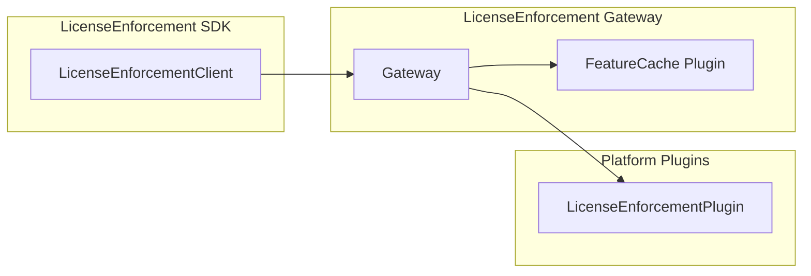
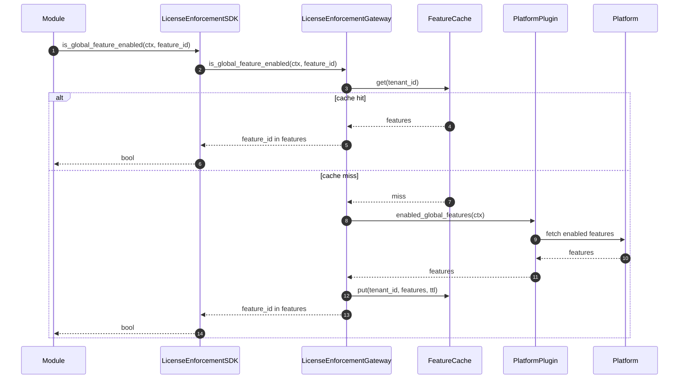

# Technical Design: License Enforcer (Phase 1)

## 1. Architecture Overview

### 1.1 Architectural Vision

The License Enforcer module provides a tenant-scoped feature-gating capability that keeps Platform licensing logic out of modules. It exposes an SDK for feature checks and centralizes caching, while delegating all Platform-specific calls and feature ID mapping to plugins.

Phase 1 delivers read-only checks over a tenant’s **global feature set** with best-effort freshness via a configurable TTL cache. Quotas, per-user/per-resource licensing, and usage reporting remain out of scope; these are handled by the Platform and the usage module.

The architecture follows the ModKit **Gateway + Plugin** pattern: the gateway implements the SDK, performs caching via a swappable cache plugin, and selects a Platform plugin based on configuration and context.

### 1.2 Architecture Drivers

#### Product requirements

#### Functional requirements

| FDD ID | Solution short description |
|--------|----------------------------|
| `fdd-license-enforcer-fr-check-global-feature` | SDK call checks membership in tenant’s cached global feature set. |
| `fdd-license-enforcer-fr-list-enabled-features` | Gateway returns full global feature set for tenant without pagination. |
| `fdd-license-enforcer-fr-cache-tenant-features` | Swappable cache plugin stores feature sets with TTL and refreshes on miss. |
| `fdd-license-enforcer-fr-plugin-integration` | Gateway delegates Platform calls and mapping to selected plugin. |
| `fdd-license-enforcer-fr-feature-id-mapping` | Plugin maps Platform feature identifiers to HyperSpot `LicenseFeatureID`. |

#### Non-functional requirements

| FDD ID | Solution short description |
|--------|----------------------------|
| `fdd-license-enforcer-nfr-tenant-isolation` | All cache keys and checks are strictly scoped to tenant ID from `SecurityContext`. |
| `fdd-license-enforcer-nfr-best-effort-freshness` | TTL-configured cache, refreshed on miss. |
| `fdd-license-enforcer-nfr-platform-agnostic` | Core gateway stays Platform-agnostic; integration is via plugins. |

### 1.3 Architecture Layers

| Layer | Responsibility | Technology |
|-------|---------------|------------|
| Presentation | API surface to other modules (SDK) | Rust traits in SDK crate |
| Application | Orchestrates cache lookup and plugin delegation | Gateway module |
| Domain | Licensing concepts: feature IDs, tenant scope | LicenseEnforcer domain types |
| Infrastructure | Cache plugin and Platform plugins | In-memory/Redis cache, Platform API clients |

## 2. Principles & Constraints

### 2.1: Design Principles

#### Platform-Agnostic Feature Gating

**ID**: `fdd-license-enforcer-principle-platform-agnostic`

<!-- fdd-id-content -->
**ADRs**: `fdd-license-enforcer-adr-plugin-boundary`

All Platform-specific licensing details live in plugins so that core modules depend only on HyperSpot feature identifiers.
<!-- fdd-id-content -->

#### Tenant-Scoped Decisions

**ID**: `fdd-license-enforcer-principle-tenant-scope`

<!-- fdd-id-content -->
**ADRs**: `fdd-license-enforcer-adr-tenant-scope`

Feature checks and cached data are always resolved using the tenant in `SecurityContext`.
<!-- fdd-id-content -->

#### Feature ID Mapping Responsibility

**ID**: `fdd-license-enforcer-principle-feature-id-mapping`

<!-- fdd-id-content -->
**ADRs**: `fdd-license-enforcer-adr-feature-id-mapping`

Platform feature identifiers can be arbitrary; the license enforcer plugin maps HyperSpot GTS feature IDs to the Platform format and back.
<!-- fdd-id-content -->

#### Swappable Cache Strategy

**ID**: `fdd-license-enforcer-principle-cache-strategy`

<!-- fdd-id-content -->
**ADRs**: `fdd-license-enforcer-adr-cache-plugin`

Caching is delegated to a swappable cache plugin (in-memory, Redis) to match deployment scale and infrastructure.
<!-- fdd-id-content -->

### 2.2: Constraints

#### Phase 1 Read-Only Scope

**ID**: `fdd-license-enforcer-constraint-phase1-readonly`

<!-- fdd-id-content -->
**ADRs**: `fdd-license-enforcer-adr-phase1-scope`

The module does not manage subscriptions, usage, or quotas; it only reads enabled features for a tenant.
<!-- fdd-id-content -->

## 3. Technical Architecture

### 3.1: Domain Model

**Technology**: Rust

**Location**: `modules/system/license_enforcer` (SDK + gateway + plugins)

**Core Entities**:
- `LicenseFeatureID` - Unique identifier for a licensed feature
- `TenantId` - Tenant scope key from `SecurityContext`

**Relationships**:
- Tenant → GlobalFeatures: a tenant is licensed for a set of global features

### 3.2: Component Model



**Components**:
- **LicenseEnforcementClient**: Public SDK for modules to check and list enabled features.
- **Gateway**: Implements SDK methods, performs cache lookups, and delegates to plugins.
- **FeatureCache Plugin**: Swappable cache backend (in-memory, Redis) for tenant feature sets.
- **LicenseEnforcementPlugin**: Platform integration and feature ID mapping.

**Interactions**:
- SDK → Gateway: request feature checks
- Gateway → Cache: get/put tenant feature sets
- Gateway → Plugin: fetch enabled global features from Platform

### 3.3: API Contracts

**Technology**: Rust SDK traits

**Location**: SDK crate in `modules/system/license_enforcer` (public client interface)

**Interfaces**:

```rust,ignore
use std::collections::HashSet;

trait LicenseEnforcementClient: Send + Sync {
    async fn is_global_feature_enabled(
        &self,
        ctx: &SecurityContext,
        feature_id: &LicenseFeatureID,
    ) -> Result<bool, LicenseEnforcementError>;

    async fn enabled_global_features(
        &self,
        ctx: &SecurityContext,
    ) -> Result<HashSet<LicenseFeatureID>, LicenseEnforcementError>;
}
```

> Note: The SDK defines `EnabledGlobalFeatures` as a type alias for `HashSet<LicenseFeatureID>` in `license_enforcer-sdk/src/models.rs`.

**Error handling**:
- `MissingTenant` when `SecurityContext` has no tenant scope (explicit deny).
- `PluginUnavailable` for plugin resolution failures.
- `PluginTimeout` when Platform calls exceed configured timeout.
- `CacheError` when the cache plugin fails or is unreachable.

**Concurrency**:
- Implementations must be safe for concurrent calls across threads (`Send + Sync`).

**Timeouts**:
- Plugin calls must respect a configurable timeout to avoid blocking callers indefinitely.

### 3.4: Interactions & Sequences



**Use cases**: `fdd-license-enforcer-usecase-check-feature`, `fdd-license-enforcer-usecase-refresh-features` (defined in PRD.md)

**Actors**: `fdd-license-enforcer-actor-hs-module`, `fdd-license-enforcer-actor-plugin` (defined in PRD.md)

### 3.5: Database schemas & tables

Not applicable in phase 1. The gateway uses a swappable cache plugin and does not require persistent storage.

### 3.6: Topology (optional)

**ID**: `fdd-license-enforcer-topology-cache`

Gateway runs within the HyperSpot service process. Cache plugin can be in-process memory or an external Redis cluster.

### 3.7: Tech stack (optional)

**ID**: `fdd-license-enforcer-tech-stack`

- Rust
- ModKit Gateway + Plugin pattern
- Cache plugin: in-memory or Redis

## 4. Additional Context

**ID**: `fdd-license-enforcer-design-context-phase1`

Phase 1 focuses exclusively on tenant-scoped global feature checks and cache-based freshness. TTL-based caching is sufficient while Platform feature sets change infrequently, but event-driven invalidation becomes necessary as real-time entitlements and usage-driven toggles are introduced. Phase 2+ is expected to be driven by customer demand for per-resource licensing and higher freshness requirements, and it will depend on Platform event delivery and usage tracking capabilities. The current SDK contracts are designed to remain stable, with phase 2 enhancements expected to be backward compatible for existing consumers.
