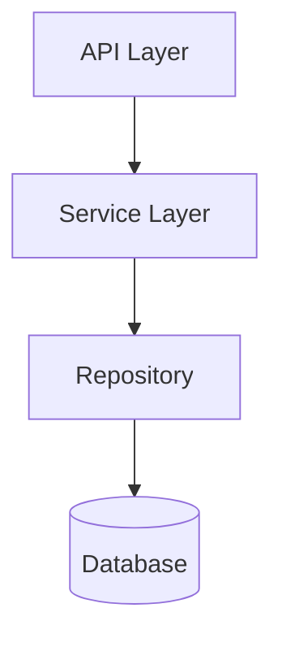

# Overall Design: Resource Group

## A. Architecture Overview

**Architectural Vision**:
The Resource Group module is designed as a core structural component of the Hyperspot platform. It provides a flexible, type-safe way to organize resources into hierarchies, which serves as the backbone for access control, visibility, and organizational modeling.

The architecture emphasizes read performance for hierarchy traversals, as these operations are on the critical path for every permission check. By isolating the hierarchy logic into a dedicated module with a specialized storage pattern (Closure Table), we ensure that structural queries remain performant even as the dataset grows.

**Architecture Layers**:
- **API Layer**: REST/gRPC endpoints for managing groups and types.
- **Service Layer**: Implements business logic, type validation, and cycle detection.
- **Domain Layer**: Defines core entities (ResourceGroup, ResourceGroupType).
- **Infrastructure Layer**: Handles database persistence using Secure ORM and Closure Table operations.

## B. Requirements & Principles

### 1. Functional Requirements

#### Resource Organization Management

**ID**: `fdd-hyperspot-req-resource-org`
<!-- fdd-id-content -->
The system MUST provide capabilities to create, update, move, and delete resource groups within a strict type hierarchy.

**Capabilities**: `fdd-hyperspot-capability-resource-organization`
**Actors**: `fdd-hyperspot-actor-application`, `fdd-hyperspot-actor-system-admin`
<!-- fdd-id-content -->

### 2. Non-Functional Requirements

#### Performance

**ID**: `fdd-hyperspot-nfr-performance`
<!-- fdd-id-content -->
Hierarchy queries (ancestors/descendants) MUST complete in under 10ms for trees up to 10 levels deep.

**ADRs**: `fdd-hyperspot-adr-closure-table`
<!-- fdd-id-content -->

### 3. Design Principles

#### Efficient Read Operations

**ID**: `fdd-hyperspot-principle-efficient-reads`
<!-- fdd-id-content -->
The system architecture MUST prioritize read performance for hierarchy operations over write performance, as reads (permission checks) occur much more frequently than writes (structure changes).

**ADRs**: `fdd-hyperspot-adr-closure-table`
<!-- fdd-id-content -->

### 4. Constraints

#### Database Independence

**ID**: `fdd-hyperspot-constraint-db-independence`
<!-- fdd-id-content -->
The implementation MUST NOT rely on proprietary database features (like Oracle CONNECT BY) and MUST work with standard SQL supported by SeaORM.

**ADRs**: `fdd-hyperspot-adr-closure-table`
<!-- fdd-id-content -->

## C. Technical Architecture

### C.1: Domain Model

**Component Diagram**:

**Components**:
- **ResourceGroupService**: Manages group lifecycle and hierarchy operations.
- **TypeRegistry**: Validates type constraints and parent-child rules.
- **ClosureTableManager**: Low-level helper for maintaining the closure table.

### C.2: Domain Model

**Technology**: Rust Structs / SeaORM Entities
**Location**: [../openspec/changes/add-resource-group-module/specs/resource-group/spec.md](../openspec/changes/add-resource-group-module/specs/resource-group/spec.md)

**Core Entities**:
- `ResourceGroup`: The node in the tree.
- `ResourceGroupType`: Definition of a node type.
- `ResourceGroupClosure`: The path storage.

### C.3: API Contracts

**Technology**: REST / OpenAPI
**Location**: [../openspec/changes/add-resource-group-module/specs/resource-group/spec.md](../openspec/changes/add-resource-group-module/specs/resource-group/spec.md)

**Endpoints**:
- `POST /types`
- `POST /groups`
- `GET /groups/{id}/ancestors`

### C.4: Security Model
- **Authentication**: JWT via SecurityCtx.
- **Authorization**: Application-level ownership for types; Hierarchy-based permissions for groups.

### C.5: Non-Functional Requirements
- **Scalability**: Horizontal scaling of read replicas.
- **Reliability**: Transactional integrity for all hierarchy moves.
