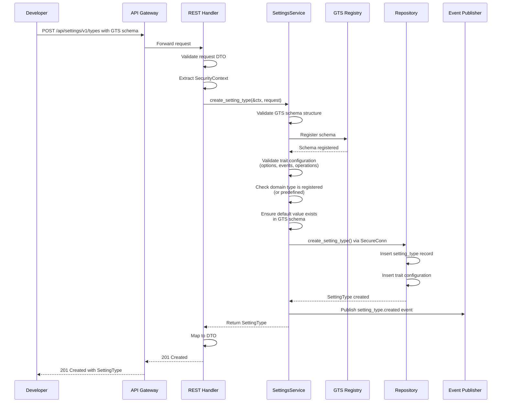
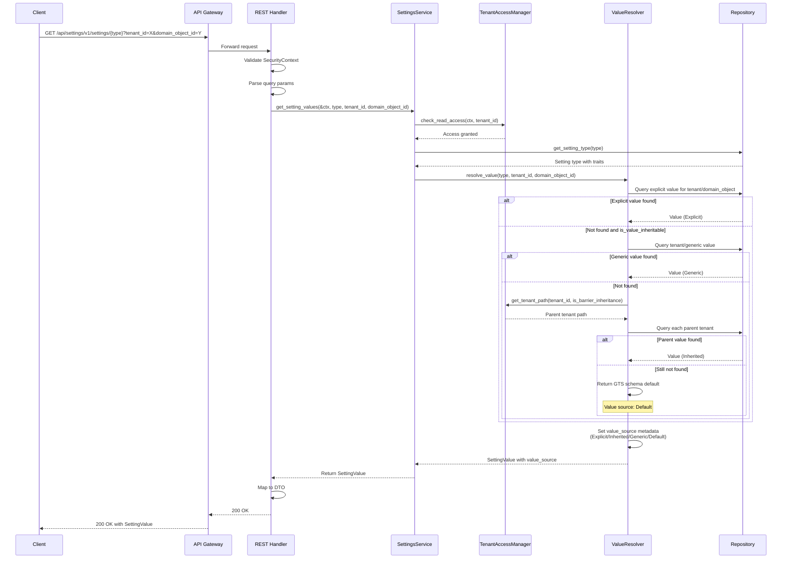
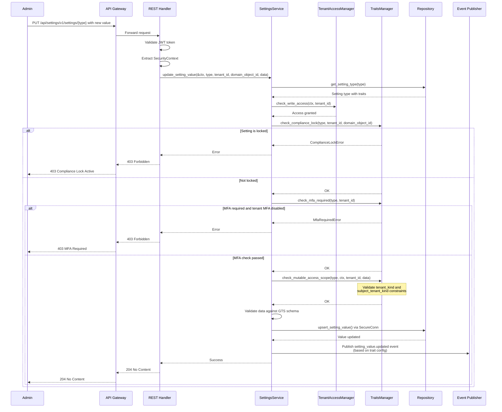
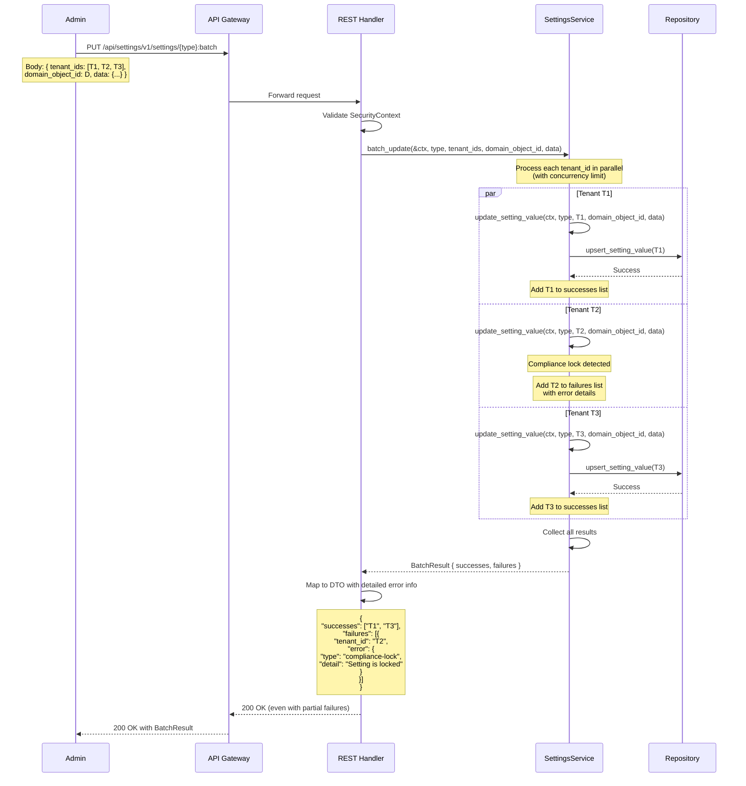
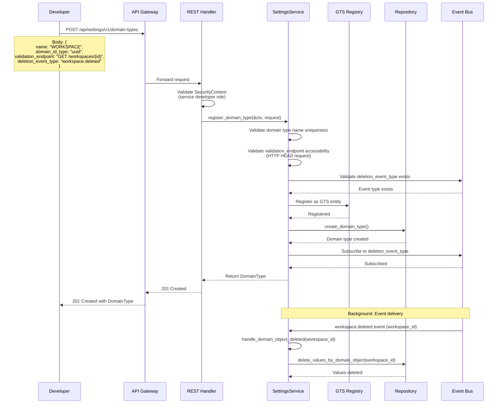
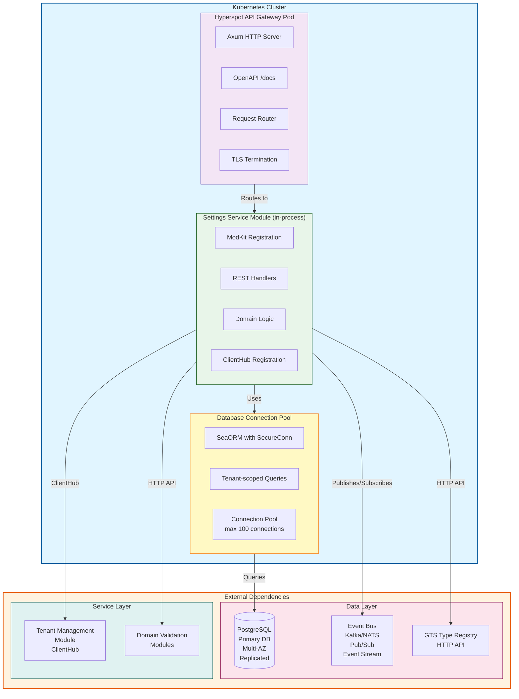

# Technical Design: Settings Service

## A. Architecture Overview

### Architectural Vision

The Settings Service is a Hyperspot module built in Rust, providing a type-safe, secure-by-default configuration management system for multi-tenant SaaS applications. The architecture follows Hyperspot's modular design principles with the SDK pattern, enabling both internal modules and external services to manage configuration through a clean, composable API.

The design leverages Hyperspot's ModKit framework to provide automatic REST API generation, OpenAPI documentation, inter-module communication via ClientHub, and secure database access with automatic tenant scoping. The service uses GTS (Global Type System) for schema management, enabling versioned schemas with backward compatibility guarantees and centralized type discovery.

The architecture emphasizes separation of concerns through DDD-light layering: SDK crate for public API surface, domain layer for business logic, infrastructure layer for persistence and external integrations, and REST API layer for HTTP transport. This separation enables independent evolution of implementation details while maintaining stable public interfaces for consuming services.

### Architecture drivers

#### Product requirements

| FDD ID                                            | Solution short description                                                                                                              |
| ------------------------------------------------- | --------------------------------------------------------------------------------------------------------------------------------------- |
| `fdd-settings-service-fr-setting-type-definition` | Implement GTS-based setting type registry with trait configuration (options, events, operations) replacing namespace-based organization |
| `fdd-settings-service-fr-setting-value-crud`      | Provide CRUD operations through REST API layer with domain service orchestration and SecureConn for tenant-scoped persistence           |
| `fdd-settings-service-fr-tenant-inheritance`      | Implement value resolution engine traversing tenant hierarchy with configurable inheritance rules and default fallback                  |
| `fdd-settings-service-fr-compliance-mode`         | Add compliance lock mechanism in domain layer with trait-based enforcement and audit event generation                                   |
| `fdd-settings-service-fr-access-control`          | Integrate SecurityContext validation in all API operations with tenant hierarchy access checks                                          |
| `fdd-settings-service-fr-batch-operations`        | Implement batch update and bulk get operations with partial success handling and detailed error reporting                               |
| `fdd-settings-service-fr-event-generation`        | Integrate Event Bus module for audit/notification events with trait-based propagation modes (SELF, SUBROOT, NONE)                       |
| `fdd-settings-service-fr-gts-versioning`          | Implement GTS Type Registry integration for schema versioning and backward compatibility                                                |
| `fdd-settings-service-fr-hyperspot-module`        | Structure as Hyperspot module with SDK pattern, ModKit lifecycle integration, and OperationBuilder for REST endpoints                   |
| `fdd-settings-service-fr-security-context`        | Require SecurityContext for all operations, use SecureConn for database access with automatic tenant scoping                            |
| `fdd-settings-service-fr-clienthub`               | Register SDK trait with ClientHub for type-safe inter-module communication                                                              |
| `fdd-settings-service-fr-rfc9457-errors`          | Map domain errors to RFC-9457 Problem format with standardized error codes                                                              |
| `fdd-settings-service-fr-odata`                   | Implement OData query support with $filter, $orderby, $select, $top/$skip, and cursor-based pagination                                  |
| `fdd-settings-service-fr-authentication`          | Validate JWT bearer tokens with tenant context, integrate with Hyperspot Tenant Resolver                                                |
| `fdd-settings-service-fr-idempotent-operations`   | Design write operations with idempotency keys for safe retry behavior                                                                   |

### Architecture Layers

```text
┌─────────────────────────────────────────────────────────────┐
│                     API Gateway (Hyperspot)                  │
│              Routes HTTP → Module REST Handlers              │
└─────────────────────────────────────────────────────────────┘
                              ↓
┌─────────────────────────────────────────────────────────────┐
│              Settings Service Module (Rust)                  │
│                                                              │
│  ┌────────────────────────────────────────────────────────┐ │
│  │  REST API Layer (api/rest/)                            │ │
│  │  - DTOs with serde + utoipa for OpenAPI               │ │
│  │  - Axum handlers (thin, delegate to domain)           │ │
│  │  - OperationBuilder route registration                │ │
│  │  - Problem error mapping (RFC-9457)                   │ │
│  │  - OData query parsing and validation                 │ │
│  └────────────────────────────────────────────────────────┘ │
│                              ↓                               │
│  ┌────────────────────────────────────────────────────────┐ │
│  │  Domain Layer (domain/)                                │ │
│  │  - SettingsService (business logic orchestration)     │ │
│  │  - ValueResolver (inheritance resolution)             │ │
│  │  - TenantAccessManager (hierarchy validation)         │ │
│  │  - TraitsManager (compliance, MFA, inheritance)       │ │
│  │  - Domain models (SettingType, SettingValue)          │ │
│  │  - Repository traits (SettingTypeRepo, ValueRepo)     │ │
│  │  - Event publisher port                               │ │
│  └────────────────────────────────────────────────────────┘ │
│                              ↓                               │
│  ┌────────────────────────────────────────────────────────┐ │
│  │  Infrastructure Layer (infra/)                         │ │
│  │  - SeaORM entities and repositories                   │ │
│  │  - SecureConn for tenant-scoped queries               │ │
│  │  - Event Bus adapter (publish audit/notification)     │ │
│  │  - GTS Type Registry client                           │ │
│  │  - Configuration (YAML + env vars)                    │ │
│  └────────────────────────────────────────────────────────┘ │
│                                                              │
│  ┌────────────────────────────────────────────────────────┐ │
│  │  SDK Crate (settings-service-sdk)                      │ │
│  │  - SettingsServiceClient trait                         │ │
│  │  - Transport-agnostic models                           │ │
│  │  - Domain errors (no HTTP/serde)                       │ │
│  └────────────────────────────────────────────────────────┘ │
└─────────────────────────────────────────────────────────────┘
                              ↓
┌─────────────────────────────────────────────────────────────┐
│                      External Dependencies                   │
│  - PostgreSQL/MariaDB/SQLite (via SeaORM)                  │
│  - Event Bus Module (audit/notification events)            │
│  - GTS Type Registry Module (schema management)            │
│  - Tenant Management Module (hierarchy data)               │
│  - Domain Validation Modules (optional object validation)  │
└─────────────────────────────────────────────────────────────┘
```

| Layer              | Responsibility                                                       | Technology                       |
| ------------------ | -------------------------------------------------------------------- | -------------------------------- |
| **REST API**       | HTTP transport, request/response DTOs, OpenAPI documentation         | Axum, utoipa, serde, modkit-rest |
| **Domain**         | Business logic, value resolution, access control, trait enforcement  | Pure Rust, async-trait           |
| **Infrastructure** | Database persistence, event publishing, external service integration | SeaORM, modkit-db, modkit-events |
| **SDK**            | Public API surface for consumers, type-safe client interface         | async-trait, modkit-security     |

## B. Principles & Constraints

### B.1: Design Principles

#### API Stability

**ID**: `fdd-settings-service-principle-api-compatibility`

<!-- fdd-id-content -->
**ADRs**: ADR-0006 (API Versioning and Deprecation Policy)

The Settings Service API provides stable, versioned endpoints with semantic versioning guarantees. API contracts are designed for long-term stability with backward compatibility maintained across minor versions. Request/response schemas, query parameters, HTTP status codes, and error formats follow consistent patterns. This principle ensures consuming services can depend on stable interfaces without frequent breaking changes.

**Implementation Strategy**: Use semantic versioning for API endpoints (v1, v2), maintain deprecated endpoints for at least one major version, provide clear migration guides for breaking changes, validate all changes against OpenAPI specifications.
<!-- fdd-id-content -->

#### Secure by Default

**ID**: `fdd-settings-service-principle-secure-default`

<!-- fdd-id-content -->
**ADRs**: References Hyperspot security guidelines

All operations MUST require SecurityContext for tenant isolation. Database access MUST use SecureConn with automatic tenant scoping to prevent cross-tenant data leakage. No raw SQL queries allowed - all database operations MUST use SeaORM queries executed via `&SecureConn`. Authentication MUST validate JWT tokens with tenant context before processing requests. This principle leverages Hyperspot's security infrastructure to enforce defense-in-depth.

**Implementation Strategy**: Pass `&SecurityContext` to all SDK methods, execute all queries via `&SecureConn` (e.g., `.one(&secure_conn)`, `.all(&secure_conn)`, `.exec(&secure_conn)`), validate tenant access in domain layer before database operations.
<!-- fdd-id-content -->

#### Trait-Based Configuration

**ID**: `fdd-settings-service-principle-trait-configuration`

<!-- fdd-id-content -->
**ADRs**: ADR-0009 (Trait Enforcement Architecture)

Setting types are configured through composable traits (SettingOptions, EventConfig, SettingsOperations) rather than monolithic configuration objects. This enables flexible, declarative configuration of inheritance rules, compliance modes, event generation, and access control without code changes. Traits are validated at setting type creation and enforced at runtime by the domain layer.

**Implementation Strategy**: Define trait structures in SDK crate, implement trait validation in domain service, enforce trait rules in ValueResolver and TraitsManager components.
<!-- fdd-id-content -->

#### Always Return a Value

**ID**: `fdd-settings-service-principle-default-fallback`

<!-- fdd-id-content -->
**ADRs**: ADR-0010 (Default Value Resolution Strategy), ADR-0012 (Setting Value Inheritance Algorithm), ADR-0016 (Database Schema Design for Tenant Hierarchy)

Setting value queries MUST never fail due to missing values. The value resolution engine follows cascading fallback: explicit value → tenant/generic → inherited from parent → GTS schema default. Every setting type MUST define a default value in its GTS schema. This principle eliminates null-checking in consuming applications and ensures predictable configuration behavior.

**Initial Implementation**: The initial implementation will query the Tenant Management Module database directly for tenant hierarchy traversal during inheritance resolution. This provides correct functionality without the complexity of cache synchronization.

**Future Enhancement**: A tenant hierarchy cache (see ADR-0005 - Proposed, deferred for initial implementation) and in-memory setting values cache (see ADR-0003 - Proposed, deferred for initial implementation) will be implemented in a future phase to achieve sub-100ms p95 latency requirements. The materialized path optimization (ADR-0016) in the database schema will minimize the performance impact of direct database queries in the initial implementation.

**Implementation Strategy**: Implement ValueResolver with fallback chain, validate default value presence in GTS schema during setting type creation, include value source metadata in responses. Query Tenant Management Module database directly for hierarchy traversal using materialized path optimization.
<!-- fdd-id-content -->

#### Domain-Driven Design Light

**ID**: `fdd-settings-service-principle-ddd-light`

<!-- fdd-id-content -->
**ADRs**: References Hyperspot module guidelines

Follow DDD-light architecture with clear layer separation: SDK (public API), Domain (business logic), Infrastructure (persistence/integration), REST API (transport). Domain layer contains pure business logic with no framework dependencies. Repository traits define persistence contracts. This separation enables testability, maintainability, and independent evolution of layers.

**Implementation Strategy**: Define repository traits in domain layer, implement with SeaORM in infrastructure layer, keep domain models framework-agnostic, use dependency injection for repository implementations.
<!-- fdd-id-content -->

### B.2: Constraints

#### Hyperspot Module Standards

**ID**: `fdd-settings-service-constraint-hyperspot-standards`

<!-- fdd-id-content -->
**ADRs**: References `.hyperspot/guidelines/NEW_MODULE.md`

MUST follow Hyperspot module conventions: SDK pattern with separate `settings-service-sdk` and `settings-service` crates, ModKit attribute `#[modkit::module]` for module registration, OperationBuilder for REST endpoint registration, SecureConn for all database access, RFC-9457 Problem for errors, YAML configuration under `modules.settings_service`. MUST NOT bypass SecureConn or use raw SQL - all database operations use SeaORM via `&SecureConn`.

**Impact**: Constrains implementation patterns to Hyperspot standards, requires learning ModKit framework, enforces specific project structure and naming conventions.
<!-- fdd-id-content -->

#### Rust Language and Tooling

**ID**: `fdd-settings-service-constraint-rust-tooling`

<!-- fdd-id-content -->
**ADRs**: References Hyperspot Rust guidelines

MUST be implemented in Rust with compile-time safety guarantees. MUST pass clippy lints with warnings denied, custom dylint lints for project compliance, and cargo deny for dependency licensing. MUST use `time::OffsetDateTime` instead of `chrono`. MUST achieve 90%+ test coverage with unit, integration, and E2E tests. MUST use workspace dependencies where available.

**Impact**: Requires Rust expertise, enforces strict code quality standards, limits dependency choices to approved crates, requires comprehensive test coverage.
<!-- fdd-id-content -->

#### Database Compatibility

**ID**: `fdd-settings-service-constraint-database-compatibility`

<!-- fdd-id-content -->
**ADRs**: ADR-0002 (Database Technology Selection)

MUST support PostgreSQL, MariaDB, and SQLite through SeaORM abstraction. Database schema MUST be compatible with existing Go implementation schema to enable gradual migration. Migrations MUST be bidirectional to support rollback scenarios. MUST maintain referential integrity and use appropriate indexes for tenant hierarchy traversal.

**Impact**: Limits database-specific features, requires schema compatibility validation, constrains migration strategy, affects query performance optimization approaches.
<!-- fdd-id-content -->

#### GTS Schema Versioning

**ID**: `fdd-settings-service-constraint-gts-transition`

<!-- fdd-id-content -->
**ADRs**: ADR-0001 (GTS Schema Versioning Strategy), ADR-0008 (GTS Type Registry Implementation)

MUST use GTS (Global Type System) for all schema definitions with semantic versioning support. Setting types reference GTS schemas by version, enabling schema evolution without breaking existing consumers. Type resolution MUST handle multiple schema versions simultaneously. Schema validation MUST use the version specified in the setting type definition.

**Impact**: Requires GTS Type Registry integration, schema version management in all operations, validation logic per schema version, coordination with GTS team for schema evolution.
<!-- fdd-id-content -->

#### Performance Requirements

**ID**: `fdd-settings-service-constraint-performance`

<!-- fdd-id-content -->
**ADRs**: References PRD success criteria

MUST achieve sub-100ms p95 latency for read operations, support 10,000+ writes per minute, handle 1,000 requests per second per tenant, support tenant hierarchies with 10+ levels without degradation. Database queries MUST use indexes for tenant hierarchy traversal. Caching strategy MUST be implemented for frequently accessed settings.

**Impact**: Requires performance profiling, query optimization, caching layer design, load testing infrastructure, may constrain feature complexity to meet latency targets.
<!-- fdd-id-content -->

#### Data Encryption

**ID**: `fdd-settings-service-constraint-data-encryption`

<!-- fdd-id-content -->
**ADRs**: References PRD NFR-Data Encryption (`fdd-settings-service-nfr-data-encryption`)

MUST encrypt sensitive setting values at rest using AES-256 or equivalent industry-standard encryption algorithms. Encryption keys MUST be managed through a secure key management system with key rotation capabilities. Setting types MUST support marking fields as sensitive to enable automatic encryption. Encrypted data MUST be decrypted only when accessed by authorized users with valid security context.

**Impact**: Requires integration with key management system, encryption/decryption overhead in read/write paths, schema design for sensitive field marking, key rotation procedures, affects query performance for encrypted fields.
<!-- fdd-id-content -->

#### Data Privacy and Compliance

**ID**: `fdd-settings-service-constraint-data-privacy`

<!-- fdd-id-content -->
**ADRs**: References PRD NFR-Data Privacy Compliance (`fdd-settings-service-nfr-data-privacy`)

MUST comply with data privacy regulations including GDPR, CCPA, and similar frameworks for user-scoped and tenant-scoped settings. MUST support data subject access requests (DSAR) to export all settings associated with a user or tenant. MUST implement the right to be forgotten by permanently deleting all user data upon request, bypassing soft deletion retention period. Personal data MUST be processed with explicit consent and purpose limitation. Data residency requirements MUST be supported for region-specific data storage.

**Impact**: Requires DSAR export API implementation, permanent deletion workflows, consent tracking mechanisms, data classification and tagging, region-aware data storage routing, compliance audit trails.
<!-- fdd-id-content -->

#### Network Security

**ID**: `fdd-settings-service-constraint-network-security`

<!-- fdd-id-content -->
**ADRs**: References PRD NFR-Network Security (`fdd-settings-service-nfr-network-security`)

MUST use TLS 1.2 or higher for all network communications including API endpoints, inter-module communication, and external service integrations. MUST enforce network isolation between tenants to prevent cross-tenant network access. API endpoints MUST be protected by rate limiting (1,000 requests per second per tenant with graceful degradation) and DDoS protection mechanisms. MUST support IP allowlisting and network access control lists for restricted environments.

**Impact**: Requires TLS certificate management, rate limiting middleware implementation, DDoS protection infrastructure, IP allowlist configuration system, network isolation validation, affects API gateway configuration.
<!-- fdd-id-content -->

## C. Technical Architecture

### C.1: Domain Model

**Technology**: GTS (Global Type System) + Rust structs  
**Location**:

- GTS Schemas: Registered in GTS Type Registry
- Rust Models: `settings-service-sdk/src/models.rs`, `settings-service/src/domain/`
- Schema Definitions: Versioned schemas in GTS Type Registry

**Core Entities**:

#### SettingType

Defines a configuration schema with validation rules and behavioral traits.

```rust
pub struct SettingType {
    pub id: Uuid,
    pub name: String,
    pub domain_type: DomainType,
    pub gts_schema: GtsSchemaReference,
    pub options: SettingOptions,
    pub event_config: EventConfig,
    pub operations: SettingsOperations,
    pub created_at: OffsetDateTime,
    pub updated_at: OffsetDateTime,
}

pub enum DomainType {
    Tenant,
    User,
    Custom(String), // For dynamically registered domain types
}

pub struct SettingOptions {
    pub is_value_inheritable: bool,        // default: true
    pub is_mfa_required: bool,             // default: false
    pub retention_period: u32,             // default: 90 days
    pub is_barrier_inheritance: bool,      // default: true
    pub enable_generic: bool,              // default: true
    pub enable_compliance: bool,           // default: false
}

pub struct EventConfig {
    pub audit: EventPropagation,           // SELF, SUBROOT, NONE
    pub notification: EventPropagation,    // SELF, SUBROOT, NONE
}

pub struct SettingsOperations {
    pub mutable_access_scope: Vec<MutableAccessScope>,
    pub read_only: Vec<ReadOnlyCondition>,
    pub hierarchy_logic: HierarchyLogic,
}
```

#### SettingValue

Represents a configuration value for a specific tenant and domain object.

```rust
pub struct SettingValue {
    pub id: Uuid,
    pub setting_type_id: Uuid,
    pub tenant_id: Uuid,
    pub domain_object_id: DomainObjectId,
    pub data: serde_json::Value,           // Validated against GTS schema
    pub is_explicit: bool,                 // true if set explicitly, false if inherited
    pub value_source: ValueSource,         // Explicit, Inherited, Generic, Default
    pub created_at: OffsetDateTime,
    pub updated_at: OffsetDateTime,
    pub deleted_at: Option<OffsetDateTime>, // Soft deletion
}

pub enum DomainObjectId {
    Uuid(Uuid),
    AppCode(String),
    Generic,
}

pub enum ValueSource {
    Explicit,      // Directly set for this tenant/domain object
    Inherited,     // Inherited from parent tenant
    Generic,       // Generic value for domain type
    Default,       // GTS schema default
}
```

#### TenantHierarchy

Cached tenant hierarchy data for inheritance resolution.

```rust
pub struct TenantHierarchy {
    pub tenant_id: Uuid,
    pub parent_id: Option<Uuid>,
    pub tenant_kind: TenantKind,
    pub is_barrier: bool,
    pub mfa_enabled: bool,
    pub provisioning_state: ProvisioningState,
    pub path: Vec<Uuid>,  // Ordered from root to current tenant
    pub materialized_path: String,  // Materialized path for efficient hierarchy queries (matches DB schema)
}

pub enum TenantKind {
    Root,
    Subroot,
    Partner,
    Customer,
    Unit,
    Folder,
}
```

**Relationships**:

- `SettingType` → `SettingValue`: One-to-many (one type, many values across tenants)
- `SettingValue` → `TenantHierarchy`: Many-to-one (values belong to tenants)
- `SettingType` → `GtsSchemaReference`: One-to-one (each type has one schema)
- `SettingValue` → `DomainObject`: Many-to-one (values associated with domain objects)

**GTS Schema Integration**:

- All setting types reference versioned GTS schemas
- Schema validation performed against GTS Type Registry
- Default values extracted from GTS schema definitions
- Schema evolution supported through GTS versioning

### C.2: Component Model

```text
┌─────────────────────────────────────────────────────────────────┐
│                    Settings Service Module                       │
│                                                                  │
│  ┌────────────────┐         ┌──────────────────┐               │
│  │ REST Handlers  │────────>│ SettingsService  │               │
│  │ (Axum)         │         │ (Domain)         │               │
│  └────────────────┘         └──────────────────┘               │
│         │                            │                          │
│         │                            ↓                          │
│         │                   ┌──────────────────┐               │
│         │                   │ ValueResolver    │               │
│         │                   │ (Inheritance)    │               │
│         │                   └──────────────────┘               │
│         │                            │                          │
│         ↓                            ↓                          │
│  ┌────────────────┐         ┌──────────────────┐               │
│  │ Error Mapper   │         │ TenantAccess     │               │
│  │ (Problem)      │         │ Manager          │               │
│  └────────────────┘         └──────────────────┘               │
│                                      │                          │
│                                      ↓                          │
│                             ┌──────────────────┐               │
│                             │ TraitsManager    │               │
│                             │ (Compliance/MFA) │               │
│                             └──────────────────┘               │
│                                      │                          │
│         ┌────────────────────────────┴────────────────┐        │
│         ↓                            ↓                 ↓        │
│  ┌────────────────┐         ┌──────────────┐  ┌──────────────┐│
│  │ SettingType    │         │ SettingValue │  │ Tenant       ││
│  │ Repository     │         │ Repository   │  │ Repository   ││
│  └────────────────┘         └──────────────┘  └──────────────┘│
│         │                            │                 │        │
└─────────┼────────────────────────────┼─────────────────┼────────┘
          │                            │                 │
          ↓                            ↓                 ↓
┌─────────────────────────────────────────────────────────────────┐
│                         SecureConn (SeaORM)                      │
│                    Tenant-Scoped Database Access                 │
└─────────────────────────────────────────────────────────────────┘
          │                            │                 │
          ↓                            ↓                 ↓
┌─────────────────────────────────────────────────────────────────┐
│                  PostgreSQL / MariaDB / SQLite                   │
└─────────────────────────────────────────────────────────────────┘

External Integrations:
┌──────────────────┐  ┌──────────────────┐  ┌──────────────────┐
│  Event Bus       │  │  GTS Type        │  │  Tenant Mgmt     │
│  Module          │  │  Registry        │  │  Module          │
└──────────────────┘  └──────────────────┘  └──────────────────┘
```

**Components**:

- **REST Handlers**: Thin Axum handlers that parse HTTP requests, validate input, delegate to domain service, map responses to DTOs
- **SettingsService**: Core domain service orchestrating business logic for CRUD operations, batch updates, compliance enforcement
- **ValueResolver**: Implements cascading value resolution through tenant hierarchy with inheritance rules and default fallback
- **TenantAccessManager**: Validates tenant hierarchy access, checks MFA requirements, enforces barrier tenant rules
- **TraitsManager**: Enforces trait-based rules (compliance locks, MFA requirements, inheritance configuration)
- **Repositories**: Abstract persistence layer with traits, implemented using SeaORM with SecureConn
- **Error Mapper**: Converts domain errors to RFC-9457 Problem format for REST responses
- **Event Publisher**: Publishes audit and notification events to Event Bus based on trait configuration

**Interactions**:

- REST Handlers → SettingsService: Delegates business logic with SecurityContext
- SettingsService → ValueResolver: Resolves values with inheritance for read operations
- SettingsService → TenantAccessManager: Validates access before write operations
- SettingsService → TraitsManager: Enforces trait rules (compliance, MFA, inheritance)
- SettingsService → Repositories: Persists/retrieves data via SecureConn
- SettingsService → Event Publisher: Publishes events for audit/notification
- ValueResolver → TenantAccessManager: Gets tenant hierarchy paths for inheritance
- Repositories → SecureConn: All database queries scoped to tenant context

### C.3: API Contracts

**Technology**: REST/OpenAPI 3.0 via Hyperspot OperationBuilder  
**Location**:

- Implementation: `settings-service/src/api/rest/routes.rs`
- OpenAPI: Auto-generated via `utoipa` at `/docs` endpoint
- DTOs: `settings-service/src/api/rest/dtos.rs`

**API Design Principles**:

- RESTful resource-oriented design
- Semantic versioning (v1, v2 in path)
- Consistent response formats across all endpoints
- RFC-9457 Problem format for all errors
- OData query support on collection endpoints
- Idempotent write operations
- Cursor-based pagination for large result sets

**Authentication & Authorization**:

- **Required**: OAuth 2.0 with JWT bearer tokens for all endpoints
- **Scopes**: `settings:read`, `settings:write`, `settings:admin`
- **Tenant Context**: Extracted from JWT token claims via SecurityContext
- **Unauthorized Requests**: Return HTTP 401 Unauthorized

**Endpoints**:

#### Setting Type Management

**POST /api/settings/v1/types** - Create Setting Type

```json
// Request
{
  "name": "data.retention",
  "domain_type": "TENANT",
  "gts_schema": {
    "ref": "gts://registry.hyperspot.dev/schemas/data-retention/v1.0.0",
    "version": "1.0.0"
  },
  "options": {
    "is_value_inheritable": true,
    "is_mfa_required": false,
    "retention_period": 90,
    "is_barrier_inheritance": true,
    "enable_generic": true,
    "enable_compliance": false
  },
  "event_config": {
    "audit": "SELF",
    "notification": "NONE"
  },
  "operations": {
    "mutable_access_scope": [
      {
        "tenant_kind": ["ROOT", "PARTNER"],
        "subject_tenant_kind": ["CUSTOMER", "UNIT"]
      }
    ],
    "read_only": []
  }
}

// Response: 201 Created
{
  "id": "550e8400-e29b-41d4-a716-446655440000",
  "name": "data.retention",
  "domain_type": "TENANT",
  "gts_schema": { ... },
  "options": { ... },
  "event_config": { ... },
  "operations": { ... },
  "created_at": "2026-02-02T12:00:00Z",
  "updated_at": "2026-02-02T12:00:00Z"
}
```

- **Auth**: JWT bearer token required (`settings:admin` scope)
- **Unauthorized**: Returns HTTP 401 if token missing or invalid
- **Validation**: GTS schema must exist in Type Registry, name must be unique
- **Errors**: 400 (invalid schema), 409 (duplicate name), 500 (registry unavailable)

**GET /api/settings/v1/types** - List Setting Types

```text
Query Parameters:
  - domain_type: Filter by domain type (TENANT, USER, etc.)
  - name_pattern: Regex pattern for name matching
  - $filter: OData filter expression
  - $orderby: Sort order (e.g., "created_at desc")
  - $select: Field projection
  - $top: Page size (default: 50, max: 200)
  - $skip: Offset for pagination
  - after: Cursor for cursor-based pagination

Response: 200 OK
{
  "items": [
    { "id": "...", "name": "data.retention", ... },
    { "id": "...", "name": "security.mfa", ... }
  ],
  "paging": {
    "total": 42,
    "cursors": {
      "after": "eyJpZCI6IjU1MGU4NDAwLWUyOWItNDFkNC1hNzE2LTQ0NjY1NTQ0MDAwMCJ9"
    }
  }
}
```

- **Auth**: JWT bearer token required (`settings:read` scope)
- **Unauthorized**: Returns HTTP 401 if token missing or invalid
- **Performance**: Results cached for 5 minutes

**GET /api/settings/v1/types/{type_id}** - Get Setting Type

```json
// Response: 200 OK
{
  "id": "550e8400-e29b-41d4-a716-446655440000",
  "name": "data.retention",
  "domain_type": "TENANT",
  "gts_schema": {
    "ref": "gts://registry.hyperspot.dev/schemas/data-retention/v1.0.0",
    "version": "1.0.0",
    "schema": { /* Full JSON Schema */ }
  },
  "options": { ... },
  "event_config": { ... },
  "operations": { ... },
  "created_at": "2026-02-02T12:00:00Z",
  "updated_at": "2026-02-02T12:00:00Z"
}
```

- **Auth**: JWT bearer token required (`settings:read` scope)
- **Unauthorized**: Returns HTTP 401 if token missing or invalid
- **Errors**: 404 (type not found)

#### Setting Value Operations

**GET /api/settings/v1/settings/{setting_type}** - Get Setting Values

```json
// Request
GET /api/settings/v1/settings/data.retention?tenant_id=f3e557f0-8bc1-421e-9781-1f3456d21742&domain_object_id=generic

// Response: 200 OK
{
  "id": "7de557f0-8bc1-778d-9781-1f3456d21798",
  "setting_type_id": "550e8400-e29b-41d4-a716-446655440000",
  "setting_type": "data.retention",
  "tenant_id": "f3e557f0-8bc1-421e-9781-1f3456d21742",
  "domain_object_id": "generic",
  "data": {
    "retention_days": 30,
    "auto_delete": true
  },
  "value_source": "INHERITED",
  "inherited_from": "a1b2c3d4-e5f6-7890-abcd-ef1234567890",
  "is_explicit": false,
  "created_at": "2026-01-15T10:00:00Z",
  "updated_at": "2026-02-01T14:30:00Z"
}
```

**Query Parameters**:

- `tenant_id` (required): Target tenant UUID
- `domain_object_id` (optional): Domain object ID or "generic" (default: "generic")
- `explicit_only` (optional): Return only explicit values, skip inheritance (default: false)
- `subtree_root_id` (optional): Get values for entire subtree starting from this tenant
- `include_metadata` (optional): Include GTS schema and type metadata (default: false)

**Response Variations**:

- Single value: Returns object when domain_object_id specified
- Multiple values: Returns array when subtree_root_id specified
- Value source always included: EXPLICIT, INHERITED, GENERIC, or DEFAULT

- **Auth**: JWT bearer token required (`settings:read` scope)
- **Unauthorized**: Returns HTTP 401 if token missing or invalid

**PUT /api/settings/v1/settings/{setting_type}** - Update Setting Value

```json
// Request
{
  "tenant_id": "f3e557f0-8bc1-421e-9781-1f3456d21742",
  "domain_object_id": "generic",
  "data": {
    "retention_days": 60,
    "auto_delete": false
  }
}

// Response: 204 No Content
```

**Validation Flow**:

1. Validate JWT token and extract tenant context
2. Check tenant hierarchy access (can only modify own tenant or descendants)
3. Validate MFA requirement (if `is_mfa_required` trait enabled)
4. Check compliance lock (if `enable_compliance` trait enabled)
5. Validate mutable access scope (tenant_kind and subject_tenant_kind)
6. Validate data against GTS schema
7. Upsert setting value
8. Publish audit event (if configured)

- **Auth**: JWT bearer token required (`settings:write` scope)
- **Unauthorized**: Returns HTTP 401 if token missing or invalid

**Errors**:

- 400: Schema validation failed
- 403: MFA required, compliance lock active, or access denied
- 404: Setting type not found
- 422: Invalid tenant hierarchy relationship

**DELETE /api/settings/v1/settings/{setting_type}** - Reset Setting Value

```text
DELETE /api/settings/v1/settings/data.retention?tenant_id=...&domain_object_id=generic

Response: 204 No Content
```

**Behavior**:

- Removes explicit value for tenant/domain_object
- Subsequent GET will return inherited or default value
- Soft deletion: Sets `deleted_at` timestamp
- Retention period: Configurable via setting type options (default: 90 days)

- **Auth**: JWT bearer token required (`settings:write` scope)
- **Unauthorized**: Returns HTTP 401 if token missing or invalid

**POST /api/settings/v1/settings/{setting_type}:batch** - Batch Update

```json
// Request
{
  "tenant_ids": [
    "f3e557f0-8bc1-421e-9781-1f3456d21742",
    "a1b2c3d4-e5f6-7890-abcd-ef1234567890",
    "9876fedc-ba98-7654-3210-fedcba987654"
  ],
  "domain_object_id": "generic",
  "data": {
    "retention_days": 90,
    "auto_delete": true
  }
}

// Response: 200 OK (partial success allowed)
{
  "successes": [
    {
      "tenant_id": "f3e557f0-8bc1-421e-9781-1f3456d21742",
      "setting_value_id": "7de557f0-8bc1-778d-9781-1f3456d21798"
    },
    {
      "tenant_id": "9876fedc-ba98-7654-3210-fedcba987654",
      "setting_value_id": "1234abcd-5678-90ef-ghij-klmnopqrstuv"
    }
  ],
  "failures": [
    {
      "tenant_id": "a1b2c3d4-e5f6-7890-abcd-ef1234567890",
      "error": {
        "type": "https://hyperspot.dev/problems/settings/compliance-lock",
        "title": "Compliance Lock Active",
        "status": 403,
        "detail": "Setting is locked for compliance and cannot be modified"
      }
    }
  ],
  "summary": {
    "total": 3,
    "succeeded": 2,
    "failed": 1
  }
}
```

**Behavior**:

- Processes all tenants in parallel (with concurrency limit)
- Returns 200 OK even with partial failures
- Each tenant validated independently
- Transaction per tenant (not global transaction)

- **Auth**: JWT bearer token required (`settings:write` scope)
- **Unauthorized**: Returns HTTP 401 if token missing or invalid

#### Compliance Operations

**PUT /api/settings/v1/settings/{setting_type}/lock** - Lock Setting

```json
// Request
{
  "tenant_id": "f3e557f0-8bc1-421e-9781-1f3456d21742",
  "domain_object_id": "generic",
  "subtree": true,
  "reason": "Regulatory compliance requirement"
}

// Response: 204 No Content
```

**Behavior**:

- Locks setting value for specified tenant/domain_object
- If `subtree: true`, locks for all child tenants recursively
- Self-service tenants are not affected by parent locks
- Locked settings return 403 on write attempts
- Lock metadata stored in `compliance_locks` table

**Requirements**:

- Setting type must have `enable_compliance: true` in options
- Caller must have `settings:admin` scope
- Lock reason required for audit trail

- **Auth**: JWT bearer token required (`settings:admin` scope)
- **Unauthorized**: Returns HTTP 401 if token missing or invalid

**Errors**:

- 400: Compliance not enabled for this setting type
- 403: Insufficient permissions
- 404: Setting type not found

**DELETE /api/settings/v1/settings/{setting_type}/lock** - Unlock Setting

```text
DELETE /api/settings/v1/settings/{setting_type}/lock?tenant_id=...&domain_object_id=generic

Response: 204 No Content
```

**Behavior**:

- Removes compliance lock
- Subtree locks removed recursively
- Audit event generated with unlock reason

- **Auth**: JWT bearer token required (`settings:admin` scope)
- **Unauthorized**: Returns HTTP 401 if token missing or invalid

#### Bulk Operations

**POST /api/settings/v1/settings:bulk-get** - Bulk Get Setting Values

```json
// Request
{
  "setting_types": ["data.retention", "security.mfa", "notification.email"],
  "tenant_ids": [
    "f3e557f0-8bc1-421e-9781-1f3456d21742",
    "a1b2c3d4-e5f6-7890-abcd-ef1234567890"
  ],
  "domain_object_ids": ["generic"]
}

// Response: 200 OK
{
  "results": [
    {
      "setting_type": "data.retention",
      "tenant_id": "f3e557f0-8bc1-421e-9781-1f3456d21742",
      "domain_object_id": "generic",
      "value": {
        "id": "...",
        "data": { "retention_days": 30 },
        "value_source": "INHERITED"
      }
    },
    {
      "setting_type": "security.mfa",
      "tenant_id": "f3e557f0-8bc1-421e-9781-1f3456d21742",
      "domain_object_id": "generic",
      "value": {
        "id": "...",
        "data": { "enabled": true },
        "value_source": "EXPLICIT"
      }
    }
  ],
  "summary": {
    "total_requested": 6,
    "total_returned": 6,
    "by_source": {
      "EXPLICIT": 2,
      "INHERITED": 3,
      "DEFAULT": 1
    }
  }
}
```

**Behavior**:

- Fetches multiple setting values in single request
- Cartesian product: setting_types × tenant_ids × domain_object_ids
- Inheritance resolution applied for each combination
- Results grouped by setting type and tenant
- Maximum 100 combinations per request

**Performance**:

- Parallel queries with connection pooling
- Results cached for 30 seconds
- Optimized for dashboard/UI bulk loading

- **Auth**: JWT bearer token required (`settings:read` scope)
- **Unauthorized**: Returns HTTP 401 if token missing or invalid

**OData Query Support** (on collection endpoints):

**Supported Operations**:

- `$filter`: Field-based filtering with operators (eq, ne, gt, lt, ge, le, in, contains)
- `$orderby`: Multi-field sorting (e.g., `$orderby=domain_type asc,created_at desc`)
- `$select`: Field projection to reduce response size
- `$top`: Page size limit (max: 200)
- `$skip`: Offset-based pagination
- `$expand`: Include related entities (e.g., `$expand=gts_schema`)

**Filter Examples**:

```text
$filter=domain_type eq 'TENANT'
$filter=created_at gt '2026-01-01T00:00:00Z'
$filter=name contains 'data'
$filter=domain_type in ('TENANT','USER') and options/is_mfa_required eq true
```

**Pagination**:

- **Offset-based**: Use `$top` and `$skip` for simple pagination
- **Cursor-based**: Use `after` parameter for efficient large dataset traversal
- Cursor format: Base64-encoded JSON with last item ID and sort keys
- Default page size: 50 items
- Maximum page size: 200 items

**Error Responses** (RFC-9457 Problem):

```json
{
  "type": "https://hyperspot.dev/problems/settings/validation-failed",
  "title": "Setting Value Validation Failed",
  "status": 400,
  "detail": "Value does not match GTS schema: field 'retention_days' must be >= 1",
  "instance": "/api/settings/v1/settings/data.retention",
  "tenant_id": "f3e557f0-8bc1-421e-9781-1f3456d21742",
  "setting_type": "data.retention",
  "validation_errors": [
    {
      "field": "retention_days",
      "constraint": "minimum",
      "expected": 1,
      "actual": 0
    }
  ]
}
```

### C.4: Interactions & Sequences

#### Sequence: Create Setting Type with GTS Schema

**Use Case**: `fdd-settings-service-usecase-create-setting-type`  
**Actor**: `fdd-settings-service-actor-service-developer`



#### Sequence: Get Setting Value with Inheritance Resolution

**Use Case**: `fdd-settings-service-usecase-get-values-hierarchy`  
**Actor**: `fdd-settings-service-actor-service-developer`



#### Sequence: Update Setting Value with Compliance Check

**Use Case**: `fdd-settings-service-usecase-update-value-inheritance`  
**Actor**: `fdd-settings-service-actor-system-administrator`



#### Sequence: Batch Update with Partial Success

**Use Case**: `fdd-settings-service-usecase-batch-update`  
**Actor**: `fdd-settings-service-actor-system-administrator`



#### Sequence: Register Dynamic Domain Type (Future Enhancement)

**Use Case**: `fdd-settings-service-usecase-register-domain-type`  
**Actor**: `fdd-settings-service-actor-service-developer`

> **Note**: This feature is planned for a future phase. The initial implementation will support only predefined domain types (TENANT, USER). Dynamic domain type registration via API will be implemented later.



### C.5: Database Schemas & Tables

**Technology**: SeaORM with PostgreSQL/MariaDB/SQLite support  
**Migration Strategy**: Maintain compatibility with existing Go implementation schema

#### Table: setting_types

**ID**: `fdd-settings-service-db-table-setting-types`

<!-- fdd-id-content -->
**Schema**:

| Column             | Type           | Description                           |
| ------------------ | -------------- | ------------------------------------- |
| id                 | UUID           | Primary key                           |
| name               | VARCHAR(255)   | Unique setting type name              |
| domain_type        | VARCHAR(50)    | Domain type enum (TENANT, USER, etc.) |
| gts_schema_ref     | TEXT           | GTS schema reference/URL              |
| gts_schema_version | VARCHAR(50)    | GTS schema version                    |
| options_json       | JSONB          | SettingOptions serialized             |
| event_config_json  | JSONB          | EventConfig serialized                |
| operations_json    | JSONB          | SettingsOperations serialized         |
| created_at         | TIMESTAMP      | Creation timestamp                    |
| updated_at         | TIMESTAMP      | Last update timestamp                 |
| deleted_at         | TIMESTAMP NULL | Soft deletion timestamp               |

**Primary Key**: `id`

**Indexes**:

- `idx_setting_types_name` ON (name) WHERE deleted_at IS NULL
- `idx_setting_types_domain_type` ON (domain_type) WHERE deleted_at IS NULL

**Constraints**:

- UNIQUE (name) WHERE deleted_at IS NULL

**Design Notes**:

- `options_json` stores all trait configuration as JSONB for flexibility
- `gts_schema_ref` stores GTS schema URL for validation
- `gts_schema_version` enables schema evolution tracking
- Soft deletion via `deleted_at` for audit compliance
<!-- fdd-id-content -->

#### Table: setting_values

**ID**: `fdd-settings-service-db-table-setting-values`

<!-- fdd-id-content -->
**Schema**:

| Column           | Type           | Description                                         |
| ---------------- | -------------- | --------------------------------------------------- |
| id               | UUID           | Primary key                                         |
| setting_type_id  | UUID           | Foreign key to setting_types                        |
| tenant_id        | UUID           | Tenant owning this value                            |
| domain_object_id | VARCHAR(255)   | Domain object ID (UUID, GTS, AppCode, or 'generic') |
| data             | JSONB          | Setting value data (validated against GTS schema)   |
| tenant_path      | VARCHAR(1024)  | Materialized path for hierarchy queries (see ADR-0016) |
| is_explicit      | BOOLEAN        | True if explicitly set, false if inherited          |
| created_at       | TIMESTAMP      | Creation timestamp                                  |
| updated_at       | TIMESTAMP      | Last update timestamp                               |
| deleted_at       | TIMESTAMP NULL | Soft deletion timestamp                             |

**Primary Key**: `id`

**Indexes**:

- `idx_setting_values_lookup` ON (setting_type_id, tenant_id, domain_object_id) WHERE deleted_at IS NULL
- `idx_setting_values_tenant` ON (tenant_id) WHERE deleted_at IS NULL
- `idx_setting_values_type` ON (setting_type_id) WHERE deleted_at IS NULL
- `idx_setting_values_tenant_path` ON (tenant_path) WHERE deleted_at IS NULL

**Constraints**:

- FOREIGN KEY (setting_type_id) REFERENCES setting_types(id)
- UNIQUE (setting_type_id, tenant_id, domain_object_id) WHERE deleted_at IS NULL

**Design Notes**:

- `is_explicit` flag distinguishes explicit values from inherited/default
- `domain_object_id` supports UUID, AppCode, or "generic" for flexible associations
- `tenant_path` column stores materialized path in format `/root-uuid/parent-uuid/tenant-uuid/` for optimized hierarchy queries (see ADR-0016)
- Materialized path enables efficient ancestor lookups and subtree queries for setting inheritance resolution without joining tenant_hierarchy_cache
- Path computed from `tenant_hierarchy_cache` during write operations
- Soft deletion via `deleted_at` with configurable retention period
- JSONB `data` field validated against GTS schema on write
<!-- fdd-id-content -->

#### Table: tenant_hierarchy_cache

**ID**: `fdd-settings-service-db-table-tenant-hierarchy`

<!-- fdd-id-content -->
**Schema**:

| Column             | Type         | Description                                         |
| ------------------ | ------------ | --------------------------------------------------- |
| tenant_id          | UUID         | Primary key                                         |
| parent_id          | UUID NULL    | Parent tenant ID                                    |
| tenant_kind        | VARCHAR(20)  | Tenant kind enum                                    |
| is_barrier         | BOOLEAN      | Barrier tenant flag                                 |
| mfa_enabled        | BOOLEAN      | MFA enabled status                                  |
| provisioning_state | VARCHAR(20)  | Provisioning state                                  |
| path               | UUID[]       | Ordered path from root to tenant (PostgreSQL array) |
| path_json          | JSONB        | Path as JSON array (for MariaDB/SQLite)             |
| materialized_path  | VARCHAR(1024)| Materialized path for hierarchy queries (see ADR-0016) |
| updated_at         | TIMESTAMP    | Last sync timestamp                                 |

**Primary Key**: `tenant_id`

**Indexes**:

- `idx_tenant_hierarchy_parent` ON (parent_id)
- `idx_tenant_hierarchy_path` ON (path) USING GIN (PostgreSQL only)
- `idx_tenant_hierarchy_materialized_path` ON (materialized_path)

**Constraints**:

- FOREIGN KEY (parent_id) REFERENCES tenant_hierarchy_cache(tenant_id)

**Design Notes**:

⚠️ **FUTURE WORK**: This table is part of the deferred caching optimization (see ADR-0005 - Proposed, deferred for initial implementation). The initial implementation will query the Tenant Management Module database directly for tenant hierarchy data.

- Cached data synchronized from Tenant Management Module via Event Bus
- `path` column (PostgreSQL array) enables efficient hierarchy traversal
- `path_json` (JSONB) provides cross-database compatibility
- `materialized_path` column (VARCHAR) stores full hierarchy path in format `/root-uuid/parent-uuid/tenant-uuid/` for optimized setting value queries (see ADR-0016)
- Materialized path enables single-query ancestor lookups and efficient subtree queries for setting inheritance resolution
- Updated via event subscriptions (tenant.created, tenant.updated, tenant.deleted)
- Cache miss handling: If tenant not found during value resolution, check DB and trigger cache refresh
<!-- fdd-id-content -->

#### Table: compliance_locks

**ID**: `fdd-settings-service-db-table-compliance-locks`

<!-- fdd-id-content -->
**Schema**:

| Column           | Type         | Description                          |
| ---------------- | ------------ | ------------------------------------ |
| id               | UUID         | Primary key                          |
| setting_type_id  | UUID         | Foreign key to setting_types         |
| tenant_id        | UUID         | Tenant where lock applies            |
| domain_object_id | VARCHAR(255) | Domain object ID or 'generic'        |
| locked_by        | UUID         | User ID who locked                   |
| locked_at        | TIMESTAMP    | Lock timestamp                       |
| subtree          | BOOLEAN      | Apply to subtree (all child tenants) |

**Primary Key**: `id`

**Indexes**:

- `idx_compliance_locks_lookup` ON (setting_type_id, tenant_id, domain_object_id)

**Constraints**:

- FOREIGN KEY (setting_type_id) REFERENCES setting_types(id)
- UNIQUE (setting_type_id, tenant_id, domain_object_id)

**Design Notes**:

- Supports compliance mode feature for regulated settings
- `subtree` flag enables recursive locking across tenant hierarchy
- Enforced by TraitsManager before all write operations
- Lock metadata includes user ID and timestamp for audit trail
<!-- fdd-id-content -->

#### Table: domain_type_registry

**ID**: `fdd-settings-service-db-table-domain-types`

<!-- fdd-id-content -->
**Schema**:

| Column              | Type         | Description                                            |
| ------------------- | ------------ | ------------------------------------------------------ |
| id                  | UUID         | Primary key                                            |
| name                | VARCHAR(50)  | Domain type name (e.g., WORKSPACE)                     |
| domain_id_type      | VARCHAR(20)  | Data type (uuid, string, integer)                      |
| validation_endpoint | VARCHAR(500) | REST API endpoint for validation (future enhancement) |
| deletion_event_type | VARCHAR(100) | Event type for deletion                                |
| is_predefined       | BOOLEAN      | True for built-in types                                |
| created_at          | TIMESTAMP    | Creation timestamp                                     |

**Primary Key**: `id`

**Indexes**:

- `idx_domain_types_name` ON (name) UNIQUE

**Constraints**:

- UNIQUE (name)

**Design Notes**:

- Supports dynamic domain type registration at runtime
- Predefined types (TENANT, USER) seeded on initialization
- **Future Enhancement**: `validation_endpoint` will enable optional domain object existence checks (not implemented in initial version)
- **Future Enhancement**: Domain API registration endpoint `/api/settings/v1/domain-types` will be implemented in a future phase
- `deletion_event_type` enables automatic cleanup on domain object deletion
<!-- fdd-id-content -->

### C.6: Topology

**ID**: `fdd-settings-service-topology-hyperspot-deployment`

<!-- fdd-id-content -->
**Deployment Architecture**:



**Scaling Strategy**:

- Horizontal scaling: Multiple Hyperspot pods behind load balancer
- Stateless design: No local state, all state in database
- Database read replicas for read-heavy workloads
- In-memory caching per instance for frequently accessed settings (future enhancement per ADR-0003)

**High Availability**:

- Multi-AZ database deployment with automatic failover
- Pod anti-affinity rules to distribute across nodes
- Health checks: `/health` endpoint validates DB connectivity
- Graceful shutdown: Drain connections before pod termination
<!-- fdd-id-content -->

### C.7: Tech Stack

**ID**: `fdd-settings-service-tech-stack`

<!-- fdd-id-content -->
**Core Technologies**:

| Component      | Technology       | Version | Purpose                                          |
| -------------- | ---------------- | ------- | ------------------------------------------------ |
| Language       | Rust             | 1.75+   | Implementation language                          |
| Framework      | Hyperspot ModKit | Latest  | Module framework                                 |
| HTTP Server    | Axum             | 0.7+    | HTTP routing and handlers                        |
| Database ORM   | SeaORM           | 0.12+   | Database abstraction                             |
| Database       | PostgreSQL       | 14+     | Primary database (also supports MariaDB, SQLite) |
| Async Runtime  | Tokio            | 1.35+   | Asynchronous runtime                             |
| Serialization  | serde            | 1.0+    | JSON serialization                               |
| OpenAPI        | utoipa           | 4.0+    | OpenAPI documentation generation                 |
| Error Handling | thiserror        | 1.0+    | Error type derivation                            |
| Testing        | cargo test       | -       | Unit and integration tests                       |
| Linting        | clippy + dylint  | -       | Code quality enforcement                         |

**Hyperspot Dependencies**:

| Crate               | Purpose                              |
| ------------------- | ------------------------------------ |
| modkit-core         | Module lifecycle management          |
| modkit-rest         | OperationBuilder for REST endpoints  |
| modkit-db           | SecureConn for tenant-scoped queries |
| modkit-security     | SecurityContext and authentication   |
| modkit-events       | Event Bus integration                |
| modkit-odata-macros | OData query support                  |
| modkit-problem      | RFC-9457 Problem error format        |

**External Service Dependencies**:

| Service           | Purpose                             | Protocol               |
| ----------------- | ----------------------------------- | ---------------------- |
| GTS Type Registry | Schema management and versioning    | HTTP REST              |
| Event Bus         | Audit and notification events       | Kafka/NATS             |
| Tenant Management | Hierarchy data and tenant lifecycle | ClientHub (in-process) |
| Domain Validation | Optional domain object validation   | HTTP REST              |

**Development Tools**:

| Tool          | Purpose                         |
| ------------- | ------------------------------- |
| cargo         | Build and dependency management |
| cargo-watch   | Auto-rebuild on file changes    |
| cargo-nextest | Fast test runner                |
| sea-orm-cli   | Database migration management   |
| cargo-deny    | Dependency license checking     |
<!-- fdd-id-content -->

## D. Additional Context

### Module Initialization and Lifecycle

**ID**: `fdd-settings-service-design-context-migration-strategy`

<!-- fdd-id-content -->
The Settings Service module follows Hyperspot's standard initialization and lifecycle patterns:

**Initialization Sequence**:

1. **Configuration Loading**: Read YAML configuration from `modules.settings_service` section
2. **Database Connection**: Establish SecureConn pool with tenant scoping enabled
3. **GTS Registry Connection**: Validate connectivity to GTS Type Registry
4. **Event Bus Subscription**: Subscribe to tenant lifecycle events (created, updated, deleted)
5. **Predefined Types Seeding**: Insert predefined domain types if not present
6. **ClientHub Registration**: Register SettingsServiceClient trait for inter-module calls
7. **REST Endpoint Registration**: Register all API routes via OperationBuilder
8. **Health Check Activation**: Enable `/health` endpoint with DB connectivity check

**Graceful Shutdown**:

1. Stop accepting new HTTP requests
2. Drain in-flight requests (30 second timeout)
3. Close Event Bus subscriptions
4. Flush pending audit events
5. Close database connections
6. Deregister from ClientHub

**Health Checks**:

- **Liveness**: Process is running and responsive
- **Readiness**: Database connected, GTS Registry accessible, Event Bus connected
- **Startup**: All initialization steps completed successfully

**Configuration Hot Reload**:

- Database connection pool settings
- Cache TTL values
- Rate limit thresholds
- Feature flags (via GTS-based configuration)
<!-- fdd-id-content -->

### GTS Schema Integration

**ID**: `fdd-settings-service-design-context-gts-integration`

<!-- fdd-id-content -->
The Settings Service uses GTS (Global Type System) for all schema definitions and validation:

**GTS Benefits**:

- Versioned schemas with semantic versioning and backward compatibility
- Centralized schema registry for discovery and validation
- Type evolution without breaking existing consumers
- Cross-service schema reuse and standardization
- Built-in validation rules and constraints

**Integration Points**:

1. **Setting Type Creation**:
   - Validate GTS schema exists in Type Registry
   - Verify schema has required default values
   - Cache schema definition locally for performance
   - Register schema version in setting type metadata

2. **Value Validation**:
   - Fetch GTS schema by version from Type Registry
   - Validate setting value data against JSON Schema
   - Apply custom validation rules from schema
   - Return detailed validation errors with field paths

3. **Schema Evolution**:
   - Support multiple schema versions simultaneously
   - Setting types reference specific schema version
   - New versions deployed without breaking existing settings
   - Validation uses version specified in setting type

4. **Default Values**:
   - Extract default values from GTS schema definitions
   - Use as fallback when no explicit/inherited value exists
   - Ensure all setting types have valid defaults

**Schema Reference Format**: `gts://registry.hyperspot.dev/schemas/data-retention/v1.2.0`

**Schema Caching Strategy**:

- In-memory cache per instance with 1 hour TTL (configurable via `cache_gts_schema_ttl`)
- Invalidate on Type Registry webhook notifications
- Fallback to cached version if registry unavailable
- Metrics tracked for cache hit/miss rates
- No cross-instance synchronization required (schemas change infrequently)
<!-- fdd-id-content -->

### Performance Optimization Strategies

**ID**: `fdd-settings-service-design-context-performance`

<!-- fdd-id-content -->
To meet sub-100ms p95 latency requirements:

**Database Optimizations**:

- Composite indexes on (setting_type_id, tenant_id, domain_object_id) for fast lookups
- GIN index on tenant hierarchy path for efficient parent traversal (PostgreSQL)
- Connection pooling with 100 max connections
- Prepared statements for common queries
- Read replicas for read-heavy workloads

**Caching Strategy** (future enhancement per ADR-0003):

- In-memory cache per instance for frequently accessed settings
- Cache-aside pattern: Check cache → Query DB → Update cache
- TTL: 5 minutes (configurable via `cache_sliding_window_size`)
- Cache invalidation on local updates (immediate)
- Cross-instance invalidation: Out of scope (eventual consistency acceptable)
- Configurable limits: `cache_max_entries` (default: 10,000), `cache_tenant_hierarchy_depth` (default: 5)
- Sliding window eviction: Items unused for TTL duration are evicted
- No external dependencies (Redis not required)

**Query Optimizations**:

- Batch database queries in bulk operations
- Parallel processing of independent operations with concurrency limits
- Lazy loading of tenant hierarchy (cache in request context)
- Avoid N+1 queries: Preload related data with JOINs

**Monitoring**:

- Track p50, p95, p99 latencies per endpoint
- Database query performance metrics
- Cache hit/miss rates
- Tenant hierarchy traversal depth distribution
<!-- fdd-id-content -->

### Security Considerations

**ID**: `fdd-settings-service-design-context-security`

<!-- fdd-id-content -->
Security is enforced at multiple layers:

**Authentication**:

- JWT bearer tokens validated by Hyperspot Tenant Resolver
- Token must contain tenant_id claim matching request tenant
- Service-to-service authentication via client credentials flow

**Authorization**:

- SecurityContext required for all operations
- Tenant hierarchy validation before read/write operations
- Role-based access control: Service developer, System admin, Compliance officer
- MFA enforcement for sensitive settings (trait-based)

**Data Protection**:

- All database queries scoped to tenant via SecureConn
- No raw SQL queries allowed - all operations use SeaORM via `&SecureConn`
- Sensitive setting values encrypted at rest (future enhancement)
- Audit events for all write operations

**Input Validation**:

- GTS schema validation for all setting values
- SQL injection prevention via parameterized queries (SeaORM)
- XSS prevention via proper JSON encoding
- Rate limiting per tenant (1000 req/sec)

**Compliance**:

- GDPR: Support data deletion requests via permanent delete API
- Audit trail: All modifications logged with user ID, timestamp, change details
- Data residency: Support region-specific database instances (future)
<!-- fdd-id-content -->

### Testing Strategy

**ID**: `fdd-settings-service-design-context-testing`

<!-- fdd-id-content -->
Comprehensive testing approach to ensure quality:

**Unit Tests** (70% coverage target):

- Domain logic: ValueResolver, TenantAccessManager, TraitsManager
- Repository implementations with mock database
- Error mapping and validation logic
- Trait enforcement rules

**Integration Tests** (20% coverage target):

- End-to-end API tests with test database
- Tenant hierarchy inheritance scenarios
- Compliance lock enforcement
- Batch operations with partial failures
- Event generation verification

**E2E Tests** (10% coverage target):

- Full stack tests with real dependencies
- Migration compatibility tests (Go vs Rust responses)
- Performance tests: Latency, throughput, concurrency
- Load tests: 10,000 writes/min, 1,000 req/sec per tenant

**Test Data**:

- Fixture data for common scenarios
- Tenant hierarchy with 10+ levels
- Multiple domain types and setting types
- Edge cases: Barrier tenants, MFA requirements, compliance locks

**CI/CD Integration**:

- Run tests on every commit
- Require 90%+ coverage for merge
- Performance regression detection
- Automated migration compatibility checks
<!-- fdd-id-content -->

### GTS Base Setting Type Design

**ID**: `fdd-settings-service-design-context-gts-base-type`

<!-- fdd-id-content -->
The Settings Service defines an abstract base GTS type `gts.x.sm.setting.v1.0~` that serves as the foundation for all concrete setting types. This design follows the GTS specification for extensible type systems with trait-based configuration.

**GTS Base Setting Type JSON Schema**:

```json
{
  "$schema": "https://json-schema.org/draft/2020-12/schema",
  "$id": "gts.x.sm.setting.v1.0~",
  "title": "Base Setting Type",
  "description": "Abstract base type for all setting types in the Settings Service. Derived types must extend this base and provide concrete gts-traits values.",
  "type": "object",
  "gts-traits": {
    "description": "Trait configuration that derived types must provide concrete values for",
    "type": "object",
    "required": ["domain_type"],
    "properties": {
      "domain_type": {
        "type": "string",
        "enum": ["TENANT", "USER"],
        "description": "Domain type that this setting applies to"
      },
      "events": {
        "type": "object",
        "description": "Event generation configuration for audit and notification",
        "properties": {
          "audit": {
            "type": "string",
            "enum": ["SELF", "SUBROOT", "NONE"],
            "default": "NONE",
            "description": "Audit event propagation mode"
          },
          "notification": {
            "type": "string",
            "enum": ["SELF", "SUBROOT", "NONE"],
            "default": "NONE",
            "description": "Notification event propagation mode"
          }
        }
      },
      "options": {
        "type": "object",
        "description": "Setting behavior options",
        "properties": {
          "is_self_service_overwritable": {
            "type": "boolean",
            "default": false,
            "description": "Allow parent tenant to enable/disable changes for self-service tenants"
          },
          "is_value_overwritable": {
            "type": "boolean",
            "default": true,
            "description": "If false, only root tenant can set explicit values"
          },
          "is_value_inheritable": {
            "type": "boolean",
            "default": true,
            "description": "Whether children inherit parent values"
          },
          "is_mfa_required": {
            "type": "boolean",
            "default": false,
            "description": "Require MFA for tenants modifying this setting"
          },
          "retention_period": {
            "type": "integer",
            "default": 90,
            "description": "Days to retain soft-deleted objects"
          },
          "is_barrier_inheritance": {
            "type": "boolean",
            "default": true,
            "description": "Allow barrier tenants to inherit parent values"
          },
          "enable_generic": {
            "type": "boolean",
            "default": true,
            "description": "Allow generic domain_object_id values"
          },
          "enable_compliance": {
            "type": "boolean",
            "default": false,
            "description": "Enable compliance mode with setting locks"
          }
        }
      },
      "operation": {
        "type": "object",
        "description": "Access control and mutability rules using CEL (Common Expression Language) expressions with runtime value resolvers",
        "properties": {
          "mutable_access_scope": {
            "type": "string",
            "description": "CEL expression that evaluates to boolean to determine if the current user has mutable (write/update/delete) access to the setting. The expression can reference runtime value resolvers provided by the Settings Service:\n\n**Value Resolvers:**\n- `$tenant_kind`: The tenant kind of the tenant being accessed (string). Possible values: 'root', 'subroot', 'partner', 'customer', 'unit', 'folder'.\n- `$subject_tenant_kind`: The tenant kind of the authenticated user's tenant (string). Possible values: 'root', 'subroot', 'partner', 'customer', 'unit', 'folder'.\n- `$origin`: The origin/source of the request (string). Can be used to restrict access based on request source (e.g., 'api', 'ui', 'internal').\n- `$.`: Prefix for accessing setting data properties. Use dot notation to reference nested fields (e.g., `$.data.attr1` accesses the `attr1` field in the setting's data object).\n\n**Examples:**\n- `$tenant_kind == 'root' || $subject_tenant_kind == 'root'` - Only root tenants can modify\n- `$tenant_kind in ['partner', 'customer'] && $subject_tenant_kind == 'root'` - Root users can modify partner/customer settings\n- `$.data.locked == false` - Only allow modification when data.locked is false\n- `$tenant_kind == $subject_tenant_kind || $subject_tenant_kind == 'root'` - Tenant users or root users can modify\n- `$origin == 'api' && $.data.api_enabled == true` - Only API requests when api_enabled is true\n\n**Default:** If not specified, mutable access is granted to tenant users, parent tenant users (if barrier not enforced), and root/subroot users.",
            "examples": [
              "$tenant_kind == 'root' || $subject_tenant_kind == 'root'",
              "$tenant_kind in ['partner', 'customer'] && $subject_tenant_kind == 'root'",
              "$.data.locked == false && $subject_tenant_kind in ['root', 'partner']"
            ]
          },
          "read_access_scope": {
            "type": "string",
            "description": "CEL expression that evaluates to boolean to determine if the current user has read access to the setting. The expression can reference the same runtime value resolvers as mutable_access_scope:\n\n**Value Resolvers:**\n- `$tenant_kind`: The tenant kind of the tenant being accessed (string). Possible values: 'root', 'subroot', 'partner', 'customer', 'unit', 'folder'.\n- `$subject_tenant_kind`: The tenant kind of the authenticated user's tenant (string). Possible values: 'root', 'subroot', 'partner', 'customer', 'unit', 'folder'.\n- `$origin`: The origin/source of the request (string). Can be used to restrict access based on request source.\n- `$.`: Prefix for accessing setting data properties. Use dot notation to reference nested fields (e.g., `$.data.visibility` accesses the `visibility` field in the setting's data object).\n\n**Examples:**\n- `true` - All authenticated users can read (default behavior)\n- `$tenant_kind == $subject_tenant_kind` - Only tenant's own users can read\n- `$.data.visibility == 'public' || $subject_tenant_kind == 'root'` - Public settings or root users\n- `$subject_tenant_kind in ['root', 'partner']` - Only root and partner users can read\n\n**Default:** If not specified, read access is granted to all authenticated users with valid tenant context.",
            "examples": [
              "true",
              "$tenant_kind == $subject_tenant_kind",
              "$.data.visibility == 'public' || $subject_tenant_kind == 'root'"
            ]
          }
        }
      }
    }
  },
  "required": ["type", "domain_object_id", "data", "tenant_id"],
  "properties": {
    "type": {
      "type": "string",
      "description": "GTS type identifier for the concrete setting type",
      "example": "gts.x.sm.setting.v1.0~x.data.retention.v1.0~"
    },
    "domain_object_id": {
      "description": "ID of the domain object this setting applies to, or 'generic' for all objects",
      "oneOf": [
        {"type": "string", "format": "uuid"},
        {"type": "string", "pattern": "^[a-zA-Z0-9_]+\\.[a-zA-Z0-9_]+$"},
        {"type": "string", "enum": ["generic"]}
      ]
    },
    "data": {
      "type": "object",
      "description": "Setting value data. Derived types MUST override this with specific schema constraints."
    },
    "tenant_id": {
      "type": "string",
      "format": "uuid",
      "description": "Tenant UUID that owns this setting value"
    },
    "updated_at": {
      "type": "string",
      "format": "date-time",
      "description": "RFC3339 timestamp when setting was last updated",
      "readOnly": true
    },
    "created_at": {
      "type": "string",
      "format": "date-time",
      "description": "RFC3339 timestamp when setting was created",
      "readOnly": true
    }
  },
  "additionalProperties": false,
  "x-gts-extension-point": true,
  "x-gts-base-type": true
}
```

**Key Design Decisions**:

1. **gts-traits Placement**: The `gts-traits` object is positioned at the same level as the `type` property in the JSON Schema, not nested within `properties`. This follows GTS specification requirements for trait definitions.

2. **Extension Point Pattern**: The base type is marked with `x-gts-extension-point: true` and `x-gts-base-type: true` to indicate it's an abstract type that must be extended by concrete implementations.

3. **Data Property Override**: The `data` property is defined as a generic `object` in the base type. Derived types MUST override this with specific JSON Schema constraints that define the structure and validation rules for their setting values.

4. **Trait Requirements**: Derived types MUST provide concrete values for all traits defined in `gts-traits`, particularly the required `domain_type` trait.

**Derived Type Registration Example**:

When a service registers a derived setting type, it provides:

```json
{
  "$schema": "https://json-schema.org/draft/2020-12/schema",
  "$id": "gts.x.sm.setting.v1.0~x.data.retention.v1.0~",
  "title": "Data Retention Setting",
  "allOf": [{"$ref": "gts.x.sm.setting.v1.0~"}],
  "gts-traits": {
    "domain_type": "TENANT",
    "events": {
      "audit": "SELF",
      "notification": "SUBROOT"
    },
    "options": {
      "is_value_inheritable": true,
      "enable_compliance": true
    }
  },
  "properties": {
    "data": {
      "type": "object",
      "required": ["retention_days", "retention_policy"],
      "properties": {
        "retention_days": {
          "type": "integer",
          "minimum": 1,
          "maximum": 3650,
          "description": "Number of days to retain data"
        },
        "retention_policy": {
          "type": "string",
          "enum": ["FIFO", "LIFO", "CUSTOM"],
          "description": "Retention policy type"
        }
      }
    }
  }
}
```

**Implementation Notes**:

1. **GTS Type Registry Integration**: The base type and all derived types are registered in the GTS Type Registry, enabling version resolution and backward compatibility.

2. **Runtime Validation**: Setting values are validated against their GTS schema at write time using a JSON Schema validator integrated with the GTS Type Registry.

3. **Trait Enforcement**: The TraitsManager component enforces trait-based rules (inheritance, compliance, MFA) by reading the `gts-traits` from the registered type definition.

4. **Schema Evolution**: New versions of setting types can be registered (e.g., `v1.1~`, `v2.0~`) while maintaining compatibility with existing values through GTS version resolution.

5. **Default Values**: Every derived type MUST define a default value in the `data` schema to support the "always return a value" design philosophy.
<!-- fdd-id-content -->

---

## References

**Source Specifications**:

- PRD: `architecture/PRD.md` - Product requirements and use cases
- Hyperspot Guidelines: `.hyperspot/guidelines/` - Module development standards
- ModKit Documentation: `.hyperspot/docs/modkit_unified_system/` - Framework reference
- GTS Specification: External GTS documentation for schema management

**External Documentation**:

- GTS Specification: <https://github.com/GlobalTypeSystem/gts-spec>
- Hyperspot ModKit: `.hyperspot/docs/modkit_unified_system/`
- RFC-9457 Problem: <https://www.rfc-editor.org/rfc/rfc9457.html>
- SeaORM Documentation: <https://www.sea-ql.org/SeaORM/>

**Related ADRs** (to be created during implementation):

- ADR-0001: GTS Schema Versioning Strategy
- ADR-0002: Database Technology Selection (PostgreSQL vs MariaDB vs SQLite)
- ADR-0003: Caching Strategy Selection (In-Memory per Instance)
- ADR-0004: Event Bus Integration Pattern (Kafka vs NATS)
- ADR-0005: Tenant Hierarchy Cache Synchronization
- ADR-0006: API Versioning and Deprecation Policy
- ADR-0007: Performance Optimization Approach
- ADR-0008: GTS Type Registry Implementation (Embedded vs External Service)
- ADR-0009: Trait Enforcement Architecture (Domain Layer vs Middleware)
- ADR-0010: Default Value Resolution Strategy (Schema-based vs Configuration-based)
- ADR-0011: Domain Type Registry Storage (Database vs GTS Registry)
- ADR-0012: Setting Value Inheritance Algorithm (Recursive vs Iterative)
- ADR-0013: Compliance Lock Implementation (Row-level vs Application-level)
- ADR-0014: Soft Deletion Strategy (Tombstone vs Separate Archive Table)
- ADR-0015: Batch Operation Transaction Boundaries (Per-tenant vs All-or-nothing)
- ADR-0016: Database Schema Design for Tenant Hierarchy (Materialized Path vs Adjacency List)
