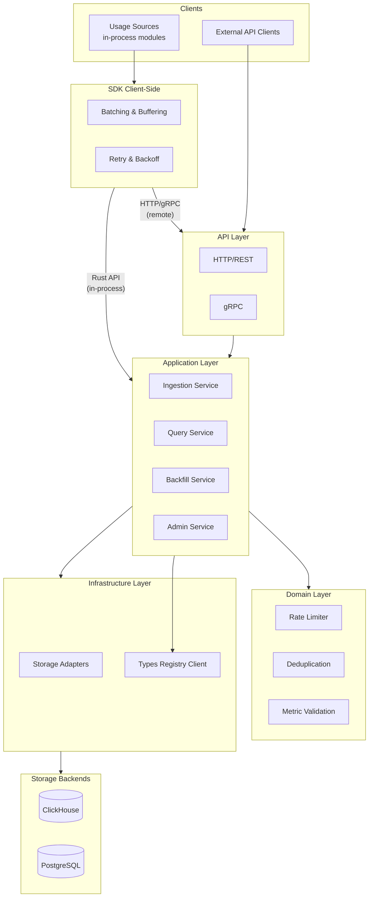
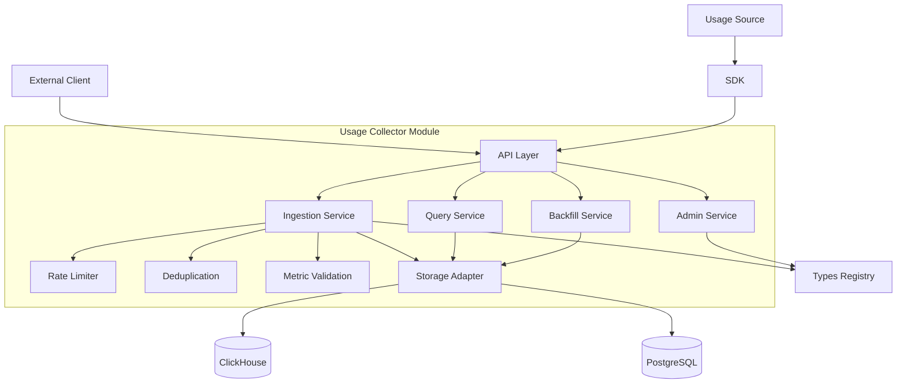
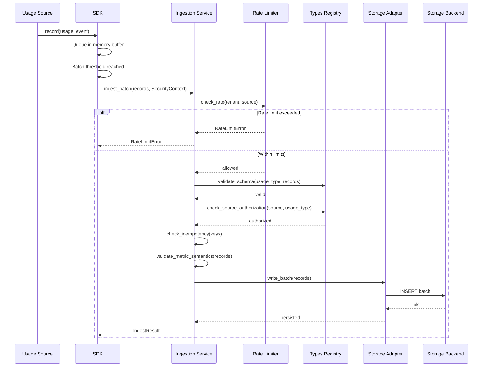
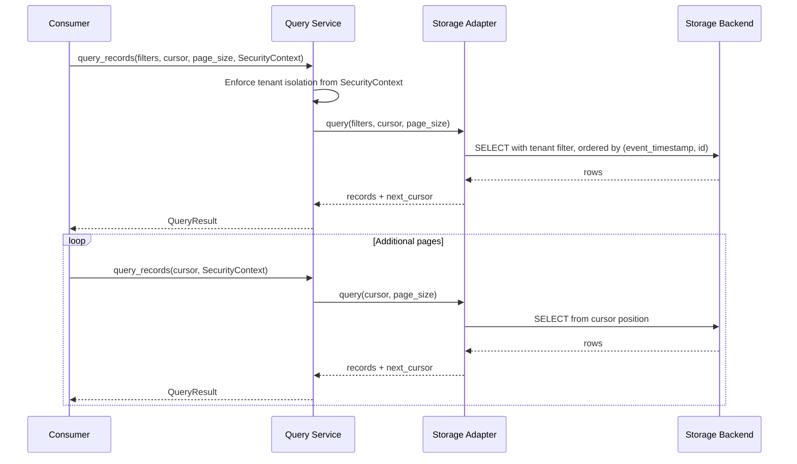
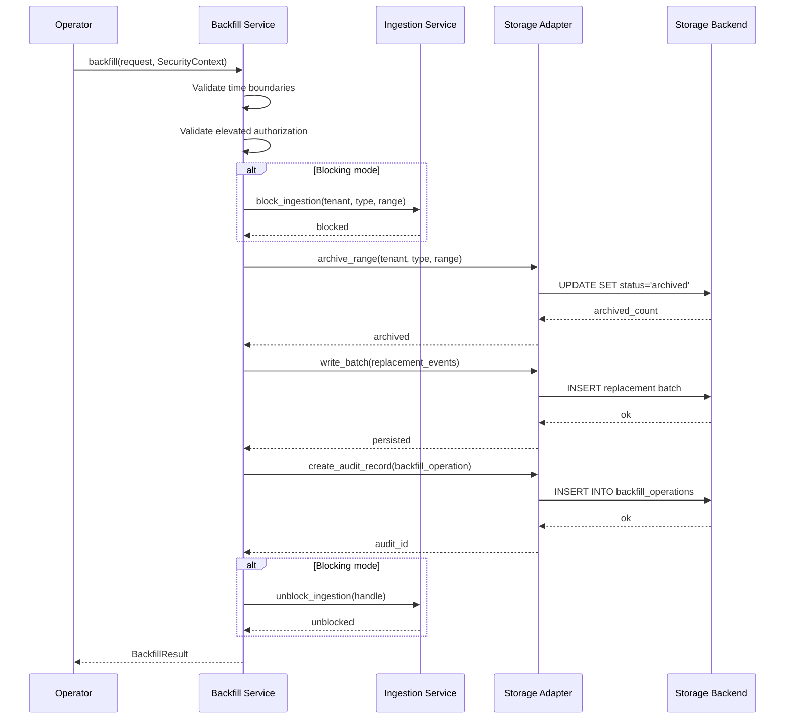
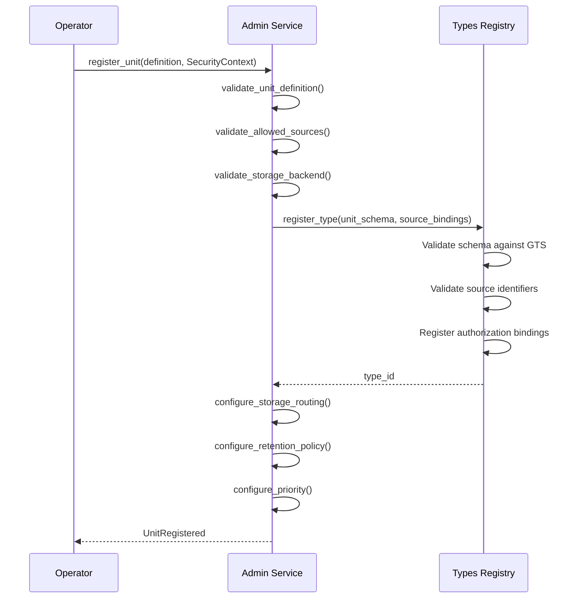
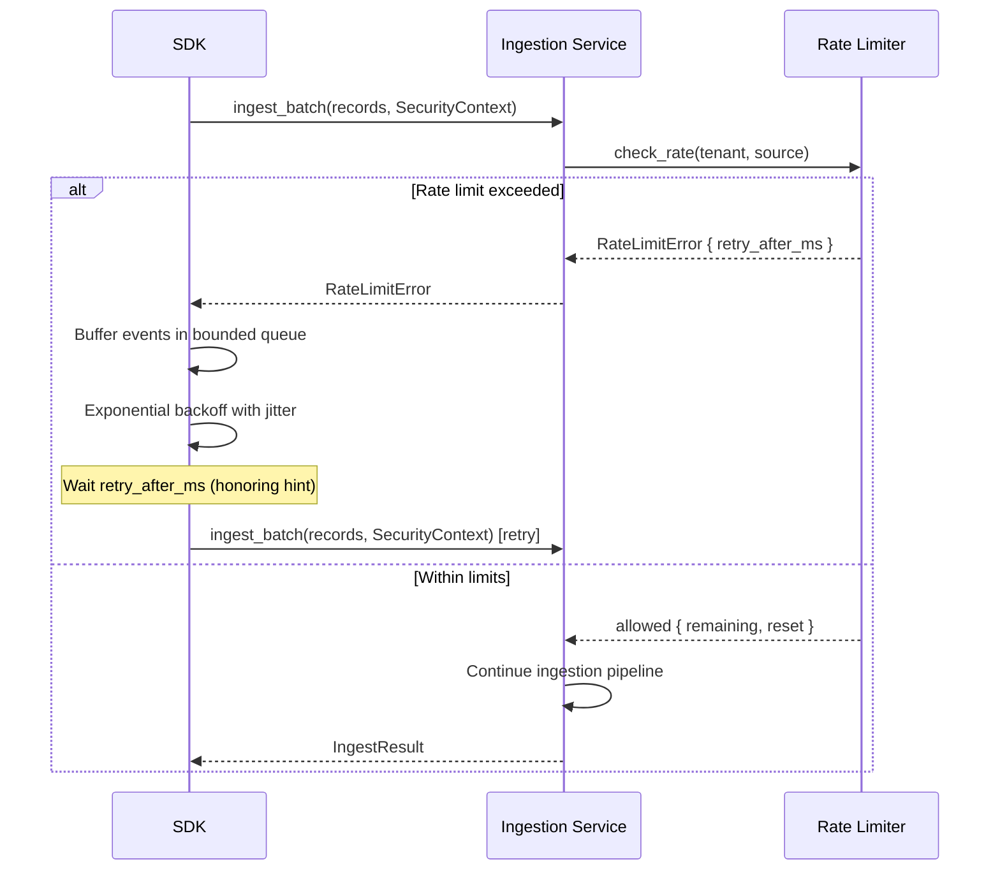

# Technical Design — Usage Collector

## 1. Architecture Overview

### 1.1 Architectural Vision

The Usage Collector (UC) serves as the platform's centralized metering ledger — a single, append-only store for all raw resource consumption data. It accepts usage records from diverse platform sources through a client-side SDK (primary path) and HTTP/gRPC APIs, validates them against registered type schemas, deduplicates via idempotency keys, and persists them through pluggable storage adapters.

The SDK provides client-side batching and buffering, enabling high-throughput sources (10,000+ events/sec) to emit usage data without blocking their primary operations. The service itself is focused on ingestion, storage, and raw data exposure — it does not aggregate, rate, or interpret usage data. Downstream consumers (billing, quota enforcement, monitoring) query raw records and apply their own domain-specific logic.

The architecture follows CyberFabric modular monolith conventions: an SDK crate for inter-module communication, a domain layer for business logic, and infrastructure adapters for storage. Multi-tenant isolation is enforced at every layer through SecurityContext propagation.

### 1.2 Architecture Drivers

#### Functional Drivers

| Requirement | Design Response |
|-------------|-----------------|
| `cpt-cf-uc-fr-usage-ingestion` | SDK with client-side batching + multi-transport API (Rust, gRPC, HTTP) |
| `cpt-cf-uc-fr-idempotency` | Idempotency key index in storage with dedup check before write |
| `cpt-cf-uc-fr-counter-semantics` | Counter validation in ingestion pipeline (monotonicity per source+resource) |
| `cpt-cf-uc-fr-gauge-semantics` | Gauge records stored as-is without monotonicity validation |
| `cpt-cf-uc-fr-tenant-attribution` | Tenant derived from SecurityContext, immutable on record |
| `cpt-cf-uc-fr-user-attribution` | Optional user_id derived from SecurityContext subject_id (when subject_type indicates a user) or explicit source attribution |
| `cpt-cf-uc-fr-resource-attribution` | Resource ID, type, and lineage stored per record |
| `cpt-cf-uc-fr-tenant-isolation` | Tenant-scoped storage partitioning + query-time tenant filter |
| `cpt-cf-uc-fr-source-authorization` | Types Registry lookup for source-to-usage-type bindings |
| `cpt-cf-uc-fr-attribution-authorization` | SecurityContext scope validation for referenced users/resources |
| `cpt-cf-uc-fr-pluggable-storage` | Storage adapter trait with routing by usage type |
| `cpt-cf-uc-fr-retention-policies` | Configurable retention per tenant/type with automated enforcement |
| `cpt-cf-uc-fr-query-api` | Query service with cursor-based pagination and filtering |
| `cpt-cf-uc-fr-stable-ordering` | Deterministic ordering by (event_timestamp, id) composite key |
| `cpt-cf-uc-fr-cursor-pagination` | Opaque cursor encoding position in ordered result set |
| `cpt-cf-uc-fr-type-validation` | Types Registry integration for schema validation on ingestion |
| `cpt-cf-uc-fr-custom-units` | Admin API delegating registration to Types Registry |
| `cpt-cf-uc-fr-late-events` | Grace period check on event_timestamp during ingestion |
| `cpt-cf-uc-fr-backfill-api` | Dedicated backfill endpoint with blocking/non-blocking modes |
| `cpt-cf-uc-fr-event-amendment` | PATCH endpoint for individual record amendment/deprecation |
| `cpt-cf-uc-fr-backfill-archival` | Status-based archival (active to archived) on backfill replace |
| `cpt-cf-uc-fr-backfill-audit` | Immutable audit records for every backfill operation |
| `cpt-cf-uc-fr-tenant-rate-limit` | Token bucket rate limiter per tenant with burst support |
| `cpt-cf-uc-fr-source-rate-limit` | Nested token bucket per source within tenant |
| `cpt-cf-uc-fr-load-shedding` | Priority classification per usage type; shed low-priority under overload |
| `cpt-cf-uc-fr-sdk-retry` | SDK-side bounded buffer with exponential backoff and jitter |

#### NFR Allocation

| NFR ID | NFR Summary | Allocated To | Design Response | Verification Approach |
|--------|-------------|--------------|-----------------|----------------------|
| `cpt-cf-uc-nfr-throughput` | 10k+ events/sec sustained | SDK + Ingestion Service | Client-side batching absorbs throughput; ingestion pipeline validates and writes in bulk | Load test: sustained 10k events/sec for 60 min |
| `cpt-cf-uc-nfr-ingestion-latency` | p95 ≤200ms | Ingestion Service + Storage | Minimal synchronous validation; bulk storage writes to operational DB | p95 latency benchmark under load |
| `cpt-cf-uc-nfr-query-latency` | p95 ≤500ms for 30-day range | Query Service + Storage | Indexed queries on tenant+type+timestamp; cursor-based pagination; query routing to appropriate storage | 30-day range query benchmark |
| `cpt-cf-uc-nfr-query-isolation` | Queries/retention don't impact ingestion | Storage Adapter | Operational/historical storage separation; ingestion writes to operational DB, queries/retention operate on historical DB | Concurrent load test: ingestion p95 during heavy query load |
| `cpt-cf-uc-nfr-availability` | 99.95% monthly | All components | Stateless ingestion service; storage health monitoring with buffering | Availability monitoring |
| `cpt-cf-uc-nfr-exactly-once` | Zero duplicates | Ingestion Service | Idempotency key dedup before write; transactional persistence | Duplicate injection tests |
| `cpt-cf-uc-nfr-fault-tolerance` | Zero data loss during storage failures | Storage Adapter | In-memory buffer during backend failures; retry with backoff | Failure injection tests |
| `cpt-cf-uc-nfr-graceful-degradation` | Zero ingestion failures from downstream outage | Ingestion Service | Decoupled from downstream consumers; ingestion path has no consumer dependencies | Consumer outage simulation |
| `cpt-cf-uc-nfr-scalability` | Linear scaling with instances | Ingestion Service | Stateless design; partitioned storage; no shared mutable state | Horizontal scale-out benchmark |
| `cpt-cf-uc-nfr-audit-trail` | 100% of operations audited | All write paths | Append-only records with status tracking; backfill audit table | Audit completeness verification |
| `cpt-cf-uc-nfr-authentication` | Zero unauthenticated access | API Layer | Platform auth infrastructure (OAuth 2.0, mTLS, API key) enforced at API boundary | Security scan |
| `cpt-cf-uc-nfr-authorization` | Zero unauthorized access | API Layer + Ingestion Service | SecurityContext-based tenant/source authorization; fail-closed | Authorization test matrix |
| `cpt-cf-uc-nfr-retention` | 7 days to 7 years configurable | Storage Adapter | Per-type/per-tenant retention config with automated cleanup jobs | Retention policy verification |

### 1.3 Architecture Layers



| Layer | Responsibility | Technology |
|-------|---------------|------------|
| SDK | Client-side batching, retry, buffering | Rust crate (usage-collector-sdk) |
| API | Request handling, authentication, transport | REST/OpenAPI, tonic (gRPC) |
| Application | Ingestion orchestration, query execution, backfill management | Rust services |
| Domain | Usage record model, metric semantics, rate limiting, deduplication | Rust domain types |
| Infrastructure | Storage adapters, Types Registry client, rate limit state | ClickHouse/PostgreSQL drivers, SeaORM |

## 2. Principles & Constraints

### 2.1 Design Principles

#### Ledger Immutability

- [ ] `p1` - **ID**: `cpt-cf-uc-principle-ledger-immutability`

Usage records are append-only. The system never performs in-place mutation or hard deletion of usage data. Corrections are handled through amendments (status change to deprecated) or backfill operations (status change to archived with replacement records inserted). This ensures a complete audit trail and supports dispute resolution.

#### Source-of-Truth Simplicity

- [ ] `p1` - **ID**: `cpt-cf-uc-principle-source-of-truth`

UC stores and exposes raw usage records only. No aggregation, rating, pricing, or interpretation is performed by the metering ledger. Downstream consumers (billing, monitoring, quota enforcement) own all derived logic and apply their own aggregation rules to raw records.

#### Non-Blocking Emission

- [ ] `p2` - **ID**: `cpt-cf-uc-principle-non-blocking-emission`

Usage emission must never block or degrade the calling service's primary operations. The SDK absorbs transient failures transparently through in-memory buffering, exponential backoff with jitter, and bounded queue management. If the buffer is full, oldest events are dropped rather than blocking the caller.

#### Fail-Closed Authorization

- [ ] `p1` - **ID**: `cpt-cf-uc-principle-fail-closed-auth`

All authorization checks (tenant isolation, source authorization, attribution authorization) fail closed. If authorization cannot be determined due to Types Registry unavailability or SecurityContext issues, the request is rejected. No usage data is accepted without verified authorization.

#### Operational/Historical Storage Separation

- [ ] `p2` - **ID**: `cpt-cf-uc-principle-storage-separation`

To satisfy `cpt-cf-uc-nfr-query-isolation`, the system **SHOULD** separate operational (write-optimized) and historical (read-optimized) storage. Usage records are always written to the operational database optimized for low-latency ingestion. Historical records are asynchronously replicated or migrated to a separate historical database optimized for analytical queries and long-term retention.

This pattern achieves workload isolation:
- **Operational DB**: Recent usage data (e.g., last 7-30 days), optimized for writes, minimal indexes, supports real-time ingestion without query contention
- **Historical DB**: Older usage data, optimized for analytical queries, columnar storage (e.g., ClickHouse), supports complex aggregations without impacting ingestion

Query operations are routed based on the requested time range: recent queries hit the operational DB, historical queries hit the historical DB, and queries spanning both are federated. Retention jobs operate on the historical DB only, moving aged data from operational to historical storage before applying retention policies.

This separation is implemented through the pluggable storage adapter framework (`cpt-cf-uc-fr-pluggable-storage`), using different storage backends or database instances for operational vs. historical workloads.

### 2.2 Constraints

#### ModKit Module Structure

- [ ] `p1` - **ID**: `cpt-cf-uc-constraint-modkit`

UC must follow CyberFabric module conventions: SDK crate with public trait, domain service with repository trait, SeaORM entities for database access, and Module trait implementation for lifecycle management. SecurityContext is propagated across all in-process calls.

#### SecurityContext Propagation

- [ ] `p1` - **ID**: `cpt-cf-uc-constraint-security-context`

All operations derive tenant identity and user identity from the platform SecurityContext. Callers cannot specify arbitrary tenant IDs — tenant attribution is always determined by the authenticated security context. This constraint ensures tenant isolation cannot be bypassed.

#### Types Registry Dependency

- [ ] `p1` - **ID**: `cpt-cf-uc-constraint-types-registry`

All usage type schemas, measuring unit definitions, and source-to-usage-type authorization bindings are managed by the external Types Registry. UC cannot validate usage records or authorize sources without Types Registry availability. This is a hard dependency for the ingestion path.

#### Storage Backend Availability

- [ ] `p2` - **ID**: `cpt-cf-uc-constraint-storage-backend`

At least one storage backend (PostgreSQL or ClickHouse) must be available for normal operation. UC provides in-memory buffering during transient storage failures (`cpt-cf-uc-nfr-fault-tolerance`) but cannot operate indefinitely without a functioning storage backend.

#### Platform Authentication Infrastructure

- [ ] `p1` - **ID**: `cpt-cf-uc-constraint-platform-auth`

UC relies on the platform's existing authentication infrastructure (OAuth 2.0, mTLS, API key). UC does not implement its own authentication mechanisms — it consumes SecurityContext provided by the platform middleware.

## 3. Technical Architecture

### 3.1 Domain Model

**Technology**: GTS (JSON Schema), Rust structs

**Location**: [usage-collector-sdk/schemas/](../usage-collector-sdk/schemas/)

**Core Entities**:

| Entity | Description | Schema |
|--------|-------------|--------|
| UsageRecord | A single usage data point with tenant, source, resource, and metric attribution | [usage_record.v1.schema.json](../usage-collector-sdk/schemas/usage_record.v1.schema.json) |
| MeasuringUnit | Registered schema defining how a usage type is measured | [measuring_unit.v1.schema.json](../usage-collector-sdk/schemas/measuring_unit.v1.schema.json) |
| BackfillOperation | Metadata and audit trail for a backfill request | [backfill_operation.v1.schema.json](../usage-collector-sdk/schemas/backfill_operation.v1.schema.json) |
| RateLimitConfig | Per-tenant and per-source rate limit parameters | [rate_limit_config.v1.schema.json](../usage-collector-sdk/schemas/rate_limit_config.v1.schema.json) |
| RetentionPolicy | Per-type and per-tenant data retention configuration | [retention_policy.v1.schema.json](../usage-collector-sdk/schemas/retention_policy.v1.schema.json) |

**Key attributes of UsageRecord**:

- tenant_id — Immutable, derived from SecurityContext
- user_id — Optional, derived from SecurityContext subject_id (when subject_type indicates a user) or explicit source attribution
- source_id — Identifies the emitting usage source
- resource_id — Resource instance identifier (mandatory; for tenant-level usage, use tenant_id as resource_id)
- resource_type — Optional resource type classification
- usage_type — References registered MeasuringUnit
- metric_kind — Counter or gauge
- value — Numeric measurement
- event_timestamp — When the consumption occurred at the source
- idempotency_key — Client-provided key for exactly-once semantics
- status — Active, deprecated, or archived

**Relationships**:

- UsageRecord → MeasuringUnit: Many-to-one (record references a usage type)
- UsageRecord → BackfillOperation: Many-to-one (archived records reference their replacing backfill)
- BackfillOperation → UsageRecord: One-to-many (backfill produces replacement records)
- RateLimitConfig → tenant/source: Scoped rate parameters
- RetentionPolicy → MeasuringUnit: Per-type retention rules

**Core Invariants**:

- tenant_id is immutable after record creation
- idempotency_key is unique within a (tenant_id, source_id, usage_type, resource_id) scope
- Counter metric values must be monotonically non-decreasing per (source_id, resource_id, usage_type)
- Gauge metric values have no monotonicity constraint
- event_timestamp must be within the grace period window (for normal ingestion) or backfill window (for backfill operations)
- Archived records are excluded from normal queries unless explicitly requested

### 3.2 Component Model



#### SDK

- [ ] `p1` - **ID**: `cpt-cf-uc-component-sdk`

Client library providing automatic batching, in-memory buffering, retry with exponential backoff and jitter, and non-blocking emission. Primary ingestion path for platform services. Exposes Rust API (in-process) and gRPC transport.

#### API Layer

- [ ] `p1` - **ID**: `cpt-cf-uc-component-api-layer`

Request handling, authentication enforcement, and transport normalization. Supports HTTP/REST and gRPC. Extracts SecurityContext from platform authentication middleware. Routes requests to appropriate application services.

#### Ingestion Service

- [ ] `p1` - **ID**: `cpt-cf-uc-component-ingestion-service`

Core ingestion pipeline: rate limit check → source authorization → schema validation → idempotency dedup → metric semantics validation → storage write. Handles both individual and batch record submission.

#### Query Service

- [ ] `p1` - **ID**: `cpt-cf-uc-component-query-service`

Executes filtered queries against storage with tenant isolation enforcement. Provides cursor-based pagination with stable ordering. Supports filtering by time range, tenant, user, resource, and usage type.

#### Backfill Service

- [ ] `p1` - **ID**: `cpt-cf-uc-component-backfill-service`

Manages backfill operations: validates time boundaries, archives existing records in target range, persists replacement records, and creates audit trail. Supports blocking and non-blocking modes. Isolated from real-time ingestion with independent rate limits.

#### Admin Service

- [ ] `p1` - **ID**: `cpt-cf-uc-component-admin-service`

Custom measuring unit registration (delegating to Types Registry), retention policy management, rate limit configuration, and ledger metadata exposure.

#### Rate Limiter

- [ ] `p1` - **ID**: `cpt-cf-uc-component-rate-limiter`

Hierarchical token bucket rate limiting: per-tenant sustained rate and burst, per-source within tenant. Supports multi-dimensional limits (events/sec, bytes/sec, batch size, record size). Hot-reloadable configuration.

#### Storage Adapter

- [ ] `p1` - **ID**: `cpt-cf-uc-component-storage-adapter`

Pluggable storage abstraction with routing by usage type. Implements the storage adapter trait for ClickHouse and PostgreSQL backends. Provides health monitoring, failure buffering, and retry with backoff.

**Operational/Historical Separation**: The storage adapter supports separating operational (write-optimized, recent data) and historical (read-optimized, aged data) storage per `cpt-cf-uc-principle-storage-separation`. It routes ingestion writes to the operational backend, queries to the appropriate backend based on time range, and manages asynchronous migration from operational to historical storage. This achieves workload isolation required by `cpt-cf-uc-nfr-query-isolation`.

**Component Interactions**:

- Usage Source → SDK: In-process method calls for recording usage events
- External API Clients → API Layer: Direct HTTP/gRPC requests (without SDK)
- SDK → Application Layer: In-process Rust API calls
- SDK → API Layer (remote): Batched HTTP/gRPC requests
- API Layer → Ingestion Service: Validated, authenticated ingestion requests
- Ingestion Service → Rate Limiter: Pre-ingestion rate check
- Ingestion Service → Deduplication: Idempotency key validation
- Ingestion Service → Metric Validation: Counter/gauge semantics validation
- Ingestion Service → Types Registry: Schema validation and source authorization
- Ingestion Service → Storage Adapter: Validated record persistence
- Query Service → Storage Adapter: Filtered, paginated reads
- Backfill Service → Ingestion Service: Blocking mode coordination (block/unblock ingestion)
- Backfill Service → Storage Adapter: Archive + replacement writes
- Admin Service → Types Registry: Unit registration and configuration
- Admin Service → Rate Limiter: Rate limit configuration
- Admin Service → Storage Adapter: Retention policy management, storage routing configuration, metadata queries
- Storage Adapter → Storage Backends: Persistence to ClickHouse/PostgreSQL; automated retention enforcement

### 3.3 API Contracts

**Public interfaces**: `cpt-cf-uc-interface-sdk` (Rust), `cpt-cf-uc-interface-http-api` (HTTP/gRPC)

**Location**: [usage-collector-sdk/](../usage-collector-sdk/)

#### Primary Interface: Rust SDK

The **Rust SDK** is the primary public interface for Usage Collector. Platform modules and services communicate with UC through in-process method calls on service traits, with SecurityContext propagated as function parameters. This is the main ingestion path for usage data and provides the lowest latency, highest throughput, and strongest type safety.

**HTTP/gRPC APIs** are thin transport adapters layered on top of the Rust services. They extract SecurityContext from platform authentication middleware, deserialize requests into Rust domain types, call the underlying service traits, and serialize responses. External clients (non-platform services, CLI tools, external integrations) use these transports when in-process access is not available.

#### Rust Service Traits

##### IngestionService

**Stability**: `stable`

Handles ingestion of usage records with rate limiting, validation, deduplication, and persistence.

```rust
trait IngestionService {
    /// Ingest a batch of usage records.
    /// Returns count of accepted records and list of rejected records with reasons.
    async fn ingest_batch(
        &self,
        records: Vec<UsageRecord>,
        ctx: SecurityContext,
    ) -> Result<IngestResult, IngestionError>;

    /// Amend an individual usage record (update metadata, correct values).
    async fn amend_record(
        &self,
        record_id: Uuid,
        amendments: RecordAmendments,
        ctx: SecurityContext,
    ) -> Result<UsageRecord, IngestionError>;

    /// Deprecate a usage record (mark as deprecated without deletion).
    async fn deprecate_record(
        &self,
        record_id: Uuid,
        reason: String,
        ctx: SecurityContext,
    ) -> Result<UsageRecord, IngestionError>;
}

struct IngestResult {
    accepted: usize,
    rejected: Vec<RejectedRecord>,
}

struct RejectedRecord {
    record: UsageRecord,
    reason: RejectionReason,
}

enum IngestionError {
    RateLimitExceeded(RateLimitError),
    ValidationFailed(ValidationError),
    AuthorizationFailed(AuthorizationError),
    DuplicateRecord(DuplicateError),
    CounterViolation(CounterError),
    GracePeriodExceeded(GracePeriodError),
    StorageError(StorageError),
}
```

##### QueryService

**Stability**: `stable`

Executes filtered queries against usage records with tenant isolation and pagination.

```rust
trait QueryService {
    /// Query usage records with filters, pagination, and tenant isolation.
    async fn query_records(
        &self,
        filters: QueryFilters,
        cursor: Option<Cursor>,
        page_size: usize,
        ctx: SecurityContext,
    ) -> Result<QueryResult, QueryError>;

    /// Get ledger metadata (watermarks, event counts, storage health).
    async fn get_metadata(
        &self,
        ctx: SecurityContext,
    ) -> Result<LedgerMetadata, QueryError>;
}

struct QueryFilters {
    usage_type: Option<String>,
    user_id: Option<Uuid>,
    resource_id: Option<String>,
    resource_type: Option<String>,
    source_id: Option<String>,
    time_range: Option<TimeRange>,
    include_archived: bool,
    include_deprecated: bool,
}

struct QueryResult {
    records: Vec<UsageRecord>,
    next_cursor: Option<Cursor>,
}

struct LedgerMetadata {
    earliest_event: Option<SystemTime>,
    latest_event: Option<SystemTime>,
    total_records: u64,
    storage_health: StorageHealth,
}
```

##### BackfillService

**Stability**: `stable`

Manages backfill operations for correcting historical usage data gaps.

```rust
trait BackfillService {
    /// Submit a backfill operation to replace usage records in a time range.
    async fn backfill(
        &self,
        request: BackfillRequest,
        ctx: SecurityContext,
    ) -> Result<BackfillResult, BackfillError>;

    /// Get status and audit trail of a backfill operation.
    async fn get_backfill_status(
        &self,
        backfill_id: Uuid,
        ctx: SecurityContext,
    ) -> Result<BackfillStatus, BackfillError>;
}

struct BackfillRequest {
    tenant_id: Uuid,
    usage_type: String,
    time_range: TimeRange,
    replacement_events: Vec<UsageRecord>,
    mode: BackfillMode,
    reason: String,
}

enum BackfillMode {
    Blocking,    // Suspend real-time ingestion during backfill
    NonBlocking, // Allow concurrent real-time ingestion
}

struct BackfillResult {
    id: Uuid,
    status: BackfillStatus,
    events_archived: usize,
    events_added: usize,
    audit_record_id: Uuid,
}

enum BackfillError {
    WindowExceeded(WindowError),
    Conflict(ConflictError),
    AuthorizationFailed(AuthorizationError),
    ValidationFailed(ValidationError),
}
```

##### AdminService

**Stability**: `stable`

Manages custom measuring units, retention policies, and rate limit configuration.

```rust
trait AdminService {
    /// Register a custom measuring unit with schema and authorization bindings.
    async fn register_unit(
        &self,
        definition: UnitDefinition,
        ctx: SecurityContext,
    ) -> Result<UnitRegistered, AdminError>;

    /// List all registered measuring units.
    async fn list_units(
        &self,
        ctx: SecurityContext,
    ) -> Result<Vec<MeasuringUnit>, AdminError>;
}

struct UnitDefinition {
    name: String,
    metric_kind: MetricKind,
    base_unit: String,
    schema: JsonValue,
    allowed_sources: Vec<String>,
    priority: Option<Priority>,
    storage_backend: Option<String>,
    retention_days: Option<u32>,
}

enum MetricKind {
    Counter, // Monotonically increasing value
    Gauge,   // Point-in-time snapshot value
}

enum Priority {
    Critical, // P0, billing-critical
    High,     // P1
    Medium,   // P2, analytics (default)
    Low,      // P3
}

struct UnitRegistered {
    unit: MeasuringUnit,
}

enum AdminError {
    UnitNameConflict(String),
    InvalidMetricKind,
    InvalidSchema(SchemaError),
    AllowedSourcesEmpty,
    SourceNotFound(String),
    StorageBackendNotFound(String),
    RetentionOutOfBounds(u32),
    TypesRegistryUnavailable,
}
```

##### RateLimiter

**Stability**: `stable`

Hierarchical token bucket rate limiting (tenant-level and source-level).

```rust
trait RateLimiter {
    /// Check if a request is within rate limits.
    async fn check_rate(
        &self,
        tenant_id: Uuid,
        source_id: &str,
    ) -> Result<RateLimitCheck, RateLimitError>;
}

struct RateLimitCheck {
    allowed: bool,
    remaining: u32,
    reset_at: SystemTime,
}

struct RateLimitError {
    retry_after_ms: u64,
    remaining: u32,
    reset_at: SystemTime,
}
```

#### HTTP/gRPC Transport Layer

**Stability**: `stable`

HTTP and gRPC transports provide external access to the Rust service APIs. All endpoints enforce platform authentication and extract SecurityContext before delegating to service traits.

**Endpoint Mapping**:

| HTTP Method | Path | Rust Trait Method | Description |
|-------------|------|-------------------|-------------|
| `POST` | `/api/uc/v1/usage/records` | `IngestionService::ingest_batch` | Ingest batch of usage records |
| `GET` | `/api/uc/v1/usage/records` | `QueryService::query_records` | Query usage records with filters |
| `PATCH` | `/api/uc/v1/usage/records/{id}` | `IngestionService::amend_record` | Amend record properties |
| `POST` | `/api/uc/v1/usage/records/{id}/deprecate` | `IngestionService::deprecate_record` | Deprecate a record |
| `POST` | `/api/uc/v1/usage/backfill` | `BackfillService::backfill` | Submit backfill operation |
| `GET` | `/api/uc/v1/usage/backfill/{id}` | `BackfillService::get_backfill_status` | Get backfill status |
| `POST` | `/api/uc/v1/admin/units` | `AdminService::register_unit` | Register custom measuring unit |
| `GET` | `/api/uc/v1/admin/units` | `AdminService::list_units` | List measuring units |
| `GET` | `/api/uc/v1/usage/metadata` | `QueryService::get_metadata` | Get ledger metadata |

**Query Parameter Mapping** (GET /api/uc/v1/usage/records → `QueryFilters`):

| HTTP Query Parameter | Rust Field | Description |
|---------------------|------------|-------------|
| `usage_type` | `QueryFilters.usage_type` | Filter by measuring unit type |
| `user_id` | `QueryFilters.user_id` | Filter by user attribution |
| `resource_id` | `QueryFilters.resource_id` | Filter by resource instance |
| `resource_type` | `QueryFilters.resource_type` | Filter by resource type |
| `source_id` | `QueryFilters.source_id` | Filter by usage source |
| `from`, `to` | `QueryFilters.time_range` | Time range (inclusive start, exclusive end) |
| `cursor` | `cursor` parameter | Opaque pagination cursor |
| `page_size` | `page_size` parameter | Records per page (default 100, max 1000) |
| `include_archived` | `QueryFilters.include_archived` | Include archived records (default false) |
| `include_deprecated` | `QueryFilters.include_deprecated` | Include deprecated records (default false) |

**Note**: Tenant scope is always enforced from SecurityContext — not a query parameter.

**Error Response Mapping**:

| Rust Error Variant | HTTP Status | Error Code |
|--------------------|-------------|------------|
| `IngestionError::ValidationFailed` | 400 | `validation_error` |
| `IngestionError::TypeNotFound` | 404 | `type_not_found` |
| `IngestionError::AuthorizationFailed` (source) | 403 | `source_not_authorized` |
| `IngestionError::AuthorizationFailed` (attribution) | 403 | `attribution_not_authorized` |
| `IngestionError::DuplicateRecord` | 409 | `duplicate_record` |
| `IngestionError::CounterViolation` | 422 | `counter_violation` |
| `IngestionError::RateLimitExceeded` | 429 | `rate_limited` |
| `IngestionError::GracePeriodExceeded` | 400 | `grace_period_exceeded` |
| `BackfillError::WindowExceeded` | 400 | `backfill_window_exceeded` |
| `BackfillError::Conflict` | 409 | `backfill_conflict` |
| `AdminError::UnitNameConflict` | 409 | `unit_name_conflict` |
| `AdminError::InvalidSchema` | 400 | `invalid_schema` |
| `AdminError::AllowedSourcesEmpty` | 400 | `allowed_sources_empty` |
| `AdminError::SourceNotFound` | 404 | `source_not_found` |
| `AdminError::StorageBackendNotFound` | 404 | `storage_backend_not_found` |
| `AdminError::RetentionOutOfBounds` | 400 | `retention_out_of_bounds` |
| `AdminError::TypesRegistryUnavailable` | 503 | `types_registry_unavailable` |

**Rate Limit Response Headers** (HTTP) — mapped from `RateLimitError`:

- `Retry-After` ← `retry_after_ms / 1000` (seconds until retry is appropriate)
- `X-RateLimit-Remaining` ← `remaining` (requests remaining in current window)
- `X-RateLimit-Reset` ← `reset_at` (UTC epoch timestamp when window resets)

For gRPC transport, equivalent metadata is provided in response trailing metadata.

### 3.4 Internal Dependencies

| Dependency Module | Interface Used | Purpose |
|-------------------|---------------|---------|
| Types Registry | `cpt-cf-uc-contract-types-registry` (SDK client) | Schema validation for usage types, measuring unit definitions, source-to-usage-type authorization bindings |

**Dependency Rules** (per project conventions):

- No circular dependencies
- Always use SDK modules for inter-module communication
- SecurityContext must be propagated across all in-process calls

### 3.5 External Dependencies

#### ClickHouse

**Type**: Database
**Direction**: bidirectional
**Protocol / Driver**: ClickHouse native driver via storage adapter
**Data Format**: Columnar storage optimized for high-volume time-series usage data
**Purpose**: Primary storage backend for high-throughput usage types requiring fast analytical queries

#### PostgreSQL

**Type**: Database
**Direction**: bidirectional
**Protocol / Driver**: SeaORM (PostgreSQL driver)
**Data Format**: Relational tables with JSONB metadata
**Purpose**: Storage backend for lower-volume usage types, configuration data (rate limits, retention policies), and backfill audit records

#### Platform Auth Infrastructure

**Type**: Platform service
**Direction**: inbound
**Protocol / Driver**: Middleware (OAuth 2.0, mTLS, API key)
**Purpose**: Provides SecurityContext for all API requests — tenant identity, user identity, and authorization scope

### 3.6 Interactions & Sequences

The following sequences illustrate the key interaction flows between components. All service interactions use the Rust APIs defined in section 3.3. SecurityContext is propagated through all calls to enforce tenant isolation and authorization.

#### SDK Batch Emission

**ID**: `cpt-cf-uc-seq-sdk-batch-emission`

**Use cases**: `cpt-cf-uc-usecase-sdk-emission`

**Actors**: `cpt-cf-uc-actor-usage-source`, `cpt-cf-uc-actor-platform-developer`



**Description**: Primary ingestion flow. The SDK batches events client-side by count or time threshold, then calls the ingestion service directly. The service applies rate limiting, schema validation, source authorization, deduplication, and metric validation before persisting through the storage adapter.

#### Usage Query with Pagination

**ID**: `cpt-cf-uc-seq-usage-query`

**Use cases**: `cpt-cf-uc-usecase-billing-query`, `cpt-cf-uc-usecase-usage-query`, `cpt-cf-uc-usecase-quota-enforcement`

**Actors**: `cpt-cf-uc-actor-billing-system`, `cpt-cf-uc-actor-tenant-admin`, `cpt-cf-uc-actor-quota-enforcement`



**Description**: Consumers query raw usage records with filters. All queries are scoped to the caller's tenant via SecurityContext. Results are returned in stable order (event_timestamp, id) with opaque cursor tokens for pagination. Cursors remain valid for at least 24 hours.

#### Backfill Operation

**ID**: `cpt-cf-uc-seq-backfill-operation`

**Use cases**: `cpt-cf-uc-usecase-backfill-after-outage`

**Actors**: `cpt-cf-uc-actor-platform-operator`



**Description**: Operators submit backfill requests to correct gaps in usage data. The service validates time boundaries and elevated authorization, archives existing records (preserving them for audit), inserts replacement records, and creates an immutable audit trail. In blocking mode, real-time ingestion for the affected range is temporarily suspended.

#### Custom Unit Registration

**ID**: `cpt-cf-uc-seq-custom-unit-registration`

**Use cases**: `cpt-cf-uc-usecase-custom-unit`

**Actors**: `cpt-cf-uc-actor-platform-operator`



**Description**: Operators register custom measuring units. The registration validates the definition, registers the schema with Types Registry along with source-to-usage-type authorization bindings, and configures storage routing, retention policies, and load shedding priority.

**Validation Rules**:

1. **Unit name uniqueness**: Reject if a unit with the same name already exists
2. **Metric kind validity**: Must be `Counter` or `Gauge`
3. **Schema well-formedness**: Must be valid JSON Schema with required usage record fields
4. **Allowed sources non-empty**: Must specify at least one authorized source per `cpt-cf-uc-fr-custom-units`
5. **Source identifiers exist**: All sources must be registered platform sources
6. **Storage backend exists**: If specified, backend must be configured and healthy
7. **Retention bounds**: If specified, must be 7-2555 days (7 years)

**Authorization Binding**: The `allowed_sources` field defines which platform sources are authorized to emit records of this type. This list is stored in Types Registry and checked during ingestion (`cpt-cf-uc-fr-source-authorization`).

**Configuration Effects**: Storage routing, retention enforcement, and load shedding priority are configured for the new usage type.

#### Rate Limited Ingestion

**ID**: `cpt-cf-uc-seq-rate-limited-ingestion`

**Use cases**: `cpt-cf-uc-fr-tenant-rate-limit`, `cpt-cf-uc-fr-source-rate-limit`, `cpt-cf-uc-fr-sdk-retry`

**Actors**: `cpt-cf-uc-actor-usage-source`



**Description**: Rate limiting is enforced using hierarchical token buckets (tenant-level, then source-level). When limits are exceeded, the SDK buffers events in a bounded in-memory queue and retries with exponential backoff and jitter, honoring the server's retry hint. The SDK never blocks the calling service.

### 3.7 Database Schemas & Tables

#### Table: usage_records

**ID**: `cpt-cf-uc-dbtable-usage-records`

| Column | Type | Description |
|--------|------|-------------|
| id | UUID | Primary key |
| tenant_id | UUID, NOT NULL | Tenant attribution (from SecurityContext) |
| user_id | UUID | Optional user attribution |
| source_id | VARCHAR, NOT NULL | Identifies the emitting usage source |
| resource_id | VARCHAR, NOT NULL | Resource instance identifier (use tenant_id for tenant-level usage) |
| resource_type | VARCHAR | Optional resource type |
| usage_type | VARCHAR, NOT NULL | References registered measuring unit |
| metric_kind | ENUM(counter, gauge), NOT NULL | Metric semantics |
| value | DECIMAL, NOT NULL | Measured value |
| event_timestamp | TIMESTAMPTZ, NOT NULL | When consumption occurred at the source |
| idempotency_key | VARCHAR, NOT NULL | Client-provided deduplication key |
| status | ENUM(active, deprecated, archived), NOT NULL | Record lifecycle status (default: active) |
| backfill_operation_id | UUID | References backfill that archived this record (if applicable) |
| metadata | JSONB | Extensible metadata |
| created_at | TIMESTAMPTZ, NOT NULL | When the record was ingested into UC database (system-set) |

**PK**: id

**Constraints**: UNIQUE (tenant_id, source_id, usage_type, resource_id, idempotency_key); NOT NULL on tenant_id, source_id, resource_id, usage_type, metric_kind, value, event_timestamp, idempotency_key, status, created_at

**Additional info**: Indexes on (tenant_id, usage_type, event_timestamp) for query performance; (tenant_id, source_id, usage_type, resource_id, idempotency_key) for dedup lookups; partition by tenant_id for isolation. ClickHouse adapter uses MergeTree engine ordered by (tenant_id, usage_type, event_timestamp, id) for analytical query performance.

#### Table: backfill_operations

**ID**: `cpt-cf-uc-dbtable-backfill-operations`

| Column | Type | Description |
|--------|------|-------------|
| id | UUID | Primary key |
| tenant_id | UUID, NOT NULL | Affected tenant |
| usage_type | VARCHAR, NOT NULL | Affected usage type |
| range_start | TIMESTAMPTZ, NOT NULL | Start of backfill time range (inclusive) |
| range_end | TIMESTAMPTZ, NOT NULL | End of backfill time range (exclusive) |
| mode | ENUM(blocking, non_blocking), NOT NULL | Backfill mode |
| status | ENUM(pending, in_progress, completed, failed), NOT NULL | Operation status |
| operator_id | UUID, NOT NULL | Operator identity from SecurityContext |
| reason | TEXT, NOT NULL | Justification for the backfill |
| events_added | INTEGER | Number of replacement events inserted |
| events_archived | INTEGER | Number of existing events archived |
| affects_invoiced_period | BOOLEAN, NOT NULL | Whether range overlaps an invoiced period |
| created_at | TIMESTAMPTZ, NOT NULL | When the backfill was initiated |
| completed_at | TIMESTAMPTZ | When the backfill completed |

**PK**: id

**Constraints**: NOT NULL on tenant_id, usage_type, range_start, range_end, mode, status, operator_id, reason

**Additional info**: This table is append-only — backfill audit records are never modified after completion. Stored in PostgreSQL regardless of usage_type routing (audit requires strong consistency).

#### Table: rate_limit_config

**ID**: `cpt-cf-uc-dbtable-rate-limit-config`

| Column | Type | Description |
|--------|------|-------------|
| id | UUID | Primary key |
| tenant_id | UUID, NOT NULL | Target tenant |
| source_id | VARCHAR | Target source (NULL for tenant-level limit) |
| sustained_rate | INTEGER, NOT NULL | Events per second sustained rate |
| burst_size | INTEGER, NOT NULL | Maximum burst capacity |
| max_batch_size | INTEGER | Maximum events per request |
| max_record_bytes | INTEGER | Maximum bytes per event |
| max_bytes_per_sec | INTEGER | Maximum throughput in bytes/sec |
| updated_at | TIMESTAMPTZ, NOT NULL | Last configuration change |

**PK**: id

**Constraints**: UNIQUE (tenant_id, source_id); NOT NULL on tenant_id, sustained_rate, burst_size

**Additional info**: Overrides inherit from system defaults for unspecified fields. Changes are hot-reloadable without service restart.

## 4. Additional Context

### Non-Applicable Design Domains

**User-Facing Architecture (UX)**: Not applicable because Usage Collector is a backend service with no user-facing frontend. Tenant administrators interact through API endpoints; operator dashboards for rate limit monitoring are provided by external monitoring systems consuming UC's observability metrics.

**Privacy Architecture (COMPL-DESIGN-002)**: Not applicable because UC handles platform operational usage data (resource consumption metrics), not personal data subject to privacy regulations. Tenant isolation ensures data separation. Usage records may contain user_id for attribution but this is an internal platform identifier, not PII. Consent management, data subject rights, and cross-border controls do not apply to infrastructure metering data.

**CDN and Edge Computing (PERF-DESIGN-003 partial)**: Not applicable because UC is a backend metering service with no user-facing content delivery requirements. All access is server-to-server or operator API calls.

**Infrastructure as Code (OPS-DESIGN-003)**: Handled at the CyberFabric platform level. UC follows standard ModKit module deployment conventions and does not define its own infrastructure topology.

## 5. Traceability

- **PRD**: [PRD.md](./PRD.md)
- **ADRs**: [ADR/](./ADR/)
- **Features**: [features/](./features/)
