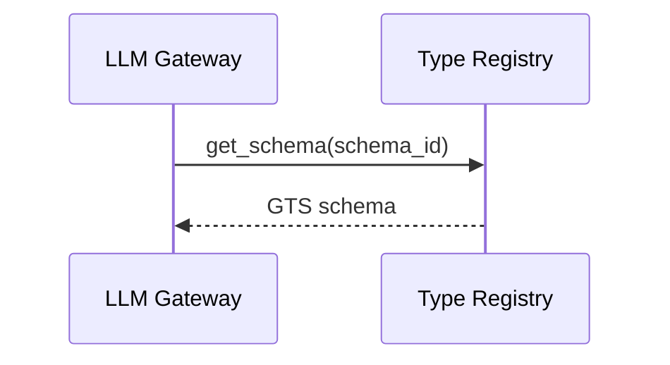
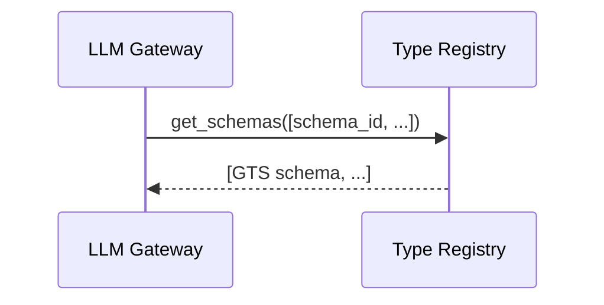

# Type Registry — PRD (LLM Gateway Scope)

GTS schema storage for LLM Gateway tool definitions.

## Scenarios

### S1 Get Schema by ID

LLM Gateway resolves tool schema by ID for function calling.

**Schema ID format**: `gts.hx.core.faas.func.v1~<vendor>.<app>.<namespace>.<func_name>.v1`

### S2 Batch Get Schemas

LLM Gateway resolves multiple tool schemas in single request.

## Errors

| Error | HTTP | Description |
|-------|------|-------------|
| `schema_not_found` | 404 | Schema ID does not exist |
| `invalid_schema_id` | 400 | Malformed schema ID |
