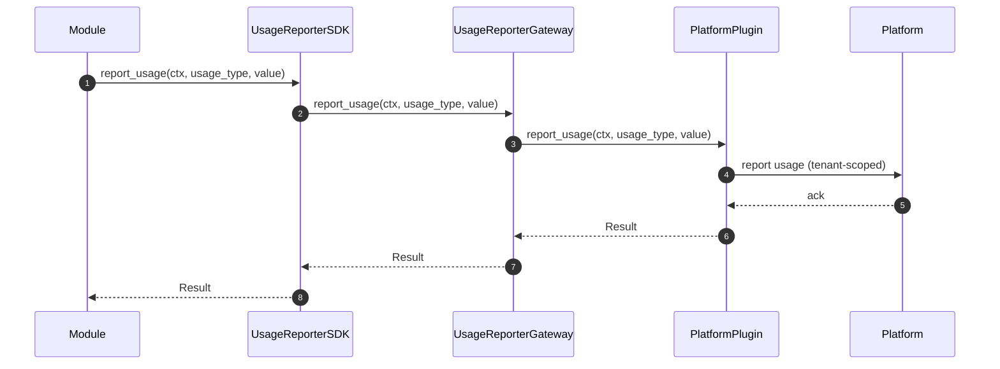
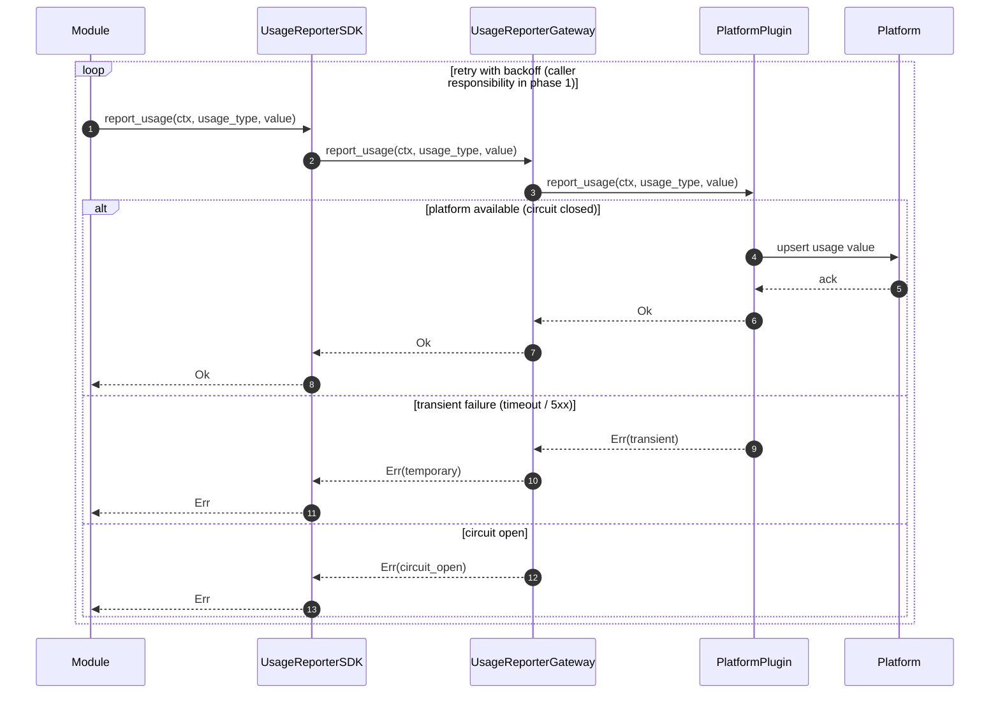

# Design document for phase 1 of usage reporting

## General information

### What is the Usage Reporter module?

The Usage Reporter module is the **single integration point** inside HyperSpot for reporting *usage values* ("metering") to an external Platform (or billing/licensing backend).

It provides a small, transport-agnostic SDK interface for other modules to call, while keeping the actual Platform integration behind a pluggable implementation.

### What is “phase 1” in this document?

Phase 1 focuses on the simplest (and safest) usage reporting scenario:

- **Tenant-scoped**: usage is reported per tenant.
- **Caller provides the value**: the calling module calculates the current usage value (e.g. current number of seats).
- **Gateway forwards the value**: HyperSpot does not yet implement internal aggregation/tracking for high-volume metrics (e.g. token usage).
- **Set / upsert semantics**: `report_usage(usage_type, value)` means “set current value”, not “increment”. This makes retries safe.
- **No quotas / enforcement**: reporting only; no restriction of tenant activity.

Future phases can extend this with internal metering (e.g. token usage), buffering, retry queues, and/or stronger delivery guarantees.

### Plugin architecture for this module

This module follows the ModKit **Gateway + Plugin** pattern:

- **SDK**: defines the API consumed by other modules (`UsageReporter`).
- **Gateway**: implements the SDK API and delegates the call to a selected Platform plugin.
- **Platform plugin(s)**: provide the Platform-specific implementation (HTTP/gRPC/etc.) and encapsulate auth, endpoints, payload formats, and any platform-specific idempotency requirements.

At runtime the gateway resolves the plugin implementation via ModKit/ClientHub scoped registration (typically keyed by a plugin instance identifier); multiple plugins can coexist and selection is driven by configuration and/or context.

## Usage reporting

In phase 1 we should be able to report some usage numbers per tenant (for example, number of seats).

For usage types like number of tokens, it is HyperSpot's responsibility to track the current usage, and these kinds of usage types will be handled in the following phases.

### SDK interface

The SDK should provide:

```rust,ignore
trait UsageReporter {
    async report_usage(&self, ctx: &SecurityCtx, usage_type: &UsageTypeId, value: u64) -> Result
}
```

This method is suitable for reporting the number of seats, the number of chats, etc.

### Gateway implementation

For phase 1, the gateway delegates the call to the plugin.



#### Fault-tolerance

Usage reporting should be resilient to transient Platform outages while avoiding unbounded memory growth and duplicate accounting.

- **Semantics**

  - For phase 1, `report_usage(usage_type, value)` is treated as **idempotent upsert** of the *current* usage value ("set" semantics), not an increment. This makes client-side retries safe.

> For phase 1, calling module is responsible for retries. In the following phases, gateway might implement buffering and retry logic.

- **Timeouts**

  - Gateway -> Plugin and Plugin -> Platform calls must have strict timeouts to avoid request threads being pinned.

- **Retry policy (transient errors only)**

  - Retry on network errors, timeouts, and Platform 5xx.
  - Use exponential backoff with jitter and a bounded number of attempts.
  - Do not retry on validation / auth errors (4xx).


- **Circuit breaker**

  - After N consecutive failures to the Platform, the gateway opens a circuit for a cooldown window.
  - While open, fail fast (for phase 1) to protect latency and avoid thundering herds. In the following phases, gateway might implement buffering and retry logic.


- **De-duplication / idempotency across retries**

  - If the Platform supports idempotency keys, Plugin should attach one derived from the current request context (e.g. trace/request id) and/or a generated UUID.
  - If the Platform does not support idempotency keys, "set" semantics still keeps duplicates safe.



### Plugin interface

The plugin should provide a similar interface:
```rust,ignore
trait UsageReporter {
    async report_usage(&self, ctx: &SecurityCtx, usage_type: &UsageTypeId, value: u64) -> Result
}
```

## Quotas

Quota restriction is out of scope for phase 1. We do not restrict the usage of resources by tenants.