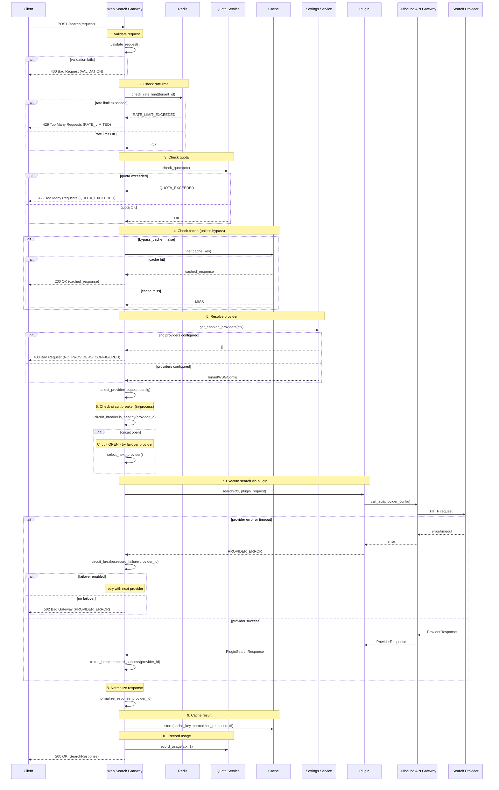
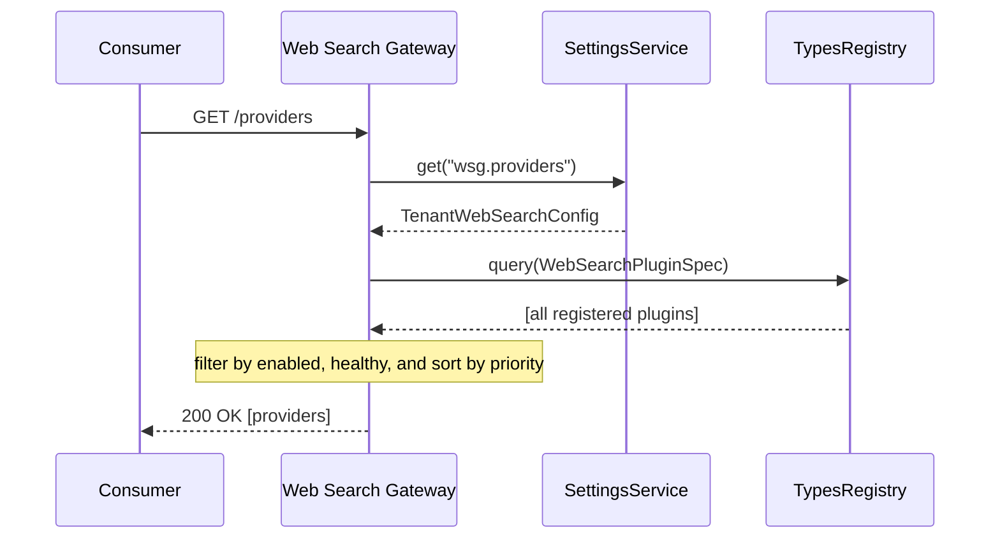

# Web Search Gateway — Design Document


## 1. Overview

### 1.1 Purpose

The Web Search Gateway is a **Gateway Module** providing a unified, provider-agnostic web search API for HyperSpot. It routes search requests to configurable **Plugin Modules** (provider implementations) while enforcing governance, result normalization, caching, and observability.

### 1.2 Module Classification

Per [Architecture Manifest](../../../docs/ARCHITECTURE_MANIFEST.md):

| Attribute | Value |
|-----------|-------|
| **Module Type** | Gateway Module |
| **API Layer** | Yes (REST) |
| **Business Logic Layer** | Yes (contract, router, normalization) |
| **Infrastructure Layer** | Yes (cache, OAGW client) |
| **Gateway Layer** | Yes (plugin connectors) |

### 1.3 Key Design Decisions

| Decision | ADR | Summary |
|----------|-----|---------|
| Stateless Gateway | [ADR-001](./ADR/001-stateless-gateway.md) | Gateway holds no state; quota/billing delegated to external service |
| Stateless Credential Management | [ADR-002](./ADR/002-use-oagw-for-credential-management.md) | Credentials injected via OAGW; gateway never handles raw secrets |
| Settings Service for Tenant Config | [ADR-003](./ADR/003-use-settings-service-for-tenant-config.md) | Per-tenant provider configuration via Settings Service |
| Tenant-Scoped Caching | [ADR-004](./ADR/004-add-tenant-scoped-caching.md) | Cache isolation per tenant prevents data leakage |

---

## 2. Architecture

### 2.1 High-Level Architecture

```
┌─────────────────────────────────────────────────────────────────────────┐
│                         CONSUMER MODULES                                │
│              (AI Chatbots, RAG Systems, Platform Services)              │
└─────────────────────────────────────────────────────────────────────────┘
                                    │
                                    │ hub.get::<dyn WebSearchGatewayApi>()
                                    │ or REST: POST /web-search/v1/search
                                    ▼
┌─────────────────────────────────────────────────────────────────────────┐
│                      WEB SEARCH GATEWAY MODULE                          │
│  ┌───────────────────────────────────────────────────────────────────┐  │
│  │  REST API Layer: /web-search/v1/search, /providers, /health       │  │
│  └───────────────────────────────────────────────────────────────────┘  │
│  ┌───────────────────────────────────────────────────────────────────┐  │
│  │  Domain Layer: SearchService, ProviderRouter, CacheService,       │  │
│  │                GovernanceService, CircuitBreaker, Normalizer      │  │
│  └───────────────────────────────────────────────────────────────────┘  │
│                                    │                                    │
│                                    │ hub.get_scoped::<dyn WebSearchPluginClient>
│                                    ▼                                    │
└─────────────────────────────────────────────────────────────────────────┘
          │                          │                          │
          ▼                          ▼                          ▼
┌─────────────────┐       ┌─────────────────┐       ┌─────────────────┐
│  TAVILY PLUGIN  │       │  SERPER PLUGIN  │       │ (FUTURE PLUGIN) │
│  Implements:    │       │  Implements:    │       │  Implements:    │
│  WebSearchPlugin│       │  WebSearchPlugin│       │  WebSearchPlugin│
│  Client         │       │  Client         │       │  Client         │
└────────┬────────┘       └────────┬────────┘       └────────┬────────┘
         │                         │                         │
         └─────────────────────────┴─────────────────────────┘
                                   │ HTTPS via OAGW
                                   ▼
┌─────────────────────────────────────────────────────────────────────────┐
│              OUTBOUND API GATEWAY (OAGW) - Credential injection         │
└─────────────────────────────────────────────────────────────────────────┘
```

### 2.2 Module Dependencies & Integrations

| Dependency | Purpose | Criticality |
|------------|---------|-------------|
| **Identity & Authorization** | Authentication and authorization of search requests | P0 |
| **Outbound API Gateway (OAGW)** | Secure storage and management of provider API credentials | P0 |
| **types-registry** | Plugin discovery, capability schemas | P0 |
| **Settings Service** | Tenant configuration | P0 |
| **Cache backend** | Response caching (Redis or in-memory) | P0 |
| **Billing Service** | Quota tracking and usage metering | P0 |
| **LLM Gateway** | Query refinement, answer extraction, summarization | P1 |
| **Observability stack** | Metrics, logs, traces | P1 |
| **Event Manager** | Audit event publishing and observability | P1 |


> **Notes**:
> - Plugins (e.g., `tavily_plugin`, `serper_plugin`) are **not** listed as dependencies. They are discovered dynamically at runtime via GTS `types-registry`. See [MODKIT_PLUGINS.md](../../../docs/MODKIT_PLUGINS.md).
> - **Billing Service** handles quota tracking and usage metering. Gateway is stateless and delegates quota checks/updates to this service.

---

## 3. Crate Structure

### 3.1 Directory Layout

```
modules/web_search_gateway/
├── docs/                            # Documentation
├── gts/                             # GTS JSON Schemas (see section 4.3)
├── web_search_gateway-sdk/          # SDK crate (public API, plugin API)
├── web_search_gateway-gw/           # Gateway implementation
│   └── src/
│       ├── api/rest/                # REST handlers, DTOs
│       ├── domain/                  # SearchService, ProviderRouter, Normalizer
│       └── infra/                   # Cache backends, adapters
└── plugins/
    ├── tavily_plugin/               # Tavily provider (Phase 1)
    └── serper_plugin/               # Serper provider (Phase 2)
```

Follows standard ModKit module layout. See [NEW_MODULE.md](../../../guidelines/NEW_MODULE.md).

---

## 4. SDK Design

### 4.1 Public API Trait

```rust
// web_search_gateway-sdk/src/api.rs
#[async_trait]
pub trait WebSearchGatewayApi: Send + Sync {
    /// Execute a web search request
    async fn search(
        &self,
        ctx: &SecurityCtx,
        request: SearchRequest,
    ) -> Result<SearchResponse, WebSearchError>;

    /// List providers enabled for the requesting tenant
    async fn list_providers(
        &self,
        ctx: &SecurityCtx,
    ) -> Result<Vec<ProviderInfo>, WebSearchError>;

    /// Get health status for a specific provider
    async fn get_provider_health(
        &self,
        ctx: &SecurityCtx,
        provider_id: &str,
    ) -> Result<ProviderHealthStatus, WebSearchError>;

    /// Invalidate cache entries (requires admin permissions)
    async fn invalidate_cache(
        &self,
        ctx: &SecurityCtx,
        pattern: Option<&str>,
    ) -> Result<u64, WebSearchError>;
}
```

### 4.2 Plugin API Trait

```rust
// web_search_gateway-sdk/src/plugin_api.rs
#[async_trait]
pub trait WebSearchPluginClient: Send + Sync {
    /// Execute search against the provider
    async fn search(
        &self,
        ctx: &SecurityCtx,
        request: PluginSearchRequest,
    ) -> Result<PluginSearchResponse, PluginError>;

    /// Return plugin's declared capabilities
    fn capabilities(&self) -> &PluginCapabilities;

    /// Health check for the provider
    async fn health_check(&self, ctx: &SecurityCtx) -> Result<HealthStatus, PluginError>;
}
```

### 4.3 Core Models (GTS JSON Schema)

Core domain types are defined as GTS JSON Schemas for language-agnostic contracts. Rust SDK types are generated from these schemas.

| Schema File | Types | GTS ID |
|-------------|-------|--------|
| [`search_request.v1.json`](../gts/search_request.v1.json) | `SearchRequest`, `SearchOptions`, `SearchType`, `SafeSearchLevel`, `Freshness`, `DateRange` | `gts.x.web_search.search_request.v1` |
| [`search_response.v1.json`](../gts/search_response.v1.json) | `SearchResponse`, `SearchResult`, `ResponseMetadata`, `ContentType`, `AdditionalLink` | `gts.x.web_search.search_response.v1` |
| [`provider.v1.json`](../gts/provider.v1.json) | `ProviderInfo`, `PluginCapabilities`, `SupportedFilters`, `HealthStatus` | `gts.x.web_search.provider.v1` |
| [`settings.v1.json`](../gts/settings.v1.json) | `TenantWebSearchConfig`, `TenantProviderConfig`, `RateLimitOverride`, `QuotaOverride` | `gts.x.web_search.settings.v1` |

### 4.4 Error Codes (GTS JSON Schema)

Error codes follow RFC 9457 Problem Details. See [`errors.v1.json`](../gts/errors.v1.json).

| GTS Code | HTTP | Title |
|----------|------|-------|
| `gts.hx.core.errors.err.v1~hx.web_search.provider_not_enabled.v1` | 400 | Provider Not Enabled |
| `gts.hx.core.errors.err.v1~hx.web_search.capability_not_supported.v1` | 400 | Capability Not Supported |
| `gts.hx.core.errors.err.v1~hx.web_search.validation.v1` | 400 | Validation Error |
| `gts.hx.core.errors.err.v1~hx.web_search.no_providers_configured.v1` | 400 | No Providers Configured |
| `gts.hx.core.errors.err.v1~hx.web_search.unauthorized.v1` | 401 | Unauthorized |
| `gts.hx.core.errors.err.v1~hx.web_search.forbidden.v1` | 403 | Forbidden |
| `gts.hx.core.errors.err.v1~hx.web_search.provider_not_found.v1` | 404 | Provider Not Found |
| `gts.hx.core.errors.err.v1~hx.web_search.rate_limited.v1` | 429 | Rate Limit Exceeded |
| `gts.hx.core.errors.err.v1~hx.web_search.quota_exceeded.v1` | 429 | Quota Exceeded |
| `gts.hx.core.errors.err.v1~hx.web_search.internal.v1` | 500 | Internal Error |
| `gts.hx.core.errors.err.v1~hx.web_search.provider_error.v1` | 502 | Provider Error |
| `gts.hx.core.errors.err.v1~hx.web_search.providers_unavailable.v1` | 503 | All Providers Unavailable |
| `gts.hx.core.errors.err.v1~hx.web_search.timeout.v1` | 504 | Request Timeout |

### 4.5 GTS Plugin Schema

```rust
// web_search_gateway-sdk/src/gts.rs
#[struct_to_gts_schema(
    dir_path = "schemas",
    base = BaseModkitPluginV1,
    schema_id = "gts.x.core.modkit.plugin.v1~x.web_search.web_search.plugin.v1~",
    description = "Web Search Gateway provider plugin specification",
    properties = ""
)]
pub struct WebSearchPluginSpecV1;
```

**GTS Instance ID Pattern**:
- Schema: `gts.x.core.modkit.plugin.v1~x.web_search.web_search.plugin.v1~`
- Instance: `gts.x.core.modkit.plugin.v1~x.web_search.web_search.plugin.v1~tavily.web_search.plugin.v1`

---

## 5. Gateway Implementation

### 5.1 Module Pattern

Web Search Gateway follows the standard Gateway + Plugin pattern. See [MODKIT_PLUGINS.md](../../../docs/MODKIT_PLUGINS.md) for:
- Module declaration with `#[modkit::module]`
- Plugin schema registration
- Plugin discovery via `types-registry`
- Scoped client resolution via `ClientHub`

### 5.2 Configuration

| Parameter | Type | Default | Description |
|-----------|------|---------|-------------|
| `default_provider` | string | `"tavily"` | Default provider when none specified |
| `request_timeout_ms` | u64 | 30000 | Overall request timeout |
| `cache.enabled` | bool | true | Enable response caching |
| `cache.default_ttl_seconds` | u64 | 3600 | Default cache TTL |
| `cache.max_size_mb` | u64 | 1024 | Max cache size |
| `rate_limit.*` |  | 100 | Default requests/second |
| `quota.default_monthly` |  | 10000 | Default monthly request quota |
| `circuit_breaker.failure_threshold` | u32 | 5 | Failures before opening circuit |
| `circuit_breaker.reset_timeout_seconds` | u64 | 60 | Half-open retry interval |
| `failover.enabled` | bool | true | Enable automatic failover |

> **Note**: 
> - **Rate limits**: Enforced via Redis (stateless). Per-tenant overrides via Settings Service.
> - **Quotas**: Managed by Billing Service (persistent). Per-tenant overrides via Settings Service.
> - See [Section 9](#9-governance) for details.

---

## 6. REST API Design

### 6.1 Endpoints

| Method | Path | Description | Auth |
|--------|------|-------------|------|
| POST | `/web-search/v1/search` | Execute search | Required |
| GET | `/web-search/v1/providers` | List enabled providers | Required |
| GET | `/web-search/v1/providers/{id}/health` | Provider health | Required |
| DELETE | `/web-search/v1/cache` | Invalidate cache | Admin |
| GET | `/health/live` | Liveness check | Public |
| GET | `/health/ready` | Readiness check | Public |

### 6.2 Request/Response Schemas

REST DTOs are generated from GTS schemas (see section 4.3):
- **Request**: [`search_request.v1.json`](../gts/search_request.v1.json)
- **Response**: [`search_response.v1.json`](../gts/search_response.v1.json)
- **Providers**: [`provider.v1.json`](../gts/provider.v1.json)
- **Errors**: [`errors.v1.json`](../gts/errors.v1.json) (RFC 9457 Problem Details)

---

## 7. Caching Strategy

### 7.1 Cache Key Structure

```
ws:{tenant_id}:{search_type}:{provider_id}:{sha256(query+options_hash)}
```

Components:
- `tenant_id`: Ensures tenant isolation
- `search_type`: web, news, images, etc.
- `provider_id`: Different providers may return different results
- `sha256(...)`: Hash of normalized query + sorted options

### 7.2 TTL Policy

TTLs vary by search type (news: shorter, images/video: longer). See [Configuration Example](#12-configuration-example).

### 7.3 Cache Bypass

- Request header: `Cache-Control: no-cache` or `X-WSG-Cache: bypass`
- Request option: `options.bypass_cache: true`
- Admin endpoint: `DELETE /web-search/v1/cache?pattern=...`

---

## 8. Tenant Provider Configuration

### 8.1 Overview

Tenants configure which providers are enabled via the **Settings Service**. The Web Search Gateway reads tenant-specific provider settings at runtime to determine:
- Which providers are enabled for the tenant
- The tenant's default provider
- Per-provider overrides (e.g., custom rate limits, priority)

### 8.2 Configuration Model

See [`settings.v1.json`](../gts/settings.v1.json) for the schema.

### 8.3 Configuration Storage

Tenant provider configuration is stored via the **Settings Service**:

```
Key:   tenant:{tenant_id}:web_search.providers
Value: TenantWebSearchConfig (JSON)
```

### 8.4 Admin REST API for Provider Management

| Method | Path | Description | Auth |
|--------|------|-------------|------|
| GET | `/web-search/v1/admin/tenants/{tenant_id}/providers` | Get tenant provider config | Admin |
| PUT | `/web-search/v1/admin/tenants/{tenant_id}/providers` | Replace provider config | Admin |
| PATCH | `/web-search/v1/admin/tenants/{tenant_id}/providers/{provider_id}` | Update single provider | Admin |
| DELETE | `/web-search/v1/admin/tenants/{tenant_id}/providers/{provider_id}` | Disable provider for tenant | Admin |

Admin request/response schemas use [`settings.v1.json`](../gts/settings.v1.json) and [`provider.v1.json`](../gts/provider.v1.json).

### 8.5 Sequence Diagrams

#### 8.5.1 Execute Search



#### 8.5.2 List Enabled Providers



### 8.6 Default Behavior

| Scenario | Behavior |
|----------|----------|
| No tenant config exists | Use gateway default config (Tavily enabled) |
| Requested provider not enabled | Return `WSG_PROVIDER_NOT_ENABLED` error |
| No enabled providers | Return `WSG_NO_PROVIDERS_CONFIGURED` error |
| Default provider unhealthy | Failover to next enabled provider by priority |

---

## 9. Governance

### 9.1 Rate Limiting

Rate limiting is enforced via **Redis** (gateway remains stateless).

Response Headers follow the [IETF RateLimit Draft](https://datatracker.ietf.org/doc/draft-ietf-httpapi-ratelimit-headers/) using structured field syntax:

| Header | Description | Example |
|--------|-------------|---------|
| `RateLimit-Policy` | Defines rate limit policy (limit `q`, window `w` in seconds) | `"rate";q=100;w=3600` |
| `RateLimit` | Current status (remaining `r`, time until reset `t` in seconds) | `"rate";r=72;t=1800` |
| `Retry-After` | Seconds to wait (included on 429 responses) | `1800` |

**Example with partition key** (per-user limiting):
```
RateLimit-Policy: "rate";q=100;w=60;pk=:dXNlcjEyMw==:
```

### 9.2 Quotas

Quota management is delegated to **Billing Service** (gateway remains stateless).


Quota Response headers:

| Header | Description | Example |
|--------|-------------|---------|
| `RateLimit-Policy` | Defines monthly quota policy | `"quota";q=10000;w=2592000` |
| `RateLimit` | Current quota status | `"quota";r=8500;t=1209600` |
| `Retry-After` | Seconds until quota resets (included on 429) | `1209600` |


Rate limits and quotas are differentiated by **policy name** (`"rate"` vs `"quota"`). Multiple policies are returned as comma-separated values in a single header:

```http
RateLimit-Policy: "rate";q=100;w=3600, "quota";q=10000;w=2592000
RateLimit: "rate";r=72;t=1800, "quota";r=8500;t=1209600
```

On 429 responses, the `Retry-After` header reflects whichever limit was exceeded (rate limit or quota).

### 9.3 Circuit Breaker

Circuit breaker state is maintained **in-process** per gateway instance.

States: Closed → Open (on failures) → Half-Open (after timeout) → Closed (on success)

---

## 10. Observability

Logging and tracing follow platform standards.

### 10.1 Metrics (WSG-specific)

| Metric | Type | Labels |
|--------|------|--------|
| `web_search_requests_total` | Counter | search_type, status |
| `web_search_request_duration_ms` | Histogram | provider, status |
| `web_search_cache_operations_total` | Counter | operation (hit/miss) |
| `web_search_provider_health` | Gauge | provider, status |

---

## 11. Security

Authentication follows platform standards. See [SECURITY.md](../../../guidelines/SECURITY.md).

### 11.1 Authorization (WSG-specific)

| Operation | Resource | Action |
|-----------|----------|--------|
| Search | `WebSearch` | `Execute` |
| List providers | `WebSearch` | `Read` |
| Cache invalidation | `WebSearch` | `Admin` |

### 11.2 Data Protection (WSG-specific)

- Query text hashed (SHA-256) in production logs
- Search results NEVER logged
- Provider credentials managed by OAGW (gateway never handles secrets)

---

## 12. Configuration Example

```yaml
modules:
  web_search_gateway:
    config:
      default_provider: "tavily"
      request_timeout_ms: 30000
      provider_timeout_ms: 10000
      cache:
        enabled: true
        default_ttl_seconds: 3600
        backend: memory
      rate_limit:
        rps: 1000
        burst: 200
        in_flight: 64
      circuit_breaker:
        failure_threshold: 5
        reset_timeout_seconds: 60
      failover:
        enabled: true
        max_attempts: 2

  tavily_plugin:
    config:
      vendor: "Tavily"
      priority: 10

  serper_plugin:
    config:
      vendor: "Serper"
      priority: 20
```

---

## 13. References

- [PRD.md](./PRD.md) — Product Requirements
- [ARCHITECTURE_MANIFEST.md](../../../docs/ARCHITECTURE_MANIFEST.md) — Platform Architecture
- [MODKIT_PLUGINS.md](../../../docs/MODKIT_PLUGINS.md) — Plugin Architecture
- [MODKIT_UNIFIED_SYSTEM.md](../../../docs/MODKIT_UNIFIED_SYSTEM.md) — ModKit Guide
- [NEW_MODULE.md](../../../guidelines/NEW_MODULE.md) — Module Creation Guide

---
